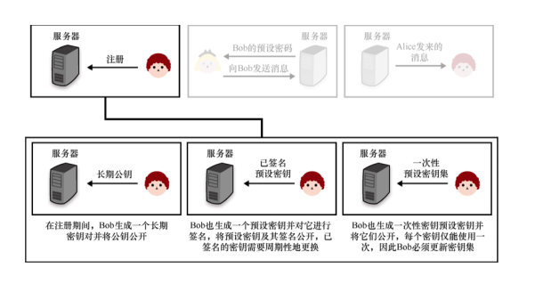

第 10 章　端到端加密
本章内容：
● 端到端加密及其重要性；
● 各种各样的邮件加密方法；
● 端到端加密正在改变消息传输方式。
第 9 章通过 TLS 和 Noise 协议等向读者介绍了安全传输的具体实现。此外，第 9 章还详细说明了 Web 系统上的信任源：成百上千个 Web 浏览器和操作系统信任的 CA。虽然这个由互不知道彼此的参与者组成的复杂系统并不完美，但到目前为止，它在实现人与人之间的安全信息交换中发挥了重要作用。
在实用密码学领域，我们面临的核心问题就是，找到信任他人（即信任他人的公钥）的方法，并且要求该方法具有很好的可扩展性。有位著名密码学家曾经说过，「对称密码的问题已经解决」，他意在表达对称密码一直都受到极大的关注。这种说法在很大程度上来说是正确的。当前的通信加密系统基本上不存在任何安全问题，我们对加密算法的安全性持有很强的信心。当谈到加密相关问题时，我们面临的大多数工程挑战并非源于算法本身，主要问题变成：Alice 和 Bob 是谁？如何证明他们的身份？
密码学家提供了许多不同的信任解决方案，这些解决方案的实用性具体取决于它应用于何种系统。在本章中，我们会学习一些用户与应用之间建立信任的方法。
++10.1　为什么使用端到端加密
本节的内容是「为什么使用端到端加密？」，而没有介绍「什么是端到端加密？」。这是因为端到端加密不仅仅是一个密码协议。端到端加密是一种在敌手存在条件下保证两个（或多个）参与者安全通信的技术。我们以一个简单的例子引入端到端加密：Alice 想向 Bob 发送一条消息，同时要保证消息传输过程中没有任何人能获得该消息。如今，有许多诸如电子邮件之类的通信应用程序使用户之间的通信变得非常便捷，然而这些应用中很少对消息进行加密。
我们可能会有这样的疑问：在这些应用中使用 TLS 协议不就可以保证通信安全吗？从理论上讲，TLS 协议确实可以实现消息的安全传输。在第 9 章中，我们已经了解到 TLS 协议在安全通信领域中广泛应用。不过，端到端加密是一种与实际通信实体密切相关的技术。相比之下，TLS 协议最常用于存在「中间人」服务器的安全系统（见图 10.1）。在这些系统中，TLS 协议仅用于保护中央服务器与用户之间的通信，但允许服务器查看传输的所有消息。实际上，应用程序运行时必须将这些中央服务器部署于用户之间，因此服务器也是协议的可信第三方。也就是说，我们必须信任系统的这些服务器，只有这样才能相信协议是安全的（剧透警告：像这种依赖中央服务器的协议不是一个完美的安全协议）。

图 10.1　在大多数系统中，可信服务器的主要作用就是转发用户之间发送的消息（见上图）。安全链接意味着用户与中央服务器之间建立了安全信道，但是中央服务器仍能看到用户的消息。在端到端加密协议（见下图）中，发送者会加密发送给接收者的所有消息，从而防止任何中间服务器观察到明文消息
在实践中，还存在一些拓扑结构更糟糕的协议。用户和服务器之间的通信链路上可能存在许多网络节点，其中一些节点可能是通信流量检测机器（也称为中间盒）。即便数据流是加密的，一些中间盒仍会结束 TLS 协议连接，然后从该点开始又以明文形式将流量转发出去，或者通过启动新的 TLS 协议连接将消息转发至下一个节点。结束 TLS 连接有时也是有利的，如更好地过滤流量，从而平衡由于地理位置或者靠近数据中心带来的连接量不均衡的现象。不使用 TLS 连接时流量的可见点会增多，这会增加协议可能受到攻击的点位。有时，终止 TLS 连接是出于恶意目的，如拦截、记录和监视流量。
2015 年，人们发现联想公司在其销售的笔记本电脑上预安装定制版的 CA（参见第 9 章）和特定软件。这些特定软件使用联想的 CA 限制 HTTPS 连接，实现将广告注入网页的目的。更令人担忧的是，为了拦截和观察网络连接上传输的内容，世界上许多国家或地区的政府也会重定向互联网流量。2013 年，爱德华·斯诺登（Edward Snowden）公开了大量美国国家安全局（NSA）的机密文件，这些文件显示许多政府（不仅仅是美国）通过监听互联网电缆流量来监视人们的日常通信。
对于公司来说，它确实有权利也有责任获取和查看用户数据。正如本书多次提到的那样，如果公司频繁出现违规和类似黑客的行为，那么会对公司的信誉造成严重破坏。从法律的角度来看，像《通用数据保护条例》（General Data Protection Regulation，GDPR）这样的法律规定最终可能会给企业的正常运作带来巨大的成本。比如声名狼藉的美国国家安全信函（National Security Letter，NSL）禁止相关公司和人员提及他们收到过该信函（所谓的禁语令），除非我们没有什么数据需要分享，否则这也会给企业或组织正常的运作带来额外的成本和压力。
最重要的是，对于我们正在使用的一些常见在线应用程序，政府部门可能已经访问或者有权限访问我们在应用中编写或上传的所有内容。根据应用程序的威胁模型（应用程序想要保护的对象）或应用程序最易受攻击用户的威胁模型，端到端加密在确保终端用户的机密性和隐私性方面发挥着重要作用。
本章介绍了许多在人与人之间建立信任的技术和协议。特别地，我们将了解当今邮件加密技术的基本原理以及安全消息传递如何改变端到端加密通信的格局。
++10.2　信任源缺失
端到端加密的最简单方案之一是：Alice 希望通过互联网向 Bob 发送加密文件。结合从本书前面章节学到的密码知识，我们可能会想到如下方法来实现这个方案：
（1）Bob 把他的公钥发送给 Alice；
（2）Alice 用 Bob 的公钥加密文件，并把加密后的文件发送给 Bob。
假设 Alice 和 Bob 可以在现实生活中见面的方式来交换公钥，或者假定他们之间存在另外一个可交换公钥的安全信道。如果这种假设成立，我们就说 Alice 和 Bob 之间有一种带外的信任建立方式。但是，事实情况并非如此。类似地，我们可以假设本书中包含一个我的公钥，你可以使用该公钥和指定的电子邮件地址向我发送加密消息。然而，谁敢保证本书编辑没有用她的公钥替换我的公钥呢？
这样的问题也发生在 Alice 身上：如何判断收到的公钥是否真的是 Bob 的公钥？在 Alice 和 Bob 通信信道中间的人可能会篡改他们向对方发送的第一条信息（即己方公钥）。正如我们将在本章中看到的这样，密码学技术无法从根源上解决信任问题。然而，密码技术为解决不同应用场景的信任问题提供了一定程度的辅助作用。密码学无法从根本上解决信任问题的原因在于，我们试图把理论密码协议和现实世界中的人连接起来。
保护公钥免受篡改是公钥密钥实践中最困难的一个问题。这是公钥密码技术的致命弱点，解决该问题需要大量复杂的软件技术。
——Zimmermann 等（“PGP User’s Guide Volume I: Essential Topics”，1992）
回到我们刚才探讨的问题：Alice 想向 Bob 发送一个文件，并且假设他们之间没有建立一个可信连接，即他们之间始终存在信任问题。Alice 无法判断给定的公钥是否属于 Bob。这似乎成了鸡生蛋还是蛋生鸡之类的问题。需要指出的是，如果没有恶意的中间人攻击者替换掉 Bob 发向 Alice 第一条消息中的公钥，那么这样的文件传输协议就是安全的。即使获得已加密的文件，攻击者也无法恢复出原始文件。
尽管在这样的场景下我们受到主动中间人攻击的概率并不高，但是依赖于攻击的可能性低来确保协议的安全性并不是密码学协议的最佳实践方式。不幸的是，我们常常以这样的方式应用密码协议。例如，Chrome 附带了它信任的 CA，但我们如何安全地获得 Chrome 呢？如果使用了操作系统的默认浏览器，那么该浏览器会依赖于系统自带的 CA 集。但是，浏览器上的可信证书都来自哪里呢？来自于笔记本电脑吗？而这些笔记本电脑又来自哪里呢？我们很快会发现，这形成了一条无止境的「证书信任链」。在这条链的某个节点，我们必须相信某个信任假设是成立的。
对威胁模型分析时，往往在特定的一层 CA 之后就停止对证书信任源的追溯，不再考虑更远证书的信任问题。基于这样的原因，本章假设存在信任源并且我们可以安全地与之建立信任。所有密码学系统都依赖于信任源，协议的安全性也都建立在信任源可信的基础之上。信任源可以是启动密码协议时使用的密钥和公开参数，也可以是获取它们的带外通道。
++10.3　邮件加密的失败案例
电子邮件协议在设计之初就未考虑采用任何加密技术。我们只能归咎于那个将安全当作次要问题的时代。1991 年一款名为 PGP 的邮件加密工具发布后，电子邮件加密开始从理论走向实践。当时，PGP 的创造者菲尔·齐默尔曼（Phil Zimmermann）决定发布 PGP 工具，以回应同年早些时候美国政府提出的一个法案。该法案允许美国政府从任何通信公司和制造商获得所有通信语音和文本数据。菲尔·齐默尔曼在他 1994 年的论文「Why Do You Need PGP ?」中表示：社会对隐私的需求与日俱增，PGP 工具使人们能够掌握自己的隐私，这就是开发这款工具的原因。
1998 年，RFC 2440 文档将该协议标准化为 OpenPGP，大约同一时间内 GNU Privacy Guard（GPG）以开源的形式发布，这引起人们的极大关注。今天，OpenPGP 的主要实现仍然是 GPG，人们可以互换着使用 GPG 和 PGP 这两个术语，它们都表示电子邮件加密协议。10.3.1　PGP 或 GPG 协议的工作原理
PGP（或 OpenPGP）邮件加密协议的工作原理就是使用混合加密技术（参见第 6 章内容）。最新版的 OpenPGP 定义于 RFC 4880 文档中，其执行过程可以简化为以下步骤。
（1）发送者创建一封邮件，并压缩邮件内容。
（2）在 OpenPGP 的实现中，它会随机生成一个对称密钥，并使用对称加密算法加密已压缩的电子邮件。
（3）用邮件接收者的公钥加密对称密钥（参见第 6 章内容）。
（4）将已加密的对称密钥拼接在已加密消息的后面。这样的数据块会作为电子邮件正文发送给收件人。
（5）解密邮件时，接收者用私钥解密已加密的对称密钥，再用对称密钥解密邮件内容。
值得注意的是，OpenPGP 还定义了对电子邮件签名的方式，实现对发件人身份的验证。通常的做法是，计算明文下电子邮件正文的哈希值，然后利用发件人的私钥对哈希值进行签名。在执行第 2 步加密操作前，会把签名和消息拼接在一起。最后，为了使收件人知道验证签名的公钥，在第 4 步中，发件人会把自身的公钥和加密电子邮件一起发送给收件人。PGP 的工作流程如图 10.2 所示。
习题
为什么选择在加密前对邮件进行压缩？是否可以在加密后对邮件进行压缩？

图 10.2　PGP 的目标就是对消息加密和签名。当与电子邮件客户端集成时，该协议不关心邮件的主题或其他元数据是否隐藏
这种设计似乎没有本质上的错误。尽管邮件主题和其他头部信息没有加密，但是 PGP 看上去可以防止中间人攻击者看到邮件内容。
注意：
需要注意的是，通过加密的方法并不是总能隐藏所有的元数据。在有隐私性要求的应用程序中，元数据会破坏隐私，在最坏的情况下，它可以致使匿名特性失效！例如，在端到端加密协议中，我们可能无法解密用户之间传输的消息，但可以知道他们的 IP 地址，发送和接收的消息的长度，通常与谁交谈（他们的社交图谱），等等。隐藏这种类型的元数据需要大量的工程技术。
然而，在实现细节上，PGP 实际上相当糟糕。OpenPGP 标准及其主要实现 GPG 都使用了旧的密码算法，而向后兼容性要求又使这种情况无法得到改善。最关键的问题是加密没有经过认证，这意味着任何截获未签名电子邮件的人都可能在一定程度上篡改加密内容，具体允许的篡改程度取决于协议使用的加密算法。仅凭这个原因，本书就不建议使用 PGP 加密邮件。
PGP 的一个令人惊讶的缺陷来自这样一个事实，即允许签名和加密操作以任何方式组合。2001 年，Don Davis 指出，由于 PGP 允许密码算法随意组合，敌手可以重新加密收到的已签名电子邮件，并将其发送给另一个收件人。这让原来的接收方 Bob 可以向第三方发送 Alice 发送给他的电子邮件，而第三方会认为该邮件是由 Alice 发来的！
与对明文签名相比，对密文签名的做法本身就存在缺陷。例如，敌手可以删除密文附带的签名，然后添加上自己的签名。实际上，敌手可以假装成 Alice，向 Bob 发一封来自 Alice 的电子邮件。图 10.3 中揭示了这两种签名方式存在的问题。

图 10.3　在上图中，Alice 使用 Bob 的公钥对消息和签名进行加密。Bob 可以重加密此消息，并将其发送给 Charles，Charles 可能会认为这个消息本来就是 Alice 发给他的。这就是 PGP 的缺陷。在下图中，Alice 加密了一条发给 Charles 的消息。同时，Alice 还对已加密的消息进行签名，而不是对明文内容进行签名。拦截加密邮件的 Bob 用自己的签名替换掉 Alice 的签名，导致 Charles 认为这是 Bob 写给他的邮件
该算法默认情况下不提供前向保密性。如果无法保证前向保密，那么一旦私钥泄露，就可以用该私钥解密先前发送给我们的所有邮件。通过改变 PGP 密钥可以实现前向保密，但是这个过程操作起来并不简单，例如，用旧密钥对新密钥进行签名。概括起来，PGP 不安全的原因有如下几点：
● PGP 在实现时使用的密码算法过于陈旧；
● PGP 加密邮件时没有采用认证加密算法，因此在不对加密邮件签名的情况下该协议是不安全的；
● PGP 存在设计上的漏洞，即使我们接收到一个已签名的消息，这个消息的目标接收者也不一定是我们；
● PGP 默认情况下不提供前向保密性。10.3.2　将 Web 系统信任机制扩展到用户之间
为什么我们要在这里讨论 PGP？这是为了介绍关于 PGP 的一些趣事。我们如何获得并信任他人的公钥？这个问题从 PGP 里可以找到答案，即我们信任自己。
「我们信任自己」指的是什么？假设我们已安装 GPG 工具，并决定以邮件形式向朋友发送一些加密消息。首先，必须找到一种能安全获取朋友公钥的方法。例如，与朋友在现实生活中会面，当面把他的公钥记录在纸条上，回家后再将密钥输入笔记本电脑里。现在，我们可以使用 OpenPGP 工具向朋友发送经过签名和加密的消息。然而，这种做法非常不符合实际。对每个邮件的接收人，我们都必须重复执行这个过程吗？答案是我们不必重复这样做。让我们来看下面这个场景：
● 我们已获得 Bob 的公钥，并且信任这个公钥；
● 我们没有 Mark 的公钥，但是 Bob 拥有 Mark 的公钥，并且 Bob 信任这个公钥。
现在，思考片刻，想想我们如何做才能相信 Mark 的公钥。Bob 只需对 Mark 的公钥进行签名，向我们证明他所信任的公钥与 Mark 的电子邮件之间是关联的。如果我们信任 Bob，就可以信任 Mark 的公钥，并将该公钥添加到我们的可信公钥列表中。这就是 PGP 分布式信任概念的核心思想。这也称为可信 Web（Web of Trust，WOT）机制，如图 10.4 所示。

图 10.4　可信 Web 是指用户可以通过数字签名技术传递信任。我们可以看到 Alice 信任 Bob，而 Bob 信任 Charles。基于 Bob 对 Charles 公钥的签名，Alice 可以信任 Charles
有时，我们会看到「密钥聚会」，即人们在现实生活中会面，并对各自的公钥签名。但这种情况大多数出现在角色扮演中，在实践中很少有人借助可信 Web 机制来扩大 PGP 可信圈子。10.3.3　寻找 PGP 公钥是个难题
PGP 尝试了另一种方法来解决寻找其他用户公钥的问题。这种方法非常简单，即我们将自身的 PGP 公钥和其他人对该公钥的签名发布到一些公共列表中，以证明我们的身份，同时也方便他人找到我们的 PGP 公钥。实际上，这并不能证明我们的身份。原因在于，任何人都可以发布与我们的电子邮件相匹配的公钥和签名。现实中的一些攻击者会故意伪造存储在密钥服务器上的密钥，这可能比单纯监听电子邮件内容更具破坏性。在某些情况下，我们可以放松威胁模型，允许可信的权威机构证明邮箱持有者的身份和公钥。例如，在公司内部，公司的人事部门有管理员工电子邮件的权限。
1995 年，RSA 公司提出了安全的 MIME 协议 S/MIME，其目的是替代已有的 MIME 和 PGP 邮件协议。RFC 5751 文档对 S/MIME 协议进行了标准化，该协议通过公钥基础设施来建立信任，这种信任建立方式与基于 Web 的可信机制不同。信任的建立方式也是 S/MIME 协议与 PGP 的唯一区别。由于许多的公司中不同的职位都有不同的权限，因此有必要使用 S/MIME 等协议来提升内部电子邮件生态系统中的信任机制。
需要注意的是，PGP 和 S/MIME 协议都是建立在简单邮件传输协议（Simple Mail Transfer Protocol，SMTP）基础上的。SMTP 是目前广泛用于收发电子邮件的协议。PGP 和 S/MIME 协议都是在 SMTP 之后才发明的，因此这两个协议与 SMTP 和电子邮件客户端在可集成性上还不够完美。例如，在 PGP 和 S/MIME 协议中，只有电子邮件的正文是加密的，而邮件主题和任何其他的标头信息都是未加密的。与 PGP 一样，S/MIME 协议使用的加密算法也比较陈旧，同时也未采用密码技术的最佳实践。与 PGP 一样，S/MIME 协议也不支持认证加密技术。
最近，对电子邮件客户端中集成这两个协议的研究（Efail:“Breaking S/MIME and OpenPGP Email Encryption using Exfiltration Channels”）表明，大多数协议都容易遭受渗透攻击，即通过观察加密的电子邮件，攻击者可以向收件人发送篡改版本的邮件，从而达到修改邮件内容的目的。
这些缺点可能无关紧要。在全球网络上传输的电子邮件中，大多数人发送和接收的邮件都是未加密的。事实证明，对于非技术用户和高级用户来说，在使用 PGP 加密邮件时需要了解许多 PGP 协议的技术细节和操作流程，这些因素导致 PGP 难以使用。例如，经常看到用户以未加密的形式回复已加密邮件，甚至以明文形式引用已加密邮件的全部内容。最重要的是，常用电子邮件客户端对 PGP 协议的支持度也很差或根本不支持。
在 20 世纪 90 年代，我对未来感到兴奋，我梦想着人人都安装 GPG 工具的时代很快就会到来。现在，我仍然对未来感到兴奋，但我想看到一个人人都卸载 GPG 工具的世界。
——Moxie Marlinspike（“GPG and Me”，2015）
由于这些原因，PGP 工具一直在慢慢失去支持（例如，Go 语言在 2019 年从其标准库中删除了对 PGP 的支持），而越来越多旨在取代 PGP 并解决其可用性问题的密码应用程序也不断被设计出来。如今，加密电子邮件协议很难与 HTTPS 取得一样的成功度和使用率。
如果不要求消息的机密性，那么消息将以明文形式传输。默认情况下，电子邮件是一种不包含加密技术的端到端协议。电子邮件的基础传输协议是明文形式的。所有主流电子邮件软件以明文形式传输邮件内容。从某种意义上说，电子邮件系统设计之初就是不加密的。
——Thomas Ptacek（“Stop Using Encrypted Email”，2020）10.3.4　PGP 的替代品
我们花了好几页的篇幅来讨论诸如 PGP 之类的协议在实践中失败的原因。虽然这样的协议设计简单，但是其在使用过程中引起的安全问题多到令人惊讶。因此，本书建议不要使用 PGP 加密邮件。虽然加密电子邮件问题仍然悬而未解，但目前正在开发的一些替代方案可以在不同使用场景下用来替代 PGP。
saltpack 是一种与 PGP 协议有类似消息格式的协议，该协议试图修复 PGP 存在的一些缺陷。到 2021 年为止，saltpack 协议的两个主要实现分别是 keys.pub 和 keybase。图 10.5 给出了 keys.pub 工具的界面。

图 10.5　keys.pub 是一个实现 saltpub 协议的本地桌面应用程序。该工具支持导入其他人的公钥，也支持对消息的加密和签名操作
这些实现都避免了基于 Web 可信机制的缺点，它们允许用户在不同的社交网络上广播他们的公钥，从而将他们的身份与公钥关联起来（见图 10.6）。而由于 PGP 出现于社交网络尚未繁荣的时代，因此它不支持这种密钥寻找机制。

图 10.6　keybase 工具的使用者通过 Twitter 社交网络发布他们的公钥。这允许其他用户获得其身份与特定公钥相关联的额外证据
另一方面，当今的大多数安全通信内容都不是一次性消息，这些工具也不再实用。在 10.4 节中，我将重点讨论安全消息传递技术，该领域旨在研究能够取代 PGP 的安全通信协议。
++10.4　安全消息传递：现代端到端加密协议 Signal
2004 年，名为「Off-the-Record Communication, or, Why Not To Use PGP」的白皮书介绍了 OTR（Off-the-Record）秘密通信协议。与 PGP 和 S/MIME 协议不同，OTR 协议的目标不在于加密电子邮件，而在于加密聊天会话信息；具体来说，OTR 是一种可扩展消息和状态的聊天协议（Extensible Messaging and Presence Protocol，XMPP）。
OTR 协议的显著特征就是提供可否认性（Deniability），即信息接收者和被动观察者不能把我们发过的消息作为在法庭上的证据。由于我们与收件人共享密钥进行对称身份认证和加密，因此收件方很容易伪造邮件。相比之下，在 PGP 中，消息是经过签名的，因此是不可否认的（Non-repudiable）。但据我所知，协议本身的这些特性都没有在法庭上使用过。
2010 年，基于 Signal 的移动端应用程序 TextSecure 发布。Signal 协议是一种新的安全通信协议。当时，大多数安全通信协议（如 PGP、S/MIME 和 OTR）都属于无中心网络的联邦协议（Federated Protocol）。基于 Signal 的移动端应用程序与传统安全通信协议存在很大差别，如该应用存在中央服务器，并且提供唯一的官方 Signal 客户端。
尽管 Signal 协议不支持与其他服务器的互操作性，但 Signal 协议遵循开放协议标准，许多安全消息传递应用程序也都采用该协议，主要包括 Google Allo（现已失效）、WhatsApp、Facebook Messenger、Skype 等。Signal 确实是一个成功的安全消息传递协议，全球数十亿人都在使用这个协议，这些人包括记者、政府监视的目标，甚至我 92 岁的祖母（我发誓我没有让她安装 Signal 协议）。
Signal 协议试图修复 PGP 中存在的缺陷，因此了解它的工作原理是一件很有趣的事。本节将介绍 Signal 协议的以下特性。
● 我们如何建立比基于 Web 的可信机制更好的信任关系？能否使用端到端加密技术升级现有的社交通信应用？Signal 协议的做法是采用首次使用信任（Trust On First Use，TOFU）方法。TOFU 机制允许用户在第一次通信时盲目地信任其他用户，依靠这种第一次不安全的交换来建立持久的安全通信信道。用户可以在未来的任何时间点通过带外匹配通信双方的会话秘密，自由检查第一次与他们进行信息交换的是否为中间人敌手。
● 在与某人开始对话时，我们该如何升级 PGP 以获得前向保密安全？Signal 协议的第一部分是密钥交换，这与大多数安全传输协议类似，但该协议还有一个称为扩展的三方 Diffie-Hellman（Extended Triple Diffie-Hellman，X3DH）的特殊部分。本节后面会详细讲解 X3DH 协议。
● 我们该怎么升级 PGP，确保每条会话消息都满足前向保密性？这一点对安全通信很重要。用户之间的对话可以跨越数年，而在某个时间点的密钥泄露不应暴露此前多年的通信内容。Signal 协议采用一种叫作对称棘轮（Symmetric Ratchet）的机制解决了这个问题。
● 如果两个用户的会话密钥在某个时间点泄露怎么办？我们就束手无策了吗？用户如何才能从这种不安全的状态恢复至安全通信？Signal 协议引入了一种称为后向泄露安全的新特性，并通过 DH 棘轮机制解决了这一问题。
接下来让我们开始了解 Signal 协议吧！首先，我们将学习 Signal 协议的 TOFU 机制建立过程。10.4.1　比 Web 信任机制更友好：信任可验证
加密电子邮件的失败之处在于，它依赖于 PGP 和 Web 可信模型将社交网络转换为安全的社交网络。PGP 最初的设计目的是，让人们通过线下会面的方式进行密钥交换，以确认彼此密钥的真实性，但这种做法会带来许多麻烦和不便。如今，人们很少会以这种方式确认彼此的 PGP 密钥。
在大多数情况下，人们在使用 PGP、OTR 和 Signal 等应用程序时会盲目信任他们在第一次连接时看到的密钥，并在未来拒绝任何更改（见图 10.7）。这样一来，敌手只能攻击用户之间的第一次连接，因此只有当时恰好处于活跃状态的中间人攻击者才能实施攻击。

图 10.7　TOFU 机制允许 Alice 信任 Bob 与其的首次连接，但如果 Bob 在后续的连接中不给出与首次连接相同的公钥，Alice 就不信任 Bob 及其的后续连接。当首次连接被主动中间人攻击的可能性很小时，TOFU 模型就变成一种简单有效的信任建立机制。之后，Alice 也可以通过不同的渠道验证 Bob 的公钥和身份之间的关联性
虽然 TOFU 不是最安全的信任模型，但它是我们当前可用的最好模型，并且其有效性在实践中已经得到证明。例如，SSH 协议在初始连接期间信任服务器的公钥（见图 10.8），同时拒绝公钥在未来的任何更改。
虽然 TOFU 机制要求信任首次看到的公钥，但仍然允许用户稍后对公钥进行验证，也允许用户捕获任何非法的连接请求。在现实世界的应用程序中，用户通常会比较公钥的十六进制表示或公钥的哈希值。当然，这种验证是在带外完成的。如果 SSH 连接遭到破坏，那么验证过程也会受到影响。
注意：
当然，如果用户不验证身份指纹，那么他们可能在不知情的情况下受到中间人攻击。但在大规模执行端到端加密时，现实世界的应用程序必须在安全性和验证代价之间权衡。事实上，基于 Web 可信机制的端到端加密协议的失败表明，以安全为中心的应用程序也必须兼顾可用性，只有这样才能被广泛采用。

图 10.8　SSH 客户端也使用 TOFU 机制。第一次连接到 SSH 服务器时（参见左图），客户端选择盲目信任 SSH 服务器及其公钥之间的关联关系。如果 SSH 服务器的公钥稍后发生更改（参见右图），SSH 客户端会阻止与 SSH 服务器的任何连接
在 Signal 移动端应用程序中，Alice 和 Bob 通过以下方式计算指纹：
（1）计算 Alice 包含用户名（在 Signal 应用中特指手机号码）前缀的身份密钥的哈希值，并将该哈希值截断为一系列数字；
（2）与 Alice 一样，Bob 也执行这样的操作；
（3）向用户显示的是两个数字序列拼接的结果。
由于身份指纹相对较长，为了便于验证指纹合法性，Signal 应用程序允许使用二维码验证用户身份指纹，如图 10.9 所示。

图 10.9　Signal 移动端应用允许我们通过不同的信道（就像在现实生活中一样）与朋友建立联系，以确保我们和朋友的两个指纹（Signal 称其为安全号码）相匹配，从而使我们可以验证与我们连接的朋友信息的真实性和机密性。以可扫描的格式对信息进行编码的二维码，可以帮助用户很容易地完成这种验证。Signal 应用通常会计算会话密钥的指纹，而不是去计算两个用户公钥的指纹，这样用户只需验证一个字符串是否匹配
接下来，让我们了解 Signal 协议的具体工作过程，以及它是如何确保前向安全的。10.4.2　X3DH：Signal 协议的握手过程
在 Signal 协议发布之前，大多数安全消息传输应用程序采用的都是同步机制。这意味着，如果 Bob 不在线，Alice 将无法启动与 Bob 的端到端加密会话。然而，Signal 协议支持异步消息传输（如电子邮件），因此 Alice 与 Bob 在离线情况下仍可会话。
注意，前向保密（见第 9 章）表示密钥的泄露不会导致以前会话的泄露。前向保密意味着密钥交换过程是交互式的，双方都必须生成临时的 DH 密钥对。在本小节中，我们将看到 Signal 协议使用非交互式密钥交换技术（一方可处于脱机状态的密钥交换协议）仍能保证前向安全。下面我们开始学习 Signal 协议的密钥交换技术。
为了与 Bob 开始对话，Alice 首先与 Bob 执行密钥交换协议。Signal 协议的密钥交换协议 X3DH 本质上是将 3 个（或更多）DH 密钥交换协议组合为一个协议。但在了解 Signal 协议的工作原理之前，我们需要知道 Signal 使用的 3 种不同类型的 DH 密钥。
● 身份密钥——表示用户身份的长期密钥。如果 Signal 协议仅有身份密钥，那么它将会变成一种类似于 PGP 的协议，同时不能保证前向保密性。
● 一次性预设公钥——为了增加密钥交换的前向保密性，即使新会话的接收者不在线，Signal 协议也会让用户上传多个一次性公钥。用户可以将这些一次性临时公钥预先上传，并在使用之后将它们删除。
● 已签名的预设密钥——事实上到这里为止，我们就能够实现前向安全的消息传输，但存在一种特殊情况。由于用户上传的一次性预设密钥可能会在某个时候用完，因此用户还必须上传用于签名的中期公钥：签名预设密钥。这样一来，如果我们的用户名在服务器上没有更多可用的一次性预设公钥，他人仍然可以使用我们已签名的预设密钥来实现前向保密性。因此，我们必须定期更换已签名的预设密钥（例如，每周更换一次）。
上面这些背景知识足够我们理解 Signal 协议的会话建立过程。图 10.10 给出 Signal 协议的密钥交换过程。
接下来，让我们更深入地探讨上述这些内容。首先，用户通过发送以下信息注册 Signal 应用程序：
● 身份密钥；
● 一个已签名的预设密钥及其签名；
● 定义一次性预设公钥数量。
此时，用户有责任定期更换已签名的预设密钥并上传新的一次性预设密钥，图 10.11 给出了定期更换密钥的流程。

图 10.10　当开始使用 Signal 应用程序时，用户会注册许多的公钥。如果 Alice 想与 Bob 交谈，她首先找到 Bob 的公钥（称为预设密钥包），然后根据 Bob 的公钥，她会执行 X3DH 密钥交换协议，并基于密钥交换协议的输出创建初始会话消息。在收到 Alice 发来的加密消息后，Bob 也执行相同的密钥交换操作，初始化会话过程
图 10.11　上接图 10.10，用户第一步要做的是，生成多个 DH 密钥对，并将公共部分发送到 中央服务器进行注册
注意：
当执行 X3DH 密钥交换时，Signal 协议利用身份密钥对已签名的预设密钥和密钥交换过程传输的密钥进行签名。我在前面提到过，不要将同一个密钥用于不同的目的。然而，Signal 协议的提出者声称，Signal 协议的这种做法应该是没有问题的。但是，这种做法不值得提倡，如果在密钥交换过程和其他密钥协议中共用同一密钥，可能会引发安全问题。

图 10.11 中介绍的步骤执行完之后，重新回到我们的示例中，为了与 Bob 开启会话，Alice 需要提取到以下信息：
● Bob 的身份密钥；
● Bob 当前已签名的预设密钥及其签名；
● 也可能获得 Bob 的一次性预设密钥（服务器稍后会删除发送给 Alice 的一次性预设密钥）。
Alice 可以验证预设密钥的签名是否正确。然后，她与 Bob 采用 X3DH 握手协议，需要的密钥信息如下：
● 获取 Bob 的所有公钥；
● Alice 为本次会话生成临时密钥对，以实现前向保密性；
● Alice 自己的身份密钥。
然后，Alice 将 X3DH 协议的输出用于之后的协议。这些协议用于加密 Alice 发送给 Bob 的消息（10.4.3 小节会将对此进行详细介绍）。X3DH 协议是一个由 3 个或 4 个（可选）DH 密钥交换协议组成的协议。这些 DH 密钥交换协议需要的密钥信息如下：
（1）Alice 的身份密钥和 Bob 的已签名预设密钥；
（2）Alice 的临时密钥和 Bob 的身份密钥；
（3）Alice 的临时密钥和 Bob 的已签名预设密钥；
（4）如果 Bob 仍有可用的一次性预设密钥，则获得 Bob 的一次性预设密钥和 Alice 的临时密钥。
将这些 DH 密钥交换协议的输出拼接在一起形成 X3DH 协议的输出，然后用密钥派生函数处理该输出。关于密钥派生函数，请参考第 8 章内容。不同的密钥交换协议发挥不同的作用。第一个和第二个密钥交换协议用于相互认证，而最后两个密钥交换协议用于实现前向保密。所有这些都来自对 X3DH 协议规范的深入分析。如果想进一步了解 X3DH 协议，建议阅读该协议规范。图 10.12 概括了 X3DH 协议的整体执行流程。

图 10.12　紧接图 10.11，为了向 Bob 发送消息，Alice 获取的内容包含 Bob 的身份密钥、Bob 的已签名预设密钥和可选的 Bob 一次性预设密钥。当使用不同的密钥执行完密钥交换协议之后，将所有的输出连接在一起，并用密钥派生算法对其进行处理，最终的输出用于加密发送给 Bob 的消息
现在，Alice 可以向 Bob 发送她的身份公钥、为开启会话而生成的临时公钥以及其他相关信息（例如她使用 Bob 的哪些一次性预设密钥）。Bob 收到该消息，并与包含在其中的公钥执行同样的 X3DH 密钥交换操作。（出于这个原因，我跳过说明此流程的最后一步。）如果 Alice 使用了 Bob 的某个一次性预设密钥，Bob 就会将这个密钥删除。执行完 X3DH 协议后会发生什么呢？请阅读 10.4.3 小节内容。10.4.3　双棘轮协议：Signal 握手结束之后的协议
只要两个用户不结束会话，或删除 X3DH 阶段产生的会话密钥，他们的消息传输就可以持续进行。出于这个原因，Signal 协议在设计时就考虑到了 SMS 会话。在此类会话中，一个会话密钥的使用时长可能会以月为单位，因此 Signal 协议引入了在消息级别（相比会话级别粒度更小）上的前向安全性。在本小节中，我们将了解这种协议的安全通信阶段（采用双棘轮协议）的工作过程。
现在，让我们来看一个简单的 Post-X3DH 协议示例。Alice 和 Bob 把 X3DH 协议的输出当作会话密钥，并用该会话密钥加密他们之间输出的消息，如图 10.13 所示。

图 10.13　简单来说，Post-X3DH 协议可以把 X3DH 的输出作为会话密钥，并用该会话密钥加密 Alice 和 Bob 之间传输的消息
不过，在密码学中，我们希望不同用途的密码算法使用不同的密钥。我们可以做的就是，将 X3DH 协议的输出当作 KDF 算法的种子（或作为双棘轮协议的根密钥），进而派生另外两个新的密钥。Alice 用其中的一个密钥去加密发送给 Bob 的消息，而 Bob 用另外一个密钥去加密发送给 Alice 的消息，整个过程如图 10.14 所示。

图 10.14　上接图 10.13。Post-X3DH 协议更好的实现方式应该是，利用 KDF 算法派生出两个不同的密钥，然后使用这两个密钥分别去加密 Alice 和 Bob 的消息。注意：Alice 发送消息使用的密钥与 Bob 接收消息使用的密钥相同，而 Bob 发送消息使用的密钥与 Alice 接收消息使用的密钥相同
就安全性而言，这种方法可能已经足够了。但 Signal 协议的文档指出：每个会话的有效时间可能会长达数年。这与第 9 章提到的 TLS 会话有很大的不同。通常，我们认为 TLS 会话是短期的。因此，如果会话密钥被窃取，以前所有的消息记录都可能被解密！
为了解决这个问题，Signal 协议引入了所谓的对称棘轮机制（见图 10.15）。现在，将发送密钥重命名为发送链密钥，但其不直接用于加密消息。当发送消息时，Alice 不断地将该发送链密钥作为单向函数的输入，该函数会生成下一个发送链密钥以及用于本次加密的实际密钥。消息的接收者 Bob 也执行类似的过程，只是他操作的是接收链密钥。因此，泄露某个发送密钥或发送链密钥，攻击者无法恢复先前的发送密钥（该原理也适用于接收密钥或接收链密钥）。

图 10.15　上接图 10.14。在 Post-X3DH 协议中，将首次执行 KDF 算法时产生的输出分别迭代地作为 KDF 算法的输入，分别产生发送和接收消息的密钥链，即通过棘轮的方式让每次发送消息时使用的密钥形成一个密钥链，每次接收消息时使用的密钥形成另一个链密钥，从而让 Signal 协议具备前向保密性。因此，密钥链中某个密钥的泄露不会导致密钥链中先前密钥的泄露
现在，我们的协议和消息传输层均具备前向保密特性。发送和接收的每条消息都会保护以前发送和接收的所有消息。需要注意的是，这个结论有待商榷。因为攻击者可能通过窃取用户的手机来获取用户密钥，而用户的手机可能会以明文形式包含先前发送和接收到的所有消息。不过，如果两个会话用户都决定删除以前的消息（例如，通过使用 Signal「删除消息」功能），则能够实现前向保密性。
关于 Signal 协议，我想谈的最后一件事情是密钥泄露后安全（Post-Compromise Security，PCS），也称为后向保密（参见第 8 章内容）。密钥泄露后安全指的是，如果密钥在某个时候泄露，协议会自行修复，恢复到安全状态。当然，如果攻击者仍然可以访问我们的设备，那么这种修复机制也无法确保协议安全。
密钥泄露后安全的原理是向协议中引入新的熵，而且攻击者无法获得这种熵。当然，协议的对等方必须获得完全一样的新熵。Signal 协议通过临时密钥交换机制向协议引入满足这种条件的熵。为此，Signal 协议会在 DH 棘轮过程中连续执行密钥交换协议。最终，Signal 协议传输的每条消息都带有当前的棘轮公钥信息，整个过程如图 10.16 所示。

图 10.16　DH 棘轮机制的原理是在发送的每条消息中公布公钥。该棘轮公钥可以与前一个棘轮公钥相同，或者如果参与者决定刷新其棘轮公钥，则他可以公布新的棘轮公钥
当 Bob 发现 Alice 提供了新的棘轮公钥时，他会利用 Alice 的新棘轮密钥和自己的棘轮密钥执行 DH 密钥交换操作。然后，密钥交换协议的输出可以作为对称棘轮密钥，解密接收到的密文。该过程如图 10.17 所示。

图 10.17　当从 Alice 收到新的棘轮公钥时，Bob 利用 Alice 和自己的棘轮密钥进行密钥交换，以产生解密密钥。这样一来，Bob 就可以解密来自 Alice 的消息
当接收到新棘轮密钥后，Bob 必须做的另一件事是：生成一个新的随机棘轮密钥。Bob 使用新生成的棘轮密钥与 Alice 的新棘轮密钥进行另一次密钥交换，然后他使用新棘轮密钥加密发送给 Alice 的消息，完整过程如图 10.18 所示。
在 Signal 协议的双棘轮规范说明中，称这种反复的密钥交换为「乒乓」机制。
当双方轮流更换棘轮密钥对时，会出现「乒乓」行为。如果其中一方的棘轮私钥发生短暂泄露，那么窃听者可能会获得当前的棘轮私钥值。但随着协议继续执行，该私钥最终会被一个未被泄露的私钥所取代。
——双棘轮规范说明

图 10.18　上接图 10.17。收到 Alice 的新棘轮密钥后，Bob 也生成一个新棘轮密钥。这个新的棘轮密钥用于派生加密密钥，并通告 Alice 接下来发送的所有消息都使用该密钥加密（直到从 Alice 收到一个新的棘轮密钥为止）
最终，我们将 DH 棘轮和对称棘轮称为双棘轮机制。用可视化的流程图来描述该机制可能会有点儿复杂，然而本书还是尝试用图 10.19 所示的流程图解释双棘轮机制。

图 10.19　从 Alice 的角度来看，双棘轮机制是 DH 棘轮过程（见左图）和对称棘轮过程（见右图）的简单组合。这种机制给 Post-X3DH 协议提供了后向泄露安全和前向保密性。在 Alice 和 Bob 之间传输的第一条消息中，Alice 还不知道 Bob 的棘轮密钥，因此她将 Bob 预签名的密钥当作棘轮密钥
图 10.19 所示的内容有点儿密集，因此我更鼓励读者阅读 Signal 协议的规范说明。这些规范提供了对协议的另一种书面解释。
++10.5　端到端加密最新进展
如今，用户之间大多都是通过安全传输应用程序进行安全通信的，而很少通过加密电子邮件来传输消息。Signal 是一个应用广泛的安全消息传输协议，该协议已被许多专有应用程序以及开放源代码和联邦协议所采用，例如 XMPP（OMEMO 协议的扩展）和 Matrix 协议（旨在替代 IRC 协议）。另一方面，PGP 和 S/MIME 协议因面临各种各样的攻击进而导致人们对其安全性缺乏信任。
如果想编写一个端到端加密消息传输应用程序，我们该怎么办？不幸的是，这个领域中使用的很多东西都是临时的，为了获得一个功能齐全的安全消息传输系统，我们必须亲自动手实现其涉及的细节。尽管 Signal 协议已公开了很多源代码，但是该协议缺乏完备的帮助文档，这增加了正确使用该协议的难度。幸运的是，Matrix 协议是完全开源的协议，该协议可能更容易集成到我们自己的消息传输应用程序中。这也正是法国政府采用的做法。
在结束本章之前，让我们谈一谈端到端加密领域的一些公开问题和研究热点。例如：
● 消息群发；
● 多设备支持；
● 比 TOFU 协议更安全的协议。
我们先来探讨第一个问题——消息群发（Group Messaging）。目前，尽管不同的应用程序以不同的方式实现了消息群发机制，但研究者们仍在积极研究该技术。例如，Signal 协议可以实现多个客户端之间的群组通信。而服务器只知道这群用户在通信，除此之外，服务器什么也无法获得。这意味着客户端必须针对所有参与者逐一加密并发送消息。这种消息传输方式称为客户端扇出，这也致使客户端的可扩展性很差。例如，当服务器看到 Alice 向 Bob 和 Charles 发送了相同长度的消息时，它可以很容易地猜出群组成员，如图 10.20 所示。

图 10.20　针对群聊场景，有两种端到端加密的解决方案。客户端扇出方法意味着，客户端必须通过已建立的安全信道单独向每个群组成员发送消息。这种方法的优点在于向服务器隐藏了群组成员。服务器扇出方法意味着，服务器会转发发向每个群组成员的消息。这种方法的优点在于减少客户端发送的消息数量
WhatsApp 基于 Signal 协议的变体实现安全消息传输，然而在该协议中服务器知道群组聊天的成员身份。在这个 Signal 变体协议中，允许群组成员向服务器发送单个加密消息，服务器负责将其转发给群组其他成员。这种消息传输方式称为服务器扇出。
群组消息传输的另一个问题是，无法将群组扩展到包含更多成员的情形。为此，最近业界的许多研究者都在研究消息层安全（Messaging Layer Security，MLS）标准，该标准旨在解决大规模安全群组消息传递问题。但距离完成这个标准的制定，研究者们似乎还有很多工作要做。我们可能会产生这样的疑问：在拥有 100 多名参与者的群组聊天中真的有保密性措施吗？
注意：
群组聊天仍然是一个热门研究领域，不同的消息传输方法在安全性和可用性方面有不同的权衡。例如，在 2021 年仍然没有群组聊天协议能够提供转录一致性，该特性用于确保群组聊天的所有参与者能够以相同的顺序看到相同消息。
对多设备的支持并不是直接将现有的实现照搬，也不是针对不同的设备开发不同的实现，通常是把不同的设备当作不同的聊天参与者。TOFU 模型会使处理多设备群组聊天变得相当复杂。在这个模型中，每个设备具有不同的身份密钥，管理这些密钥可能成为一个新的问题。想象这样一个场景：我们必须验证我们每个设备的指纹，同时还必须验证我们每个朋友设备的指纹。例如，Matrix 协议要求用户对自己的设备进行签名。然后，通过验证设备关联的签名，其他用户可以将所有设备视为一个可信任的实体。
最后，值得一提的是 TOFU 模型也不是群组聊天的最好解决方案。该模式的信任建立在我们首次看到的公钥，而且大多数用户以后也不会验证指纹是否匹配。对此，我们能做些什么呢？如果服务器决定用 Bob 冒充 Alice 呢？这是密钥透明研究领域正在努力解决的问题。密钥透明是谷歌提出的一个协议，它类似于第 9 章中谈到的证书透明化。此外，还有基于区块链技术构造群组聊天的方案，在第 12 章中我们会讨论该问题。
++10.6　本章小结
● 端到端加密是一种保证人与人之间安全通信的技术。与存在中心服务器的安全通信系统相比，采用端到端加密能够更好地抵抗中心式系统固有的弱点，并且可以避免一些法律法规对公司的约束。
● 端到端加密系统需要用户之间事先建立起信任。我们既可以通过已经信任的公钥建立信任，也可以通过外部安全信道建立信任。
● PGP 和 S/MIME 是目前两个广泛应用的电子邮件加密协议，但由于这两种协议采用的加密算法及其实现过于陈旧，因此我们认为这两种协议都是不安全的。这两种协议与电子邮件客户端的集成度也很差，实践证明，采用这些协议的电子邮件客户端容易受到不同的攻击。
❏ PGP 使用 Web 信任模型，用户之间通过互相生成公钥签名来建立信任。
❏ S/MIME 基于公钥基础设施为用户建立信任，该协议常用于公司和大学。
● saltpack 协议可以替代 PGP。该协议修复了 PGP 存在的诸多问题，并借助社交网络发现他人的公钥。
● 电子邮件协议在设计之初就没有考虑加密，所以邮件协议始终存在安全问题。另外，现代消息传输协议和应用程序在设计时都内置端到端加密技术，因此可以用这些现代协议和应用来代替加密邮件协议。
❏ 大多数应用程序都使用 Signal 协议实现用户之间安全的端到端通信。诸如 Signal Messenger、WhatsApp、Facebook Messenger 和 Skype 之类的应用都声称它们使用 Signal 协议安全传输消息。
❏ 有些像 Matrix 这样的协议试图标准化采用端到端加密的联邦协议。联邦协议是一种支持多种应用互操作的开放协议（这与仅限于单个应用程序的集中式协议功能相反）。