第 11 章　用户认证
本章内容：
● 认证用户身份与认证数据的区别；
● 用户认证是指基于口令或密钥对用户进行认证；
● 用户辅助认证用于保证用户的设备之间的安全连接。
在本书中，我们将密码学主要包含两个概念：机密性和认证性。在实际应用中，保密性（通常）是必须满足的最低安全需求；而认证性用于满足复杂的场景下的安全需求。虽然我们在本书中已经多次讨论过认证性，但这依然是一个令人困惑的概念，因为它在密码学中有很多不同的含义。因此，本章首先介绍认证性的真正含义。与我们之前学习的密码学算法一样，实践中存在着各种认证协议，本章的其余部分将介绍常用的认证协议。
++11.1　认证性的定义
到目前为止，书中已经多次出现过认证性（Authentication）这个词语，让我们来回顾一下。
● 密码原语中的认证性，如消息认证码（见第 3 章）和认证加密（见第 4 章）。
● 密码协议中的认证性，比如在 TLS 协议（见第 9 章）和 Signal 协议（见第 10 章）中，指的是对协议的一个或多个参与者进行认证。
在第一种情况下，认证性是指消息的真实性（或完整性）。在第二种情况下，认证性表示向他人证明自己的身份。同一个词语却有不同的含义，不禁令人感到困惑。但正如《牛津英语词典》所指出的那样，这两种用法都是正确的。《牛津英语词典》中对认证（authentication）一词的解释如下：
认证指证明或展示某物是真实或有效的过程或行动。
因此，我们应该将认证性看作一个密码学术语，根据具体上下文来理解它的含义。
● 消息认证（或有效负载认证）：验证消息的真实性，即消息自生成以来没有被修改。（例如，验证消息是否遭到篡改？）
● 身份认证（或者源认证、实体认证）：证明一个实体确是其所声称身份的过程。（例如，浏览器验证与自己通信的网站是否为 google.com？）
特别说明：认证性表示某种事物（一些消息、人的身份等）可以证明它自己当前的状态就是应有的状态。在本章中，我们使用认证性这个术语时，只表示人或机器身份的认证性。换句话说，本章提及的认证性指的是身份认证。此外，我们在此前的学习中已经看到过许多关于身份认证的知识，如下。
● 在第 9 章安全传输中，计算机可以通过公钥基础设施（PKI）对其他机器进行大规模的身份认证。
● 在第 10 章端到端加密中，基于首次使用信任（TOFU）（在之后进行验证）或可信 Web（WOT）技术大规模对双方进行身份认证。
在本章中，我们将学习此前没有学过的以下两种情况（这两种情况的概述见图 11.1）。
● 用户身份认证：服务器认证客户端的身份。
● 用户辅助身份认证：人类辅助机器之间进行身份认证。
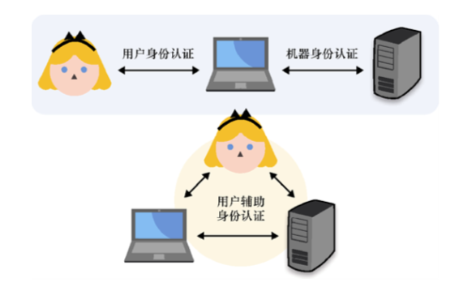
图 11.1　本书中，我们主要讨论 3 种场景下的身份认证。机器验证用户身份过程中的用户身份认证；机器与机器认证过程中的机器身份认证；人类参与到机器与机器认证过程中的用户辅助身份认证
身份认证的另一个重点是身份。换句话说，我们如何在密码协议中定义一个人的身份呢（比如，如何定义 Alice 是谁）？计算机如何认证网络中的用户呢？现实世界中人的身份与计算机中的比特数据存在固有差距。为了连接现实世界和数字世界，我们总是假设 Alice 是唯一知道秘密数据的人，为了证明自己的身份，Alice 必须证明自己知道这些秘密数据。例如，Alice 可以发送自己的密码，或者她可以使用与自己公钥对应的私钥对一个随机挑战值进行签名。
接下来的大量示例会让我们对上述内容有更深的理解，现在，让我们首先了解一些机器验证用户身份的方法！深入浅出密码学
**************少了11.2和11.2.1
**************　   
++11.2.2　避免口令的明文传输：使用非对称的口令认证密钥交换协议
11.2.1 小节介绍了一些试图简化用户身份管理的协议，这些协议允许用户仅使用一个链接到单个服务的账户来实现对多个服务的身份认证。虽然类似于 OIDC 的协议可以有效地减少用户必须管理的口令数量，但它们并没有改变这样一个事实，即某些服务仍然需要以明文形式查看用户的口令。即使服务器只保存口令的哈希值，用户注册、更改口令以及登录时仍会以明文形式发送口令。
非对称（或增强）口令认证密钥交换（Password-Authenticated Key Exchange，PAKE）协议试图提供一种无须用户以明文方式把口令传输给服务器即可实现对用户的认证的方法。与之相对应的是对称或平衡 PAKE 协议，后者表示协议双方都知道口令。
目前，最流行的非对称 PAKE 协议实例是安全远程口令（Secure Remote Password，SRP）协议，2000 年在 RFC 2944（“Telnet Authentication: SRP”）中首次提出该协议的标准化，后来 RFC 5054（“Using the Secure Remote Password (SRP) Protocol for TLS Authentication”）将其集成到 TLS 协议中。这是一个相当古老的协议，其存在很多缺陷。例如，如果中间人攻击者拦截了注册信息流，那么攻击者将能够模拟并以受害者身份登录网站。而且由于 SPR 协议不能在椭圆曲线上实例化，因此它也不能很好地与现代协议配合使用，更糟糕的是，它与 TLS 1.3 协议不兼容。
自 SRP 发明以来，许多非对称 PAKE 协议也被相继提出并标准化。2019 年夏天，IETF 的密码论坛研究小组（Crypto Forum Research Group，CFRG）启动了 PAKE 协议的选择过程，其目标是为每类 PAKE 协议选择一种标准化算法：对称/平衡算法和非对称/增强算法。2020 年 3 月，CFRG 宣布 PAKE 协议选拔流程结束，推荐如下两个算法。
● CPace——由 Haase 和 Benoît Labrique 发明的对称/平衡的 PAKE 协议。
● OPAQUE——由 Stanislaw Jarecki、Hugo Krawczyk 和 Jiayu Xu 发明的非对称/增强 PAKE 协议。
本小节将讨论 OPAQUE 协议，但该协议（在 2021 年初）仍处于标准化过程中。在后文，我们将了解有关对称 PAKE 协议和 CPace 协议的更多信息。
OPAQUE 一词源于与之同音的 O-PAKE，其中 O 指的是「不经意」。这是因为 OPAQUE 依赖于一个本书还未提及的密码原语：不经意伪随机函数（Oblivious Pseudorandom Function，OPRF）。
1．不经意伪随机函数
OPRF 是一个有两方参与的协议，读者可参考在第 3 章中学习的 PRF 来理解该协议。提醒一下，PRF 在某种程度上实现了人们期望 MAC 算法具备的功能：它以一个密钥和一个额外输入为输入参数，输出一个固定长度的随机值。
注意：
密码学中的「不经意」一词通常指的是协议性质，即一方在不知道另一方输入的情况下进行密码学操作。
以下是 OPRF 在宏观上的工作原理。
（1）Alice 希望将一个秘密值作为 PRF 的输入。她用一个随机值（称为盲因子）来盲化她的输入，并将其发送给 Bob。
（2）Bob 将接收到的盲化值作为 OPRF 的输入，但 OPRF 输出的结果仍然是盲化过的，因此 Bob 无法获取 Alice 的秘密值的任何信息。接着，Bob 将这个生成的盲化值发送给 Alice。
（3）Alice 使用相同的盲因子对接收到的值进行去盲处理，最后得到真正的输出值。
需要注意的是，每次 Alice 想要执行这个协议时，都必须创建一个不同的盲因子。但无论她使用什么样的盲因子，只要她使用相同的输入，她总是会得到相同的结果。该过程如图 11.5 所示。
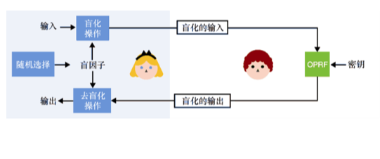
图 11.5　OPRF 是一种允许一方在不知道另一方输入的情况下计算另一方输入的 PRF 构造。为此，Alice 首先生成一个随机盲因子，然后利用盲因子对秘密输入进行盲化并将盲化值发送给 Bob。Bob 使用盲化值以及密钥作为 OPRF 的输入，然后将协议输出的盲化值发送给 Alice。Alice 对 Bob 发来的值进行去盲化。去盲化的结果与盲因子值的选取无关
下面是一个在基于离散对数困难问题的群中实现 OPRF 协议的具体例子。
（1）Alice 将她的输入值转换为群元素x。
（2）Alice 生成了一个随机的盲因子r。
（3）Alice 对其输入进行盲化，如。
（4）Alice 将盲值发送给 Bob。
（5）Bob 计算并输出盲值，其中是密钥。
（6）Bob 将上述结果发送给 Alice。
（7）Alice 执行去盲化操作，计算，其中 1/r是r的逆。
非对称 PAKE 协议的底层原理正是建立在 OPRF 协议的这种有趣构造基础之上。
2．OPAQUE 非对称 PAKE 协议是如何工作的呢？
我们希望客户端（比如 Alice）能够与某个服务器进行认证密钥交换。我们还假设 Alice 已经知道服务器的公钥，或者已经有了对其进行身份认证的方法（服务器可以是 HTTPS 网站，因此 Alice 可以使用 Web PKI 对其进行认证）。让我们逐步构建 OPAQUE 协议，以便逐步了解它的工作原理。
第一个想法：使用公钥密码来认证 Alice 端（客户端）的身份。如果 Alice 拥有一对长期密钥，并且服务器知道 Alice 的公钥，那么她可以简单地使用私钥与服务器执行相互认证的密钥交换，或者 Alice 可以对服务器给出的质询进行签名。不幸的是，非对称私钥太长，Alice 只能记住她的口令值。她可以在当前设备上存储密钥对，但她也希望以后能够从另一台设备登录网站。
第二个想法：Alice 可以使用基于口令的密钥派生函数（KDF），如 Argon2，从她的口令中派生出非对称私钥（详见第 2 章与第 8 章）。Alice 的公钥可以存储在服务器上。如果想避免攻击者在数据库被破坏的情况下测试整个数据库的口令，我们可以让服务器为每个用户提供不同的盐值，这些盐值必须与基于口令的 KDF 一起使用。
这个想法已经相当不错了，但 OPAQUE 还需要避免一种攻击：预计算攻击。攻击者可以尝试以用户的身份登录，接收用户的盐值，然后离线重新计算大量非对称私钥及其关联的公钥。在数据库被攻破的那天，攻击者可以快速查看是否可以在已重新计算的大量非对称公钥列表中找到用户的公钥和相关口令。
第三个想法：我们可以将 Alice 的口令作为 OPRF 协议的输入来导出非对称私钥。这也是 OPAQUE 协议的主要技巧！如果服务器要求每个用户使用不同的密钥，就等同于加盐（攻击一次只能针对一个用户）。这样一来，攻击者想要通过预计算非对称私钥来猜测用户口令就必须执行在线查询（防止离线暴力攻击）。而在线查询的效果会受查询速率的限制（例如，要求 1 小时内的登录次数不能超过 10），可以防止此类在线暴力攻击。
请注意，这实际上并不是 OPAQUE 协议的工作方式：OPAQUE 协议不是让用户派生非对称私钥，而是让用户派生对称密钥。然后，对称密钥用于加密非对称密钥对的备份和一些附加数据（例如服务器的公钥）。算法的执行流程如图 11.6 所示。
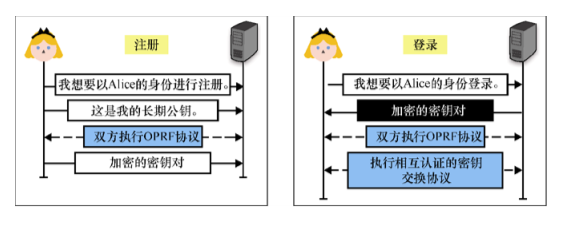
图 11.6　为了使用 OPAQUE 协议在服务器上进行注册，Alice 生成一个长期密钥对，并将她的公钥发送到服务器，服务器存储公钥并将其与 Alice 的身份关联。然后，Alice 使用 OPRF 协议从口令中派生出随机的对称密钥，并将备份密钥对加密后发送到服务器。当登录服务器时，Alice 从服务器获得加密密钥对，然后使用口令执行 OPRF 协议，以获得能够解密密钥对的对称密钥。最后，用这个密钥执行相互验证的密钥交换
在进入 11.2.3 小节之前，让我们回顾一下本小节学到的知识。图 11.7 对本小节所学知识进行了总结。
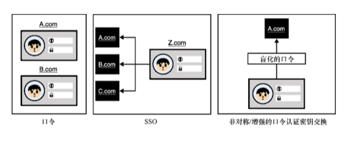
图 11.7　口令是认证用户身份的便捷方法，因为它们保存在人们的头脑中，可以在任何设备上使用。另外，用户很难创建强安全的口令，而且由于用户倾向于在各个网站上重复使用口令，口令泄露可能会造成用户在多个网站上的信息被泄露。SSO 允许用户使用一个（或几个）服务连接到多个服务，而非对称（或增强）口令认证密钥交换允许用户在服务器不知道真实口令的情况下进行身份认证11.2.3　一次性口令并不是真正的口令：使用对称密钥进行无口令操作
到目前为止，我们已经了解应用程序可以利用不同的基于口令的协议对用户进行身份认证。但是，口令并非完美。口令容易受到暴力攻击，而且往往存在重复使用、被盗取的情况。如果不想使用口令对用户进行身份认证，那么我们应该怎么做呢？
答案是使用密钥！根据已学到的知识可知，密码学中的密钥分为两类，这两种类型都很有用：
● 对称密钥；
● 非对称密钥。
本小节将介绍基于对称密钥的解决方案，而 11.2.4 小节将介绍基于非对称密钥的解决方案。假设 Alice 使用对称密钥（通常由服务器生成并通过二维码与客户端通信）在服务器上进行注册。对 Alice 进行身份认证的一种简单方法是让她发送对称密钥。这当然不是什么好事，因为泄露她的对称密钥会让攻击者可以无限制地访问她的账户。因此，Alice 可以利用对称密钥派生所谓的一次性口令（One-time Password，OTP），并用这些口令代替长期的对称密钥。尽管 OTP 不是口令，但其名称表明可以使用 OTP 代替口令。然而，请注意，永远不要重复使用这些口令。
基于 OTP 的用户身份认证的思想很简单：用户的安全性（通常）来自 16～32 字节均匀随机的对称密钥，而不是低熵口令。这个对称密钥允许用户按需生成一次性口令，如图 11.8 所示。

图 11.8　一次性口令算法允许用户通过对称密钥和一些附加数据创建任意数量的一次性口令。 根据 OTP 算法的不同，附加数据也可能会有所不同
基于一次性口令的身份认证通常在移动应用程序（参见图 11.9 中的示例）或安全密钥（可以插入计算机 USB 端口的小型设备）中实现。有两种主要方案可用于产生一次性口令：
● 基于 HMAC 的一次性口令（HMAC-based One-time Password，HOTP）算法已在 RFC 4226 中标准化，该 OTP 算法中的附加数据是一个计数器的值。
● 基于时间的一次性口令（Time-based One-time Password，TOTP）算法已在 RFC 6238 中标准化，该 OTP 算法中的附加数据是时间。
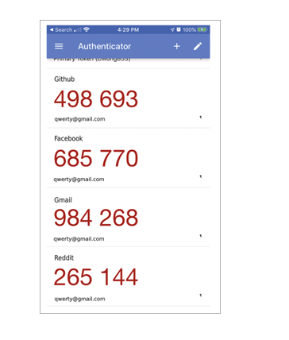
图 11.9　谷歌认证器移动应用的屏幕截图。该应用程序允许用户为每个应用程序生成唯一的对称密钥，这些对称密钥可与 TOTP 算法一起使用，生成有效期仅有 30 秒的 6 位一次性口令
现在，大多数应用程序都使用 TOTP 算法，因为 HOTP 算法要求客户端和服务器保持同步状态（计数器的值）。如果一方失去同步状态，则无法再生成（或验证）合法的一次性口令，这可能导致算法无法正常运行。
在大多数情况下，TOTP 算法的工作方式如下。
● 注册时，该服务器向用户发送一个对称密钥（可能是一个二维码）。然后，用户会将此密钥添加到一个 TOTP 应用程序中。
● 登录时，用户可以使用 TOTP 应用程序来计算一次性口令。具体是通过计算来完成的，其中 time 表示当前的时间（四舍五入为整数分钟，使得一次性口令有效时间变为 60 秒）。接着，进行如下操作。
● TOTP 应用程序向用户显示由对称密钥派生出的一次性口令，将其截断并以人类可读的基数形式显示（例如，用十进制表示截取的 6 位口令）。
● 用户将一次性口令复制或输入相关应用程序中。
● 应用程序检索用户关联的对称密钥，并以与用户相同的方式计算一次性口令。如果计算结果与收到的一次性口令匹配，则该用户成功通过身份认证。
当然，判断用户的 OTP 和服务器计算的 OTP 之间的相等性必须在恒定的时间内完成。这类似于 MAC 认证标签的验证过程。该流程如图 11.10 所示。
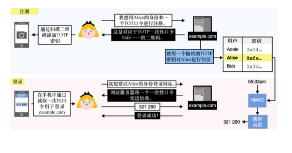
图 11.10　Alice 使用 TOTP 作为身份认证的口令注册到 example.com。她将对称密钥从网站导入她的 TOTP 应用程序。稍后，她可以要求应用程序为 example.com 的服务计算一次性口令，并使用该口令向网站进行身份认证。example.com 网站获取与 Alice 关联的对称密钥，并使用 HMAC 和当前时间计算出一次性口令。接下来，该网站在恒定时间内完成计算出的一次性口令与 Alice 发送的口令的比较
不过，这种基于 TOTP 的身份认证流程并不理想，还有很多地方可以改进，如下。
● 由于服务器拥有对称密钥，它可以伪造用户的认证身份。
● 通过一次性口令可以进行社交工程攻击。
因此，对称密钥也不是口令的完美替代品。接下来，让我们看看如何使用非对称密钥解决这些问题。
网络钓鱼
网络钓鱼是一种以人类社交漏洞而非软件漏洞为目标的攻击。假设应用程序要求用户输入一次性口令进行身份认证。在这种情况下，攻击者可能会尝试以用户的身份登录应用程序，并在收到一次性口令的输入请求时，给用户打电话，向其询问有效的口令（假装自己是该应用程序的工作人员）。
如果有人觉得自己不会上当，那么请记住，优秀的社会工程师擅长编造可信的故事，制造一种紧迫感，让我们知无不言。仔细想想，我们之前讨论过的所有协议都容易受到这种类型的攻击。11.2.4　用非对称密钥替换口令
现在我们讨论公钥密码体制中的身份认证，通过使用非对称密钥，用户有多种方法向服务器进行身份认证。我们可以：
● 在密钥交换中使用我们的非对称密钥来认证我们这一端的连接；
● 在与经过认证的服务器之间的安全连接中使用我们的非对称密钥。
让我们详细了解每种方法的基本原理。
1．密钥交换中的相互认证
我们已经学过在密钥交换中使用非对称密钥进行身份认证。在第 9 章中，我们学过 TLS 服务器会将请求证书作为与客户端执行握手过程的一部分。通常情况下，公司会为每位员工的设备提供一个唯一的员工证书，允许他们向内部服务机构进行身份认证。从用户角度来看，该流程如图 11.11 所示。
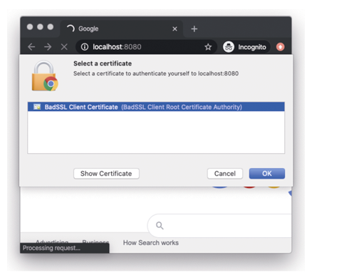
图 11.11　用户浏览器获取客户端证书的提示页面。然后，用户可以从本地安装的证书列表中选择要使用的证书。在 TLS 握手协议中，客户端证书的密钥随后用于对握手记录进行签名，该记录包括客户端的临时公钥
客户端证书非常简单。例如，在 TLS 1.3 协议中，服务器可以通过发送 Certificate-Request 消息请求客户端在握手期间进行认证。然后，客户端通过在 Certificate 消息中发送其证书，接着将 Certificate-Verify 消息（包括密钥交换中使用的临时公钥）中发送和接收的所有消息的签名发送给服务器。
如果服务器能够识别证书并成功验证客户端的签名，则客户端将通过认证。另一个例子是 SSH 协议，它还让客户端对握手过程的消息进行签名，其签名公钥对服务器来说是已知的。
请注意，在握手阶段，签名并不是使用公钥密码进行认证的唯一方法。Noise 协议框架（在第 9 章中介绍）有几种握手模式，这些模式仅使用 DH 密钥交换即可实现对客户端的认证。
2．握手后使用 FIDO2 协议进行用户认证
第二种基于非对称密钥的认证协议需要事先建立一个安全连接，其中只有服务器已经完成认证。对用户认证时，服务器可以简单地要求客户端对一个随机的质询签名。这种方式可以防止重放攻击。
一个有趣的标准是快速身份在线 2（Fast IDentity Online 2，FIDO2）。FIDO2 是一个定义了使用非对称密钥对用户进行认证的开放标准。该标准专门针对网络钓鱼攻击，因此 FIDO2 仅适用于硬件认证器。硬件认证器是一个可以生成和存储签名密钥并对任意挑战值进行签名的物理组件。FIDO2 可分为两种规格，如图 11.12 所示。
● 客户端到认证器协议（Client to Authenticator Protocol，CTAP）：CTAP 是用于实现移动认证器和客户端彼此通信的协议。移动认证器是主设备外部的硬件认证器。CTAP 规范中的客户机定义为希望将查询认证器作为认证协议一部分的软件。因此，客户机可以是操作系统，也可以是浏览器之类的本机应用程序，等等。
● Web 认证（WebAuthn）：WebAuthn 协议允许 Web 浏览器和 Web 应用程序使用硬件认证器对用户进行认证。因此，它必须由浏览器实现，以支持认证器。在构建一个 Web 应用程序，并且希望通过硬件认证器支持用户认证时，就需要使用 WebAuthn 协议。
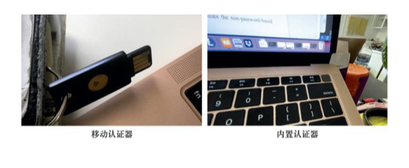
图 11.12　可与 FIDO2 一起使用的两种类型的硬件认证器：Yubikey（移动认证器，见左图）和 TouchID（内置认证器，见右图）
WebAuthn 协议不仅允许网站使用移动认证器，还允许网站使用平台认证器。平台认证器是一种由设备提供的内置认证器。在不同的平台上，它们的实现方式也不同，并且常受到生物识别技术（例如指纹读取器、面部识别器等）的保护。
我们现在结束本小节。但在此之前，我们可以利用图 11.13 来回顾基于非口令的认证协议。
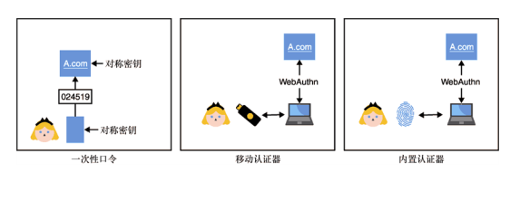
图 11.13　为了在不使用口令的情况下进行认证，应用程序允许用户通过基于 OTP 的协议使用对称密钥，或者按照 FIDO2 标准使用非对称密钥。FIDO2 支持不同类型的认证器，包括移动认证器（通过 CTAP 标准）和内置认证器
现在，我们已经了解了许多不同的技术和协议，这些技术和协议既可以提高口令的安全性，也可以用更强大的密码解决方案取代口令，但我们应该使用哪一种呢？每种解决方案都有自己的优缺点，没有一种解决方案可以做到完美。不过我们可以合并多个解决方案！这种想法被称为多因素认证（Multi-Factor Authentication，MFA）。实际上，除了口令之外（而非代替口令），我们也可能早已使用过 OTP 或 FIDO2 作为第二认证因素。
此处是本章关于用户身份认证前半部分的结尾。接下来，让我们来看看人类如何辅助设备进行相互认证。
++11.3　用户辅助身份认证：人工辅助设备配对
人类每天都在帮助机器相互认证！比如将无线耳机与手机配对，或将手机与汽车配对，或将某些设备连接到家庭 Wi-Fi，等等。和任何配对一样，这些操作的底层很可能涉及密钥交换协议。
11.2 节中的认证协议（可能是 TLS）是在已建立安全连接的前提下完成的，且服务器在该安全信道中进行了认证。相比之下，本节的大部分内容试图为两个不知道如何相互认证的设备提供安全信道。从这个意义上讲，本节将讨论人类如何辅助设备将不安全的连接变为相互认证的安全连接。因此，接下来学习的技术很容易让人想起第 10 章端到端协议中的一些信任建立技术，只不过本节讨论的内容是双方试图相互认证。
如今，最常见的非互联网方式下的不安全连接基于蓝牙、Wi-Fi 和近场通信（Near Field Communication，NFC）等短距离无线电协议。NFC 是一种基于手机或银行卡进行「非接触式」支付时使用的协议。这些通信协议的应用领域涵盖了从低功耗电子设备到功能强大的计算机等各种设备。这就给我们设定了一些限制。
● 我们试图连接的设备可能没有屏幕去显示密钥或无法手动输入密钥。我们称之为供应设备。例如，大多数的无线音频耳机只有几个按钮，它们就属于这样的设备。
● 由于人类会参与验证过程，因此要求输入或比较字符串是不切实际的，而且对用户操作也非常不友好。因此，许多协议试图将与安全相关的字符串缩短为 4 位或 6 位 PIN 码。
习题
假如要求正确地输入 4 位密码才能安全地连接到设备，那么猜对一个口令的概率会有多大呢？
回想我们给一些设备配对的经验，我们会意识到其中很多设备都配对成功了。例如：
（1）我们按下设备上的一个按键；
（2）设备进入配对模式；
（3）我们试图在手机的蓝牙列表中找到该设备；
（4）当我们找到设备并点击它时，就成功将设备与手机配对。
第 10 章中我们学习了首次使用信任（TOFU）机制。不过，这次我们需要一些其他的前提条件。
● 接近：两个设备必须彼此接近，特别是在使用 NFC 协议时。
● 时间：设备配对通常会有时间限制。通常，如果在 30 秒内配对不成功，则必须手动重启进程。
但与 TOFU 机制不同的是，当正确地连接到设备后，这些现实场景通常不允许再对手机进行验证。这种做法并不安全，我们应该尽可能努力地提高安全性。
注意：
顺便说一句，Just Works 协议是一种类似 TOFU 的蓝牙协议核心规范提及的协议。值得一提的是，由于存在许多针对蓝牙协议的攻击，当前内置的蓝牙协议已被攻破，2019 年出现的 KNOB 攻击就属于这些攻击中的一个。尽管如此，如果协议的设计和应用完全正确，本章所述技术仍然是安全的。
我们要学习的下一个认证方法是什么？我们将会在本节中看到人类辅助设备进行身份认证的方法。前情提要：
● 密码学密钥总是最安全的方法，但不一定对用户最友好。
● 我们将学习对称的 PAKE 协议以及在两个设备上输入相同的口令以建立安全连接的方法。
● 我们将了解基于短认证字符串的协议，该协议通过比较和匹配两个设备显示的两个短字符串对密钥交换过程进行认证。
现在，让我们开始学习吧！深入浅出密码学
作者：戴维·王（David Wong）　   11.3.2　CPace 对称口令认证密钥交换
如果可能的话，我们应该尽量选择上述的解决方案，因为它以安全性更强的非对称密钥作为信任的基础。然而，事实证明，在实践中，用键盘手动输入一个代表密钥的长字符串是件烦琐的事。那么如果使用口令呢？口令相比密钥短得多，因此更容易通过键盘输入。我们都喜欢口令，对吗？也许我们也不喜欢口令，但相比于密钥，用户会更喜欢口令，而且现实世界的密码技术本就充满了妥协。
在关于非对称密码认证密钥交换的部分中，我们提过它的对称（或平衡）版本，该版本中两个知道公共口令的对等方可以执行相互认证密钥交换。这正是我们需要的。
可组合口令认证连接建立（Composable Password Authenticated Connection Establishment，CPace）协议由比约恩·哈斯（Björn Haase）和贝诺特·拉布里克（Benoît Labrique）于 2008 年提出，并于 2020 年初被选为密码论坛研究小组（CFRG）的官方推荐协议。目前，RFC 正在标准化该算法。CPace 协议的简化版执行过程如下（该算法的执行过程见图 11.15）。
● 两个设备基于公共口令派生出一个生成元（对于某些预定的循环群）。
● 然后，这两个设备使用这个生成元执行一次临时 DH 密钥交换协议。
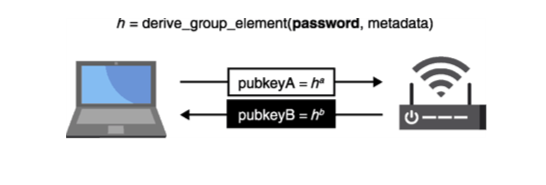
图 11.15　CPace 对称口令认证密钥交换协议的工作原理是让两个设备根据口令产生一个生成元， 然后将其用作（通常是）临时 DH 密钥交换的基数
当然，问题在于作为现代规范，CPace 协议以椭圆曲线「gotchas」为目标曲线，并定义了何时必须验证接收到的点是否在正确的椭圆曲线群中（由于流行的 Curve25519 无法超出素数阶群的范畴）。它还指定了在椭圆曲线群中如何基于口令派生生成元（使用 Hash-to-curve 算法），以及执行此操作的过程（不仅需要通用口令，还需要唯一的会话 ID 和一些其他上下文元数据，如对等方的 IP 地址等）。
这些步骤很重要，因为两个对等方都必须以某种方式导出生成元gx = h，以防止它们知道其离散对数x。最后，从 DH 密钥交换的输出、临时公钥和唯一会话 ID 派生出会话密钥。
直观地说，在握手过程中，对等方会向另一方发送一个群元素作为公钥，该公钥与秘密私钥相关联。这意味着，如果攻击者不知道口令，就永远无法正确地执行 DH 密钥交换协议。而真正的 DH 密钥交换的脚本与其他的 DH 密钥交换脚本无法区分，因此如果 DH 算法是安全的，那么敌手猜中正确口令值的优势就是可以忽略的。11.3.3　用短认证字符串避免密钥交换遭受 MIMT 攻击
在本节中，我们学习了一些人类辅助两台设备配对的协议。然而，本章也提到，一些设备由于受到限制，无法使用这些协议。让我们来看一个可以在两个设备无法导入密钥但可以向用户显示有限数据的情况下（可能通过屏幕、打开一些 LED 或发出一些声音等）实现设备配对的方案。
首先，请记住我们在第 10 章学习了如何使用指纹（脚本的哈希）对会话的安全通信阶段（密钥交换后）进行认证。我们可以使用这样的工具，因为我们有带外通道来传递这些指纹。如果用户能够成功地比较和匹配从两个设备获得的指纹，那么用户可以确定密钥交换阶段没有中间人敌手介入。
通常，指纹是一串长字节串（如 32 字节长），可能很难将其展示给用户，且比较两个指纹是否相等也比较麻烦。但是在设备配对中可以使用更短的字节串，因为我们正在进行实时的比较！我们称这样的短字符串为短认证字符串（Short Authenticated String，SAS）。由于 SAS 对用户非常友好，因此它得到广泛应用，在蓝牙协议中尤其常见（见图 11.16）。
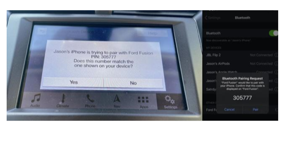
图 11.16　通过蓝牙配对手机与汽车时，数字比较模式可用于生成两台设备之间协商好的安全连接短认证字符串。不幸的是，正如本章前面所说，由于 KNOB 攻击，当前内置的蓝牙安全协议目前已被攻破（截至 2021 年）。两台设备的控制者需要实现自己的 SAS 协议
基于 SAS 的方案没有任何标准，但大多数协议（包括蓝牙协议的数字比较）都实现了手动认证 DH（Manually Authenticated Diffie-Hellman，MA-DH）协议的变体。MA-DH 是一种简单的附加有其他技术的密钥交换协议，这个技术使得主动的中间人敌手很难成功介入密钥交换过程。那么为什么不通过截取指纹来创建 SAS 呢？为什么要使用这些技巧呢？
通常，SAS 由 6 位数字组成，通过将脚本的哈希值截断为小于 20 位（比特长度）并将其转换为以 10 为基数的数字可以获取这样的短认证字符串。因此，SAS 非常小，这使得攻击者更容易在截断的哈希上获取第二原像。在图 11.17 中，我们以两台设备（图中使用 Alice 和 Bob 表示）为例，执行未认证的密钥交换。主动的中间人攻击者可以在第一条消息中用自己的公钥替换 Alice 的公钥。一旦攻击者收到 Bob 的公钥，他就会知道 Bob 计算出的 SAS（基于攻击者公钥和 Bob 公钥哈希的截断值）。攻击者只需生成多个公钥就可以找到一个（public_keyE2），使 Alice 的 SAS 与 Bob 的匹配。
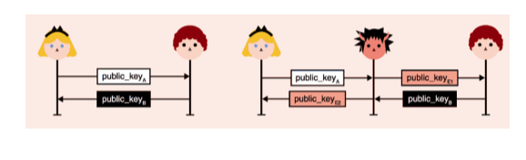
图 11.17　典型的未认证的密钥交换（左侧）可能会被主动的中间人攻击者（右侧）拦截，然后攻击者可以替换 Alice 和 Bob 的公钥。如果 Alice 和 Bob 生成相同的短认证字符串，即 hash(public_keyA||public_keyE2)和 hash(public_keyE1||public_keyB)匹配，则中间人攻击者攻击成功
实际上，生成一个能使两个 SAS 匹配的公钥相当容易。假设 SAS 的长度为 20 比特，那么在仅仅 220 次计算之后，我们应该会找到它的第二原像，这会使 Alice 和 Bob 生成相同的 SAS。对于性能较差的手机，这样的计算量也可以实时完成。
基于 SAS 密钥交换背后的技巧是，防止攻击者通过选择第二个公钥来迫使两个 SAS 匹配。为此，Alice 只需在看到 Bob 的公钥之前发送自己公钥的承诺（见图 11.18）。
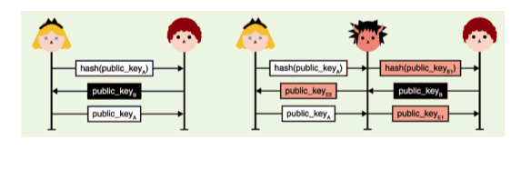
图 11.18　左边的图展示了一个基于 SAS 的安全协议，在该协议中，Alice 首先发送一个公钥的承诺。然后，她只在收到 Bob 的公钥后才公开自己的公钥。因此 Alice 不能根据 Bob 的密钥自由地选择密钥对。如果主动的中间人攻击者介入密钥交换的过程（见右图），攻击者无法选择任何一个密钥对来强制 Alice 和 Bob 的 SAS 匹配
与之前的不安全方案一样，攻击者选择不会给他们带来任何好处。但是现在他们也不能选择一个有用的，因为此时他并不知道 Bob 的 SAS。攻击者被迫只能「摸黑攻击」，寄希望于 Alice 和 Bob 的 SAS 能够匹配。
如果 SAS 比特长度为 20 位，则 Alice 和 Bob 的 SAS 匹配的概率是。通过多次运行该协议，攻击者获得成功的概率会大大增加，但请记住，该协议的每个实例都要求用户必须手动匹配 SAS。这种小阻碍可以降低攻击者攻击成功的概率。
本章的主要内容到此结束！对本节内容的回顾如图 11.19 所示。
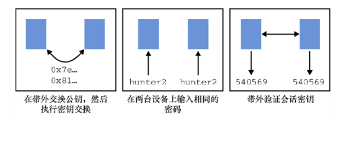
图 11.19　我们已经了解两台设备配对的 3 种技术：（1）用户辅助两台设备获取彼此的公钥，以便进行密钥交换；（2）用户可以在两台设备上输入相同的口令，以便进行对称的口令认证密钥交换；（3）用户可以在会话密钥创建后验证密钥交换的指纹，以确认是否有中间攻击者拦截配对过程
故事时间
有趣的是，当我在写第 10 章端到端加密时，我开始研究 Matrix 端到端加密聊天协议的用户如何验证他们的通信。为了使验证操作更加方便，Matrix 协议创建了基于 SAS 协议的变体。不幸的是，虽然它计算了 X25519 密钥交换的共享秘密哈希值，但却没有将正在交换的公钥作为哈希函数的输入。
在第 5 章中，我们知道验证 X25519 密钥交换中的公钥是件很重要的事。而 Matrix 协议没有这样做，这使得中间人攻击者可以向用户发送不正确的公钥，迫使用户最终得到相同的可预测的共享秘密，进而获得相同的 SAS。这完全违背了端到端加密协议的原则，不过该漏洞很快就得到修复。
++11.4　本章小结
● 用户认证协议（用于设备认证用户的协议）通常在已建立安全连接的基础上进行，且只完成服务器向用户端的身份认证。从这个意义上说，用户认证协议将单向认证的连接变为相互认证的连接。
● 用户认证协议会大量使用口令。口令是一种比较实用并且为用户广泛接受的解决方案。但由于口令具有安全性不足、低熵和口令数据库容易泄露等缺点，所以基于口令的用户认证协议会引起许多问题。
● 避免用户管理多个口令（或者重用口令）的方法如下。
❏ 口令管理器：一种帮助用户生成和管理每个应用程序所需的安全口令的工具。
❏ 单点登录（SSO）：允许用户使用一个账户来注册并登录到其他服务的联邦协议。
● 避免服务器获取用户口令的一个解决方案是使用非对称口令认证密钥交换（非对称 PAKE）。非对称 PAKE（如 OPAQUE 协议）允许用户使用口令向已知服务器进行认证，但不必向服务器透露口令。
● 完全避免口令的解决方案是让用户通过一次性口令（OTP）算法使用对称密钥，或者按照 FIDO2 这样的标准使用非对称密钥。
● 用户辅助身份认证协议通常发生在不安全的连接（如 Wi-Fi 协议、蓝牙协议、NFC 协议）上，这类协议要求在人的辅助下完成两台设备的相互认证。为了确保这些场景中连接的安全性，用户辅助身份认证协议假定两个参与者拥有一个额外可用的经过认证（但不保密）的信道（如设备上的屏幕）。
● 将一个设备的公钥导出到另一个设备可能实现强安全的相互认证密钥交换。但由于设备限制（例如，无法导出或导入密钥），这些操作流程对用户并不友好，有时甚至完全不可实现。
● CPace 之类的对称口令认证密钥交换（PAKE）协议可以减轻用户导入长公钥的负担，用户只需在设备中手动输入口令即可。例如，大多数人都在用对称 PAKE 连接到他们的家庭 Wi-Fi。
● 基于短认证字符串（SAS）的协议可以为无法导入密钥或口令但能够在密钥交换后显示短字符串的设备提供安全性。两台设备上的短字符串必须相同，以确保未经认证的密钥交换过程未被主动的中间人敌手介入。