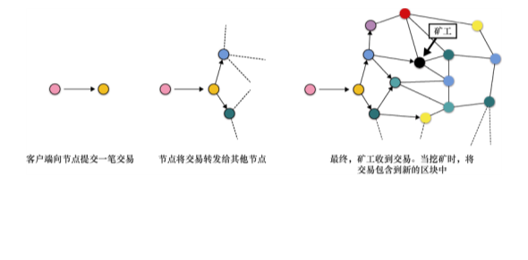
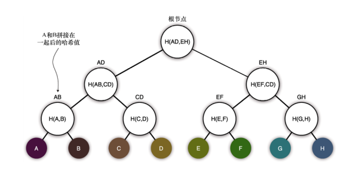
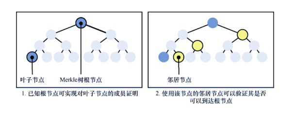
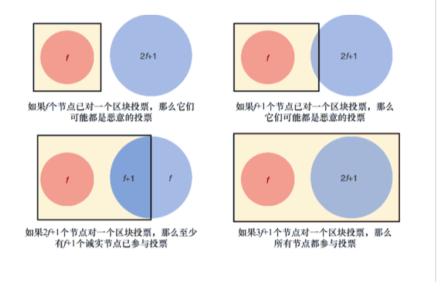
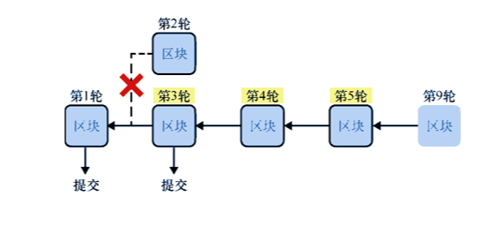

第 12 章　「加密货币」
本章内容：
● 共识协议以及基于该协议的「加密货币」；
● 各种类型的「加密货币」；
● 比特币和 Diem「加密货币」在实践中的工作原理。
密码学能成为新金融体系的基础吗？从 2008 年开始甚至更早以前，「加密货币」就试图利用密码技术构建新的金融货币体系。在此背景下，中本聪[1]（Satoshi Nakamoto）提出了比特币（Bitcoin）。在此之前，密码这个术语只出现在密码学领域的文献中。但自从比特币这个术语诞生以来，它的含义迅速地发生了改变，现在密码一词多用于指代「加密货币」。反过来，这也激发了「加密货币」爱好者学习密码技术的兴趣。这样说也是合理的，毕竟密码技术是「加密货币」的核心。
[1]　至今，中本聪尚未透露自己的身份。
什么是加密货币？它体现在如下两个方面。
● 简单地说，「加密货币」允许人们以电子方式进行货币交易。我们可能已经在使用数字货币，例如通过互联网或支票账户给某人汇款，这些都表明我们正在使用数字货币！今天，我们不需要通过邮递来寄送现金。事实上，大多数货币交易都只需更新数据库中的几行数据。
● 「加密货币」是一种高度依赖密码技术的数字货币，其货币系统的运行完全透明。我们经常将这种性质称为去中心化（或信任关系的去中心化）。因此，我们将在本章中看到，「加密货币」能够容忍一定数量的恶意参与者，并允许人们验证货币系统是否正常运行。
在全球金融危机中期（2008 年），密码学家提出了 Bitcoin，这是第一个成功推行的「加密货币」系统。虽然这场金融危机始于美国，但它很快蔓延到世界的其他地区，侵蚀了人们对金融系统的信任。当时，许多人开始意识到金融交易的现状：效率低下，维护成本高昂，而且对大多数人来说金融系统也不够透明。本章主要介绍「加密货币」的历史，相信在密码学著作中本书是少见的包含加密货币知识的图书。
++12.1　拜占庭共识算法介绍
假设我们想创造一种新的数字货币（实际上，构建一个有效的数字货币系统并不复杂），我们可以在专用服务器上搭建一个记录用户信息及其余额的数据库。该数据库系统提供查询用户余额，同时提供允许用户发起支付请求的接口。付款方在数据库中的余额会减少，而收款方在数据库中的余额会相应增加。最初，我们也可以将一些随机制造的货币转交给我们的朋友，这样他们就可以利用我们创建的货币系统完成转账。但是这种简单的货币系统存在许多缺陷。12.1.1　数据恢复问题：分布式数据可恢复协议
我们刚才提到的系统存在单点故障问题。如果断电，用户将无法使用该系统。更糟糕的是，如果一些自然灾害意外地破坏了货币系统服务器，每个用户都可能永久性地失去他在该货币系统中的余额。为了解决这个问题，我们可以使用一些技术来提高系统的恢复。分布式系统领域主要研究的就是这种技术。
在这种情况下，大多数大型应用程序使用的解决方案是（某种程度上）实时将数据库内容复制到其他备份服务器上。这些服务器可以分布在不同的地理位置，随时备份服务器上的数据，当主服务器出现故障时，备份服务器甚至会替代主服务器。这就是所谓的高可用性。现在，假设我们有一个这样的分布式数据库。
对于支持大量查询请求的大型系统，通常情况下，这些备份数据库不是处于闲置且等待使用的状态，而是处于允许读取其数据的状态。向多个数据库同时写入和更新数据是很困难的，这样操作数据库可能会出现冲突（就像两个人同时编辑同一个文档一样，可能会出现错误）。因此，我们通常希望由一个数据库充当主数据库，并负责对数据库进行所有写入和更新操作，而其他数据库用于状态读取。
数据库内容的复制速度可能会很慢，一些备份数据库的更新速度将落后于主数据库。如果这些数据库分布的距离相对遥远，或者由于某种原因连接数据库的网络正在经历网络延迟，数据库复制速度会更慢。当使用备份的数据库读取数据状态时，这种延迟会成为一个问题（如对于同一个数字货币账户，由于数据库中的数据更新速度不同步，我们与我们朋友看到的账户余额会有所不同）。
在这些情况下，编写的应用程序通常需要容忍这种延迟。这称为最终一致性，即数据库的状态最终会变得一致（存在更强的一致性模型，但是这些模型通常速度慢且不切实际）。这样的系统还存在其他问题：如果主数据库崩溃，那么哪个备份数据库会成为主数据库？另一个问题是，如果备份数据库的更新速度落后于主数据库，那么主数据库崩溃时我们会丢失最新更改过的数据吗？
当我们需要整个系统就某个决策达成一致意见（或达成共识）时，共识算法（也称为日志复制、状态机复制或原子广播）就有了用武之地。我们可以把共识算法视为一群人协商点什么比萨问题的解决方案。如果每个人都在同一个房间里，很容易看出大多数人想要什么。但是，如果每个人都通过网络进行通信，信息可能存在延迟、删除、拦截和修改等问题，就需要一个更复杂的协议才能解决大多数人想要什么的问题。
让我们看看如何利用共识机制解决前面提到的两个问题。第一个问题称为主数据库选择，即在主数据库崩溃的情况下，哪个数据库将替代崩溃数据库，最终成为主数据库。共识算法用于确定哪个数据库将成为下一个主数据库。第二个问题的解决方法是，将数据库中数据的更改操作分为两个步骤：挂起和提交。在开始时，将数据库状态更改为挂起，只有足够多的数据库同意提交时才能将其设置为已提交（共识协议也可以解决该问题）。由于大多数参与的数据库已经提交了更改，所以一旦提交，对状态的更新就不会轻易丢失。
著名的共识算法包括 Paxos（Lamport 在 1989 年提出）及其简化算法 Raft（Ongaro 和 Ousterhout 于 2013 年提出）。我们可以在大多数分布式数据库系统中使用这些算法来解决各种各样的问题。12.1.2　信任问题：利用去中心化解决信任问题
分布式系统（从操作角度来看）为存在单点故障的系统提供了一种有弹性的替代方案。大多数分布式数据库系统使用的共识算法不能很好地容忍系统故障。一旦机器开始崩溃，或由于硬件故障而出现异常行为，或出现与其他机器断开连接的网络分区现象，系统就会随之出现各种故障。此外，无法从用户的角度检测到这些问题，如果服务器受到破坏，这会是一个更严重的问题。
假设，向一个服务器查询 Alice 账户中的余额，该服务器返回的余额为 50 亿美元。我们只能相信该查询结果。如果服务器在其响应中包含 Alice 从一开始接收和发送的所有转账记录并将其汇总，我们就可以验证 Alice 账户余额中的 50 亿美元是否为正确的余额。但是，怎么证明服务器没有欺骗我们呢？或许，当 Bob 向另一个不同的服务器查询 Alice 的账户余额时，服务器返回一个不同的 Alice 账户的余额和历史交易记录。我们称之为分叉（两个相互矛盾但都有效的状态），在历史交易记录中不应该出现这样的分叉。因此，我们可以推断，一个备份数据库的泄露就可能导致非常严重的后果。
第 9 章曾提到过证书透明化，它的目标在于检测 Web 公钥基础设施（PKI）中的分叉问题。在涉及金钱的数据库中，仅靠检测是无法解决分叉问题的。在这类场景中，防止分叉是我们首要解决的问题。1982 年，Paxos 共识算法的作者 Lamport 提出了拜占庭容错（Byzantine Fault-Tolerant，BFT）共识算法思想。
想象拜占庭军队的几个师驻扎在敌城外，每个师都由自己的将军指挥。将军们只能通过信使互相交流。观察到敌手之后，他们必须协商出一致的行动计划。然而，其中的一些将军可能是叛徒，他们试图阻止忠诚的将军们达成正确的行动计划。
——Lamport 等（“The Byzantine Generals Problem”，1982）
通过拜占庭式的思想类比，Lamport 开拓了 BFT 共识算法。该算法旨在解决达成一致决策时，防止恶意参与者对系统最终的决策产生不利影响。这些 BFT 共识算法与之前的共识算法（如 Paxos 和 Raft）非常相似，只是备份数据库（协议的参与者）不再盲目地相互信任。通常，BFT 协议使用大量密码学技术来验证消息和决策结果，反过来，其他人也可以使用密码学技术验证共识协议输出的决策结果。
因此，BFT 共识算法有助于解决系统弹性和信任问题。不同的备份数据库可以运行这些 BFT 算法，它们共同就新的系统状态达成一致结果，同时通过验证状态转换（用户之间的事务）是否有效以及大多数参与者是否已达成一致意见来相互监督。我们称这样的信任建立机制是去中心化的。
1999 年，人们提出第一个实用的 BFT 算法，称为 PBFT（Practical BFT）。PBFT 是一种类似于 Paxos 和 Raft 的基于领导式的共识算法，其中提议由一位领导者提出，而其他领导者则试图就该提议达成一致。不幸的是，PBFT 非常复杂，速度很慢，而且不能很好地扩展到具有十几名参与者的系统。如今，大多数现代「加密货币」都使用更高效的 PBFT 协议变体。例如，脸书公司在 2019 年推出基于 HotStuff 共识协议的「加密货币」Diem。HotStuff 是一种受 PBFT 启发的共识协议。12.1.3　规模问题：无许可和不受审查的网络
基于 PBFT 共识算法的协议存在局限性，即要求协议的参与者事先已知且固定不变。基于 PBFT 的协议还存在更严重的问题，当参与者超过一定数量后，他们的通信复杂性急剧增加，产生共识的速度也极其缓慢，选举领导者的过程也变得非常复杂，等等。
在「加密货币」场景下，如何确定共识协议的参与者？该问题有许多种解决方法，但最常见的两种方法如下。
● 权威证明（Proof of Authority，PoA）——事先决定共识过程的参与者。
● 股权证明（Proof of Stake，PoS）——动态挑选共识过程的参与者，即把拥有股权较多者设定为共识过程的参与者（因此，拥有股权较多者攻击协议的动机较低）。一般来说，基于 PoS 的「加密货币」会根据参与者持有的数字货币数量来选择共识过程的参与者。
尽管如此，并不是所有的共识协议都是经典的 BFT 共识协议的变体。例如，Bitcoin 提出一种在参与者名单事先未知情况下的共识机制。这在当时是一个相当新颖的想法，通过放松对经典 BFT 共识协议的约束，Bitcoin 实现了这样的共识机制。正如我们将在本章后面看到的那样，正是由于这种机制才导致 Bitcoin 的分叉现象，这也给 Bitcoin 带来了一系列挑战。
如果没有参与者，我们该怎么挑选共识过程的领导者呢？我们可以使用 PoS 系统（例如，Ouroboros 共识协议可以做到这一点）。与现有的共识机制不同，Bitcoin 的共识依赖于一种叫作工作量证明（Proof of Work，PoW）的机制。在 Bitcoin 中，PoW 机制要求找到难题的解的人才能成为共识协议的参与者和领导者。这里提到的难题指的是密码学难题，本章后面的内容会包含该难题的详细描述。
由于无法预先知道协议的参与者，Bitcoin 被称为无许可网络。在无许可网络中，参与协议者不需要额外的授权和许可；任何人都可以参与协议。这与具有固定参与者集的许可网络形成鲜明对比。图 12.1 给出无许可网络与许可网络之间的区别和联系。

图 12.1　集中式的网络存在单点故障问题，而分布式和去中心式网络则能够抵御大量服务器关闭或存在恶意行为的情形。在许可网络中，共识过程的参与者往往已知且固定，而在无许可网络中，任何人都可以成为共识过程的参与者
目前，人们还不知道如何在无许可网络中使用经典的 BFT 共识协议，同时使任何人都可以加入该网络。如今，有许多方法使用 PoS 来动态选择较小的参与者子集作为共识过程的参与者。比较著名的共识协议是 2017 年提出的 Algorand 协议，它根据参与者持有的货币数量动态地选择参与者和领导者。
此外，Bitcoin 系统还能够抵抗监督和审查。这是因为我们无法提前知道谁将成为下一任领导者。基于这一原因，我们也无法阻止系统选举新的领导者。目前，尚不清楚在 PoS 系统中是否可能实现这一特性。在 PoS 系统中，我们可能更容易找到大额货币持有者对应的身份。
值得一提的是，并非所有的 BFT 共识协议都是基于领导者的。有些协议是无领导的，这些协议不是通过选举的方式来产生新的领导者的。相反，在这些无领导的协议中，每个参与者都可以提出新的提议，共识协议可以帮助每个参与者就下一个状态达成共识。2019 年，Avalanche 推出了一种允许任何人提出新提议并参与共识过程的「加密货币」。
最后，对于一个分布式的支付系统来说，达成共识也不是必要的。2018 年，Guerraoui、Kuznetsov、Monti、Pavlovic 和 Seredinschi 在「AT2: Asynchronous Trustworthy Transfers」中提出了无共识协议。无共识协议是一种相对较新的协议，尚未经过实践的检验。考虑到这一点，本章不会讨论无共识协议。在本章的剩余部分，通过两种不同的「加密货币」展示共识协议的具体应用。
● Bitcoin——于 2008 年提出，是一种基于 PoW 机制的「加密货币」。
● Diem——由 Facebook 等公司于 2019 年提出，是一种基于 BFT 共识协议的「加密货币」。
++12.2　Bitcoin 的工作原理
2008 年 10 月 31 日，一位匿名研究员以笔名中本聪发表了一篇标题为「Bitcoin: A Peer-to-Peer Electronic Cash System」的文章。直到今天，人们仍然不知道谁是中本聪。然而，该文章发表之后没多久，Bitcoin 核心客户端就发布了，任何人都可以运行该软件来加入 Bitcoin 网络。Bitcoin 唯一需要的就是：有足够多的用户来运行 Bitcoin 的核心软件，或运行包含相同算法的软件。因此，有史以来的第一个「加密货币」——Bitcoin。
Bitcoin 是一个真正成功的案例。该「加密货币」已经运行了十多年（到撰写本书时为止），并允许世界各地的用户使用数字货币进行交易。2010 年，程序员 Laszlo Hanyecz 用 10000 BTC 的价格购买了两个比萨。而在近几年，1BTC 的价值曾接近 57000 美元。人们也已经意识到，有时「加密货币」的价值会非常不稳定。12.2.1　Bitcoin 处理用户余额和交易的方式
首先，让我们深入了解 Bitcoin 的内部结构，看看 Bitcoin 如何处理用户余额和交易。作为 Bitcoin 的用户，我们会直接触及各种密码学知识。与任何银行一样，最初我们也都没有登录 Bitcoin 网站的用户名和密码，不过，我们有一个自己生成的 ECDSA（椭圆曲线数字签名算法）密钥对。用户余额只是许多与某一公钥相关联的比特币，因此如果想接收他人转来的比特币，只需要将自己的公钥共享给其他人。
当使用比特币时，我们需要使用私钥对交易进行签名。交易的基本内容是：「我将X个比特币发送到公钥Y 」。这里忽略了一些细节，本书后续内容会对此做进一步解释。
注意：
Bitcoin 用 secp256k1 曲线实例化 ECDSA。切记，不要将该曲线与 NIST 的 P-256 曲线（即 secp256r1）相混淆。
账户资金的安全性与私钥的安全性直接相关。同时，我们知道管理好密钥是一件很难的事情。在过去十多年中，「加密货币」中的密钥管理问题导致了价值数百万美元的密钥意外丢失（或被盗）。因此，请保管好私钥！
Bitcoin 中存在不同类型的交易，在网络上看到的大多数交易实际上是通过哈希函数计算摘要的方式隐藏了收件人的公钥。也即，把公钥的哈希值当作账户的地址。（例如，笔者的 Bitcoin 地址为 bc1q8y6p4x3rp32dz80etpyffh6764ray9842egchy。）除非账户所有者决定使用比特币（在这种情况下，需要知道地址的原像，以便其他人验证交易的签名），否则账户地址能够有效地隐藏账户实际对应的公钥。这样做会缩短地址的长度，同时哪怕 ECDSA 算法某天被攻破，这种做法还能防止恶意攻击者提取到我们的私钥。
一个有趣的事实是，在 Bitcoin 中存在不同类型的交易。交易记录不仅仅包含一些与交易相关的有效载荷信息；交易实际上是用一个精心设计的、相当有限的指令集编写的短脚本。当处理交易时，需要先执行脚本，然后根据脚本的输出确定交易是否有效。如果交易有效，需要确定采取哪些步骤来修改所有账户的状态。
以太坊（Ethereum）等「加密货币」将这种脚本思想推向了极致，它允许交易时执行更复杂的程序，这种程序也称为智能合约（Smart Contract）。目前，我们尚未详细解释下面这些问题。
● 一笔交易中包含哪些信息？
● 执行交易意味着什么？而交易又由谁来执行？
在 12.2.2 小节会解释第二个问题。现在，让我们深入了解一笔交易中都包含哪些信息。
Bitcoin 最明显的特征就是，不存在一个存储账户余额的真实数据库。取而代之的是，用户拥有一个比特币钱包，里面包含大量可供使用的比特币，这些比特币常被称为未消费的交易输出（Unspent Transaction Output，UTXO）。我们可以把 UTXO 模型想象成一个任何人都能看见的大碗，而碗里面装满了只有硬币拥有者才能消费的硬币。当一笔交易花费掉某些硬币时，这些硬币就会从碗中消失，而该笔交易的收款人会拥有一些新的硬币。这些新硬币包含在交易输出信息中。
想要知道我们的账户中有多少个比特币，我们必须统计分配到我们账户地址的所有 UTXO。换句话说，我们必须清点所有转给我们的钱和尚未花费的钱。图 12.2 给出了 UTXO 在交易中的使用方式。

图 12.2　Alice 对交易 1 进行签名，它将 1BTC 转给 Bob。该交易使用包含 5BTC 的 UTXO 模型，交易剩余的比特币会返回给 Alice，并保留部分比特币作为交易费用。Bob 对交易 2 进行签名，他把从 Alice 账户收到的 1BTC 和自己的 2BTC 发送给 Felix（值得注意的是，交易费用在现实中要比本示例中低得多）
现在有一个先有鸡还是先有蛋的问题：第一批 UTXO 是从哪里来的？12.2.2 小节将会回答该问题。12.2.2　挖掘数字黄金 BTC
现在，我们了解了 Bitcoin 的交易细节、管理账户的方法、账户余额计算方法。但谁能真正获得所有交易记录呢？答案是每个人都可获得 Bitcoin 系统的交易记录！
事实上，在 Bitcoin 数字货币系统中，每笔交易记录都必须公开。Bitcoin 是一种只允许追加记录的账本，即它是一种交易账簿，其中每页交易记录都与前一页记录相关联。这里需要强调的是，只许追加意味着不能修改先前页中的交易记录。还要注意的是，因为每笔交易都是公开的，所以 Bitcoin 的匿名性只是表象，我们只是很难确定交易双方是谁（换句话说，我们无法把公钥与现实生活中的某个人关联起来）。
下载 Bitcoin 客户端，并使用它下载完整历史交易记录，我们可以方便地检查自 Bitcoin 诞生以来发生的任何交易。通过这样做，我们将成为 Bitcoin 网络的一部分，并且必须根据 Bitcoin 客户端中的编码规则重新执行每笔交易。当然，Bitcoin 的历史记录相当庞大：在撰写本书时，Bitcoin 的交易记录约占 300GB。根据网络连接情况，下载整个 Bitcoin 交易记录可能需要花费几天时间。我们可以通过在线服务轻松地检查交易，该服务为我们完成繁重的计算工作（前提是我们要信任在线服务）。图 12.3 给出了区块链的详细组成结构。

图 12.3　本示例是从区块链上随机选取的一个交易记录。该交易记录的输入大约为 1.976 BTC，输出由两部分组成，它们分别是 0.009 BTC 和 1.967 BTC。总输入金额和总输出金额之间的差额就是交易费用（交易费用不是交易输出的组成部分）。为了花费输入中的 UTXO，或使输出中的 UTXO 可花费，用 Bitcoin 脚本语言编写的脚本填充交易记录中的其他字段
Bitcoin 实际上只是一个记录从诞生（我们称之为「创世纪」）到现在已经处理过的所有交易的列表。这让我们产生这样的疑问：谁负责管理这个账本中的交易顺序？
为了就交易顺序达成一致，Bitcoin 允许任何人提交一份交易清单，将其作为交易账本的下一页。然而，只允许其中一个人为下一笔交易生成新的区块。为了做到这一点，Bitcoin 系统允许每个人去尝试解决一个概率型难题，但是它只认为首先解决难题的人提出的区块合法。这就是我们之前提到的 PoW 机制。Bitcoin 的 PoW 目标是，找到一个区块并使该区块的哈希值小于某个已知的摘要值。换句话说，必须以二进制形式表示区块的摘要，同时要求摘要的前若干二进制位为 0。
除了要在新增区块包含交易本身外，该区块还必须包含前一个区块的哈希值。因此，Bitcoin 账本实际上由一系列连续的区块组成，其中每个区块都指向前一个区块，直到第一个区块，即创世区块。这就是将 Bitcoin 称为区块链的原因所在。区块链的特殊之处在于，对一个区块进行轻微的修改就会导致该区块链无效。这是因为修改区块的内容会导致区块的摘要也发生变化，从而导致下一个区块无法索引到这个修改的区块。
需要注意的是，如果希望提出区块链的下一个区块，我们不需要在区块中做太多更改，就可以从中派生出一个新的哈希值。我们可以先确定它的主要内容（包含交易内容、扩展的区块哈希值等），然后通过修改区块的一个 Nonce 字段来改变区块的哈希值。我们可以将此字段视为一个值递增的计数器，直到找到符合规则的区块摘要，或者随机生成一个 Nonce 值并保证区块摘要满足要求。图 12.4 中给出了区块链中的区块生成过程。

图 12.4　Anders Brownworth 网站允许我们以交互式方式体验区块链的工作原理。每个区块都包含其父区块的摘要，并且每个区块都包含一个随机的 Nonce 值，通过改变该 Nonce 值使得本区块的摘要值以 4 个 0 开头。需要注意的是，第一幅图片构成一个真实的区块链，而第二幅图片中区块链则包含一个已修改的区块（编号为 2 的区块，它的数据段最初为空）。对区块 2 的修改导致该区块的摘要发生了改变，因此后续区块无法再对其提供完整性认证
每个人都以相同的规则运行同样的协议，因此对每个人来说，所有区块都是有效的。当需要同步区块链时，我们可以从其他对等方下载并验证所有区块。
● 计算每个区块的哈希值，并确保得到的哈希值小于预期值。
● 每个区块都包含区块链历史记录中前一个区块的哈希值。
每个人都可以向区块链提供新的区块，但这不是必需的。如果愿意，我们也可以提出新区块。在区块链系统中，我们常称提出新区块者为「矿工」（Miner）。为了在区块链中进行交易，我们需要「矿工」的帮助（见图 12.5）。

图 12.5　比特币网络由一系列相互连接的节点（「矿工」与交易者）组成。为了完成交易，必须将交易发送给能够将本交易所在区块纳入区块链的「矿工」。由于不知道哪个「矿工」能够成功挖到下一个区块，因此必须通过网络广播我们的交易，将交易告知尽可能多的「矿工」
「矿工」不是免费的，我们需要向其支付一定的费用。如果「矿工」发现新的区块，需要做如下工作。
● 发送奖励——将一定数量的 BTC 发送到「矿工」的账户地址。最初，「矿工」们每开采一个区块将可以获得 50BTC。但是每挖出 21 万个区块，奖励价值减半，最终奖励将减少到 0，而整个区块链可创建的 BTC 总量上限为 2100 万。
● 所有交易费用都包含在区块中——「矿工」往往乐意把交易费用高的交易包含在他们挖出的区块中。这就是增加交易费用可以让我们的交易更快完成的原因。
这就是比特币用户能够推动和激励区块链发展的原因。每个区块总是包含一个币基交易（Coinbase）地址，即收取奖励和费用的地址。通常，「矿工」会把币库地址设置为自己的账户地址。
现在，我们可以回答 11.2.1 小节提到的问题：第一批 UTXO 来自哪里？答案是，所有的 BTC 都是「矿工」集体奖励的一部分，它们随着挖矿的成功而产生。12.2.3　解决挖矿中的冲突
比特币通过基于 PoW 的系统选择下一组要处理的交易任务。我们挖到一个区块的概率与我们单位时间能够计算的哈希值数量密切相关，即挖到区块的概率取决于我们的计算能力。如今，大量算力都用于挖掘比特币或其他基于 PoW 的「加密货币」中的区块。
注意：
PoW 机制可以让比特币抵抗女巫攻击（Sybil Attack）。该攻击利用这样的事实：我们可以在比特币协议中创建任意数量的账户，这种做法为不诚实的参与者提供不对称优势。在比特币中，获得更多算力的唯一方法是，购买更多可以计算哈希值的硬件设备，而在比特币网络中创建更多的账户地址不会提高参与者的算力。
不过，仍然有一个问题尚未解决：找到某个小于预设值的哈希值不能太过容易。如果这个过程太过容易，那么会出现许多比特币网络中的参与者同时挖到有效的区块的情况。如果发生这种情况，哪个区块会成为区块链中的下一个合法区块？这就是区块链分叉现象形成的原因。
在比特币中，有两种机制可以解决分叉问题。第一种机制是，动态地保持 PoW 机制的困难性。如果区块的挖掘速度过快或过慢，比特币系统会通过提高或降低 PoW 机制的难度让每个参与者动态地适应网络条件。简而言之，比特币系统要求「矿工」们找到的区块摘要包含的 0 的个数也是动态变化的。
注意：
如果 PoW 机制的难度要求是区块摘要必须以一个全 0 的字节开头，则需要尝试计算 28个不同的区块的摘要（更具体地说，计算 28个不同的 Nonce 值对应的区块摘要），直到找到有效的摘要为止。若将难度要求提高到区块摘要以两个全 0 的字节开头，则我们需要尝试 216个不同的区块。获得区块摘要所需的时间取决于我们拥有的算力，以及我们是否有专门的硬件可以更快地计算这些摘要。目前，比特币系统会动态地改变 PoW 机制的难度，始终保持每 10 分钟挖到一个区块。
解决分叉问题的第二种机制是，如果真的发生了分叉，那么比特币的参与者遵循最长链有效原则继续沿着正确的链进行交易。2008 年，相关论文指出：「最长的链不仅可以证明所见证的事件序列，还可以证明它由最大的 CPU 资源池创建。」这表明参与者应该承认最长链的有效性。该协议后来发生了更新，它将累积工作量最大的链视为有效链。然而，协议更新前后的这两种有效链判断原则并没有明显的区别。区块链分叉及其解决方法的示意如图 12.6 所示。

图 12.6　区块链中的分叉：两名「矿工」在高度为 3 处发布一个有效区块（即在创世区块之后的第 3 个区块）。后来，另一名「矿工」在高度为 4 处发布一个有效区块，该区块指向高度为 3 的第 2 个区块。现在，第 2 个分叉比第 1 个分叉长，因此第 2 个分叉成为「矿工」们继续延伸的有效分叉。需要注意的是，箭头从子区块指向父区块
本章前面提到过，比特币采用的共识算法不是 BFT 协议。这是因为 BFT 共识算法允许产生分叉。因此，如果正在等待交易处理，那么我们不应该仅靠观察交易是否包含在其中一个区块中来确认这笔交易是否完成！有时，我们观察到的区块实际上可能在一个分叉上，并且这个分叉在不久的将来可能会丢失。
我们需要更多的保证来决定交易何时真正得到处理。大多数钱包和交换平台都在等待在我们交易所在区块后面能挖到一些确认区块。分叉上包含的交易区块越多，该分叉长度等于另一个分叉长度的可能性就越小。
通常，确认区块的数量被设置为 6 个，这使得每笔交易大约需要 1 小时的确认时间。尽管如此，当有 6 个确认区块时，比特币仍然不能 100% 保证不会出现分叉。如果调整好区块的挖掘难度，那么比特币应该不会出现此类问题。
随着「加密货币」受关注程度的提升，比特币的 PoW 机制难度也逐渐增加。现在，比特币的 PoW 难度系数非常高，以至于大多数人都买不起挖掘区块所需的硬件设备。如今，大多数「矿工」选择聚集在一起，组成所谓的矿池（Mining Pool），他们共同分摊挖掘区块所需的工作量。当然，挖到区块后，「矿工」们也会分摊奖励。
对于区块 632874 [. . .]，在比特币的区块链中，预计挖掘到该区块需要超过 292次的 double-SHA256 哈希函数计算。
——Pieter Wuille（2020）
为了深入理解区块链分叉的破坏性，让我们想象下面这样的场景。假如，Alice 从我们这里买了一瓶酒，而我们一直在等她把账户上的 5BTC 转到我们的账户上。最后，我们在区块高度为 10 处观察到一个新的区块（即创世区块之后的第 10 个区块）包含 Alice 与我们的交易。出于谨慎，我们决定再等 6 个区块追加到该区块上，才确定包含交易的区块在正确的链上。等了一会儿，我们终于看到一个高度为 16 的区块，它与高度为 10 的区块形成一条链。直到此时，我们才把这瓶酒交给 Alice。但是，故事的结局并非如此。
后来，高度为 30 的区块不知从何处冒出来，它所在的链是从高度为 9 的区块（我们交易所在区块的前一个区块）分叉而来的。因为新的区块链更长，所以它被视为一条合法的区块链。我们交易之前所在的链（从高度为 10 的区块开始）会被丢弃，区块链网络中的参与者需要让他们新挖掘的区块指向这条最长链。正如我们所猜测的那样，这条长链中的任何一个区块都不包含我们与 Alice 的这笔交易。然而，这条长链会包含一笔将 Alice 的所有资金转移到另一个账户地址的交易，从而防止我们重新发布先前的那笔原始交易，即阻止我们将 Alice 的资金转移到我们的账户地址。Alice 实际上对她拥有的资金进行了双花。
这也称为 51% 算力攻击。这个攻击的命名源于 Alice 执行攻击所需的计算能力，即她只需要比其他人多一点算力（Crypto51 网站列出了对基于 PoW 机制的不同「加密货币」执行 51% 攻击需要的计算代价）。51% 算力攻击不只是一种理论上的攻击，它也会出现在现实世界中。例如，2018 年，一名攻击者对 Vertcoin「加密货币」实施 51% 的攻击，成功地实现大量资金的双花。
攻击者基本上重写了账本的部分交易历史记录，然后利用他们哈希算力的优势生成最长的区块链，使其他「矿工」信服并验证这条最长链。借助这样的算力优势，攻击者可能会实施「加密货币」犯罪：再次花费先前已经花费过的资金，使先前收款人持有的数字货币失效。
——Michael J. Casey（“Vertcoin’s Struggle Is Real: Why the Latest Crypto 51% Attack Matters”，2018）
2019 年，以太经典（以太坊的一种变体）也受到了这样的攻击。当时，有多个深度超过 100 的区块发生了重组，造成超过 100 万美元的经济损失。2020 年，比特币黄金（比特币的一种变体）也遭受了 51% 的攻击，攻击者从交易历史记录中删除了 29 个区块，导致在不到两天的时间里超过 70000 美元的资金发生双花。12.2.4　使用 Merkle 树减小区块的大小
关于比特币的一个有趣的方面是，如何压缩可用信息。比特币中的区块实际上不包含任何交易！每笔交易都是独立且公开的，区块仅包含一个对许多交易记录进行认证的摘要。该摘要可能只是本区块包含的所有交易的哈希值，但与在区块中列出的所有交易相比，仅包含摘要的做法更明智一点儿。事实上，这个摘要是 Merkle 树的根。
Merkle 树是什么？简单地说，它属于数据结构概念里的一种树，其中内部节点存储的是其子节点的哈希值。这个概念理解起来可能有点儿令人困惑。图 12.7 给出了 Merkle 树的详细结构。

图 12.7　Merkle 树是一种认证叶子节点的数据结构。树中内部节点存储的是其叶子节点的哈希值。树的根哈希值可以用来认证整个树形结构上的数据。在本图中，H()表示哈希函数，输入参数之间的逗号分隔符表示数据串联
Merkle 树是一种非常常用的数据结构，在现实世界中，许多协议都会用到这种结构。该结构可以将大量数据压缩成一个固定大小的值，即 Merkle 树的根。除此以外，当重建根节点时，我们不需要知道全部的叶子节点值。
例如，假设我们知道 Merkle 树的根（它包含在比特币的区块中），现在我们想知道一笔交易（对应于 Merkle 树中的一个叶子节点）是否包含在该区块中。如果该交易包含在 Merkle 树中，我们可以把该交易的邻居节点到根路径中的所有节点当作交易本身的证明（注意：树的深度与树的节点总个数呈对数关系）。为了验证该交易是否包含在该区块中，我们要做的就是，计算 Merkle 树中给定路径到根节点上每对内部节点的哈希值。用书面表达解释这个过程有点儿复杂，图 12.8 所示是一个证明交易包含在某区块中的具体示例。

图 12.8　当 Merkle 树的根哈希值已知时，我们可以通过所有叶子节点重建根哈希值来验证某个叶子节点是否属于该 Merkle 树。为了做到这一点，我们需要知道所有的叶子节点。在本图中，叶子节点总共有 8 个（假设叶子节点是某个对象的哈希值）。我们有一种构造节点存在性证据的更高效方法，不要求所有的叶子节点已知，即我们只需要从叶子节点到根节点的路径中的邻居节点。在本图中，叶子节点及叶子节点到根节点的邻居节点总共有 4 个。然后，验证者利用这些邻居节点，计算叶子节点到根节点路径中所有缺失节点的哈希值，直到重建根节点哈希值为止，并检查计算所得的根节点哈希值是否等于已知的根节点哈希值
与直接列出所有交易相比，在区块中使用 Merkle 树能够减少在区块链上执行简单查询操作需要下载的信息量。例如，当我们想检查最近的一笔交易是否包含在区块中时，我们不必下载区块链的完整历史交易记录，而只需下载区块头部信息。由于区块头部不包含交易，所以包含的数据很少。当需要查询某笔交易时，只需要对方告诉我们该交易包含在哪个区块即可。如果存在这样一个区块，那么该区块应该能够向我们证明：我们的交易包含在可以由区块头部摘要认证的树中。
关于比特币的知识还有很多，但限于篇幅，本书只讲这些内容。本章中剩余部分将介绍「加密货币」领域的其他知识，并解释经典的 BFT 共识协议工作原理。
++12.3　「加密货币」之旅
比特币是第一种成功推广的「加密货币」。尽管「加密货币」已经有数百种之多，但比特币仍是市场份额最大和最有价值的「加密货币」。有趣的是，许多「加密货币」试图解决比特币在过去和现在所存在的问题，有些「加密货币」也取得了一定程度的成功。更有趣的是，「加密货币」用到许多密码学原语，但到目前为止，还没有发现其中一些原语的其他实际应用案例！接下来将简要介绍一些自比特币问世以来的热门研究问题。12.3.1　波动性
目前，大多数人将「加密货币」视为一种投机工具。显然，比特币的价格波动能够说明这一点。在一天之内，比特币的价格可以上下波动数千美元。一些人声称，随着时间的推移，比特币的价格会逐渐趋于稳定，但实际情况是，我们仍不能将比特币作为一种货币来使用。其他「加密货币」也尝试了引入稳定币中的保持货币稳定的概念，它们试图将数字货币的价格与现有法定货币（如美元）绑定。12.3.2　延迟性
衡量「加密货币」效率的方法有很多，吞吐量便是其中之一。「加密货币」的吞吐量是指每秒可以处理的交易数量。例如，比特币的吞吐量非常低，它每秒只能处理 7 笔交易。比特币的吞吐量还受最终性的影响，它是指从交易包含在区块链中开始到最终确认所需的时间。由于存在分叉现象，比特币的最终性无法完全实现。我们认为，当一笔交易在一个新区块中至少保留一小时后，该交易最终未被确认的概率几乎可以忽略。这两个因素都会对交易的延迟性产生影响。延迟性是指从用户的角度来看完成交易所需的时间。在比特币中，延迟包括创建交易需要的时间、通过网络传播交易所需的时间、将交易包含在区块中所需的时间，以及最终确认区块需要等待的时间。
利用 BFT 协议可以解决延迟性较高的问题。通常，BFT 协议达到最终性只需几秒，同时还能确保不出现分叉，以及每秒数千笔交易吞吐量。然而，对于有些问题，有时 BFT 协议显得非常低效。因此，我们仍需要探索其他可以解决「加密货币」延迟性问题的技术。为了提供一种额外的解决方案，人们试图将「加密货币」分为两层协议，即在主链上定期保存区块链的交易记录进度，同时在链下实现快速支付。12.3.3　区块链规模
与其他常见的「加密货币」一样，比特币中的区块链可能会迅速增长到不切实际的大小。当想使用「加密货币」（如查询账户余额）时，用户需要先下载整个区块链，才能与整个区块链网络进行交互，这就产生了区块链的可用性问题。基于 BFT 的「加密货币」每秒可以处理大量交易，预计在数月甚至数周内交易数据的规模就能轻松达到 TB 级。为了解决这个问题，「加密货币」领域已经尝试过几种解决方案。
Mina 是一种很特别的「加密货币」，它不要求我们下载区块链的全部历史交易记录就可以让我们获得最新的区块链状态。Mina 使用的密码技术主要是第 7 章提到的零知识证明。第 15 章会更深入地介绍将所有历史交易记录压缩为 11KB 固定大小证据的方法。对于必须信任第三方服务器才能查询区块链的轻量级客户端来说，零知识证明的体量越小就越实用。12.3.4　机密性
每个比特币账户会关联一个特定的公钥，因此比特币具有伪匿名性。只要不能将公钥与某个特定的人关联起来，账户本身就可以保持匿名性。切记，该账户发生的所有交易都是公开的。基于这些交易记录，我们仍然可以创建出一幅完整的社交图谱，从而了解谁更倾向于与谁进行交易，以及谁拥有多少货币。
有许多「加密货币」试图使用零知识证明或其他技术来解决交易的匿名性问题。Zcash 是目前著名的「加密货币」之一，它可以实现交易数据中发送方地址、接收方地址和交易金额的加密传输。Zcash 就是借助零知识证明技术实现这样的匿名性的！12.3.5　电能消耗
比特币因挖矿的耗电量过大而备受批评。最近，英国剑桥大学的一份评估报告称，在比特币挖矿方面，世界上耗电量排名前 30 的「矿工」每年消耗的总电量比阿根廷的总用电量还要多。然而，BFT 协议不依赖 PoW 机制，因此避免了这种沉重的能源开销。这也是现代「加密货币」都试图避免采用基于 PoW 的共识机制的原因，甚至以太坊等重要的基于 PoW 的「加密货币」也宣布了要开发更环保共识协议的计划。在进入第 13 章之前，让我们先看看基于 BFT 共识协议的「加密货币」。
++12.4　DiemBFT：一种拜占庭容错共识协议
许多现代「加密货币」不再使用比特币的基于 PoW 的共识机制，转而采用更环保、更高效的共识协议。这些共识协议大多基于经典的 BFT 共识协议，它们中的大部分都是原始 PBFT 协议的变体。在本节中，我们将借助 Diem「加密货币」来理解此类 BFT 协议的共性。
Diem（以前称为 Libra）是 Facebook 研发的一种数字货币，它于 2019 年正式上线，并由 Diem 协会负责管理。Diem 协会由公司、大学和非营利组织共同组成，旨在推动建立一个开放的全球性支付网络。Diem 的特殊性在于，它与真实货币挂钩，并储备有法定货币。与比特币不同，数字货币 Diem 的这一特殊性决定了它的价格会非常稳定。为了以安全和开放的方式运行支付网络，Diem 使用了名为 DiemBFT 的 BFT 共识协议，而该协议实际上是 HotStuff 协议的变体。在本节中，让我们看看 DiemBFT 协议的工作原理。12.4.1　安全性和活跃性：BFT 共识协议的两大属性
在允许一定比例恶意参与者存在的情况下，BFT 共识协议旨在实现如下两个属性。
● 安全性——不能就相互矛盾的状态达成一致，即区块链不会发生分叉（或者分叉发生的概率可以忽略不计）。
● 活跃性——人们提交交易后，只有当交易得到处理时，区块链的状态才会发生改变。换句话说，没有人能阻止协议的运行。
值得注意的是，如果参与者不按照协议行事，我们会将其视为恶意参与者（也称为拜占庭人）。通常，恶意参与者在协议运行过程中不做任何事情，或者说他们没有按照正确的步骤来执行协议，再或者说他们没有遵守一些确保不出现分叉的强制性规则，等等。
通常，BFT 共识协议的安全性很容易实现，而它的活跃性则很难实现。事实上，Fischer、Lync 和 Paterson 在 1985 年发表的论文「Impossibility of distributed consensus with one faulty process」就已经提出，同时满足这两个性质是不可能的，任何确定性共识协议都不能容忍异步网络中的故障（在异步网络中，对消息到达目的地的时间往往没有限制）。大多数 BFT 协议通过考虑网络的同步性（实际上，如果网络长时间宕机，那么任何协议都是无用的）或在算法中引入随机性来避免这种不可能的结果。
基于上述原因，即使在极端的网络条件下，DiemBFT 协议也不会出现分叉。此外，即使存在网络分区，网络的不同部分无法到达网络的其他部分，只要网络在足够长的时间内恢复稳定，DiemBFT 协议就能保持正常运行。12.4.2　一轮 DiemBFT 协议
在 Diem「加密货币」中，参与者（称为验证者）事先知道他们运行在一个许可的环境中。该协议在严格增加轮次（第 1 轮、第 2 轮、第 3 轮等）方面取得了进展，在此期间，验证者轮流提出交易区块。每轮的执行过程如下。
（1）处于领导地位的验证者会收集大量交易，将它们组合在一起形成新区块用于扩展区块链，然后对区块进行签名并将区块及其签名发送给所有其他的验证者。
（2）收到提议的区块后，其他验证者通过签名对区块进行投票和证明，然后将签名发送给下一轮的领导验证者。
（3）如果下一轮的领导验证者在该区块获得了足够的票数，他会把所有投票捆绑在法定人数证书（Quorum Certification，QC）中，该证书起到对区块的认证作用，并在其中提出一个新区块（在下一轮中）来扩展现有的认证区块。
另一种方式是，让比特币的区块只包含它所扩展区块的哈希值，而在 DiemBFT 协议中，一个区块还包含许多个对前一个区块哈希值的签名。签名的数量非常重要，稍后会对此深入介绍。
需要注意的是，如果验证者在一轮中没有看到任何提议区块，就会发出超时警告，并告诉其他验证者什么也没发生。在这种情况下，会触发下一轮投票，区块提议者可以扩展他们所看到的最高认证区块。该过程如图 12.9 所示。

图 12.9　在每轮投票中，DiemBFT 协议首先会让指定的领导者提出一个新区块，该区块的作用就是扩展他们看到的最后一个区块。如果下一轮的领导者获得足够的票数，形成法定人数证书，他就可以提出一个包含法定人数证书的新区块，从而扩展之前看到的区块12.4.3　协议对不诚实行为的容忍度
假设我们希望协议最多能够容忍f个恶意验证者（允许他们相互勾结），对于 DiemBFT 协议来说，协议的验证者至少要达到(3f + 1)。换句话说，要想容忍f个恶意验证者，协议至少需要(2f + 1)个诚实验证者。只要这个假设成立，协议就能提供所要求的安全性和活跃性。
考虑到这一点，只能由大多数诚实的验证者投票和创建法定人数证书。如果有(3f + 1)个参与者，参与投票的验证者至少要有(2f + 1)。图 12.10 展示了诚实参与者和恶意参与者数量如何影响投票结果的可信度。12.4.4　DiemBFT 协议的投票规则
验证者必须始终遵循以下两条投票规则，如果这两条规则不满足，协议就退化为拜占庭式的共识协议。
（1）验证者不能为过去的提议投票（例如，如果第 3 轮投票刚刚结束，验证者只能在第 4 轮及以后投票）。

图 12.10　在 DiemBFT 协议中，诚实验证者的数量至少要占参与者总数的三分之二，这样才能让协议保持安全性和活跃性。换句话说，如果协议能够容忍f个恶意的验证者，那么诚实验证者的数量至少要达到(2f + 1)个。认证的区块至少要获得(2f + 1)票，它代表诚实验证者拥有的最低票数
（2）验证者只能投票支持和扩展他们偏好轮次或更高轮次中的区块。
验证者偏好哪一轮？默认情况下，验证者会更喜欢第 0 轮，但如果仅给扩展了一个块的区块投票（为一个有祖父母的区块投票），那么验证者会更喜欢为祖父母区块投票的那一轮（除非之前参与了更高轮区块的投票）。图 12.11 解释了这一复杂过程。

图 12.11　如果设置的轮数高于他们当前的偏好轮次，那么对区块进行投票后，验证者将他们偏好的轮次设置为祖先区块的轮次。若要对一个区块进行投票，则它父区块的轮次必须大于或等于它偏好的轮次12.4.5　交易最终得到确认
需要注意的是，经过认证的区块尚未最终确定，或者正如我们前面所说的区块仅仅进行了提交。任何尚未最终确认的区块中包含的交易都可能会被恢复。区块及其包含的交易只有在触发提交规则后才能视为已完成。提交规则（见图 12.12）说明一个区块及其扩展的所有挂起的区块在什么情况下被提交，具体情况如下。
● 该区块从一个包含连续（如第 1 轮、第 2 轮和第 3 轮）提出的 3 个区块组成的区块链开始。
● 3 个连续区块的最后一个区块经过认证。
这就是 DiemBFT 协议的宏观描述。当然，协议的细节才是关键之处。

图 12.12　连续 3 个轮次（3、4、5）产生的区块碰巧形成一个得到认证的区块链。任何观察到第 9 轮法定人数证书对第 5 轮最后一个区块认证的验证者都可以提交第 3 轮的第 1 个区块，以及它的所有祖先区块（这里指第 1 轮产生的区块）。任何相互矛盾的分支（如第 2 轮产生的区块）都会被删除12.4.6　DiemBFT 协议安全性的直观解释
虽然我鼓励大家阅读 DiemBFT 论文中的安全性证明，但在这里我想让大家直观地了解它的工作原理。首先，我们注意到在同一轮中不能对两个不同的区块进行认证。这是 DiemBFT 协议的一个重要属性，图 12.13 直观地解释了协议的这个属性。
基于每轮只能认证一个区块的特性，我们可以简化对区块的讨论方式：区块 3 产生于第 3 轮，区块 6 产生于第 6 轮，以此类推。现在，让我们仔细观察图 12.14，并理解为什么在非连续轮次中提交一个认证区块、两个认证区块或 3 个认证区块不会导致分叉。
你能找到图 12.14 中问题的答案吗？简单地回答是，除了最后一种情形，所有情形都为扩展第 1 轮产生的区块留出了空间。最末的区块可以高效地产生分支，并允许根据共识协议规则做进一步扩展。如果发生分叉，随着另一个分支的提交，区块 5 及扩展它的其他区块都会被删除。对于第 1 种情形和第 2 种情形，出现这类情况的原因可能是区块的提出者没有看到前面的区块。在第 3 种情形中，较早提出的区块可能出现得比预期晚，这可能是网络延迟造成的，或者更糟糕的是，验证者没在第一时间验证该区块。图 12.15 详细解释了这一过程。

图 12.13　假设在一个拥有(3f + 1)个验证者的协议中最多只能有f个恶意验证者，并且通过(2f + 1)个签名投票创建仲裁证书，因此每轮只能产生一个认证的区块。这幅图通过反证法给出证明，即得出与初始假设相矛盾的结论

图 12.14　除了第 4 种情形，在其他所有情形中，提交区块 5 可能会导致分叉。只有在第 4 种情形下，区块 5 才能安全提交。为什么说除了第 4 种情形外，在其他情形下提交区块 5 存在分叉风险

图 12.15　上接图 12.14，除最后一种情形外，其他情形都存在一个并行链，最终并行链可以得到确认，同时丢弃区块 5 产生的分支。最后一种情形是，在连续的几轮中产生 3 个得到认证的区块。这表示区块 7 得到大多数诚实参与者的投票支持，这些诚实者会将他们偏好的轮次设置为第 5 轮。之后，在区块 5 之前的任何区块都不能产生分叉和获得法定人数证书。最糟糕的情形是，一个区块扩展了区块 5 或区块 6，不过这种情形并不影响最终仍会产生相同的结果，即区块 5 被提交
++12.5　本章小结
● 「加密货币」是一种能够避免单点故障的去中心化支付网络。
● 共识算法可以让每个人都参与到「加密货币」的状态协商过程。
● 拜占庭容错（BFT）共识协议发明于 1982 年，现在它已发展为高效、广泛应用和易于理解的共识协议。
● BFT 共识协议要求共识过程的参与者事先已知且固定不变，这样的共识网络也称为许可网络。此类协议可以决定谁是参与者集的一部分（称为授权证明或 PoA），或者根据持有的货币数量（称为股权证明或 PoS）动态选择参与者集。
● 比特币的共识算法（中本共识）使用工作证明（PoW）来验证区块链的有效性，同时该共识过程允许任何人参与，这种共识网络也称为无许可网络。
● 为了找到有特定前缀的哈希值，比特币的 PoW 机制让参与者（称为「矿工」）计算大量哈希值。成功找到有效哈希值的「矿工」不仅能够决定下一个交易区块包含的交易，还能获得挖矿奖励和交易费用。
● 比特币中的账户本质上是一个 secp256k1 曲线的 ECDSA 密钥对。用户通过查看所有未消费的交易输出（UTXO），可以知道其账户含有的 BTC 数量。因此，交易实际上是一条已签名的消息，这条消息将多个公钥关联的旧交易输出转移到新交易输出。
● 比特币使用 Merkle 树来压缩区块，并允许传递很少的数据来验证该区块是否包含某笔交易。
● 稳定币（StableCoin）是一种试图稳定数字货币价值的「加密货币」，它通过将数字货币与美元等法定货币绑定来实现稳定数字货币价值的目的。
● 为了降低交易延迟，「加密货币」经常使用两层协议，即在链下处理交易并定期将交易进度更新到链上。
● 许多区块链应用都使用了零知识证明（ZKP）技术（例如，Zcash 利用零知识证明技术实现机密性，Coda 用零知识证明技术将整个区块链压缩成一个简短有效的证据）。
● Diem 是一种基于 DiemBFT 共识协议的稳定币。只要(3f + 1)个参与者中恶意参与者的数量不超过f个，Diem 将保持安全（无分叉）和有效。
● DiemBFT 协议的工作原理是让参与者提出一个扩展前一区块的交易区块。然后，其他参与者可以投票支持该区块。如果获得的票数超过(2f + 1)，就会创建一个法定人数证书（QC）。
● 在 DiemBFT 协议中，只有当预定规则触发时，区块及其包含的交易才会得到确认。