# 深入浅出密码学
## 第十二章：加密货币
-------------------
[幻灯片 1 - 封面]

# 加密货币与区块链技术
- 基于《深入浅出密码学》第十二章
- "探索现代加密货币的密码学基础"
- 作者: [您的姓名]
- 日期: [当前日期]

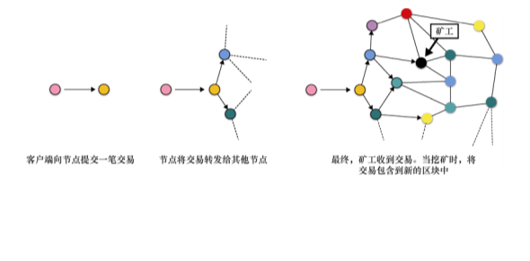
-------------------

[幻灯片 2 - 目录]

# 本章内容
1. 比特币基础
2. 区块链技术
3. Merkle树应用
4. 加密货币发展
5. DiemBFT协议

## 学习目标
- 理解比特币工作原理
- 掌握区块链核心概念
- 了解现代共识协议

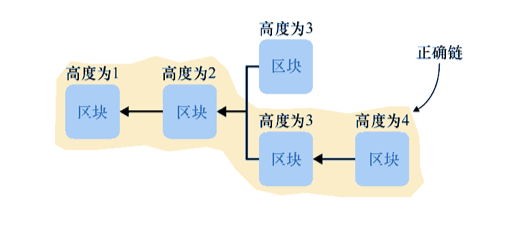
-------------------

[幻灯片 3 - 比特币架构]

# 比特币系统架构

## 核心组件
1. 交易系统
   - UTXO模型
   - 数字签名
   - 交易验证

2. 区块结构
   - 区块头
   - 交易摘要
   - Merkle树

3. 共识机制
   - 工作量证明(PoW)
   - 挖矿过程
   - 奖励机制

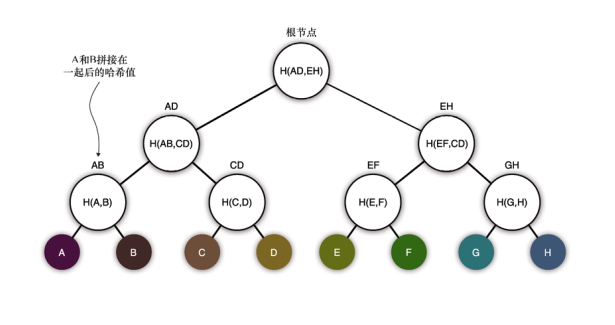
-------------------

[幻灯片 4 - Merkle树详解]

# Merkle树技术

## 基本概念
- 一种特殊的树形数据结构
- 内部节点存储子节点哈希值
- 用于高效验证数据完整性

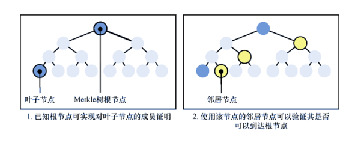

## 工作原理
1. 结构特点
   - 叶子节点存储数据
   - 父节点存储子节点哈希
   - 根节点代表整体摘要

2. 验证机制
   - 路径验证
   - 部分重建
   - 高效证明

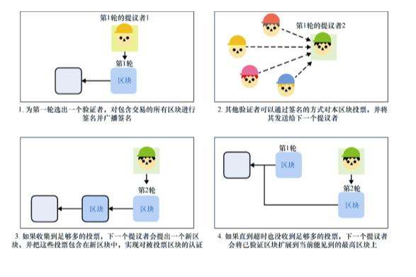
-------------------

[幻灯片 5 - 比特币中的Merkle树]

# 比特币中的Merkle树应用

## 主要用途
1. 交易压缩
   - 区块仅包含交易摘要
   - 减少存储空间
   - 提高传输效率

2. 交易验证
   - 快速验证交易存在性
   - 无需下载完整区块
   - 支持轻量级客户端

## 验证过程
- 计算交易哈希
- 构建验证路径
- 重建根哈希值
- 比对区块头数据

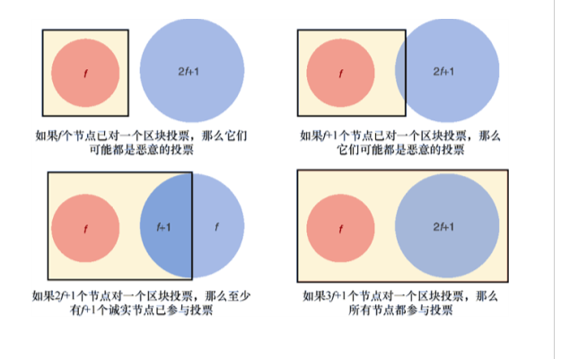
-------------------

[幻灯片 6 - 加密货币发展]

# 现代加密货币发展

## 主要挑战
1. 波动性问题
   - 价格剧烈波动
   - 稳定币方案
   - 价值锚定

2. 延迟性问题
   - 交易确认时间
   - 吞吐量限制
   - 最终性保证

3. 扩展性问题
   - 区块链规模
   - 存储压力
   - 同步效率

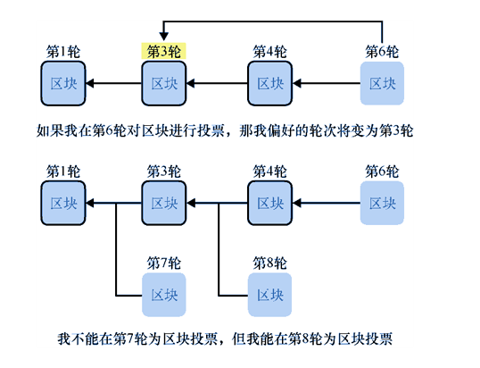
-------------------

[幻灯片 7 - DiemBFT协议]

# DiemBFT共识协议

## 基本特征
- BFT类共识协议
- 高效环保
- 确定性终局

## 安全假设
- 3f+1个验证者
- 最多f个恶意节点
- 同步网络假设

## 协议流程
1. 领导者提议
2. 验证者投票
3. 区块认证
4. 交易确认

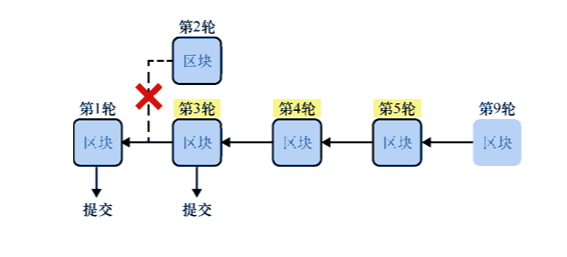
-------------------

[幻灯片 8 - DiemBFT安全性]

# DiemBFT安全保证

## 核心属性
1. 安全性
   - 防止分叉
   - 交易一致性
   - 状态同步

2. 活跃性
   - 持续运行
   - 故障恢复
   - 网络分区容忍

## 投票规则
- 轮次严格递增
- 偏好轮次更新
- 连续区块确认

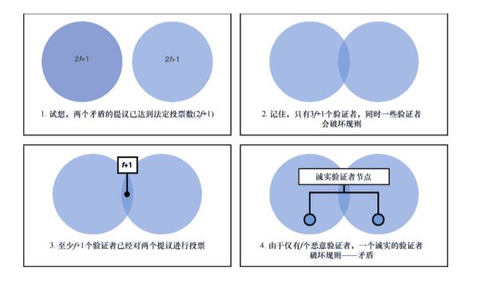
-------------------

[幻灯片 9 - 实践考虑]

# 加密货币实践考虑

## 技术选择
1. 共识机制
   - PoW vs BFT
   - 能耗与效率
   - 安全性权衡

2. 隐私保护
   - 交易匿名性
   - 零知识证明
   - 数据加密

3. 扩展方案
   - 层次化架构
   - 侧链技术
   - 状态通道

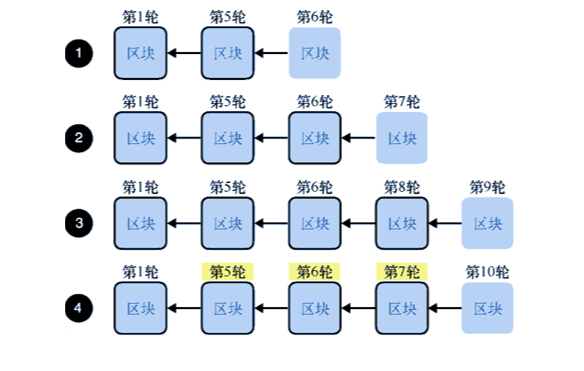
-------------------

[幻灯片 10 - 总结]

# 本章小结

## 核心要点
1. 比特币技术
   - UTXO模型
   - Merkle树应用
   - PoW共识

2. 现代发展
   - 稳定币方案
   - BFT共识
   - 扩展性解决

3. 未来趋势
   - 环保共识
   - 隐私保护
   - 跨链互操作

## 下一步建议
- 深入学习共识协议
- 关注技术发展
- 实践安全部署

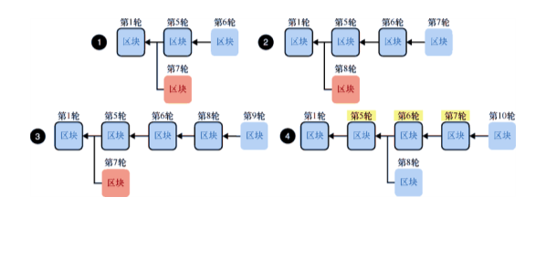
------------------- 