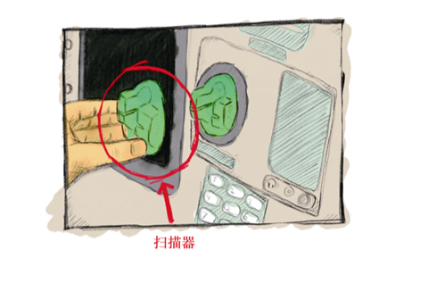
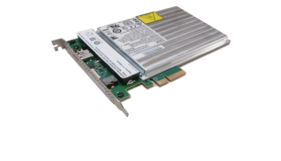
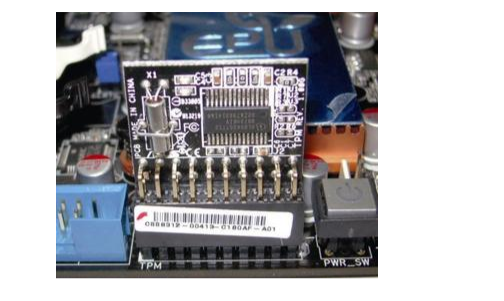
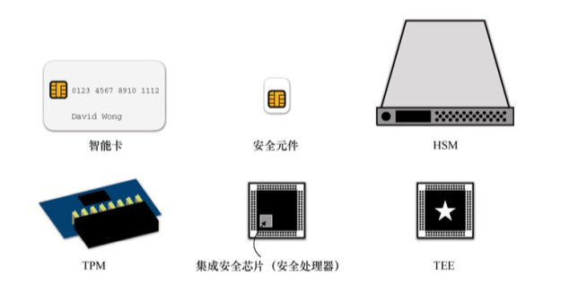
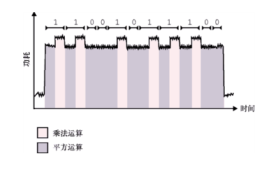

第 13 章　硬件密码学
本章内容：
● 高度不可信环境中的密码学问题；
● 增加攻击者成本的硬件解决方案；
● 侧信道攻击以及软件缓解措施。
通常，将密码原语和协议视为独立的基础模块，假设它们运行在不存在任何敌手的理想环境下。在实践中，这是一个不切实际且错误的假设。在现实世界中，密码算法会运行在各种环境中，并受到各种威胁。本章我们将介绍更极端的场景，即高度不可信的环境，以及在此环境中保护密钥和数据的方法。（剧透警告：使用专门的硬件可以达到此目的。）
++13.1　现代密码学中常见的攻击模型
当今的计算机和网络安全始于这样一个假设：我们拥有一个可以信任的环境。例如，在互联网上传输加密数据时，我们通常会假设进行加密的计算机没有受到攻击，并且存在其他可以安全解密的接收端。
——Joanna Rutkowska（“Intel x86 considered harmful”，2015）
密码学过去关注这样的场景：Alice 想在 Eve 无法截获任何密文数据的情况下向 Bob 发送加密的消息。而如今的很多密码学原语都更关注这样的场景：Alice 想向 Bob 发送一条加密消息，但 Alice 已经受到安全威胁。这是一个完全不同的攻击者模型，理论密码学没有考虑这样的威胁。这是什么意思？让我们看几个例子。
● 使用信用卡在自动柜员机（ATM）上存取款时，该取款机上可能会被安装一个扫描器，将该设备放在读卡器上，小偷可以复制用户的银行卡内容（见图 13.1）。
● 在手机上下载危及操作系统（Operating System，OS）的应用程序。
● 在共享 Web 托管服务中托管 Web 服务器时，可能会有恶意客户与我们共享同一台机器。
● 在一个数据中心管理高度敏感的机密数据，但该数据中心却允许来自不同国家的间谍访问。

图 13.1　扫描器是一种恶意设备，可以放置在 ATM 或支付终端读卡器前面，以复制信用卡磁条中包含的数据。磁条中的信息通常包含账号、失效日期和其他元数据，这些元数据可以在线上支付或许多支付终端中使用。有时，还会在 ATM 上安装隐藏的摄像头，以获取用户的 PIN 码。这让小偷可以通过输入 PIN 码使用 ATM 以及支付终端
上述的所有例子都是密码学的现代应用案例，而这些场景涉及的威胁模型都是密码学家忽略或者未曾考虑过的。事实上，我们在文献中读到的大多数加密原语都会假设 Alice 完全控制着她的执行环境，并且只有密文在网络上传输的过程中，攻击者才能执行中间人攻击。但是，在现实中，我们经常在不可信的环境下使用密码学。
警告：
密码算法的安全性源于困难性假设以及人们对潜在攻击者攻击能力的假设。如果困难性假设不成立，那么密码算法的安全性也将不复存在。
现实世界的应用程序如何确保在面临真实敌手时仍具备理论密码学的安全性呢？答案是做出妥协。换句话说，就是假设攻击者的能力有限。通常，我们会使用攻击代价来衡量系统的安全性（攻击者攻破系统的代价），而很少基于计算复杂性评估其安全性。
本章我们会学到很多不完美的密码学方案，在现实世界中，我们称这样的方案是基于纵深防御策略的。在本章中，我们会学到许多新的知识，还会介绍一些公司及其营销团队提出的新概念和方案。接下来，让我们开始学习如何在不可信环境中运行可信系统。
++13.2　不可信环境：让硬件提供帮助
在实践中，攻击系统的方式多种多样。在对它们进行分类时可以考虑如下问题。
● 软件攻击：利用设备上运行的代码进行攻击。
● 硬件攻击：敌手通过在物理上靠近设备进行攻击。
前几章中，我们已经多次谈到针对密码的软件攻击及其缓解方法，但如果利用硬件解决方案，有些软件攻击更容易防御。例如，通过在连接到计算机的独立设备上生成并使用密钥，可以防止在病毒攻击计算机时提取密钥。
然而，针对硬件的攻击更为棘手，因为有权访问设备的攻击者几乎可以进行任何他们想要的操作：敌手可以随意修改磁盘上的数据；可以在目标位置发射激光，从而迫使计算产生错误值（称为故障攻击）；可以打开芯片观察其中的部件，并通过聚焦离子束（Focused Ion Beam，FIB）显微镜对部件进行逆向工程等。这种攻击者几乎不受任何限制，因此很难抵御。通常，各种可行的方案都不约而同地选择增加尽可能多的防御层，试图给攻击者的攻击行为增加难度。这一切都是为了增加攻击者的攻击成本！
邪恶女仆攻击
硬件攻击者的能力各不相同。例如，一些攻击者可以花时间对设备进行高质量的攻击，而其他攻击者的攻击时间可能有限。想象下面的场景：我们把手机或笔记本电脑放在酒店房间里无人看管，一个「邪恶」女仆走进来，打开我们的设备并使用现成的简单工具修改系统，然后将设备伪造成从未被修改过的模样。在文献中，这种「邪恶女仆」攻击，可以推广到许多环境中（例如，飞行时在值机行李中携带设备，在不安全的数据中心存储敏感密钥，等等）。
当然，并非所有系统都需要抵御最强大的硬件攻击，不同的应用程序能应对的威胁级别也不相同。在不同的环境中，针对相同的攻击有不同的硬件解决方案，因此本节的其余部分旨在帮助读者理解不同环境下针对不同攻击的解决方案，同时了解不同攻击之间的区别和联系。13.2.1　白盒密码学不可取
在学习不可信环境中的硬件解决方案之前，我们先考虑为何不使用软件解决方案呢？密码学能提供不泄露密钥的原语吗？
白盒密码算法可以解决上述问题。白盒密码学是密码学的一个研究领域，它试图使用密钥对密码方案的实现进行置乱。白盒密码算法的目标是防止监听者提取密钥。攻击者可以获取固定密钥的 AES 算法白盒实现的源代码，并且它的白盒实现可以正常加密和解密，但密钥与算法的实现混淆在一起，因此任何人都很难从算法中提取密钥，至少在理论上确实如此。但在实践中，尚未发现任何公开的安全白盒密码算法。基于这一事实，大多数商业解决方案都不开放其源代码。
注意：
由于尚未证明通过模糊和混淆（对代码进行置乱，使其变得不可读）实现安全性的技术的有效性，因此这样的技术往往不受欢迎。尽管如此，在现实世界中，这些技术有时可以用来拖延和阻碍敌手实施有效攻击。
总而言之，白盒密码学是一个大产业，制造商向需要数字版权管理（Digital Rights Management，DRM）工具的企业销售不安全的产品，这些工具用于控制客户对他们所购买产品的访问权限。例如，在播放电影碟片的硬件或播放电影的媒体服务软件中可以找到这些白盒解决方案。事实上，DRM 并不能有力地阻止针对硬件的攻击，这只会让用户操作变得烦琐。更严重的是，密码学有一个分支称为不可分辨混淆（Indistinguishability Obfuscation，IO），它试图用密码学方法实现白盒密码学解决方案。IO 是一个理论上的、不切实际的且到目前为止还未真正得到证实的研究领域。我们来看看现实世界最终会选择何种解决方案。13.2.2　智能卡和安全元件
白盒密码学并不是最好的解决方案，但它几乎是抵御强大敌手的最佳软件解决方案。因此，让我们转而寻找硬件解决方案。（剧透警告：在硬件中，抵御敌手将变得更加复杂。）现实世界的密码学已经十分复杂，有太多的标准或方法来实现同样的功能。但是，当我们学习硬件层面的密码学时就会发现，其复杂程度不亚于现实世界的密码学。在硬件密码学中，不同的术语会以不同的方式组成和使用，而且硬件密码学中的标准甚至与密码学中的标准还要多。
为了了解这些硬件解决方案的具体内容，以及它们之间的不同之处，让我们先了解一些必要的发展历史。智能卡通常是一种包装在塑料卡（如银行卡）内的小芯片，它在 20 世纪 70 年代早期随着微电子技术的进步而出现。最初，智能卡是为了让每个人都拥有一台「袖珍」电脑！实际上，现代智能卡还嵌入了 CPU、不同类型的可编程或非可编程存储器（如 ROM、RAM 和 EEPROM）、输入输出设备、硬件随机数生成器（详见第 8 章，也称为 TRNG）等。
智能卡可以运行程序，不像非智能卡只能通过磁条存储数据，而磁条很容易通过扫描器复制。大多数智能卡允许开发者在卡上编写可运行的小型应用程序。智能卡广泛支持的标准是 JavaCard，它允许开发人员在卡上编写类似 Java 的应用程序。
使用智能卡时，首先需要将其插入读卡器来激活。近年来，智能卡中增加了近场通信（Near Field Communication，NFC）协议，通过无线电频率实现与向智能卡插入读卡器一样的效果。这使我们可以通过接近读卡器而不必在物理上接触读卡器来使用智能卡。
银行与传统密码学
顺便说一句，银行利用智能卡为每张卡存储一个唯一的秘密值，其可以证明持卡人的身份。直觉上，我们可能会认为这是通过公钥密码实现的，但由于银行业内仍在使用大量遗留的软件和硬件，因此银行业使用的依然是对称密码！
更具体地说，大多数银行卡存储三重 DES（3DES）对称密钥，这是一种古老的 64 比特分组密码，三重密钥是因为一重的 DES 算法并不安全。该算法不是用来加密的，而是用于产生消息认证码来对一些挑战做出响应。由于银行持有每位客户当前的 3DES 对称密钥，因此其可以正确验证消息认证码。这个例子充分说明了现实世界中历史遗留算法随处可见，并正以一种不安全的方式运行着。（这也是密钥轮换的重要之处，也是我们必须定期更换银行卡的原因。）
智能卡融合了许多物理和逻辑技术，以防止敌手观察、提取和修改其执行环境和部分内存（其中存储了秘密值）。试图破坏智能卡和硬件设备的常见攻击有很多。这些攻击可分为以下 3 种类别。
● 非侵入式攻击：非侵入式攻击不影响目标设备的运行。例如，差分功耗分析（Differential Power Analysis，DPA）攻击在执行智能卡的加密操作的同时评估智能卡的功耗，从而达到提取密钥的目的。
● 半侵入式攻击：半侵入式攻击以非破坏性方式访问芯片表面以进行攻击。例如，差分故障分析（Differential Fault Analysis，DFA）攻击利用热量、激光和其他技术修改智能卡上程序的执行过程，从而达到泄露密钥的目的。
● 侵入式攻击：侵入式攻击中，攻击者会打开芯片，探测或修改芯片本身的电路，以达到改变芯片的功能并泄露秘密值的目的。这些攻击特征明显，因为它们会损坏设备，并且很大概率会令设备无法使用。
尽管硬件芯片非常小且封装紧密，已经可以使得攻击变得困难。但专用硬件通常会在此基础上增强防护，它们使用不同的材料层来防止拆包和物理观察带来的安全威胁，并使用硬件技术来降低已知攻击的准确度。
智能卡的流行速度非常快，在其他设备中安装这样一个安全的黑匣子明显十分有用。安全元件的概念也由此诞生。安全元件是一种防篡改的微控制器，它可以是可插拔的（例如，手机中访问运营商网络所需的 SIM 卡），也可以直接连接到芯片和主板（例如，连接到 iPhone NFC 芯片上用于支付的嵌入式安全元件）。安全元件实际上只是一小块单独的硬件，用于保护秘密值及执行相关的密码操作。
安全元件是物联网（Internet of Things，IoT）中保护密码操作的重要概念。IoT 是一个口语化术语，指的是可以与其他设备（比如信用卡、手机、生物识别护照、车库钥匙、智能家居传感器等）通信的设备。我们可以将本节介绍的所有解决方案视为以不同形式实现的安全元件，它们基于不同的技术实现了几乎相同的功能，但提供不同的安全等级和运行速度。
安全元件的主要定义和标准由全球平台（Global Platform）制定，这是一个非营利性组织，它因行业内不同参与者的需要而创建，旨在促进不同供应商和系统之间的互操作性。在通用标准（Common Criteria，CC）、NIST 或 EMV（表示 Europay、Mastercard 和 Visa）这类标准机构中，我们可以获取更多关于安全元件的安全声明标准和认证。
由于安全元件是高度保密的模块，将它们集成到产品中意味着我们必须签署保密协议，并不能使用开放源代码的硬件和固件。对于许多项目来说，这些要求对产品的透明度造成严重限制，但我们可以理解这种做法，因为安全元件的一部分安全性来自它们在设计上的模糊性。13.2.3　硬件安全模块——银行业的宠儿
理解了安全元件的概念后，那么硬件安全模块（Hardware Security Module，HSM）基本上可以视为一个更大、运行速度更快的安全元件。与安全元件一样，一些 HSM 也可以运行任意代码。但也有一些 HSM 很小（比如 YubiHSM，一种类似于 YubiKey 的小型 USB 适配器），因此「硬件安全模块」一词在不同情况下表示不同的含义。
许多人会认为，到目前为止讨论的所有硬件解决方案都是不同形式的 HSM，安全元件只是由全局平台指定的 HSM，而可信平台模块（Trusted Platform Module，TPM）是由可信计算组织指定的 HSM。但大多数时候，HSM 表达的含义更广。
HSM 通常根据 FIPS 140-2 的「Security Requirements for Cryptographic Modules」进行分类，该文件在 2001 年发布，自然没有考虑到出版后发现的一些攻击。幸运的是，2019 年，它被更新的 FIPS 140-3 取代。现在，FIPS 140-3 依赖两个国际标准。
● ISO/IEC 19790:2012：该标准定义了 HSM 的 4 个安全级别。1 级 HSM 不提供任何针对物理攻击的保护（可以视其为纯软件实现），而 3 级 HSM 在检测到任何入侵时会擦除秘密值！
● ISO 24759:2017：该标准定义了 HSM 测试方法，以便标准化 HSM 产品的认证。
不过，上述两个标准并不是免费的，必须付费才能阅读其内容。
美国、加拿大等国家要求银行等行业必须使用已通过 FIPS 140 等级认证的设备。全球有许多公司采用了这些标准的建议。
注意：
擦除秘密值的做法也称为归零。与 3 级 HSM 不同，4 级 HSM 即便在断电的情况下也可以多次覆盖机密数据，这要归功于内部备用电池。
通常，HSM 是一种自带支架的外部设备，往往放置在架子上（见图 13.2），并插在数据中心的企业服务器上，或者作为 PCI 卡插在服务器主板上，甚至作为硬件安全令牌的小型适配器。HSM 可以通过 USB 接口插入硬件设备（如果不介意性能降低的话）。为了实现完整的循环，还可以使用智能卡来管理其中一些 HSM，实现安装应用程序、备份密钥等操作。
 
图 13.2　一个用作 PCI 卡的 IBM 4767 HSM（图片源自维基百科）
有一些行业对 HSM 的依赖度很高。例如，每次我们在 ATM 上输入 PIN 码时，该 PIN 码都会在某个地方的 HSM 上验证。无论何时通过 HTTPS 连接到网站，信任源都来自将私钥存储在 HSM 中的 CA，而 HSM 可能会由于网站不可信而终止 TLS 连接。想必大多数人都使用安卓或者 iOS，谷歌公司或苹果公司可能会用一组 HSM 安全地备份手机数据。最后一个案例很有趣，因为威胁模型是逆向思考的，即用户不信任云服务器及其数据，因此，云服务提供商必须声称其服务无法看到用户的加密备份数据，也无法访问用于加密的密钥。
HSM 并没有真正的标准接口，但它们中的大多数至少实现了 PKCS#11 标准，这是 RSA 公司发起的一个旧标准。为了更好地使用相关标准，2012 年 PKCS#11 标准逐步转移到 OASIS 组织。虽然 PKCS#11 的最后一个版本（PKCS#11 v2.40）是在 2015 年才发布的，但它其实只是对 1994 年发布的初始版本标准的更新。因此，它修改了一些可能导致漏洞的旧密码算法或旧的操作方式。尽管如此，在很多应用场景中，PKCS#11（v2.40）提供的算法功能已经足够，并且指定了一个允许不同的系统便捷地进行互操作的接口。好消息是 PKCS#11 v3.0 于 2020 年发布，其中包括许多 Curve25519、EdDSA 和 SHAKE 之类的现代密码算法。
虽然 HSM 的真正目标是确保敌手无法从中提取秘密信息，但并非所有的 HSM 都拥有高安全性。硬件解决方案的安全性很大程度上依赖于其高昂的价格、未披露的硬件防御技术，以及通过硬件标准的认证（如 FIPS 标准和通用标准）。在实践中，我们可以发现毁灭性的软件漏洞，但却并不容易发现 HSM 存在的漏洞。2018 年，Jean-Baptiste Bédrune 和 Gabriel Campana 在他们的研究「Everybody be Cool, This is a Robbery」中提出了一种软件攻击，可以实现在 HSM 中提取密钥。
注意：
单个 HSM 的价格已经十分高昂（随着安全级别的提升，HSM 的价格很容易达到成千上万美元），但我们通常至少还需要一个 HSM 用于测试，以及另外一个 HSM 用于备份（以防第一个 HSM 中的密钥失效）。这些费用加起来构成 HSM 的使用成本！
此外，我们还没有提到一些显而易见却无人问津的攻击：虽然我们可以阻止大多数攻击者获取密钥，但却无法阻止攻击者破坏系统并自行调用 HSM（除非 HSM 中的逻辑需要通过多个签名验证才能运行或者智能卡存在门限）。但是，在大多数情况下，HSM 提供的唯一服务是防止攻击者偷偷窃取并使用秘密信息。在选择集成硬件解决方案（如集成 HSM）时，最好首先了解威胁模型、想要阻止的攻击类型，以及考虑第 8 章中提到的多重签名等门限方案是否为更好的解决方案。13.2.4　可信平台模块：安全元件的有效标准化
虽然实践已经证明安全元件和 HSM 是有效的，但它们仅限于在特定的用例中使用，而且编写定制应用程序的过程非常烦琐。出于这个原因，由行业参与者组成的另一个非营利组织——可信计算组织（Trusted Computing Group，TCG）提出了一个针对个人和企业计算机的即用型替代方案，这就是可信平台模块（Trusted Platform Module，TPM）。
TPM 不是一种芯片，而是一个标准（TPM 2.0 标准），任何选择使用 TPM 2.0 标准的供应商都可以实现 TPM。符合 TPM 2.0 标准的 TPM 是一个安全的微控制器，它带有一个硬件随机数生成器以及用于存储秘密信息的安全内存，可以执行加密操作，并且整个系统是防篡改的。这种描述听起来可能很耳熟，事实上，提供商往往通过重新打包安全元件来实现 TPM。TPM 通常直接焊接或插入企业服务器、笔记本电脑和台式计算机的主板（见图 13.3）。
与智能卡和安全元件不同，TPM 不运行任意代码。TPM 提供了一个定义良好的接口，以便更大的系统可以充分利用这个模块。TPM 通常都很便宜，现在许多普通笔记本电脑都带有一个 TPM。
糟糕的是：TPM 和处理器之间的通信信道通常只是一个总线接口，以便在敌手试图窃取或获得对设备的临时物理访问权限时进行拦截。虽然许多 TPM 对物理攻击具有很高的抵抗力，但它们的通信信道在某种程度上是开放的，这一事实确实减少了它们在硬件防御上的应用，因此 TPM 主要用于对软件攻击的防御。
 
图 13.3　一个实现 TPM 2.0 标准的芯片，插入主板（图片源自维基百科）。这个芯片可以被系统的主板组件以及运行在计算机操作系统上的用户应用程序所调用
为了解决这些问题，人们开始尝试直接将类似 TPM 的芯片集成到主处理器中。例如，苹果设备的 Secure Enclave、微软设备的 Pluton。不幸的是，这些安全处理器似乎都没有遵循标准，因此用户的应用程序可能很难甚至无法使用它们的功能。让我们通过一些例子来了解 TPM 等硬件安全芯片的功能。
TPM 最简单的用例是保护数据。要保护密钥很容易：只需在安全芯片中生成密钥，并禁止外部提取密钥。如果用户需要密钥，则要通过芯片执行密码操作。需要加密数据时，由安全芯片来执行加密操作。如果加密单个文件，则称为基于文件的加密（File-based Encryption，FBE）；如果加密整个磁盘，则称为全磁盘加密（Full-disk Encryption，FDE）。FDE 听起来更好，因为它是一种全部加密或全部不加密的方法。这也是大多数笔记本电脑和台式计算机使用的方法。但实际上，FDE 并没有那么好：它没有考虑到人类的使用习惯。我们经常将设备锁定（而不是关闭），以便让后台程序继续运行。计算机通过保留数据加密密钥（Data-Encryption Key，DEK）来处理此问题，使得即使在计算机已锁定的情况下依然能够确保设备安全。（下次在咖啡厅去洗手间前，你把锁定的电脑留在无人看管的地方时，可以想想这个问题。）现代手机提供了更高的安全性，可以根据手机是锁定还是关闭的状态，对不同类型的文件进行加密。
注意：
在实践中，FDE 和 FBE 在实现上都存在许多问题。2019 年，Meijer 和 Gastel 在「Self-encrypting deception: Weaknesses in the encryption of solid state drives (SSDs)」中指出，一些 SSD 供应商的解决方案完全不安全。2021 年，Zink 等在「Data Security on Mobile Devices: Current State of the Art, Open Problems, and Proposed Solutions」中指出电话磁盘加密也存在很多安全问题。
当然，在解密数据之前，应该先对用户进行认证。这通常是通过要求用户输入 PIN 码或口令来实现的。然而，PIN 码或口令是不够安全的，因为简单的暴力攻击就可以破解 PIN 码或者口令（尤其是 4 位或 6 位 PIN 码）。通常的解决方案是将 DEK 与用户凭证和保存在安全区域上的对称密钥联系起来。
但是芯片制造商不能在他们生产的每个设备上硬编码相同的密钥，这会导致类似 DUHK 的攻击，DUHK 攻击正是源于攻击者发现成千上万的设备硬编码了相同的密钥。这反过来意味着攻破一个设备将导致所有设备被攻破！解决方案是让每个设备拥有唯一的密钥，密钥要么在制造时融合到芯片中，要么由芯片本身通过称为物理不可克隆功能的硬件组件来生成。例如，每个苹果设备的 Secure Enclave 模块都有一个 UID，每个 TPM 都有一个唯一的背书密钥和认证密钥等。为了防止暴力攻击，Apple 的 Secure Enclave 模块将 UID 密钥和用户 PIN 码与基于口令的密钥派生函数（利用第 2 章介绍的口令哈希算法来派生密钥）混合在一起，用于派生 DEK。为了允许用户快速更改 PIN 码，DEK 不是直接派生的，而是由密钥加密密钥（Key Encryption Key，KEK）加密产生的。
另一个例子是安全启动。启动计算机时，需要经过多个阶段的运行才能最终进入用户许可操作的界面。用户面临的一个问题是，如果病毒和恶意软件感染了启动过程，用户操作将在一个恶意的操作系统上运行。
为了保护启动过程的完整性，我们选择 TPM 和集成安全芯片作为信任基础，它们是绝对可以信任的设备，让我们可以信任以其为基础的其他应用程序。这种信任通常源自一些不能被覆盖的只读存储器（ROM，也称为一次性可编程存储器，因为它的内容在制造过程中就已经写入，不能更改）。例如，当给最近的苹果设备通电时，执行的第一个代码是启动 ROM，它位于苹果设备操作系统的 Secure Enclave ROM 中。这个启动 ROM 很小，所以通常它只需：
（1）准备一些受保护的内存并加载下一个运行的程序（通常是其他启动加载程序）；
（2）计算程序的哈希值，并根据 ROM 中硬编码的公钥验证其签名；
（3）执行程序。
下一个启动加载程序也会做同样的事情，直到最终一个启动加载程序启动操作系统。顺便说一下，这就是没有获得苹果官方签名的应用程序无法安装到苹果手机的原因。
TPM 和集成的 TPM 芯片有一些有趣的发展，近年来极大地提高了设备的安全性。随着新标准的出现以及这些芯片的价格日益降低，更多的设备将能够从中受益。13.2.5　在可信执行环境中进行保密计算
智能卡、安全元件、HSM 和 TPM 是独立的芯片或模块，它们都带有 CPU、内存、TRNG 等组件，支持 NFC 的芯片中的一些电线或射频组件可以与它们通信。虽然类似 TPM 的芯片（微软公司的 Proputo 和苹果公司的 Secure Enclave）与芯片系统（System on Chip，SoC）内部的主处理器紧密耦合，但它们仍是独立的芯片。在本小节中，我们将学习主处理器内部的硬件安全性、集成安全性、硬件强制安全性在逻辑上的分类。
安全处理器通过扩展处理器的指令集来为用户代码创建可信执行环境（Trusted Execution Environment，TEE），从而允许程序在单独的安全环境中运行。TEE 与我们熟悉的运行环境（通常称为富执行环境）之间的分离是通过硬件实现的。现代 CPU 同时运行普通操作系统和安全操作系统。两者都有自己的寄存器集，但共享 CPU 体系结构的其余大部分功能。通过使用 CPU 强制逻辑，外界数据无法访问安全环境的数据。例如，一个 CPU 通常将自己的内存分割出一部分专用于 TEE。由于 TEE 直接在主处理器上实现，因此 TEE 不仅比 TPM 或安全设备更快、更便宜，而且在许多现代 CPU 中也是免费的。
与其他硬件解决方案一样，TEE 也是由不同供应商独立开发的，目前全球平台也在抓紧实现 TEE 的标准化。著名的 TEE 解决方案是英特尔的软件保护扩展（Software Guard Extension，SGX）和 ARM 的 TrustZone。
我们用下面的例子来说明 TEE 的作用。在过去的几年里，出现了一种新的服务模式，即大公司运行云服务器用于用户托管数据。比如亚马逊的 AWS、谷歌的 GCP、微软的 Azure 等。另一种说法是，人们正从在自己的计算机上运行程序转向在别人的计算机上运行程序。这给某些注重隐私的应用带来了安全问题。为了解决这一问题，保密计算提供的解决方案是在无法看到或修改用户代码的情况下运行客户端代码。如今，SGX 的主要使用场景是：客户端在服务器上运行代码，但服务器无法看到客户代码，也无法篡改客户代码。
一个有趣的问题是，人们如何相信请求的响应来自 SGX，而不是来自某个攻击者。这就是证明技术试图解决的问题。此处，我们介绍两种证明技术。
● 本地证明：在同一平台上运行的两个安全区域需要相互交流，并向对方证明自己是安全区域。
● 远程证明：客户端查询一个远程安全区域，并需要确保它是产生该请求结果的合法安全区域。
每个 SGX 芯片在制造时都配有独特的密钥对。然后，英特尔的 CA 对公钥部分进行签名。英特尔的签名有意义的前提是，我们不假设硬件都是安全的，而是假设英特尔只为安全的 SGX 芯片公钥签名。因此，我们现在可以从英特尔的 CA 获得一份签名证明，证明我们正在与一个真正的 SGX 安全区域对话，并且它正在运行一些特定的代码。
TEE 的第一个目标是阻止软件攻击。虽然 TEE 声称自己具备的软件安全性似乎极具吸引力，但在实践中，由于现代 CPU 及其动态状态的极端复杂性，在同一芯片上分离执行程序很难实现。这一点在针对 SGX 和 ARM 可信区域的许多软件攻击中得到了证明。
TEE 作为一种概念提供了一些抵抗物理攻击的能力，这是因为微观层面的事物太小且包装紧密，需要昂贵的设备才能进行分析。但对于一个目的明确的攻击者，这些问题可能无法阻挡他发起的攻击。
++13.3　何为最优解决方案
在本章中我们已经了解了许多硬件产品。图 13.4 所示是对这些硬件产品的总结。
● 智能卡是需要由外部设备（如支付终端）激活的微型计算机，它们可以运行小型的类似 Java 的定制应用程序。银行卡是一种广泛使用的智能卡。
● 安全元件是一种一般化的智能卡，它们依赖于一套由全球平台提出的标准。SIM 卡就是一种安全元件。
● HSM 是企业服务器使用的可插拔安全元件。它们运行速度更快、更灵活，主要被数据中心用于存储密钥，使得对密钥的攻击更加容易发现。
● TPM 是插入个人和企业计算机主板的安全元件。它们遵循 TCG 的标准化接口，且可以为操作系统和终端用户提供服务。
● 安全处理器是存在于主处理器附近的类似 TPM 的芯片，它们是不可编程的。安全处理器没有任何标准可以遵循，因此不同的供应商可采用不同的技术来实现。
● ARM 可信区域和 SGX 等 TEE 可以看作在 CPU 指令集中实现的可编程安全元件。它们的运行速度更快、成本更低，主要用于抵御软件攻击。大多数现代 CPU 都配备了 TEE 和各种级别的硬件攻击防御模块。

图 13.4　本章涵盖的硬件解决方案及其外观形态
对我们来说，最好的解决方案是什么？试着通过下述问题来缩小选择范围。
● 以何种形式？例如，如果在一个小设备中需要一个安全元件，就可以排除一些需要空间较大的解决方案。
● 需要多高的运行速度？每秒需要执行大量密码操作的应用程序在选择解决方案时需要考虑运行速度，可能只能在 HSM 和 TEE 中选择。
● 需要多高的安全级别？供应商的认证和声明中指明了他们不同级别的软件或硬件产品的安全性。解决方案的安全性没有上限。
请记住，没有一个硬件解决方案是万能的，我们能做的只是增加攻击者的攻击成本。对于一个老练的攻击者，所有这些解决方案几乎都毫无用处。我们需要做的是让系统不会由于一个设备受到攻击而导致所有设备受到牵连。
++13.4　防泄露密码
此前我们学习了利用硬件防止直接观察和提取密钥的方法，但硬件防御的能力有限。尽管硬件在不断强化其安全性，但密钥仍然有可能由于软件的疏忽而泄露。软件可以直接泄露密钥（比如创建后门）或以泄露足够的信息使敌手有能力重建密钥的方式来间接泄露密钥。后者被称为侧信道攻击，侧信道漏洞在大多数情况下都是无意中产生的。
我们在第 3 章中学过时序攻击，也因此学到了 MAC 认证标签的比较必须在恒定时间内完成，否则，攻击者可以通过发送许多不正确的认证标签并记录它们的响应时间，最后推断出正确的认证标签。在实用密码学领域，时序攻击很受重视，因为它们可能通过网络进行远程攻击，而不像物理侧信道攻击有距离的限制。
最知名的侧信道攻击是功耗分析攻击，这在本章前面提到过。1998 年，Kocher、Jaffe 和 Jun 发现了一种称为差分功率分析（Differential Power Analysis，DPA）的攻击，当时他们发现，在对已知明文进行加密时，可以将示波器连接到设备上，观察设备消耗的电量随时间的变化。如果设备设置了操作位数，那么耗电量的差异显然取决于使用的密钥位数，以及异或这类操作的数量。这可以用于实现密钥提取攻击（所谓的完全攻破攻击）。
侧信道攻击的概念可以用简单功率分析（Simple Power Analysis，SPA）攻击来说明。在理想情况下，当没有针对功耗分析攻击采用硬件或软件缓解措施时，SPA 足以测量和分析涉及密钥的单个密码操作的功耗。此攻击的说明如图 13.5 所示。

图 13.5　一些密码算法通过其功耗泄露了大量信息，因此对单个功耗曲线（功耗随时间变化的曲线）进行简单的功耗分析就可能会泄露算法的私钥。例如，此图表示 RSA 指数运算（消息进行幂运算，其中指数是私有的，具体参阅第 6 章）的功耗曲线。RSA 指数运算是通过「平方乘」算法实现的，该算法迭代次数等于私有指数的比特长度。对于每一位，只有当该位设置为 1 时才会调用平方运算，然后调用乘法运算。在这个例子中，乘法显然消耗了更多的能量，因此它的功耗更加明显
功率不是唯一的物理侧信道。有些攻击依赖于电磁辐射、振动，甚至硬件发出的声音。虽然本章主要讨论硬件密码学，但是在现实世界中非物理侧信道攻击也非常重要，需要加以缓解。
首先，返回的错误信息有时会泄露关键信息。例如，在 2018 年出现的 ROBOT 攻击可以在多台实现 RSA PKCS#1 v1.5 算法的 TLS 协议（见第 9 章）的服务器上发起百万消息攻击（见第 6 章）。百万消息攻击只有在能够区分 RSA 密文是否具有有效填充的情况下才有效。为了防止这种攻击，安全实现方式是在恒定时间内执行填充的验证，且在检测到填充无效后避免提前返回错误提示。例如，在 TLS 协议的 RSA 密钥交换过程中，如果 RSA 有效负载的填充不正确，服务器假装完成了成功的握手并进行响应。不过，如果在算法的实现中，填充验证结束后会根据填充的有效性返回不同的值，那么上述攻击仍然可以生效。
其次，访问内存可能需要或长或短的时间，由于计算机中存在大量的缓存层，因此时间的长短取决于数据之前是否被访问过。例如，如果 CPU 需要一些数据，它首先会检查这些数据是否已缓存在内部内存中。如果没有，它就会检查距离越来越远的缓存。缓存越远，读取需要的时间就越长。不仅如此，还有一些缓存与特定核关联（例如一级缓存），而另一些缓存则是多个核共享（三级缓存、RAM、磁盘）。
缓存攻击利用了恶意程序与正常程序可能在同一台计算机上运行并且使用同样的密码学库编写敏感密码程序的事实。例如，许多云服务在同一台机器上托管不同的虚拟服务器，而许多服务器使用 OpenSSL 库进行密码操作或提供 TLS 页面。恶意程序会删除已加载到受害者进程共享缓存中的密码库的某些部分，然后周期性测量重新读取该库某些部分所需的时间。如果需要很长时间，那么说明受害者没有执行程序的这一部分；如果需要很短时间，则说明受害者访问了程序的这一部分，并且为了快速读取密码学库的这部分内容而重新填充了缓存。这种攻击得到的曲线类似于功耗曲线，所以它可以用类似的方法进行分析！
至此，我们对侧信道攻击的了解已经足够多了。如果读者对侧信道攻击感兴趣，可以查阅其他相关图书。在本节中，我们讨论防止一般的侧信道攻击的方法，密码算法的实现应该考虑的侧信道攻击及软件缓解措施。这整个研究领域被称为防泄露密码学，因为密码学家的目标是不泄露任何信息。
防御物理攻击者是一场无休止的战斗。本节内容显然不够详尽，但应该足够让我们了解应用密码学家正在努力解决的侧信道攻击类型。13.4.1　恒定时间编程
任何密码算法实现的第一道防线都是在恒定的时间内实现其密码敏感部分（比如涉及秘密的计算）。很明显，在恒定的时间内运行算法可以抵抗时序攻击，也可以抵抗其他许多类型的攻击，如缓存攻击和简单的功率分析攻击。
如何在固定的时间内执行某种计算呢？答案是永远不要在代码中出现分支。换句话说，无论输入是什么，总是运行同样多的代码。例如，代码清单 13.1 展示了用 Go 语言实现 HMAC 算法在恒定时间内完成认证标签比较的方法。直观地说，如果两个字节相等，那么它们的异或结果为 0。如果每一对字节异或的结果都是 0，那么之后对异或结果进行或运算，最终会得到 0（否则为非零值）。注意，下面这段代码对于没有了解过恒定时间编程这个技巧的人来说比较难以接受。
代码清单 13.1　Go 语言实现在恒定时间内两个字节数组之间的比较
func ConstantTimeCompare（x, y []byte） byte {
    if len（x） ！= len（y） {    ←---　比较的两个字符串（字节数组）长度必须相同 
        return 0 
    }                              
　
    var v byte    ←---　循环将每个字节的异或运算结果通过或运算得到一个值 v
    for i := 0； i < len（x）； i++ { 
        v |= x[i] ^ y[i]     
    }                                            
　
    return v    ←---　返回 v 值，v 是 0 或者一个非零值，表明字符串相等或者不等 
}
对于 MAC 认证标签的比较而言，只需通过分支（使用条件表达式，如 if）检查结果是否为 0 就足够了。另一个有趣的例子是椭圆曲线密码中的标量乘法（见第 5 章），它通过多次自加来实现，其中x就是标量。这个计算过程可能有点儿慢，因此有一些巧妙的算法可以加速标量运算。其中一个流行的算法叫作蒙哥马利阶梯算法，它与前面提到的 RSA 算法的平方乘算法类似（但是在另一个群中实现）。
蒙哥马利阶梯算法交替进行两点的相加以及一个点的加倍运算。RSA 的平方乘算法和蒙哥马利阶梯算法都有一种缓解时序攻击的简单方法，即程序中不出现分支，并且总是执行上述两种操作。这就是 RSA 算法在恒定时间内的求幂算法常被称为平方乘的原因。
注意：
第 7 章中提到签名方案可能会以多种方式出错，并且针对泄露 nonce 某些字节的签名方案实现（在 ECDSA 等签名方案中）可以进行密钥恢复攻击。这就是 Minerva 和 TPM 失败（TPM-Fail）攻击的具体实现，这两种攻击几乎同时发生。这两种攻击都根据签名操作所需的时间随操作量的变化来攻击设备。
实际上，缓解时序攻击并不总是简单的，因为乘法或条件移动的 CPU 指令运行时间并非总是恒定的。此外，当与不同的编译标志一起使用时，我们无法确定编译器编译高级代码的方法。因此，为了确保程序确实在恒定时间内运行，有时开发人员会手动检查程序生成的汇编代码。此外，还有许多用于分析恒定时间代码的工具（如 ducdect、ct-verif、SideTrail 等），不过我们很少在实践中使用它们。13.4.2　隐藏与盲化
防御或迷惑攻击者的另一种常见方法是在任何保密操作中添加间接层。其中有一种称为盲化的技术，这种技术源于公钥密码算法的算术结构。在第 11 章中，我们学习了利用盲化技术实现不经意算法（比如口令认证的密钥交换算法）的方法，我们也可以用同样的方式将盲化技术用于保密操作，其中不经意的一方是暗中观察计算过程所泄露信息的攻击者。接下来让我们以 RSA 算法为例理解盲化技术。
请记住，RSA 算法通过获取密文c并计算密文c的d次幂来解密。其中d是私有的指数，私有指数d可以用于消除公共指数e对消息明文的影响，密文计算方法如me mod N。详细内容请参考第 6 章。添加间接信息的一种方法是，对一个攻击者不知道的密文执行解密操作。这个方法被称为基盲化，其过程如下。
（1）生成一个随机的盲因子。
（2）计算盲化消息的方法为。
（3）恢复原始消息的方法是，其中是随机盲因子r的逆元。
除了如上例一样对密文进行盲化，我们还可以盲化秘密值本身。例如，椭圆曲线标量乘法中的标量通常是保密的。但是由于我们在一个循环群中进行计算，因此将该秘密值加上群阶的倍数并不会改变计算结果。这种技术被称为标量盲化技术，其过程如下。
（1）产生一个随机值k1。
（2）计算一个标量，其中是原始的秘密值，是群的阶。
（3）通过计算，可令。
所有这些技术都已被证明是有效的，并且经常与其他软件和硬件缓解措施结合使用。在对称密码学中，也常使用另一种类似掩码的技术。
掩码的概念是在将输入（对于密码算法来说是明文或密文）传递给算法之前对其进行转换。例如，选择一个随机值与输入进行异或运算。然后，通过解开输出值获得正确输出。由于任何中间状态都被掩盖起来，因此密码计算与输入数据之间保持一定程度的不相关性，并使侧信道攻击变得更加困难。不过，算法必须知道这种掩码的存在，才能正确执行内部操作，同时保持原始算法的计算正确性。13.4.3　故障攻击
我们之前谈到过故障攻击，它是一种更具侵入性的侧信道攻击，通过诱导故障发生来修改算法的执行。注入故障的方式有很多，例如在物理上，可以通过增加系统的热量，甚至通过对目标芯片上的计算点发射激光来实现攻击。
令人惊讶的是，故障也可以通过软件诱发。例如，Plundervolt 和 V0LTpwn 攻击成功地改变了 CPU 的电压，从而引入了自然故障。软件诱发也发生在臭名昭著的 Rowhammer 攻击中，该攻击发现重复访问某些 DRAM 设备的内存可能会翻转附近的比特位。这种类型的攻击可能很难实现，但是一旦攻击成功就会有巨大的破坏力。在密码学中，计算一个错误的结果有时会泄露密钥。例如，通过某些特定优化方法实现的 RSA 签名就是这种情况。
虽然我们不可能完全消除故障攻击，但可以使用一些技术来增加成功攻击的复杂性。例如，通过多次进行相同的操作并比较多次计算的结果来确保公开发布的结果是正确的，或者在公布结果之前先对操作结果进行验证。例如，对于签名算法而言，可以在输出签名之前通过公钥验证签名的正确性。
故障攻击也会对随机数生成器产生严重影响。一个简单的解决方案是，使用每次运行时都不需要新随机数的算法。例如，第 7 章中提到的 EdDSA。与 ECDSA 不同，它计算签名时不需要使用新随机数。
总之，上述防御故障攻击的技术并非万无一失。在高度不可信的环境中进行密码学操作的安全程度越高意味着攻击者的攻击成本会越高。
++13.5　本章小结
● 如今密码算法的安全威胁不仅来自攻击者通过窃听器拦截消息，还有攻击者窃取或篡改运行密码算法的设备。物联网（IoT）中的设备经常遇到安全威胁，在默认情况下，这些设备在面对老练的攻击者时毫无抵抗能力。最近，云服务成为用户安全威胁模型中考虑的安全威胁之一。
● 硬件可以在高度不可信的环境中保护密码应用程序及用户秘密。其中一个解决方案是使用具有抗篡改芯片的设备来存储和执行密码操作。如此一来，即便设备落在攻击者的手中，提取密钥或修改芯片的操作也很难实现。
● 人们普遍接受结合不同的软件和硬件技术以加强不可信环境中密码学算法安全性的观点。但受硬件保护的密码学并不是万能的，它只是一种纵深防御策略，能够有效地增加攻击的成本从而减少攻击行为的发生。拥有无限时间和金钱的攻击者总是有方法破坏硬件设备。
● 减少攻击的影响也有助于阻止攻击者的攻击行为。这种解决方案必须通过设计一个好的系统来实现（例如，通过确保一个设备遭到攻击并不会使得所有设备陷入危险）。
● 使用最广泛的硬件解决方案如下。
❏ 智能卡是最早的安全微控制器之一，它可以用作微型计算机来存储秘密和执行密码操作。智能卡使用一些技术来阻止物理攻击者。智能卡的概念可以一般化为一个安全元件，这个术语在不同领域有不同的含义，但可以归结为一个能够在已有主处理器的大系统中用作协处理器的智能卡。
❏ 硬件安全模块（Hardware Security Module，HSM）是一种类似于安全元件的可插拔卡。它们不遵循任何标准接口，但通常按照 PKCS#11 标准实现密码操作。HSM 可以基于一些 NIST 标准（FIPS 140-3）进行不同的安全级别认证。
❏ 可信平台模块（TPM）类似于安全元件，它的接口规范遵循 TPM 2.0 标准。TPM 通常插在笔记本电脑或服务器主板上。
❏ 可信执行环境（TEE）是一种将执行环境隔离在安全的执行环境和潜在的不安全执行环境之间的方法。TEE 通常通过扩展 CPU 指令集来实现。
● 在高度不可信的环境中，只依靠硬件并不足以保护密码学操作，因为软件和硬件的侧信道攻击可以利用不同方式的泄露（定时、功耗、电磁辐射等）进行攻击。为了抵御侧信道攻击，密码算法的实现需要考虑软件缓解措施。
❏ 严格的密码实现要基于恒定时间算法，并且避免所有由于秘密数据输入引起的分支和内存访问。
❏ 基于盲化和掩码的软件缓解技术可以去除敏感操作与秘密或已知的操作数据之间的关联。
❏ 故障攻击更难防范。减少故障攻击的措施包括多次进行相同的操作，并在发布结果之前对结果进行比较和验证（例如，在公布签名之前使用公钥验证签名）。
● 在不可信环境中增强密码算法的安全性是一项永无止境的研究。正确的做法是结合软件和硬件缓解措施，以增加成功攻击的成本和时间，使得风险下降到可以接受的程度。其次，还应该通过每个设备使用唯一密钥，以及要求每个密码操作使用唯一密钥来减少攻击对其产生的影响。
