第 14 章　后量子密码
本章内容：
● 量子计算机及其对密码学的影响；
● 保障量子计算机安全的后量子密码学；
● 后量子算法的发展历史。
美国麻省理工学院数学教授 Peter Shor 曾指出：「量子计算机可以破解密码算法。」1994 年，Peter Shor 提出了一个新的量子算法。如果量子计算机成为现实，那么用他提出的量子算法可以高效地进行整数分解，这将彻底攻破 RSA 等密码算法。当时，量子计算机还处于理论研究阶段，它是一种基于量子物理学的新型计算机概念。量子计算机理论还有待证实。在 2015 年年中，美国国家安全局（National Security Agency，NSA）宣布了他们从传统密码算法向抗量子密码算法（不易受量子计算机攻击的密码算法）过渡的计划。
对于那些尚未过渡到套件 B 类型椭圆曲线算法的合作伙伴和供应商，我们建议不要为此花费大量资金，而应将资金花费在即将到来的抗量子算法上。不幸的是，椭圆曲线应用的增长与量子计算研究的持续进展背道而驰，这表明椭圆曲线密码不再是安全问题理想的解决方案。因此，我们有义务更新我们的战略。
——National Security Agency（“Cryptography Today”，2015）
虽然量子计算（基于量子力学领域研究的物理现象构建一台计算机）的想法并不新鲜，但近年来，量子计算研究获得的资助呈爆炸式增长，也带来许多实验的巨大突破。然而，目前人们仍然不能用量子计算机破解密码算法。难道美国国家安全局向我们隐瞒了一些事情吗？量子计算机真的能用于破解密码算法吗？而抗量子密码指的又是什么呢？本章将尝试回答这些问题！
++14.1　震动密码学界的量子计算机
自从美国国家安全局宣布研究抗量子密码的计划以来，IBM、谷歌、阿里巴巴、微软、英特尔等许多大公司已经投入大量资金和人才来研究量子计算机。那么量子计算机是什么？为什么它们令密码学家如此害怕？这一切都始于量子力学（也称为量子物理学），它是一个旨在研究小物体（比如原子和比原子更小的物体）行为的物理学领域。量子力学是量子计算机的基础，因此本章将首先介绍量子力学方面的知识。
有一段时间报刊声称：只有 12 个人理解相对论。但我并不相信这个说法。也许过一段时间只有一个人理解相对论，这个人就是写相对论这篇论文的人。但在读了这篇论文之后，不同的人会从不同角度理解相对论，因此理解相对论的人肯定不止有 12 个。如果按照报纸上的说法，那么我也可以说，没有人理解量子力学。
——Richard Feynman（The Character of Physical Law，MIT Press，1965）14.1.1　研究小物体的量子力学
长期以来，物理学家认为整个世界都是确定性的，就像密码学中的伪随机数生成器一样。如果知道宇宙是如何运行的，并且有一台足够大的计算机来计算「宇宙函数」，那么我们只需获得宇宙的种子（包含在宇宙大爆炸中的信息）就可以预测宇宙的一切事物。是的，甚至在宇宙开始运行 137 亿年后，我们也可以获知发生的一切事情。在这样的世界里，不存在任何的随机性。我们所做的每一个决定都取决于过去的事情，当然也包括我们出生之前所发生的事情。
这种世界观让许多哲学家困惑，他们曾经发出这样的疑问，「我们真的有自由意志吗？」量子物理学（也称为量子力学）是一个 20 世纪 90 年代开始发展的物理学领域，它让许多科学家感到困惑。事实证明，非常小的物体（比如原子和比原子更小的物体）的行为往往与基于经典物理观察和理论推导的结果截然不同。在（亚）原子维度上，粒子似乎表现出像波一样的行为。在物理学上，波可以相互叠加，也可以相互抵消。
对于像电子这样的粒子而言，我们可以测量它们的自旋。例如，我们可以测量电子是向上旋转还是向下旋转的。到目前为止，电子的行为并没有什么独特之处。令人感到奇怪的是，量子力学说一个粒子可以同时处于这两种状态，即上下旋转。此时，我们称粒子处于量子叠加态（Quantum Superposition）。
针对不同类型的粒子，我们可以使用不同的技术手动诱导粒子进入量子叠加态。在测量粒子状态之前，粒子可以一直维持在叠加态；一旦对粒子状态进行测量，粒子就会坍缩成一种可能的状态，即向上旋转或者向下旋转。量子计算机就建立在量子叠加态机制之上，即一个量子比特可以同时处于 0 态和 1 态，而不是要么处于 1 态，要么处于 0 态。
更奇怪的是，量子理论解释道，只有在测量粒子状态时，叠加态粒子才随机决定变成哪种状态（成为 0 态和 1 态的概率均为 50%）。对于这种奇怪现象，许多物理学家甚至无法想象粒子状态在确定性世界中会如何变化。爱因斯坦（Einstein）曾认为量子理论存在问题。然而，密码学家却对这种现象倍感兴趣。量子理论给出一种获得真随机数的方法！这种随机数发生器称为量子随机数发生器（Quantum Random Number Generator，QRNG），它的实现原理是不断测量处于叠加态的粒子。
物理学家还以普通人的角度从理论上解释了量子力学的概念。这引发了著名的薛定谔的猫实验：在观察者打开盒子看之前，盒子里的猫处于既死又活的状态（关于观察者的准确定义还存在许多的争论）。
在钢铁箱内关一只猫，同时在箱内安装一些其他的装置（必须防止猫直接触发装置）。在盖革计数器中放一点放射性非常低的物质，使得一小时内可能只有一个原子发生衰变，当然也可能没有一个原子发生衰变，这里要求原子发生衰变和不发生衰变的概率是相等的。如果发生衰变，计数器管会放电，并通过继电器释放锤子，打碎装有氢氰酸的瓶子。如果一个人没有时刻观察这个装置，而是把它单独放置一小时，那么他会得出这样的结论：如果没有原子发生衰变，猫仍然会活着；否则，原子衰变会使它中毒而亡。整个系统的功能可以通过观察猫处于死亡和存活状态的概率来表示。
——Erwin Schrödinger（“The Present Situation in Quantum Mechanics”，1935）
这种量子行为在日常生活也从未出现过，因此所有这些现象对我们来说都非常不直观。现在，让我们了解更多奇怪的量子知识！
有时粒子间会发生相互作用（如相互碰撞），并最终处于强相关性状态，在这种状态下，不可能只描述一个粒子的状态而忽略其他与它相关的粒子的状态。这种现象被称为量子纠缠（Quantum Entanglement），它是提升量子计算机性能的一个关键因素。如果两个粒子纠缠在一起，那么当测量其中一个粒子时，两个粒子的状态都会改变，即一个粒子的状态与另一个粒子的状态完全相关。这个现象再次让人感到困惑。现在，我们用一个具体的例子来说明这个现象：如果两个粒子纠缠在一起，当我们测量其中一个粒子的状态，发现该粒子正在向上旋转时，就可以知道另一个粒子正在向下旋转（但在测量第一个粒子之前，我们不知道它的旋转状态）。任何这样的实验都会得出相同的结果。
这让人难以置信，但更令人震惊的是，即使两个粒子距离很远，仍然会发生量子纠缠。爱因斯坦、波多尔斯基（Podolsky）和罗森（Rosen）有一个著名的论点，即量子力学的描述是不完整的，它很可能缺少了可以解释量子纠缠的隐藏变量（比如，一旦粒子分离，粒子状态的测量结果也就确定下来）。
爱因斯坦、波多尔斯基和罗森还描述了一个思维实验（该实验也称为 EPR 悖论，EPR 分别为 3 个提出者姓氏的首字母）。在这个实验中，假设两个纠缠的粒子距离（用光年度量）很远，然后我们同时测量它们所处的状态。由量子力学的知识可知，测量其中一个粒子的状态会立即影响另一个粒子的状态，然而根据相对论原理，我们知道任何信息的传播速度都不能超过光速，因此两个粒子的状态互不影响。爱因斯坦称这个奇怪的思维实验为「远处的幽灵行为」。
约翰·贝尔（John Bell）后来提出了一个称为贝尔定理的概率不等式。如果这个定理成立，那么它将证明隐藏变量是存在的。后来，这个不等式多次与实验结果相悖，这足以让我们相信粒子纠缠是真实存在的，同时它也否定了隐藏变量的存在。
今天，我们说对纠缠粒子的测量会导致粒子相互干扰，这违背了相对论中任何信息的传播速度不能超过光速的预测。的确，我们想不出任何可以利用量子纠缠设计通信信道的方法。然而，对于密码学家来说，具有一定距离的量子纠缠行为有利于我们设计新的密钥交换方法。密码学家将这种想法称为量子密钥分配（Quantum Key Distribution，QKD）。
想象一下，将两个纠缠的粒子分配给两个对等方，为了生成相同的密钥，他们是否会分别测量他们各自所持有的粒子状态（测量一个粒子的状态将为我们提供对等方持有粒子的状态信息）？不可克隆定理（No-cloning Theorem）使量子密钥分配的概念更加具有吸引力。该定理指出，敌手不能观察到这种密钥交换，也不能获得该信道上所发送粒子的精确副本。然而，这些协议很容易受到中间人攻击，而且在没有方法对数据进行认证的情况下，量子密钥分配是无法在实际场景下应用的。鉴于这种缺陷的存在，密码学家 Bruce Schneier 表示：「量子密钥分配是一种没有未来的产品。」
这就是本章介绍的关于量子物理学的全部内容。对于密码学的图书来说，这些关于量子物理学的介绍已经足够多了。许多读者可能并不相信刚刚读到的离奇知识。Leon van Dommelen 在其著作Quantum Mechanics for Engineers中介绍：「物理学最终与量子力学结合不是为了获得最合乎逻辑的解释，而是无数的观察结果使两者的结合变得不可避免。」14.1.2　量子计算机从诞生到实现量子霸权
1980 年，量子计算的概念诞生。Paul Benioff 是第一个对量子计算机进行准确描述的学者，他说：量子计算机是一种根据过去几十年对量子力学的观察结果而建造的计算机。同年晚些时候，Paul Benioff 和 Richard Feynman 认为，量子计算机是模拟和分析量子系统的唯一方法，而且不存在经典计算机的局限性。
18 年后，IBM 公司首次在真实的量子计算机上运行了量子算法。到 2011 年，D-Wave Systems 公司宣布推出第一台商用量子计算机，开启整个量子计算机行业发展的新纪元，以期创造出首台可扩展的量子计算机。
在创造出第一台实用的量子计算机之前，我们还有很长的路要走。在撰写本书之时（2021 年），量子计算机方面最新的成果是谷歌公司发布的，它曾在 2019 年宣称其已经实现 53 个量子位的量子计算机并实现了量子霸权。量子霸权是指量子计算机拥有超越所有经典计算机的计算能力。这台量子计算机在 3 分 20 秒的时间里完成了一些经典计算机大约 10000 年才能完成的分析任务。但我们不应对此太过兴奋，因为这样的分析任务其实没有多大实用价值。不过，这依然是量子计算机发展史上一个令人兴奋的里程碑式事件。然而，我们还不知道量子计算机技术会把我们引向何方。
量子计算机几乎全部建立在量子物理现象（如量子叠加和纠缠）之上，这就像经典计算机使用电来执行计算一样。在量子计算机世界，没有比特这一概念，而使用量子比特或量子位的概念，通过量子门可以将量子比特设置为特定值，或将其置于叠加甚至纠缠状态。这有点儿类似于经典计算机中的门电路。为了用经典计算中门电路（用 0 和 1 表示其值）的解释方式理解量子计算机，我们可以在计算任务完成后测量量子位的状态。在此基础上，人们可以用经典计算机理论进一步解释计算结果，进而完成有实际意义的计算任务。
一般来说，N个纠缠的量子比特包含的信息相当于 2N个经典比特所包含的信息。但在计算任务结束时，测量量子位状态只会得到N个 0 或 1。因此，我们还不清楚量子计算机如何解决通用的计算问题，当前量子计算机能够解决的问题还十分有限。当人们找到利用量子计算机计算能力的方法后，它才可能会越来越有价值。
如今，我们已经可以在家里舒适地使用量子计算机了。IBM 公司提供的量子计算服务允许我们构建量子电路，并在量子云计算机上执行这些电路。当然，截至目前（2021 年年初），这类量子云计算平台提供的服务相当有限，可用的量子位也比较少。不过，对于我们来说，能在免费的量子云服务平台上运行自己创建的电路就已经是一次令人兴奋的经历了。14.1.3　Shor 和 Grover 算法对密码学的影响
不幸的是，正如我之前所说，量子计算机并不能处理所有类型的计算任务，因此量子计算机并不能够完全取代经典计算机。那么，量子计算机有什么好处呢？
1994 年，量子计算机还只是一个处于思维实验阶段的概念，Peter Shor 提出了一种可以解决离散对数和因式分解问题的量子算法。Shor 观察到，量子计算机可以用来快速计算出密码学困难问题相关的解。Shor 证明了存在一种有效的量子算法可以找到函数f(x)的周期（peroid），使得给定任意x均有f(x + period) = f(x)。例如，通过gx+period = gxmod N查找函数的周期。这使我们可以设计出高效解决因式分解和离散对数问题的算法，进而影响 RSA 算法（参见第 6 章）和 DH 算法（参见第 5 章）的安全性。
对非对称密码算法来说，Shor 算法产生的影响是毁灭性的。当今，我们使用的大多数非对称算法都依赖于离散对数或因式分解问题（本书中大部分非对称算法均依赖这两个难题）。目前，我们认为离散对数和因式分解仍然属于数学困难问题，通过增加算法参数的尺寸可以提高这两类问题的抗量子能力。不幸的是，Bernstein 等人在 2017 年表明，虽然增加参数尺寸可以提高算法的抗量子能力，但却会降低算法的运行性能，甚至导致算法难以在实际场景下应用。该研究表明，我们需要将 RSA 的参数尺寸增加到 1TB，才可以使其具有抗量子性。这是非常不切实际的做法。
Shor 算法可以攻破常用作公钥密码基础的困难问题，包括 RSA 问题、有限域和椭圆曲线上的离散对数问题。需要长期保密的文件（如患者的医疗记录和国家机密）必须在很多年内保证安全。但是，如果使用 RSA 算法或基于椭圆曲线的算法加密和存储这些文件，那么等到量子计算机问世，破解这些公钥密码算法加密的消息就会像我们现在破解用恩尼格玛密码加密的消息一样容易。
——PQCRYPTO: Initial recommendations of long-term secure post-quantum systems（2015）
对于对称加密，我们就无须担忧了。Grover 算法是由 Lov Grover 于 1996 年提出的，该算法提供了一种针对无序列表的优化搜索方法。在经典计算机系统下，包含个数据项的无序列表平均需要的基本操作次数为N/2。然而，在量子计算机下，它的搜索代价为次操作。这实现了速度上的极大提升。
Grover 算法也是一个可应用于密码学领域的工具，例如，提取对称密码的密钥和寻找哈希函数碰撞。以搜索长度为 128 比特的密钥为例，在量子计算机下，Grover 算法需要的基本操作次数为 264，而在经典计算机下，需要的基本操作次数为 2127。对于所有的对称密码算法来说，这是一个非常可怕的结论，但我们可以简单地将安全参数从 128 比特提升到 256 比特，这样就可以对抗 Grover 算法的攻击。因此，如果希望对称密码不受量子计算机的影响，我们可以用 SHA-3-512 算法代替 SHA-3-256 算法，用 AES-256-GCM 算法代替 AES-128-GCM 算法，以此类推。
总之，在量子计算机下，对称加密基本上仍然可用，但是非对称加密会因此变得不安全，从而无法继续使用。这似乎比我们想象的还要糟糕：在使用对称加密之前，通常需要进行密钥交换。但在量子计算机下，密钥交换过程很容易受到攻击。难道这就是密码学的最终走向吗？14.1.4　可抵抗量子算法的后量子密码
幸运的是，量子计算机并不是密码学的末日。密码学社区迅速对量子威胁做出反应，并对不易受到 Shor 和 Grover 算法攻击的新旧密码算法进行了深入研究。在这样的背景下，抗量子密码学（也称为后量子密码学）诞生了。目前，在互联网世界里，存在各种各样的标准化研究机构，但深受好评的机构是 NIST，该机构于 2016 年启动了后量子密码标准化进程。
向后量子密码过渡的过程似乎并不简单，没有相应的量子密码算法可以作为当前正在使用的公钥加密算法的「替代品」。为了开发、标准化和部署新的后量子密码系统，我们还需要付出巨大努力。此外，在量子计算机大规模生产之前，必须完成向后量子密码的过渡。只有这样才能确保量子密码分析技术无法获取任何敏感信息。因此，我们需要尽快完成向量子密码过渡的计划。
——Post-Quantum Cryptography page of the NIST standardization process（2016）
自 NIST 启动后量子密码进程以来，共收到 82 个候选算法。通过 3 轮筛选，将候选算法个数缩小到：7 个入围算法和 8 个候补入围算法（基本不可能会对候补入围算法进行标准化，只有入围算法最终被攻破，才会考虑从候补入围算法中选择新算法）。NIST 的标准化工作旨在取代常见的非对称加密原语，包括数字签名方案和非对称加密方案。后者也可以用作密钥交换原语（参见第 6 章内容）。
在本章的其余部分，我们将回顾各种正在标准化的后量子密码算法类型，并指出哪些算法已经可以使用。
++14.2　基于哈希函数的一次性签名
虽然所有实用的签名方案似乎都是基于哈希函数的，但有一些方法可以构造仅基于哈希函数的签名方案。更重要的一点是，这些签名方案的安全性只依赖于哈希函数的抗原像性而非它的抗碰撞性。当前，应用密码学中的许多算法都是基于哈希函数的，因此这样的构造非常有吸引力。
现代哈希函数也可以抵抗量子计算机攻击，这使得那些基于哈希函数的签名方案天然具有抗量子性。让我们来了解基于哈希函数的签名定义及其实现原理。14.2.1　Lamport 一次性签名
1979 年 10 月 18 日，莱斯利·兰波特（Leslie Lamport）提出了一次性签名（One-time Signature，OTS）的概念：每对密钥只能进行一次签名。大多数签名方案（部分）依赖单向函数（常指哈希函数）是为了进行安全性证明。Lamport 方案的优点在于，签名方案的安全性完全依赖于单向函数的安全性。
假设，我们想对一个单比特的消息进行签名。首先，需要按照如下方式生成一对密钥。
（1）生成两个随机数x和y，并将它们当作私钥。
（2）计算x和y的哈希值h(x)和h(y)，并将它们当作公钥公开。
对于比特值为 0 的消息，则把私钥中的x当作其签名；对于比特值为 1 的消息，则把私钥中的y当作其签名。当验证签名的合法性时，只需计算已知的部分私钥的哈希值，并检查计算结果是否与所给两个公钥中的一个匹配。该过程如图 14.1 所示。
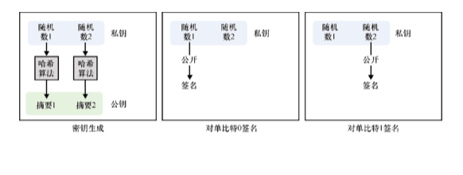
图 14.1　Lamport 签名是一个仅基于哈希函数构造的一次性签名方案。为单比特的消息签名时，我们需要先生成两个随机数，并计算它们的哈希值。最终，将两个随机数当作私钥，将它们各自对应的哈希值当作公钥。对于比特值为 0 的消息，把第一个私钥当作其签名；对于比特值为 1 的消息，把第二个私钥当作其签名
仅对单比特消息进行签名没有多大的实际意义。不过，Lamport 签名方案也可以处理多比特的消息，即将消息拆分成单比特，然后逐比特进行签名（见图 14.2）。显然，对于长度大于 256 比特的消息，我们需要先计算它的哈希值，然后对其哈希值进行签名。
Lamport 签名方案的主要缺点是：一对密钥只能执行一次签名；如果用一对密钥执行两次签名，则会导致其他人通过混合这两个签名伪造出其他消息的有效签名。为了解决这样的问题，我们可以生成大量一次性密钥对，同时确保每个使用过的密钥对都被彻底删除。这不仅使公钥与最终的签名数量一样多，同时还必须记录使用了哪些密钥对（最好的做法是将已使用过的私钥彻底删除）。例如，如果要使用输出长度为 256 位的哈希函数对 1000 个长度为 256 位的消息进行签名，则私钥和公钥的比特长度都必须为 1000 × （256 × 2 × 256）比特，即 16MB。我们仅生成 1000 个签名，公私钥的数量就已经如此巨大。
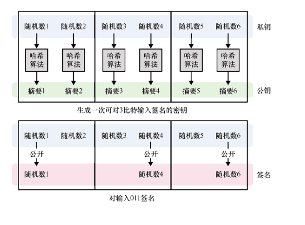
图 14.2　若要用 Lamport 签名方案对n比特长的消息进行签名，需要生成 2n个随机数。然后，将这 2n个随机数当作私钥，而把它们各自的哈希值当作公钥。当执行签名算法时，逐比特遍历消息，同时依次遍历私钥对。如果当前比特值为 1，则将对应私钥对的第一个私钥当作其签名；如果当前比特值为 0，则将对应私钥对的第二个私钥当作其签名
今天，大多数基于哈希函数的签名方案都建立在 Lamport 的一次性签名方案的基础之上，这些签名方案允许单个密钥对更多的消息进行签名，同时不同私钥之间也是无状态关联的，此外它们的参数长度也较小。14.2.2　具有较小密钥长度的 Winternitz 一次性签名方案
当 Lamport 提出一次性签名的概念后，美国斯坦福大学数学系的罗伯特·温特尼茨（Robert Winternitz）提出了对一个秘密值多次计算哈希值的一次性签名方案，该方案可以达到减小私钥长度的目的（见图 14.3）。该方案称为 Winternitz 一次性签名（Winternitz One-time Signature，WOTS）。
例如，令w = 16 时，该签名方案可以为 16 个不同的消息签名，即可为 4 比特的输入值签名。首先，生成一个随机值x并将其作为私钥，连续对私钥计算 16 次哈希值，获得公钥h16(x)。现在，假设想要对比特串 1001（等价于十进制的 9）进行签名，我们可以将第 9 次迭代产生的私钥哈希值h9(x)作为该比特串的签名，该过程如图 14.3 所示。
现在，让我们来了解这个方案的基本原理。这样的签名方案存在问题吗？它的主要问题是，该方案允许签名伪造（Signature Forgeries）。假设，已知对比特串 1001 的签名，根据前面的示例可知，它的签名应该是h9(x)。通过计算h9(x)的哈希值，我们可以获取其他轮迭代产生的哈希值，如h10(x)和h11(x)，这会让我们得到比特串 1010 和 1011 的有效签名。在消息后添加一个短的认证标签可以避免产生这样的伪造，但必须对短认证标签进行签名，该过程如图 14.4 所示。为了帮助大家理解这种解决方法，下面让我们尝试根据一个已知的签名伪造一个新的签名。
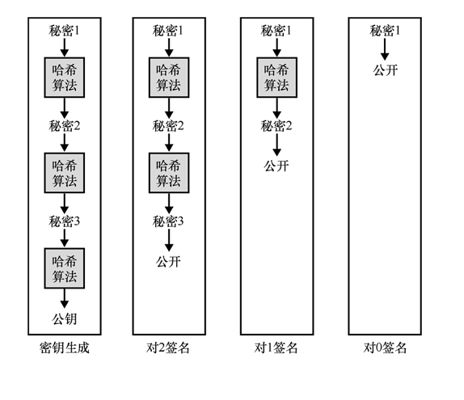
图 14.3　Winternitz 一次性签名方案是一个优化版 Lamport 一次性签名。Winternitz 一次性签名方案会多次迭代计算一个秘密值的哈希值，从而产生许多其他的秘密值，同时获得一个公开密钥。利用不同的秘密值可以实现对不同数字的签名
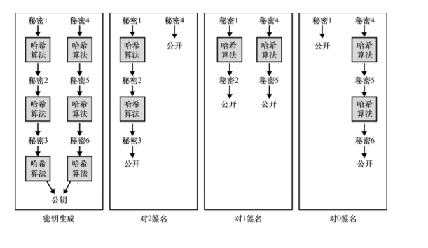
图 14.4　为了防止签名被篡改，Winternitz 一次性签名方案使用额外的签名密钥来认证签名。它的工作原理如下：当执行签名算法时，用第一个私钥对消息进行签名，用第二个私钥对消息的补码进行签名。容易看到，在本图所给的情形中，篡改任何一个签名都无法生成新的有效签名14.2.3　XMSS 和 SPHINCS+ 多次签名
到目前为止，我们已经学习了仅基于哈希函数的签名方案。虽然 Lamport 签名方案的密钥尺寸很大，但是 Winternitz 签名方案对其进行了改进，减小了密钥尺寸。然而，这两种方案的可扩展性都不好，它们都属于一次性签名方案（重用密钥对会破坏方案的安全性），因此方案的参数会随着签名数量的增加而呈线性增加。
除了一次性签名方案之外，还有一些方案允许使用单个密钥执行多次签名。这些方案被称为多次签名（Few-time Signature，FTS），如果同一个密钥对重复使用次数过多，仍会导致伪造签名的攻击。多次签名方案依赖于这样一个事实：从秘密池中挑选出的秘密组合相同的概率较小。这是对一次性签名的一个小改进，可以降低密钥重用的风险。不过，我们还有更好的改进方法。
在本书中，我们已经学过这样的技术，它可以把许多条数据压缩成一条数据。这项技术就是 Merkle 树。从第 12 章学到的知识可知，Merkle 树是一种能够证明某个数据在所给集合中的数据结构。20 世纪 90 年代，Merkle 树的提出者还提出了一种基于哈希函数的签名方案，该方案可以将多个一次性签名压缩成一个 Merkle 树。
这个想法非常简单，即树的每个叶子节点都是一次性签名的哈希值，树根节点的哈希值可以作为公钥公开。这样一来，签名的大小就变为与哈希函数的输出等长。为了完成对一个消息的签名，我们可以选择一个先前没有用过的一次性签名密钥，然后按照 14.2.2 小节中的过程进行签名。这种方案生成的签名属于一次性签名，同时附带有证明签名属于某个 Merkle 树（所有邻居）的 Merkle 证据。显然，我们应该避免重用包含在树中的一次性签名密钥，因此这样的签名方案是有状态的。该过程如图 14.5 所示。
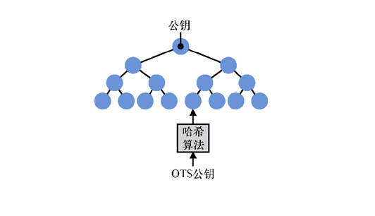
图 14.5　Merkle 签名方案是一种基于哈希函数的有状态签名算法，它利用 Merkle 树将许多一次性签名公钥压缩成一个尺寸很小的公钥（根哈希值）。Merkle 树越深，需要生成的签名数量就越多。需要注意的是，该签名方案有一个额外的成员证明的开销，而成员证明由许多与待验证签名关联的邻居节点组成，这些节点允许我们验证某个一次性签名是否属于树的节点
扩展 Merkle 签名方案（Extended Merkle Signature Scheme，XMSS）在 RFC 8391 中进行了标准化，它对原始 Merkle 签名方案中进行了许多优化。例如，在原始的 Merkle 签名方案中，如果想生成可为N条消息签名的密钥对，必须生成N个一次性签名私钥。虽然公钥只是一个根节点的哈希值，但仍然需要存储N个一次性签名的私钥。而扩展 Merkle 签名方案通过使用一个种子和叶子节点在树中的位置，可以确定地生成树中的每个一次性签名密钥，从而减少需要保存的私钥数量。这样一来，我们只需要保存种子并将其当作私钥，而不必保存所有的一次性签名私钥，并且可以根据种子和节点在树中的位置快速地重新生成其他一次性密钥对。为了跟踪最后使用了哪个叶子节点或一次性密钥对，私钥还应包含一个计数器，每当私钥被使用时，计数器的值都会加 1。
话虽如此，每个 Merkle 树可以容纳的一次性签名密钥也是有限的。Merkle 树越大，对消息签名时重新生成树所需的时间就越长（因为需要重新生成所有叶子节点才能生成 Merkle 证明）。而树越小，签名时需要重新生成的一次性签名私钥就越少，而我们想要一个签名次数不受限的方案，但这显然违背了我们使用 Merkle 树的初衷。针对这样的问题，我们可以使用深度较小的树，并且不使用叶子节点处的一次性签名密钥对消息进行签名，而是用叶子节点处的一次性签名密钥对其他 Merkle 树的根节点哈希值进行签名。该方案将原始的 Merkle 树转换为超级 Merkle 树（节点由树组成的树），实际上是扩展 Merkle 签名方案的一个变体，常称为 XMSSMT。在 XMSSMT中，使用与 XMSS 一样的技术就可以重新生成与某个一次性签名相关路径中的所有树。该过程如图 14.6 所示。
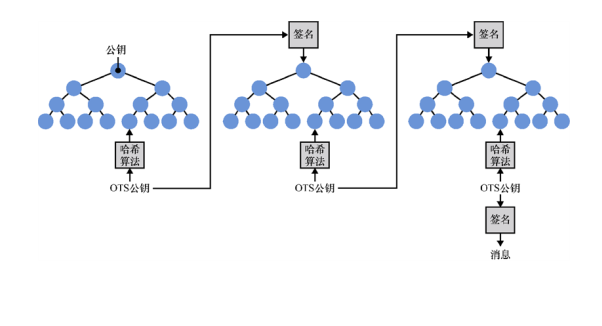
图 14.6　基于哈希函数的有状态签名方案 XMSSMT通过使用多个树来增加方案支持的签名数量，同时减小密钥生成过程的计算量，减少签名需要的时间。对一个消息签名时，根据根节点到最终的叶子节点的路径，以确定性的方式生成对该消息签名时需要的所有一次性签名密钥
需要注意的是，在某些情况下，处理 XMSS 和 XMSSMT签名的状态并不困难。但是一般来说，我们不希望签名算法具有状态性。在签名算法内部维护一个计数器并非密码学中的常见做法，实际上，用户也不希望签名算法具有这样的计数器。但如果没有这样的计算器，又可能会导致一次性密钥重复使用（从而导致签名伪造）。例如，当文件系统恢复到前一个状态，或者在多个服务器上使用相同的签名密钥时，就可能导致两次签名都使用了超级 Merkle 树中的同一路径。
当修复了 XMSS 签名存在的状态性这一缺点并向用户公开一个类似于常用签名方案的接口后，密码学家提出了 SPHINCS+ 签名算法，并将其作为 NIST 后量子密码竞赛的其中一个签名方案。无状态签名方案从 3 个方面对 XMSSMT做出改进。
● 对同一个消息计算两次签名会产生相同的结果。与 EdDSA 算法（参见第 7 章）类似，超级 Merkle 树中的路径是基于私钥和消息以确定性方式派生的。这确保了对同一消息进行两次签名产生的一次性签名密钥也是相同的，从而导致产生相同的签名。由于签名过程中用到私钥，所以攻击者无法预测我们将采用哪条路径对其他消息进行签名。
● 使用多个 Merkle 树。XMSSMT通过记录最后使用的一次性签名密钥，避免重复使用同一个一次性签名密钥。由于 SPHINCS+ 签名算法主要目的是避免记录算法执行状态，因此以伪随机方式在树中选择路径时需要避免发生碰撞。为此，SPHINCS+ 签名使用了大量一次性签名密钥，降低了重复使用同一个一次性签名密钥的可能性。SPHINCS+ 签名算法也用到一个超级 Merkle 树，而超级 Merkle 树可以转化成更多的树。
● 允许多次签名。由于该方案的安全性与重复使用树中同一路径的概率有关，因此 SPHINCS+ 还用多次签名技术代替最终对消息进行签名的一次性签名算法。这样一来，用同一路径对两条不同的消息进行签名不会破坏签名方案的安全性。
虽然在 NIST 后量子密码学竞赛中，SPHINCS+ 签名算法也列入考虑，但该算法并不具备明显的竞争力。SPHINCS+ 签名算法不仅执行速度慢，而且与其他的备选方案（如基于格的签名方案）相比，它生成的签名尺寸也非常大。基于哈希函数的有状态签名方案（如 XMS）具有执行速度快和产生的签名尺寸小（小于 3KB，而 SPHINCS+ 算法签名体积最小为 8KB）的特点。而这两种方案的公钥尺寸与 ECDSA 和 Ed25519 签名方案的非常接近。由于参数尺寸小和安全性强等优势，NIST 在 SP 800-208「Recommendation for Stateful Hash-Based Signature Schemes」中建议将 XMSS 作为标准加以推广。
接下来，让我们看看另外两种抗量子密码原语的构造方法。温馨提示：这些构造方法涉及很多数学知识！
++14.3　基于格密码的短密钥和签名方案
许多后量子密码方案都基于一种称为格的数学结构。本节将重点介绍基于格的密码技术。在 NIST 后量子密码学竞赛中，有一半的候选算法都是基于格的密码方案。这使得基于格的密码算法更有希望成为 NIST 后量子密码标准。在本节中，我将介绍两种基于格的密码算法：Dilithium 签名方案和公钥加密原语 Kyber。在正式介绍这两个算法前，让我们先来了解格在数学上的定义。14.3.1　格的定义
首先，基于格的密码的含义可能并不是我们直观认为的那样。例如，以第 6 章中介绍的 RSA 算法为例，我们说它是一个基于因式分解问题的算法，这并不意味着我们在 RSA 算法中使用了因式分解算法，而表示使用因子分解算法可以攻击 RSA 算法。正是由于因子分解问题很难，所以我们说 RSA 是安全的。基于格的密码系统也是如此：格是一种蕴含困难问题的数学结构，只要这些问题是困难的，那么基于格的密码系统就是安全的。
话虽如此，那么格具体是指什么呢？它是一个由整数构成的向量空间。如果不知道向量空间是什么，就简单将它理解为所有向量的集合。
● 基：向量的集合，例如，(0,1)和(1,0)就构成一个基。
● 加法操作：允许将两个向量加起来，例如，(0,1) + (1,0) = (1,1)。
● 标量乘操作：允许一个向量乘一个标量，例如，3 × (1,2) = (3,6)。
在上述示例中，向量空间中的所有向量可以表示为基向量的线性组合，即对于标量a和b，任何向量都可以写成：a × (0,1) + b × (1,0)。例如，示例所给的向量空间里向量(3.87,0.5)和(0,99)可以表示为：0.5 × (0,1) + 3.87 × (1,0) = 99 × (0,1) + 0 × (1,0) = (0,99)。
格是一个向量空间，其中向量中的所有数字都是整数。是的，在密码学中，各种运算也总是在整数空间上进行。图 14.7 所示是向量空间的示例。
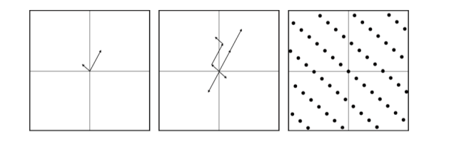
图 14.7　左图表示两个基向量。两个基向量所有可能的组合（见中图）构成格。由基向量最终生成的格可以看作一系列按照某种模式在空间中重复出现的点（见右图）
在格空间中，存在一些众所周知的困难问题，而且我们还有相应的算法可以解决这些困难问题。同时，这些算法也是已知能够解决格上困难问题最好的算法，但它们的运行效率低，也不实用。因此，在研究出更高效的算法前，我们认为这些问题都是困难的。格上著名的两个困难问题（见图 14.8）定义如下。
● 最短向量问题（Shortest Vector Problem，SVP）——寻找格空间中的最短向量。
● 最近向量问题（Closest Vector Problem，CVP）——给定一个不在格上的坐标点，寻找与该点距离最近的格点。
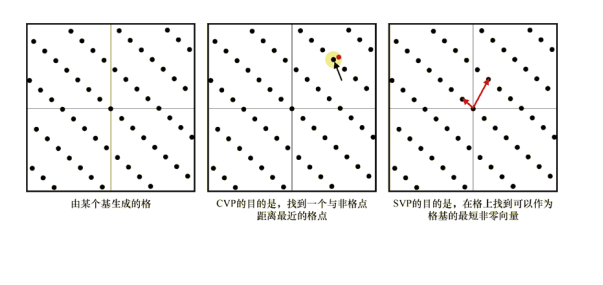
图 14.8　在密码学中主要使用两个格困难问题：CVP 和 SVP
通常，使用 LLL（Lenstra–Lenstra–Lovász）和 BKZ（Block-Korkine-Zolotarev）等算法可以解决这两个问题（CVP 可以归约到 SVP）。这些算法可以对格基进行约减，它们会尝试找到一组比给定向量更短的向量，同时满足短向量能生成与原始格完全相同的格。14.3.2　格密码的基础：LWE 问题
2005 年，Oded Regev 提出容错学习（Learning With Errors，LWE）问题。随后，密码学家基于该问题提出了包括本章中算法在内的许多密码方案。在继续学习本章内容之前，让我们先来了解 LWE 问题的定义。让我们从下面两个等式开始，这两个等式是整数s0和s1的线性组合：
只要拥有的等式足够多，我们就可以利用高斯消元算法快速地计算出s0和s1的值。有趣的是，如果我们在这些方程中加入一些噪声，问题就会变得更加困难：
尽管无论添加多大噪声，找到方程解似乎并不难，但是当我们增加方程中变量si的个数时，找到方程的解就成了一个困难的问题。
这就是 LWE 问题的本质（通常用向量的形式表示该问题）。假设有一个秘密向量s，并且向量各元素对某个整数取模。给定任意数量的长度相同的随机向量和表达式，其中是一个随机的小误差值，我们能从这些表达式中找到s值吗？
注意：
对于两个向量和，表示它们的点积，即每对坐标的乘积之和。例如，对于二维向量v = (v0,v1)和w = (w0, w1)，则vw = v0 × w0 + v1 × w1。
例如，如果 Alice 拥有秘密向量s = (3,6)，而 Alice 把两个随机向量a0 = (5,2)和a1 = (2,0)发给 Bob。现在，让我们回到本节开头所给的示例。正如我之前所说，基于格的方案实际上没有使用格，只是这些方案的安全性基于 SVP 的困难性。将前面的方程式写成矩阵形式，我们就可以看到得出秘密向量的约减过程，如图 14.9 所示。
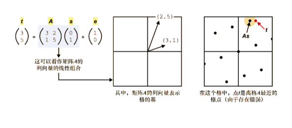
图 14.9　由于存在 LWE 问题到 CVP 的归约算法，所以 LWE 是一个基于格的困难问题。换句话说，如果我们能找到 CVP 的解，那么我们就能找到 LWE 问题的解
这种矩阵表示形式很重要。实际上，大多数基于 LWE 的方案都是用这种形式表示的。另外，本书用了一些常见符号来表示方程，即用黑斜体字体表示矩阵和向量，且常用大写字母表示矩阵，这些符号让涉及矩阵和向量的方程可读性更强。例如，A表示矩阵，a表示向量，b表示数值。
注意：
LWE 问题有几种变体（例如，环 LWE 问题和模 LWE 问题），它们基本上属于相同的问题，只是向量中元素取自不同类型的群。由于具有紧凑性和可优化性，密码学家在设计方案时更喜欢 LWE 问题的这些变体。不过，接下来我们要解释的问题同时适用于 LWE 问题及其变体。
既然已经知道了 LWE 问题的定义，那么让我们学习一些基于该问题的后量子密码方案：代数格密码套件（Cryptographic Suite for Algebraic Lattices，CRYSTALS）。具体来说，CRYSTALS 包含两个加密原语：Kyber 密钥交换方案和 Dilithium 数字签名方案。14.3.3　基于格的密钥交换算法 Kyber
进入 NIST 后量子竞赛的两个方案密切相关：CRYSTALS-Kyber 和 CRYSTALS-Dilithium。这两个方案都由同一研究团队提出，而且它们都基于 LWE 问题。Kyber 是一个公钥加密原语，本小节主要解释该算法的工作原理。Dilithium 是一种数字签名方案，14.3.4 小节将会介绍该算法。需要注意的是，由于这些算法仍在不断演进，所以这里只介绍这两种方案背后的想法。
首先，我们假设所有运算都发生在模大整数q上。也可以说，错误值和私钥是从一个以 0 为中心的小范围内采样（均匀随机选取）得到的。我们称这样的采样范围为错误范围（Error Range）。具体来说，误差范围可以定义为，其中B远小于q。这一点很重要，错误值只有小于某个值才能被视为「错误」。
生成私钥时，我们只需生成一个随机向量s，其中每个元素都在错误范围内。公钥由两部分组成，它的第一部分是一个与私钥等长的随机向量，第二部分是包含噪声的随机向量s和的点积。这正是我们之前了解到的 LWE 问题。重要的是，我们可以用矩阵来重写上述表达式：
其中，矩阵是一个由行向量组成，错误向量e是一个由误差值组成的向量。
为了使用 Kyber 方案进行密钥交换，我们加密一个 1 比特的对称密钥（是的，只有 1 比特！）。这类似于在第 6 章中看到的 RSA 密钥封装机制。以下 4 个步骤是基于 Kyber 密钥交换的加密过程。
（1）将对等方的矩阵作为公共参数，生成一个临时私钥向量r（向量各个元素都在错误范围内）及其对应的临时公钥（rA + e1），其中是一个随机的错误向量。注意，矩阵乘法是在右边进行的，即将向量r与按列相乘，而不是去计算（向量与按行相乘）。需要特别注意这个细节，否则，无法完成解密。
（2）为了避免错误值覆盖消息，我们将消息乘。需要注意的是，模通常指的是乘 2 模的逆元，但这里模指的是与最接近的整数。
（3）通过计算己方临时私钥和对等方公钥的点积生成一个共享密钥。
（4）将处理后的消息与共享密钥相加，再加上一个随机的错误向量，最终生成密文。
执行完上述步骤后，就可以向另一个对等方发送临时公钥和密文。在收到临时公钥和密文后，按照以下步骤可以对消息进行解密。
（1）计算己方私钥与接收到的临时公钥的点积，获得共享密钥。
（2）从密文中减去共享秘密，其结果包含处理后的消息和一些错误值。
（3）将前一步骤的计算结果除以，达到消除错误的目的。
（4）如果计算结果接近，则原消息为 1；如果计算结果接近 0，则原消息为 0。
当然，只能加密 1 个比特是不够的，当前的方案采用许多的技术来克服算法的这个限制。该算法的密钥生成、加密和解密过程如图 14.10 所示。
实际上，在密钥交换过程中，用对等方公钥加密的消息可以看作一个随机的秘密。然后，从密钥交换过程中的秘密和副本中确定地生成共享密钥，其中密钥交换副本包括对等方的公钥、己方的临时私钥和密文。
使用 Kyber 算法推荐的参数，产生的公钥和密文的大小约为 1000 字节。这样的参数尺寸比我们使用的前量子方案要大得多，但在现实应用场景中，这样的参数尺寸仍然是可以接受的。
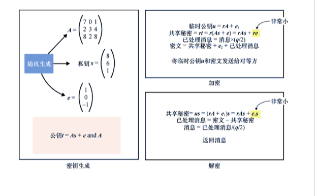
图 14.10　Kyber 公钥加密方案。值得注意的是，在加密和解密过程中，双方生成的共享密钥近似相同。这是因为r、s和错误值都远远小于q/2，所以re和e1也都远远小于q/2。因此，解密过程的最后一步消除了两个共享秘密之间的误差。注意，所有运算的模数都是q14.3.4　基于格的数字签名算法 Dilithium
接下来要介绍的 Dilithium 数字签名算法也基于 LWE 问题。与我们已经了解的其他数字签名算法（如第 7 章中 Schnorr 的签名）一样，Dilithium 是一个基于零知识证明的算法，它借助 Fiat- Shamir 技术实现算法的非交互性。
除了将错误值当作私钥的一部分外，Dilithium 算法与 Kyber 算法的密钥生成过程是一样的。首先，生成两个随机向量和并将它们当作私钥，然后根据这两个随机向量生成公钥，其中是一个矩阵，关于其生成方式参见 Kyber 算法。将和当作公钥。需要注意的是，通常我们会把错误向量当作私钥的一部分，这是因为每次对消息进行签名时都会用到它。这与 Kyber 算法密钥生成过程明显不同，Kyber 算法在密钥生成之后会丢弃错误向量。
为了实现对消息的签名，我们会创建一个 Sigma 协议，然后通过 Fiat-Shamir 转换将其转换为非交互式的零知识证明，这与第 7 章中的 Schnorr 身份协议转换为 Schnorr 签名的方式类似。交互式协议的执行过程如下（见图 14.11）。
（1）证明者通过发送，完成对两个随机向量和的承诺。
（2）在收到该承诺后，验证者返回一个随机挑战。
（3）证明者计算两个向量和。当这两个向量的值都较小时，就将它们发送给验证者。
（4）验证者判断向量和向量是否相等。
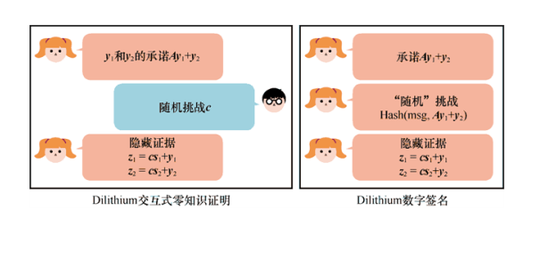
图 14.11　Dilithium 签名是一个基于 Fiat-Shamir 转换构造的非交互式秘密向量知识证明。左边的图表示交互式验证协议，而右边的图表示其非交互式版本，其中挑战是一个关于y和待签名消息的承诺
同样，这是对签名方案的一个简化描述。在实践中，会使用许多优化手段来减小密钥和签名的尺寸。通常，这些优化方法着眼于减少任何随机数据，主要方法是根据较小的随机值确定性地生成其他随机值，并通过自定义方法（不一定通过已知的压缩算法）压缩非随机数据，达到减少非随机数据量的目的。由于 LWE 具有独特的结构，还可能进行一些其他额外的优化。
在推荐的安全级别下，Dilithium 算法生成的签名大小为 3KB，生成的公钥小于 2KB。显然，这样的签名和公钥尺寸要比前量子签名方案（公钥为 32 字节，签名为 64 字节）大得多。但与基于无状态哈希的签名算法相比，Dilithium 算法的签名和公钥尺寸要小得多。记住，这些方案都比较新颖，因此如果找到解决 LWE 问题的更高效算法，出于安全性考虑，公钥和签名的尺寸还会变得更大。我们也有可能找到更好的技术来减小这些参数的尺寸。总的来说，提高抗量子性总是以牺牲算法参数尺寸为代价。
这并不是后量子密码学的全部内容。NIST 后量子密码学竞赛有许多基于其他范式的构造。NIST 已宣布他们将于 2022 年发布初始标准，但在后量子计算被视为巨大威胁的背景下，笔者预计该领域将会快速发展。虽然仍有很多未知因素，但这也意味着还有很多令人兴奋的研究空间。如果对此感兴趣，建议大家阅读 NIST 的相关报告。
++14.4　有必要恐慌吗
总而言之，如果量子计算机得以实现，那将是一件轰动密码学界的大事。量子计算机会对密码学领域产生何种影响呢？我们需要放弃正在做的一切，转而研究后量子算法吗？其实，事情并没有这么简单。
向不同的专家请教，我们会得到不同的答案。有些人认为量子计算还需要 5～50 年的时间才会出现。另一些人认为，量子计算机根本不存在。量子计算研究所所长米歇尔·莫斯卡（Michele Mosca）估计，「到 2026 年，攻破 RSA-2048 算法的概率将变为 1/7；到 2031 年，攻破 RSA-2048 的概率将变为 1/2」，而法国 CNRS 的研究员米哈伊尔·迪亚科诺夫（Mikhail Dyakonov）则公开声明「我们能学会控制超过 10300个用于定义系统量子态的可变参数吗？我的答案非常简洁，那就是我们不可以。」虽然物理学家（而不是密码学家）更清楚这一事实，但为了获得资助，他们会大肆宣传自己的研究。由于笔者不是物理学家，笔者只想表达，我们应该继续对非同寻常的主张持怀疑态度，但同时也要做好最坏的准备。
在实现可扩展的量子计算机（可以攻破密码学算法）方面，我们还面临许多的挑战。实现量子计算机最大的问题是，噪声和错误的数量难以减少和纠正。美国得克萨斯大学的计算机科学家 Scott Aaronson 将我们实现量子计算机的相关工作描述为「我们正在努力建造一艘与原来完全一样的船，只是它的每一块木板都腐烂了，我们必须替换掉这些地方。」
美国国家安全局是怎么看待量子计算的呢？人们需要记住，政府对保密性的需求往往超过个人和私人公司。例如，政府可能想让一些绝密数据保密时间长达 50 年之久。然而，这让许多密码学家感到困惑［例如，尼尔·科布利茨（Neal Koblitz）和阿尔弗雷德·J.梅内塞斯（Alfred J.Menezes）写作的「A Riddle Wrapped In An Enigma」］，他们一直在想，为什么我们要费力避免尚不存在甚至可能永远不会出现的安全威胁呢？
在任何情况下，如果真的担心数据的安全性，并且要求长时间保持数据资产的机密性，那么有必要增加正在使用的对称加密算法的安全参数。也就是说，如果通过密钥交换获得 AES-256-GCM 算法的密钥，那么非对称加密部分仍然容易受到量子计算机的攻击，因此仅让对称加密算法保持安全是不够的。
对于非对称加密算法，我们不能确定它们中的哪些是真正安全可用的。最好等到 NIST 后量子竞赛结束，以便我们获得更多的密码分析结果，最终确定这些新算法中的哪些更安全可靠。
目前，密码学家已经提出多种后量子密码系统，包括基于格的密码系统、基于编码的密码系统、基于多变量的密码系统、基于哈希的签名等。然而，人们还需要对这些候选算法中的大多数进行深入的研究，以便对它们的安全性（尤其是面对量子计算机敌手时的安全性）获得充足的信心，同时提高它们的性能。
——NIST Post-Quantum Cryptography Call for Proposals（2017）
如果不愿等待 NIST 后量子竞赛的最终结果，我们可以做的就是，在协议中同时使用当前的非对称密码方案和后量子密码方案。例如，我们可以使用 Ed25519 和 Dilithium 算法对消息进行交叉签名，或者换句话说，让一个消息拥有两个不同签名方案产生的签名。如果 Dilithium 算法被破解，攻击者仍然需要破解 Ed25519 算法。如果事实证明量子计算机真的存在，那么攻击者仍然无法伪造 Dilithium 算法的签名。
注意：
这就是谷歌在 2018 年和 2019 年利用 Cloudflare 所做的事情，他们在一小部分谷歌浏览器用户与谷歌和 Cloudflare 的服务器之间的 TLS 连接中试验一种混合密钥交换方案。该混合密钥交换方案由 X25519 算法和一个后量子密钥交换方案（于 2018 年提出的 New Hope 方案，于 2019 年提出的 HRSS 和 SIKE 方案）组成，最终将两个密钥交换的输出混合在一起，作为 HKDF 算法的输入，生成共享密钥。
最后，需要再次强调的是，基于哈希的签名算法受到广泛研究。尽管存在一些额外的开销，但是 XMSS 和 SPHINCS+ 等方案现在是可以使用的，而且 XMSS 算法即将在 RFC 8391 和 NIST SP 800-20 中进行标准化。
++14.5　本章小结
● 量子计算机基于量子物理学，它对特定任务的计算速度有显著提升。
● 并非所有算法都能在量子计算机上运行，也并非所有量子算法都优于经典计算机算法。但有两个令密码学家担忧的量子算法。
❏ Shor 算法可以高效地求解离散对数和因子分解问题，它能攻破当今许多的非对称密码机制。
❏ Grover 算法可以在 2128密钥空间中高效地搜索密钥，从而影响大多数安全级别为 128 比特的对称密码算法。不过，将对称密码算法的安全参数提升到 256 比特就足以抵抗量子攻击。
● 后量子密码学领域的目标是，寻找可以取代当今非对称密码原语（例如，非对称加密、密钥交换和数字签名）的新密码算法。
● NIST 启动了后量子密码标准化工作。
● 基于哈希的签名是一种仅基于哈希函数的数字签名方案。XMSS（有状态）方案和 SPHINCS+（无状态）方案是两个主要的数字签名标准。
● 基于格的密码算法密钥更短，还能用于构造抗量子的数字签名算法，因此基于格的密码算法非常有应用前景。基于 LWE 问题的两个最有可能入选 NIST 后量子标准的方案是：Kyber 非对称加密和密钥交换原语以及 Dilithium 数字签名方案。
● 密码学家已经提出了许多后量子密码方案，其中一些已经成为 NIST 后量子密码竞赛的候选算法。这些方案主要基于编码理论、同素、对称密钥密码和多变量多项式。NIST 的后量子竞争计划会在 2022 年结束。而在竞赛结束之前，仍然有可能出现对候选方案的新攻击手段，而候选方案也还有优化的空间。
● 目前，尚不清楚量子计算机何时能足够高效地攻破密码算法，也不清楚它是否能成功研发。
● 如果需要对数据进行长期保护，应该考虑使用后量子密码技术。
❏ 将使用的所有对称密码算法安全级别提升到 256 比特（例如，将 AES-128-GCM 算法更换为 AES-256-GCM 算法，将 SHA-3-256 算法更换为 SHA-3-512 算法）。
❏ 将后量子算法和前量子算法组合在一起，形成混合加密方案。例如，始终使用 Ed25519 和 Dilithium 算法对消息进行签名，或者始终使用 X25519 和 Kyber 执行密钥交换（根据密钥交换算法的输出派生出共享密钥）。
❏ 使用基于哈希的签名算法，比如 XMSS 和 SPHINCS+ 签名算法，这些算法经过充分研究和分析。XMSS 的优势在于，NIST 已对其进行了标准化。