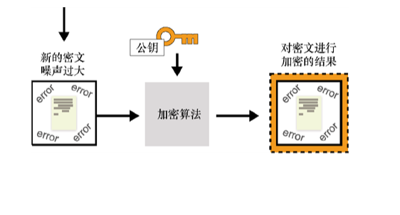

第 15 章　新一代密码技术
本章内容：
● 通过安全多方计算技术摆脱对可信第三方的依赖；
● 通过全同态加密实现在密文数据上的计算；
● 通过零知识证明隐藏程序执行的部分内容。
本书的目的是激发读者对实用密码学的兴趣。当我们阅读一本应用或实用类图书时，应该重点关注现今使用的技术，以及密码学领域正在迅速发生哪些变化（比如近年来「加密货币」得到迅速发展）。
在阅读本书的时候，许多理论上的密码原语和协议正在进入应用密码世界。这是因为我们找到了这些理论密码学原语的使用场景，或者是因为它们变得足够高效，从而可以在现实世界中使用。不管是什么原因，密码学在现实世界中的用途肯定是在不断增加的，而且它实现的效果也越来越令人兴奋。本章通过简单介绍 3 种密码原语让读者了解应用密码学的未来发展方向（可能在未来 10 年到 20 年内）。
● 安全多方计算（Secure Multi-party Computation，MPC）：MPC 是密码学的一个研究领域，它可以实现不同的参与者一起执行一个程序，而不需要向其他人暴露自己在程序中的输入。
● 全同态加密（Fully Homomorphic Encryption，FHE）：FHE 是一种允许对密文数据进行任意计算的原语。
● 通用零知识证明（Zero-knowledge Proof, ZKP）：ZKP 是我们在第 7 章中学到的一种密码原语，它可以实现在不泄露秘密消息的前提下证明自己拥有该秘密消息，但在本章中，ZKP 广泛地应用于更复杂的程序。
本书里最先进和最复杂的密码学概念均包含在本章中。出于这个原因，建议读者先浏览本章内容，然后阅读第 16 章给出的结论。当有动力了解更多高级密码学概念时，再回过头阅读本章。让我们开始吧！++15.1　安全多方计算
安全多方计算（MPC）是密码学的一个研究领域，该领域起始于 1982 年提出的百万富翁问题。在 1982 年，Andrew C. Yao 在他的论文「Protocols for Secure Computations」中写道：「两位百万富翁希望知道谁更富，但他们不想无意中泄露任何关于彼此财富值的额外信息。两位富翁该怎么进行一场关于他们财富值的谈话呢？」简单地说，MPC 给出了让多个参与者一起计算某个程序的解决方法。但是在了解更多 MPC 知识之前，让我们看看 MPC 技术为何有很高的应用价值。
我们知道，在可信第三方的帮助下，任何分布式计算都很容易实现。这个可信第三方可以维护每个参与者输入的隐私，也可以限制计算过程向参与者泄露的信息量。然而，在现实世界中，我们并不喜欢可信第三方，因为可信第三方往往难以获得，而且有时他们并没有自称的那样值得信任。
MPC 使得分布式计算完全摆脱了可信第三方，且计算参与者能够自己进行计算，而不需要向参与计算的其他人透露自己的输入。这样的计算过程是通过一个密码协议来完成的。因此，在某个系统中使用 MPC 协议相当于使用了可信第三方（见图 15.1）。

图 15.1　安全多方计算协议将需要可信第三方的分布式计算（见左图）转换为不需要可信第三方的计算（见右图）
其实，我们早已学过一些 MPC 协议。第 8 章介绍的门限签名和分布式密钥派生算法都是 MPC 协议。更具体地说，这些算法都属于 MPC 领域中的门限密码研究方向。近年来该领域受到广泛关注。例如，在 2019 年年中启动了门限密码学的标准化进程。15.1.1　隐私集合求交
MPC 的另一个著名的研究领域是隐私集合求交（Private Set Intersection，PSI），它主要解决以下问题：Alice 和 Bob 有一个单词列表，他们想在不透露各自单词列表的前提下知道自己与对方有哪些单词是相同的。这个问题的其中一种解决方法是，使用第 11 章提到的不经意伪随机函数（Oblivious Pseudorandom Function，OPRF）协议，此协议的执行过程如图 15.2 所示。如果还记得 OPRF 的功能，我们可以通过如下方式实现 PSI。
（1）Bob 为 OPRF 生成一个密钥。
（2）对于自己列表中的每个单词，Alice 都通过 OPRF 协议使用函数为其计算一个随机值，因此 Alice 不知道 PRF 使用的密钥（），而 Bob 不知道 Alice 列表中的单词（）。
（3）与 Alice 一样，Bob 也使用函数为其列表中的每个单词生成一个伪随机值，并将这些值发送给 Alice。Alice 将这些伪随机值与自己使用 PRF 计算产生的输出进行比较，通过检查两个伪随机值是否相等来判断单词是否相等。

图 15.2　PSI 使得 Alice 可以在不泄露自身集合的前提下获得她与 Bob 单词列表中包含的相同单词。首先，Alice 盲化自己单词列表中的每一个单词，并与 Bob 运行 OPRF 协议。之后，Bob 将自己的密钥与 Alice 的盲化单词作为输入运行 PRF 算法并将得到的一系列盲化的随机值发送给 Alice。最后，Bob 以自己的密钥以及单词为输入运行 PRF 算法得到一系列随机数并将其发送给 Alice。Alice 可以通过检查去盲后的随机数与 Bob 最后发来的随机值是否相等来判断单词是否相等
PSI 是一个很有前景的研究领域，由于与之相关的技术已经比过去更加实用，因此近年来越来越多人开始使用 PSI 技术。Chrome 浏览器中集成的口令检查功能就用到 PSI 技术。如果用户的口令不满足要求，口令在转存过程中会被检测到，浏览器此时会向用户发出警告。但在这个过程中，无须让浏览器知道用户的真实口令。有趣的是，微软的 Edge 浏览器也有这样的功能，不过它使用全同态加密（将在 15.2 节介绍）来执行 PSI 的计算。另外，Signal 即时聊天应用程序（见第 10 章）的开发人员认为 PSI 执行联系人发现的速度太慢，难以根据手机的联系人列表确定用户可以通话的对象。相反，使用 SGX（见第 13 章）作为可信第三方可以快速地执行联系人发现。15.1.2　通用 MPC 协议
更一般地说，有许多 MPC 协议可用于计算任意程序。不同的 MPC 方案的运行时间（从小时到毫秒）不同，它们也具备不同的性质。例如，该协议可以容忍多少不诚实的参与者？参与者是恶意的还是半诚实的（即参与者会正确地执行协议，但可能存在试图获取其他参与者输入的行为）？如果所有参与者中的一些人提前终止协议，那么协议依然公平吗？
在使用 MPC 协议安全地运行程序之前，需要将程序转换为算术电路（Arithmetic Circuit）。算术电路是由加法和乘法操作构成的计算序列。由加法和乘法构成的电路是图灵完备的，因此它可以表示任何程序！算术电路的示意如图 15.3 所示。

图 15.3　算术电路由连接输入和输出的若干加法和乘法门组成。在本图中，计算过程从左到右进行。例如，d = a + b。本图中的电路只输出一个值f = a + b + bc，但在理论上电路可以有多个输出值。请注意，电路的输入由不同的参与者提供，但也允许参与者有公共的输入（每个参与者都知道的输入）
在学习下一个原语之前，让我们再来看一个基于 Shamir 的秘密共享算法构造的（诚实参与者占大多数的）通用 MPC 方案。通用 MPC 方案有很多，但这个方案十分简单，它的执行过程可以分为如下三步：在每个电路的输入中共享足够多的信息，计算电路中的每个门，并重构输出值。让我们详细地解释每一步。
第一步是让每个参与者都拥有关于该电路的每个输入足够多的信息。公开输入是公开共享的，而秘密输入则是通过 Shamir 的秘密共享算法来共享的（详见第 8 章）。图 15.4 举例说明了这一点。
第二步是计算电路的每个门。出于技术原因，此处将忽略对电路的细节讨论，我们只需要知道加法门可以在本地计算，而乘法门需要双方交互进行计算（参与者必须交换一些消息）。对于加法门，只需将现有的共享输入相加；对于乘法门，将共享的输入相乘。计算后用户得到结果的份额，如图 15.5 所示。此时，参与者可以交换计算结果的秘密份额（以便重建输出）或使用结果的份额（如果这些计算结果的份额属于电路的中间值）继续执行计算。

图 15.4　基于秘密共享的通用 MPC 方案的第一步是让参与者（使用 Shamir 的秘密共享算法）分割各自的秘密输入，并将这些秘密份额分别发给协议中的相应参与者。例如，这里 Alice 将她的输入a分成a1和a2。由于本例中只有两个参与者，因此 Alice 保留两个秘密份额中的其中一个，将另一个秘密份额发给 Bob

图 15.5　基于秘密共享的通用 MPC 方案的第二步是让参与者计算电路中的每个门。例如，通过将两个 Shamir 输入的份额相加，参与者可以计算加法门，产生的输出也是 Shamir 份额形式
第三步是重建输出。在这个步骤中，每个参与者都应该拥有输出的秘密份额，这些份额可以用来重建最终的输出。15.1.3　MPC 发展现状
在过去的十年里，MPC 在实用化方面取得了巨大的进步。MPC 是一个拥有许多不同应用场景的领域，人们更应该关注对潜在应用有益的新原语。但是，MPC 没有受到正式的标准化，尽管现今已有许多案例证明了 MPC 方案的实用性，但这些方案使用起来并不容易。
顺便说一句，本节所给的通用 MPC 示例是基于秘密共享的，除此之外，构造 MPC 协议的方法还有很多。另一种构造 MPC 协议的著名方法是基于混淆电路的，它是 1982 年姚期智在介绍 MPC 的论文中首次提出的一种构造方法。还有一种方法是基于全同态加密。在下一节中我们将学习同态加密原语。
++15.2　全同态加密及其在云技术中的应用
长期以来，有一个问题一直困扰着密码学家：是否有可能在加密的数据上执行任意程序的计算呢？想象一下，我们可以分别加密a、b和c，并将密文发送到云服务器，要求该服务器返回计算结果的密文，然后客户端可以对计算结果的密文进行解密。重要的一点是，该服务器无法知道客户端发送值的明文，同时计算也是在密文上进行的。本示例可能没有多大价值，但通过实现密文上的加法和乘法计算，我们可以在密文上执行任意程序的计算。
这个有趣的概念最初由 Rivest、Adleman 和 Dertouzos 在 1978 年提出，即我们所说的全同态加密（Fully Homomorphic Encryption，FHE）。该密码原语的功能如图 15.6 所示。

图 15.6　全同态加密是一种加密方案，它允许对加密的内容进行任意计算。只有密钥的所有者才能解密计算的结果15.2.1　基于 RSA 加密方案的同态加密方案示例
我们已经学过一些加密方案，有助于较好地理解接下来的加密方案。想想 RSA 加密方案（见第 6 章）：给定一个密文（），其计算方式是，可以轻易计算出密文的一些特定函数：
其中n可以是任意的数值（尽管它不能太大）。通过上述运算可以得到一个密文，其解密结果是：
当然，对于 RSA 加密方案，我们并不希望出现这样的情况，这会引起一些攻击（例如，第 6 章提到的百万消息攻击）。实际上，RSA 加密方案使用填充方案来破坏其同态特性。注意，RSA 加密方案仅对乘法具有同态性，而由于能够计算任意程序的同态方案必须同时具备乘法和加法同态性，因此，我们称 RSA 为半同态方案。15.2.2　不同类型的同态加密
同态加密的类型如下。
● 部分同态：部分同态同时具备加法和乘法的同态性，但同态操作的次数是有限的（次数无法提前确定）。例如，同态加法运算次数在一定数量内是无限的，但只能进行几次同态乘法运算。
● 层次同态：层次同态中加法和乘法的同态运算都有可能达到一定的次数（事先确定）。
● 全同态：全同态加法和乘法的计算次数是无限的。
在 FHE 发明之前，人们提出了几种同态加密方案，但没有一种能够实现全同态加密。主要原因是，加密数据经过电路上的计算后噪声会增加，直到噪声达到阈值，使得密文无法正确解密。多年来，一些研究人员试图从信息论上证明 FHE 是不可能实现的，但后来，FHE 被证明是可以实现的。15.2.3　Bootstrapping：全同态加密的关键
一天晚上，Alice 梦见了巨大的财富，洞穴里面堆满了金银珠宝。然后，一条巨龙吞噬了财富，并开始吃自己的尾巴！Alice 醒来时感到自己很平静。当她试图理解梦境时，她意识到自己已经找到了解决问题的方法。
——Craig Gentry（“Computing Arbitrary Functions of Encrypted Data”，2009）
2009 年，Dan Boneh 的博士生 Craig Gentry 提出了第一个全同态加密构造。Gentry 的解决方案被称为 Bootstrapping，它实际上是在密文上运行解密电路，以便将噪声降低到一个可操作的阈值内。有趣的是，解密电路本身并不会泄露私钥，可以由不可信的计算方执行。Bootstrapping 允许将层次 FHE 方案转换为 FHE 方案。Gentry 构造的 FHE 方案运行速度缓慢，也无法在实际环境下使用，而且针对单个基本比特的操作大约需要 30 分钟，但随着时间的推移，构造的效率只会变得更好。Bootstrapping 使全同态加密技术成为可能。
Bootstrapping 如何工作？让我们跟随下面的思路理解 Bootstrapping 的操作原理。首先，我们需要公钥加密方案，其中公钥用来加密，私钥用来解密。现在，假设我们在一个密文上执行一定数量的加法和乘法操作，并使噪声达到某个值。此时该噪声值没有超过阈值，我们仍然可以正确解密密文。但如果继续执行同态操作，那么噪声值将超过阈值，导致密文无法正确解密。对上述过程的说明如图 15.7 所示。

图 15.7　使用全同态加密算法对消息进行加密后，对密文进行同态运算会让其噪声增加到接近阈值的程度，此时会导致密文无法正确解密
也许读者会认为程序到此无法正确运行，但是 Bootstrapping 可以通过消除密文中的噪声来保证解密的正确性。为此，我们可以使用另一个公钥（通常称为 Bootstrapping 密钥）对包含噪声的密文进行重新加密，以获得对该噪声密文的新密文，而且新密文没有噪声。该过程如图 15.8 所示。

图 15.8　基于图 15.7，为了消除密文中的噪声，我们可以对现有密文进行解密。但是由于我们没有密钥，因此需要在另一个公钥（称为 Bootstrapping 密钥）下重新加密包含噪声的密文，获得噪声密文对应的 新密文，且该密文里没有噪声
现在神奇的事情发生了：我们会得到有 Bootstrapping 密钥加密的初始私钥（我们不知道初始私钥的明文）。这意味着我们可以将加密的私钥与解密电路一起使用，对内部的噪声密文进行同态解密。如果解密电路产生的噪声值在可以接受的范围内，那么 Bootstrapping 就成功降低噪声值，最终将得到在 Bootstrapping 密钥下的第一次同态操作的计算结果。此过程如图 15.9 所示。

图 15.9　在图 15.8 的基础上，将由 Bootstrapping 密钥加密的初始私钥与新的密文作为解密电路的输入。这有效地对噪声密文进行正确解密，同时降低了噪声值。解密电路也会产生一些噪声值
如果剩余的噪声值允许我们执行至少一次同态操作（+ 或 ×），那么我们就赚了：我们拥有了一个全同态加密算法。因为在实践中，我们总是可以在每次同态操作之后或之前运行 Bootstrapping 算法。请注意，我们可以将 Bootstrapping 密钥对设置为与初始密钥对相同。这有点儿奇怪，因为我们得到一种反常的循环安全性，但它似乎也可以运行，并且没有已知的安全问题。15.2.4　一种基于 LWE 问题的 FHE 方案
在继续之前，让我们看一个基于第 14 章学到的 LWE 问题的 FHE 方案示例。此处将介绍 GSW 方案的简化版本，该方案根据作者 Craig Gentry、Amit Sahai 以及 Brent Waters 的名字命名。为了简单起见，此处将介绍该算法的一个私钥版本，不过将这样的方案转换为公钥方案相对简单（转化为公钥方案是 Bootstrapping 的要求）。看看下面的等式，其中C是一个方阵，s是一个向量，m是一个标量（一个数字）：
上述方程中，s被称为特征向量，m是特征值。如果读者对这部分内容比较陌生也不必担心，它们并不是我们的重点。
我们的第一个 FHE 方案灵感来自对特征向量和特征值的观察。观察结果是，如果我们将m设置为要加密的单比特消息，将C设置为密文，将s设置为密钥，那么我们可以拥有一个用来加密单比特消息的（不安全的）同态加密方案。当然，我们假设有一种方法可以根据给定消息比特m和密钥s计算随机密文C。该过程如图 15.10 所示。

图 15.10　我们可以构造一个不安全的同态加密方案，即将m当作特征值，把秘密s当作特征向量， 然后找到一个满足图中等式的矩阵C作为密文输出
解密密文时，只需将矩阵与秘密向量s相乘，然后检查计算结果是向量s还是。通过检查两个密文相加(C1 + C2)后解密是否等于两个密文对应的比特位相加，以及两个密文相乘(C1 × C2)后解密是否等于两个密文对应的比特位相乘，可以验证该方案是否支持加法和乘法同态：
但是很不幸，该方案是不安全的，因为找到矩阵的特征向量（秘密向量s）非常简单。那么如果在等式中添加一点噪声呢？我们可以稍微改变一下这个等式，让它看起来像 LWE 问题：
这样的形式看起来应该更熟悉。同样，我们可以验证该方案支持加法同态：
注意，此处误差值变为，不过这在我们预料之中。同样地，我们可以验证该方案支持乘法同态：
上述等式中，很小（因为它是或），但可能很大。这显然是一个问题，为了避免过多细节讨论，此处将忽略这个问题。有兴趣了解更多相关内容的读者可以阅读 Shai Halevi 在 2017 年发布的「Homomorphic Encryption」报告，该报告详细解释了同态加密技术相关的细节。15.2.5　FHE 的用武之地
最受欢迎的 FHE 应用场景一直是云计算。当数据以密文形式存储在云端时，FHE 可以确保云服务器能够对加密数据进行有效的计算。事实上，我们能想到许多 FHE 的应用场景，如下。
● 垃圾邮件检测应用可以检查用户的电子邮件，但却不能获取电子邮件的内容。
● 允许基因研究人员使用 DNA 数据，同时还可以保护人类基因密码的隐私性。
● 以加密形式存储数据库中的数据，并且保证服务器端查询数据库中的数据时不会泄露任何其他数据。
然而，Phillip Rogaway 在 2015 年发表的「The Moral Character of Cryptographic Work」开创性论文中指出，「FHE[…]引发了密码学的新一轮热度。在拨款提议、媒体采访和演讲中，理论密码学家都谈到了 FHE[…]，这标志密码学领域发展到了一个新的阶段。然而，似乎没有人强调这其中任何一项进展会对密码学实践和应用产生的影响。」
虽然 Rogaway 没有错，FHE 的发展仍然相当缓慢，但是该领域的进展令人兴奋。在撰写本书时（2021 年），同态加密的运算速度比正常运算速度慢约 10 亿倍，但自 2009 年以来，同态计算速度已经提高了 109 倍。毫无疑问，FHE 在某些特殊应用领域的发展很值得期待。
此外，并非每个应用程序都需要完整的原语，部分同态加密的应用也很广泛，并且比全同态高效得多。理论密码学原语进入现实世界的一个标志是标准化。事实上，许多大公司和大学都在为全同态的标准化做出努力。目前，尚不清楚同态加密将在何时、何地以及以何种形式进入现实应用世界。但这件事情一定会发生，所以请读者继续关注全同态加密的进展！
++15.3　通用零知识证明
第 7 章中介绍了零知识证明（ZKP），大家了解到签名类似于基于离散对数的非交互式 ZKP。这类 ZKP 是由 Shafi Goldwasser、Silvio Micali 和 Charles Rackoff 教授在 20 世纪 80 年代中期提出的。不久之后，Goldreich、Micali 和 Wigderson 发现，我们可以证明的不仅仅是离散对数或其他类型的难题，还可以在删除了一些输入或输出（见图 15.11）的情况下证明任何程序的正确执行。本节重点介绍这种通用类型的 ZKP。

图 15.11　通用 ZKP 允许证明者说服验证者相信执行步骤（程序的输入和执行后获得的输出）的完整性，同时隐藏计算中涉及的一些输入或输出。上图是证明数独问题有解的例子
ZKP 是一个自成立之初就有巨大发展的领域。这种发展的一个主要原因是「加密货币」的繁荣，因此链上交易需要更多的机密性以及优化空间。截至本书撰写之时，ZKP 领域仍在飞速发展，很难了解现有的所有现代方案以及通用 ZKP 的类型。
于我们而言幸运的是，ZKP 领域变得足够大，以至于超出了标准化的门槛（一条假想的界限）。一旦达到这个界限，几乎总是会激励一些人为了解释这个领域一起努力。2018 年以来，来自工业界和学术界的参与者联合起来为 ZKP 的标准化工作努力，目标是「标准化密码中 ZKP 技术的使用范式」。
通用 ZKP 的使用场景很多，但到目前为止，它们主要用于「加密货币」领域，这也可能是很多人对密码学感兴趣并且愿意尝试最前沿的技术的原因。尽管如此，通用 ZKP 在很多领域都有潜在的应用场景：身份管理（能够证明自己的年龄而不泄露年龄）、压缩（能够隐藏大部分计算）、保密（能够隐藏协议的一部分信息）等。对于更多使用通用 ZKP 的应用程序来说，最大的障碍似乎是：
● 有大量的 ZKP 方案可供选择，而且每年都有更多的 ZKP 方案被提出；
● 掌握这些系统的工作方式以及在特定的应用中选择不同方案的困难性。
区分不同的方案是相当重要的。因为这是困惑的来源，下面是一些 ZKP 方案的划分方式。
● 是否需要零知识。如果某些信息需要对某些参与者保密，那么我们就需要零知识。注意，没有秘密的证明也可能很有用。例如，用户将一些密集的计算委托给一个服务器，而该服务器必须向用户证明它们提供的结果是正确的。
● 是否需要交互：大多数 ZKP 方案都可以是非交互式的（借助第 7 章中提到的 Fiat-Shamir 转换），协议设计者似乎对方案的非交互式版本更感兴趣。这是因为在协议中，交互可能会很耗时间，但也因为交互性有时是不可能的。所谓的非交互式证明通常被表示为非交互式 ZKP，其缩写为 NIZK（Non-interactive ZKP）。
● 是否需要简洁证明。受到最多关注的 ZKP 方案是 zk-SNARK，表示零知识简洁的非交互式知识论证（Zero-Knowledge Succinct Non-Interactive Argument of Knowledge）。虽然不同文献对 zk-SNARK 的定义可能有所不同，但它们都侧重于此类系统生成的证据尺寸（通常是百字节的量级）以及验证证据所需的时间（在毫秒范围内）。因此，zk-SNARK 的证据短且易于 ZKP 验证。注意，一个非 zk-SNARK 的方案在现实世界中并非没有用武之地，因为不同的属性在不同的应用场景中可能会很有用。
● 是否需要透明设置。与每个加密原语一样，ZKP 需要一个设置过程来商定一组参数和公共值。这被称为公共参考字符串（Common Reference String，CRS）。但是 ZKP 的设置过程可能比原始的做法更危险。设置过程有如下 3 种类型。
❏ 可信的：这意味着 CRS 的创建者可以获得秘密，从而能够伪造证据（这就是秘密有时被称为「有毒废料」的原因）。这是一个很大的问题，因为我们回到了需要可信第三方的场景，但拥有这种属性的方案通常是最高效的，并且证据最短。为了降低安全风险，可以使用 MPC 协议让许多参与者帮助创建这些危险参数。如果有一个参与者是诚实的并且在参数创建结束后删除密钥，有毒废料将无法复原。
❏ 通用的：如果可以用可信设置来证明任何电路（电路大小受限）的执行，那么可信设置就是通用的。否则，它就是特定于某个电路的可信设置。
❏ 透明的：许多方案提供了透明设置，这意味着系统参数的创建过程不需要可信任第三方。具有透明设置的方案在设计上是通用的。
● 是否需要抗量子：有一些 ZKP 方案使用公钥密码和高级原语，如双线性对（后续将介绍此内容），而另一些 ZKP 方案仅依赖对称密码（如哈希函数），这使它们天然地抵抗量子计算机的攻击（通常以更长的证据为代价）。
因为 zk-SNARK 是在撰写本书时才出现的，所以作者将用自己的理解来向读者介绍 zk-SNARK 的工作原理。15.3.1　zk-SNARK 的工作原理
首先，zk-SNARK 方案有很多种，它们大多数都基于如下构造。
● 作为一个证明系统，允许证明者向验证者证明某个论断。
● 将一个程序翻译或编译成证明系统可以证明的东西。
第一部分并不难理解，而理解第二部分则需要学习该学科的一门研究生课程。首先，让我们来看看第一部分。
zk-SNARK 的主要思想是，证明自己知道一些有根的多项式f(x)。验证者拥有多项式的根，即验证者记住的一些值（例如，1 和 2），而证明者必须证明他们知道的秘密多项式与验证者的值计算结果为 0（例如，f(1) = f(2) = 0）。顺便说一下，对于某些多项式h(x)，以 1 和 2 为根的多项式（如我们的示例中）可以写成f(x) = (x − 1)(x − 2)h(x)。如果不确定，可以试着将x = 1 和x = 2 代入。证明者必须证明他们知道一个f(x)和h(x)，使得对于某些目标多项式t(x) = (x − 1)(x − 2)满足f(x) = t(x)h(x)。在本例中，1 和 2 是验证者想要检查的根。
这就是 zk-SNARK 证明系统通常提供的：一些可以证明某人知道某些多项式的证据。之所以重复这一点，是因为我第一次知道这对我们来说没有意义。如果我们只能证明自己知道一个多项式，那么该如何证明自己知道某个程序的秘密输入呢？这就是为什么 zk-SNARK 的第二部分如此困难的原因。zk-SNARK 是一种将程序转换成多项式的技术。稍后会介绍更多相关内容。
回到我们的证明系统，证明者如何证明他们知道这样一个函数f(x)？他们必须证明自己知道一个h(x)满足f(x) = t(x)h(x)。不过，本节的重点是 ZKP，我们如何证明自己拥有h(x)而不给出f(x)呢？这个问题的答案源于以下 3 个技巧。
● 同态承诺：一个类似于我们在其他 ZKP 中使用的承诺方案（见第 7 章）。
● 双线性对：一种具有一些有趣性质的数学构造，稍后将会详细介绍。
● 不同的多项式在大多数情况下会计算出不同的值。
接下来让我们仔细学习上述的 3 点内容。15.3.2　同态承诺隐藏部分证据
第一个技巧是使用承诺来隐藏我们正在发送给验证程序的值。但我们不仅隐藏了这些值，还希望验证者可以对它们执行一些操作，以便验证者可以验证证据。具体来说，验证者需要做的是，如果证明者提交了多项式f(x)和h(x)，那么验证者可以进行如下验证：
其中，由验证者计算，作为对目标多项式的约束。上述操作称为同态操作，且如果我们使用哈希函数作为承诺机制（见第 2 章），就无法执行同态操作。多亏了这些同态承诺，我们可以「将值隐藏在指数中」（例如，对于值，发送承诺），并执行同态操作的检查。
● 承诺相等：意味着。
● 承诺相加：意味着。
● 承诺标量乘：意味着。
注意，只有当是公开值而不是承诺（）时，最后一次检查才有效。仅凭同态承诺，我们无法检查承诺乘法，而这才是我们所需要的。幸运的是，密码学有另一个工具，可以得到隐藏在指数中的等式，这就是双线性对。15.3.3　利用双线性对改进同态承诺方案
双线性对可以用来帮我们消除阻碍，这就是在 zk-SNARK 中使用双线性对的唯一原因（实际上，只是为了能够保证承诺的乘法满足同态）。此处不会深入讨论双线性对的原理，只需要知道它是我们工具箱中的另一个工具，允许我们通过将元素从一个群移动到另一个群使得之前不能执行的乘法操作变得可行。
不妨使用来表示双线性对，可以将双线性映射写为，其中、和是不同群的生成元。在这里，我们将令等式左边的生成元相等（），构成对称双线性对。我们可以使用一个双线性对，通过下述方程来执行隐藏在指数上的值的乘法：
我们通过双线性对使我们的承诺不仅满足加法同态，而且也满足乘法同态。（注意，这不是一个全同态的方案，因为乘法仅限于一次。）双线性对也被用于密码学的其他领域，并逐渐成为一种更常见的构造模块。它们可以在同态加密方案中看到，也可以在 BLS（见第 8 章）等签名方案中看到。15.3.4　简洁性的来源
最后，zk-SNARK 的简洁性来自这样一个事实：在大多数情况下，两个不同的函数对不同的点求值的结果不同。这意味着什么呢？假设证明者没有一个多项式f(x)拥有和验证者持有的根相等的根，这意味着f(x)不等于t(x)h(x)。那么，将一个随机点分别代入f(x)以及t(x)h(x)在大多数情况下不会得到相同的结果。对于几乎所有的，f(r)≠t(r)h(r)。这称为 Schwartz-Zippel 引理，如图 15.12 所示。

图 15.12　Schwartz-Zippel 引理表示，两个不同的n次多项式最多有n个交点。换句话说，两个不同的多项式在大多数点上是不相等的
知道了这一点，就足以证明对于某些随机点成立。这就是为什么 zk-SNARK 的证据如此之小：比较一个群中的点，相当于比较整个多项式。但这也是大多数 zk-SNARK 构造中需要可信设置的原因。如果一个证明者知道将用于检查等式的随机点，那么他可以建立一个无效的多项式使得等式成立。所以一个可信设置的工作包括如下步骤。
● 创建一个随机值。
● 将隐藏在某个群元素的指数上（如），这样就可以让证明者在不知道r值情况下进行验证。
● 销毁。
上述的第二个步骤有意义吗？答案是肯定的。如果证明者要证明的多项式是，那么证明者要计算，从而得到该多项式在点上的证据。15.3.5　程序转换为多项式
到目前为止，对证明者多项式的约束是它存在一些根，将这些根代入多项式中计算结果都为 0。但是，我们如何将更一般的陈述转化为多项式的知识证明呢？「加密货币」是目前使用 zk-SNARK 最多的应用程序，它们的形式如下。
● 证明一个值在[0,264]内（这称为范围证明）。
● 证明一个（秘密）值包含在某些给定的（公共）Merkle 树中。
● 证明某些值的和等于其他一些值的和，等等。
这就是 zk-SNARK 困难的部分。正如我们前面看到的，将程序执行过程转换为多项式的知识是非常困难的。不过本书不会讨论所有的细节，但会让我们了解转换过程如何运作。在这个过程中，读者应该能够理解本书未涉及的部分解释，并按照自己的理解来填补空白。这个过程如下。
（1）首先，程序会被转换成一个算术电路，就像我们在 15.1.2 小节中学到的方式。
（2）该算术电路将被转换成某种形式的方程组（称为一阶约束系统，缩写为 R1CS）。
（3）然后我们用一个技巧把方程组转换成多项式。15.3.6　程序转换为算术电路
首先，假设几乎任何程序或多或少都容易重写为数学公式。这样做的原因很明显：我们不能证明代码，但可以证明数学公式。例如，代码清单 15.1 提供了一个函数，其中除了秘密输入a以外，所有输入都是公开的。
代码清单 15.1　一个简单的函数
fn my_function(w, a, b) { 
  if w == true { 
    return a * (b + 3); 
   } else { 
    return a + b; 
   } 
} 
在这个简单的例子中，如果除了a之外，每个输入和输出都是公开的，那么我们仍然可以推断出a的值。这段代码说明了有些东西无法用 ZKP 完成证明。暂且忽略这些问题，上述程序可以用数学表达式重写为下述方程：
其中，v是输出，w是 0（false）或 1（true）。注意，这个方程并不是一个真正的程序或电路，它只是看起来像一个约束。如果我们正确执行程序，然后将输入以及程序的输出填写到方程中，那么等式应该是成立的。如果等式不成立，那么说明我们的输出不是程序对输入的有效执行结果。
这就是我们必须思考的关于通用 ZKP 的问题。我们使用 zk-SNARK 来证明某些给定的输入和输出与程序的执行是正确匹配的（即使某些输入或输出被忽略），而不是在零知识的情况下执行一个函数（实际上这样做意义不大）。15.3.7　R1CS 运算电路
在任何情况下，将程序的执行过程转化为可以用 zk-SNARK 证明的公式只是一个步骤。下一步是将其转化为一系列约束，然后转化为证明某个多项式的知识。zk-SNARK 想要的是一阶约束系统（Rank-1 Constraint System，R1CS）。R1CS 实际上只是一系列形式为L × R = O的方程，其中L、R和O只能是一些变量的加法，因此，唯一的乘法是L和R之间的乘法。将算术电路转换成这样一个方程组的原因并不重要，我们只需知道它有助于将电路转换成可证明知识。试着按照上述的方式处理我们得到的方程，可得到如下结果：
实际上，我们忽略了w是 0 或者是 1 的约束，可以通过一个技巧将其添加到我们的系统中。
我们应该把这个系统看作一组约束：如果有人声称这组约束与程序执行的输入输出相匹配，那么我们应该能够验证这些值使得等式成立。如果其中一个等式不成立，那么说明以对方声称的值作为程序的输入并不能得到对方声称的输出。另一种理解方式是，zk-SNARK 允许我们以可验证的方式删除正确执行程序脚本的输入或输出。15.3.8　将 R1CS 转换为多项式
现在问题仍然是：我们如何将上述方程组转换成多项式？答案依然是一系列的技巧！因为我们的方程组中有 3 个不同的等式，所以第一步是，就多项式的 3 个根的选择达成一致。我们可以简单地选择 1、2、3 作为根，这意味着x = 1、x = 2 和x = 3 令多项式满足f(x) = 0。通过这样做，我们可以使多项式同时表示系统中的所有方程，当x为 1 时表示第一个方程，当x为 2 时表示第二个方程，以此类推。现在证明者的工作是创建一个多项式f(x)，如下。
注意，如果值与原始程序的执行过程正确匹配，则上述 3 个方程都应该等于 0。换句话说，只有当我们正确创建多项式f(x)时才有 1、2、3 这 3 个根。这就是 zk-SNARK 的意义：有协议可以证明我们的多项式f(x)有这些根（证明者和验证者都知道这些根）。
现在的问题是证明者在选择他们的多项式f(x)方面有太多的自由。他们可以简单地找到一个根为 1、2、3 的多项式而不关心a、b、m、v和w的值。证明者几乎可以做任何他们想做的事！相反，我们想要的方程组是，除了验证者无法获取的秘密值之外，该方程组的每个多项式系数项都可以确定。15.3.9　隐藏在指数中的多项式
回顾一下，我们希望证明者正确地执行具有秘密值a和公共值b、w的程序，并获得可公开的输出v。然后，验证者必须只通过输入验证者不能获取的部分（即a和m）来创建一个多项式。因此，在一个真正的 zk-SNARK 协议中，我们希望在证明者创建他们的多项式并在一个随机点上计算多项式的值时，他们具有最小的自由度。
为了做到这一点，多项式在某种程度上是动态创建的，通过让证明者只填充自己的部分，让验证者填充其他部分。例如，让我们取第一个方程，并将其表示为
其中、以及多项式，都满足当时计算结果为 1，而当或时计算结果为 0。这样一来，、以及就只影响第一个方程式。（注意，通过拉格朗日插值等算法很容易找到这样的多项式。）现在，请注意另外两件事。
● 我们拥有输入、中间值和输出作为多项式的系数。
● 多项式是对的求和，其中我们可以用类似于的方法定义和。
可以看到，在点x = 1 处多项式仍然表示为第一个方程：
有了这种表示方程（记住，它表示程序的执行过程）的新方法，证明者现在可以计算与它们相关的多项式部分。
取隐藏在指数中的随机点来重建多项式和。
以秘密值a为指数与进行幂运算，得到，表示在一个未知的随机点r处的值，并且这个值隐藏在指数中。
以中间值为指数与进行幂运算，得到，表示在一个未知的随机点处的值，并且这个值隐藏在指数中。
然后，验证者可以通过使用相同的技术重建和来填充缺失的部分。将两者相乘，验证者得到，它表示在一个未知随机点r上的值，且这个值被隐藏在指数中。最后，验证者可以利用双线性对重构隐藏在指数中的：
如果将这些技术推广到整个多项式f(x)中，我们就可以计算出最终的协议。当然，这仍然是对真正的 zk-SNARK 协议的粗略简化，仍然给了证明者太多的权力。
在 zk-SNARK 中使用的所有其他技巧都是为了进一步限制证明者的能力，确保它们正确和一致地填充缺失的部分，以及优化其他内容。顺便说一下，我读到的对 zk-SNARK 工作原理最好的解释是 Maksym Petkus 的论文「Why and How zk-SNARK Works: Definitive Explanation」，其中解释了本书忽略的所有细节。
上述就是本书关于 zk-SNARK 协议的所有介绍。实际上，zk-SNARK 的理解和使用要复杂得多！巨大的工作量不仅来自需要将一个程序转换成可以证明的知识，有时还来自需要对密码协议增加新的限制。例如，主流哈希函数和签名方案对于通用 ZKP 系统来说往往过于繁重，因此许多协议设计人员会研究不同的对 ZKP 更友好的哈希和签名方案。此外，正如我之前所说，zk-SNARK 的构造有很多种，也有许多不同的非 zk-SNARK 构造，它们可能与通用 ZKP 构造相关性更强，选择哪一种具体构造取决于应用场景。
但是似乎并不存在同时具备所有特性的 ZKP 方案（例如，具有设置透明、简洁、通用和抗量子的 ZKP 方案），而且不同应用场景中如何选择具体方案并不明确。这个领域还很「年轻」，每年都会公开更新、更好的方案。也许几年后，更好的标准和易于使用的密码学库就会出现，所以如果对这个领域感兴趣，请继续关注！
++15.4　本章小结
● 在过去的十年里，许多理论密码原语在效率和实用性方面取得了巨大的进步，其中有一些正在进入现实世界。
● 安全多方计算（MPC）是一种原语，它允许多个参与者一起正确地执行一个程序，而不透露他们各自的输入。许多的 MPC 方案已经用于现实世界，例如门限签名已经开始在「加密货币」中被采用，而隐私集合求交（PSI）协议则被用于大规模的现代协议，如谷歌的口令检查。
● 全同态加密（FHE）允许在加密数据上计算任意函数而且计算过程不会泄露数据明文。FHE 在云技术中有潜在的应用场景，它可以阻止除用户之外的任何人访问数据，同时仍然允许云平台对数据执行有效的计算。
● 通用的零知识证明（ZKP）的应用场景很多，并且最近在快速验证短证据上已经取得突破。ZKP 主要用于「加密货币」，以增加隐私或压缩区块链的大小。它的应用场景似乎很广泛，而且随着更好的标准和更容易使用的密码库的出现，我们可能会看到越来越多的 ZKP 应用场景。