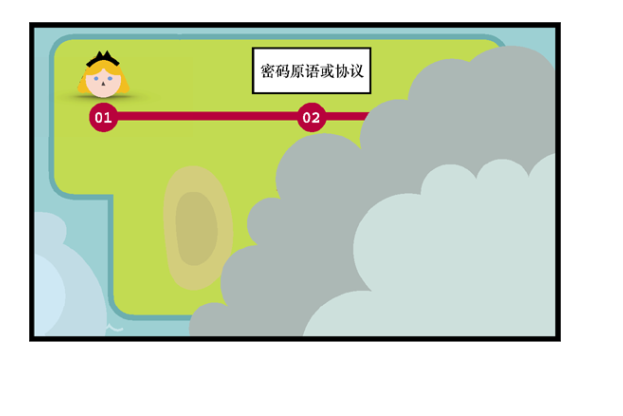
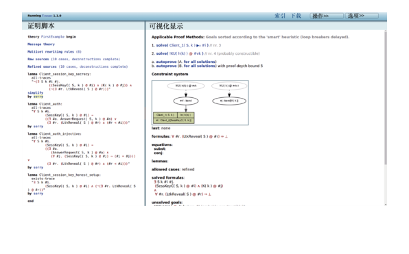
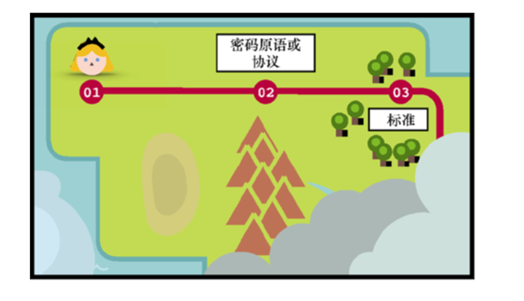
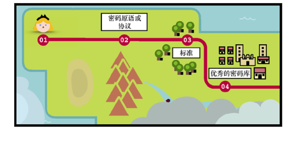
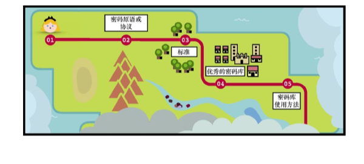
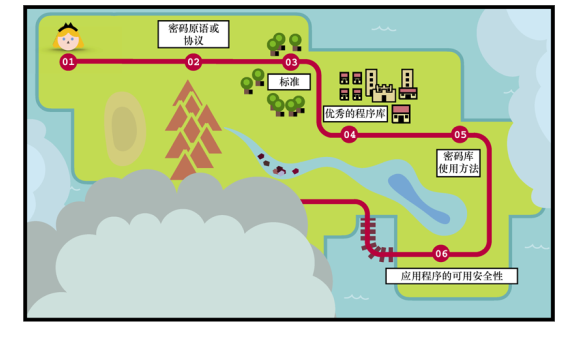
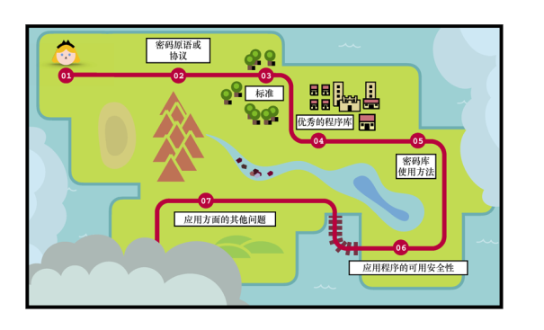
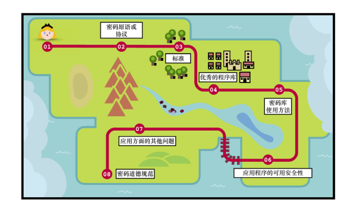

第 16 章　密码技术并非万能
本章内容：
● 使用密码技术可能遇到的问题；
● 正确使用密码技术要遵循的原则；
● 密码行业从业人员面临的问题和责任。
你好，旅行者！
你的密码学之旅已经进行了许久。虽然这是最后一章，但这不是你学习密码学技术的终点。现在，你已经具备了迈入应用密码世界所必需的知识。在这个崭新的世界里，你要做的就是，将前面学到的知识应用于实践。
在本书结束之前，我想给你一些重要的提示和工具，它们有助于你理解接下来的内容。通常，你面临的任务遵循相同的模式：每个任务都以一个挑战性问题开始，进而引发你对现有密码原语或协议的深入思考。从这里开始，你将学会寻找一个密码标准及其较好实现的方法，然后以密码学的最佳实践方式使用该算法。下面让我们按照这个流程来逐一解释本章内容。
忠告
在将密码学理论和实践建立起联系的过程中，我们还需做出许多额外的努力。本章内容将为我们扫除这些障碍。
++16.1　寻找到正确的密码原语或协议
针对未加密的信息流、大量服务器互相认证和存储秘密信息系统的单点故障问题，我们该采取何种措施呢？
我们可能会使用 TLS 和 Noise 协议（参见第 9 章）加密通信信息流。通过公钥基础设施（参见第 9 章）为某个机构颁发的证书签名，我们可以对服务器的身份进行验证，还可以使用门限方案（参见第 8 章）分发秘密信息，以避免泄露秘密导致整个系统遭受破坏。这些都是刚刚所提问题的解决办法。
如果面临的问题比较常见，那么很可能现有的加密原语或协议就可以解决这样的问题。本书有助于大家了解标准密码原语和通用协议。因此，在此基础上，大家容易知道解决问题应该使用哪些密码工具。
密码学是一个非常有趣的研究领域。人们不断提出新的密码原语，这使密码学的应用愈加广泛。尽管我们可能很想采用一些奇特的密码学技术来解决遇到的问题，但是，请记住，保持保守才是我们应该遵循的重要原则。原因在于，复杂性是应用系统安全的敌手。当我们去解决某些安全问题时，应该尽可能地采用那些简单可靠的方法。用复杂的协议解决应用问题也会引入一些安全漏洞。2015 年，Bernstein 曾称这样的安全问题解决策略为无趣密码学，这也是谷歌 TLS 库 BoringSSL 命名的灵感来源。
密码方案需要经过多年的仔细审查才能成为可实际使用的可信候选方案。尤其是对于那些基于新数学问题的密码方案，更应该牢牢遵守这样的原则。
——Rivest 等（“Responses to NIST’s proposal”，1992）
对于要解决的问题，如果找不到可用的加密原语或协议怎么办？这时，我们必须到理论密码学世界寻找答案。显然，这不是本书的主题。针对这样的情形，本书只能给出一些建议。
本书给的第一个建议是阅读由 Dan Boneh 和 Victor Shoup 共同撰写的A Graduate Course in Applied Cryptography一书。该书几乎涵盖本书中的所有内容，但它比本书更深入。Dan Boneh 还在 Coursera 网站推出过一套不错的密码学在线课程。该课程以更加浅显易懂的方式对理论密码学进行了介绍。如果想阅读一本难度介于本书和理论密码学之间的书，我推荐阅读由 Jean-Philippe Aumasson 撰写的Serious Cryptography: A Practical Introduction to Modern Encryption（No Starch Press，2017）。
现在，假设我们已有可以解决所遇到问题的密码学方案或协议。但是，许多密码原语或协议在很大程度上仍然处于非常理论化的阶段。如果已有一个实用的标准，那么我们应该如何正确地使用该标准呢（见图 16.1）？

图 16.1　已有一个实用的密码原语或协议
++16.2　如何使用加密原语或协议——文雅标准与形式验证
如果我们意识到现存的密码方案可以解决遇到的问题，那么我们需要进一步确认该密码方案是否已有标准？如果不存在相应的标准，那么这样的密码原语往往没有在现实世界中广泛地使用。通常，密码学家不会考虑密码原语或协议在使用过程中存在的隐患以及它们的实现细节。文雅密码学这个概念由 Riad S.Wahby 提出，其主要关注密码标准的实现问题，它使得实现者在实现密码算法的过程中几乎不会出现任何安全漏洞。
毫无经验的密码标准使用者构造的安全应用常常漏洞百出，这是标准不应该出现的问题。
——Rivest 等（“Responses to NIST’s proposal”，1992）
文雅标准旨在通过提供安全且易于使用的接口促使密码的实现更加规范，并就如何使用密码原语或协议提供良好的指导，从而达到解决所有边缘情况和潜在安全问题的目的。此外，好的标准还附带了测试向量，即匹配输入和输出的测试用例列表，我们可以将这些测试用例提供给算法实现者以测试算法的正确性。
不幸的是，并不是所有的标准都是「文雅的」，它们容易形成各种密码学隐患，这也是造成本书所提漏洞的根本原因。有时标准太模糊，缺少测试向量。而有时标准试图去规定太多不必要的东西。例如，加密灵活性是一个衡量协议对加密算法支持度的术语，支持不同的加密算法可以给密码标准带来一定程度上的优势。有时，一种算法可能无法抵抗某种攻击并被弃用，而同类的其他算法则不存在这样的问题。在这种情况下，不灵活的协议无法让客户端和服务器轻松完成更换算法的操作。另外，过高的灵活性也会严重影响标准的复杂性。有时，甚至会引发安全漏洞，许多针对 TLS 协议的降级攻击正是由此引发的。
不幸的是，标准密码方案不能解决的问题往往比密码学家承认的要多。例如，存在主流密码原语或协议无法解决的边缘情况，或者待解决问题与标准密码方案不匹配。因此，开发人员创建自己的「迷你协议」或「迷你标准」是非常常见的做法。然而，这也是麻烦的开始。
当对原语的威胁模型（保护的对象是什么）或其可组合性（如何在协议中使用）基于错误的假设时，密码原语的安全性就会遭到破坏。这些出现在特定上下文的问题会被下面的事实放大：通常，密码原语往往独立存在，一旦密码原语以不同方式或与另一个密码原语组合使用时，设计者不一定能考虑到可能会出现的所有问题。本书已经给出了很多这样的例子：X25519 破坏了协议的边缘情况（参见第 11 章），签名方案基于签名的唯一性假设（参见第 7 章），以及通信双方的模糊性（参见第 10 章）。这不一定是我们的错！开发人员比密码学家更聪明，他们揭示了密码学家不知道的密码原语或协议的缺陷。这样的事情经常发生。
如果发现这种情况，密码学家常用的方法就是纸笔证明法。这对我们这些安全从业者来说并没有多大帮助。我们要么没有时间做这项工作（这真的需要很多时间），要么就是专业知识不足。不过，我们并非孤立无援，我们可以使用计算机来简化迷你协议的分析。这就是所谓的形式验证，它可以极大地节省我们的时间。
形式验证允许我们用某种中间语言编写协议，并在其上测试协议的某些特性。例如，Tamarin 协议验证程序（见图 16.2）是一种正式的验证工具，它能够发现许多协议可能遭受的攻击。若想了解更多信息，请参阅论文「Prime, Order Please! Revisiting Small Subgroup and Invalid Curve Attacks on Protocols using Diffie-Hellman」（2019）和「Seems Legit: Automated Analysis of Subtle Attacks on Protocols that Use Signatures」（2019）。

图 16.2　Tamarin 协议验证程序是一款免费的形式验证工具，使用该工具可以对密码协议进行建模并发现对协议的攻击方法
然而，形式验证工具使用起来非常困难。使用验证工具的第一步是，弄清楚如何把协议翻译成验证工具所能理解的语言和概念。通常，这并不是一件简单的事。当能用形式化语言描述协议后，仍然需要弄清楚我们要证明什么以及如何用形式化语言表达要证明的对象。
事实上，协议证明器经常会出现证明出错的情况，因此我们会产生这样的疑问：谁来检验形式验证的结果？该领域的一些研究旨在让开发人员以更简单的方式形式验证他们开发的协议。例如，Verifpal 验证工具就在易用性和稳健性（能够找到所有攻击）之间进行了权衡。
形式验证工具（如 Coq、CryptoVerif 和 ProVerif）可以验证密码原语的安全证明结果，它甚至还可以生成不同语言的「形式验证」实现（具体参考 HACL*、Vale 和 fiat-crypto 等项目，这些项目实现了主流密码原语正确性、内存安全性等的可验证性）。尽管如此，形式验证并不是一种万能的技术。纸质协议和它的形式化描述之间或者形式化描述和实现之间的差距总是存在的，并且在发现协议的致命弱点之前，它们都是安全的协议。
研究其他协议失败的原因是一个避免犯同样错误的好方法。Cryptopals 和 CryptoHack 网站上有许多密码方面的问题挑战，熟悉这些问题有助于了解在使用和编写密码原语和协议时出现的错误。如果正在构建一个迷你协议，那么我们需要特别小心，要么形式验证该协议，要么向专家寻求帮助。如果我们有相应的标准，或者类似标准的东西，那么谁负责实现这样的标准呢（见图 16.3）？

图 16.3　建议使用已标准化的密码算法或协议
++16.3　哪里能找到出色的密码库
我们离解决最终问题又近了一步。现在，我们知道想要使用的密码原语或协议，并且它们存在相应的标准。这样我们就离规范更进一步，但这一步可能会使协议的实现含有漏洞。从哪里找到安全的密码算法代码实现呢？
简单搜索一下，我们会发现可以使用的库或框架有很多。这为我们所面临的问题提供了不错的解决办法。不过，我们该选择哪个库和框架呢？哪个库最安全呢？这些问题很难回答。有些密码库非常著名，本书中列出了一些库，如谷歌公司的 Tink、libsodium 和 cryptography.io 等。
然而，有时我们很难找到一个好的库来使用。也许我们正在使用的编程语言本身对密码学的支持度不够，或者我们想要使用的密码原语或协议没有全部被实现。在这些情况下，最好保持小心谨慎，我们既可以向密码学社区寻求建议，也可以了解库作者的密码学背景，甚至还可以让密码专家对我们的代码进行审查。例如，Reddit 上的 r/crypto 社区提供了这些帮助（直接给作者发电子邮件有时就会得到回复；在会议召开期间，通过麦克风向听众询问，我们也可能会得到问题的答案），也很受欢迎。
如果实在没有现成的代码，我们可能需要自己实现密码原语或协议。此时，可能会出现许多问题。最好的做法是，检查密码算法实现过程中经常出现的问题。幸运的是，如果我们能很好地遵循密码算法标准，就不容易犯错。但是，密码算法实现是一门技术，我们应该尽量避免自己实现密码原语或协议。
测试密码实现是否存在错误的一个有趣方法是使用工具。虽然没有一种工具可以测试所有的密码算法，但谷歌公司的 Wycheproof 工具值得一提。Wycheproof 是一个测试向量套件，它可用于排查 ECDSA、AES-GCM 等常见密码算法中的错误。该工具已在不同的密码实现中发现大量错误。接下来，我们假设自己没有实现密码算法而是发现了一个我们所需算法的密码库（见图 16.4）。

图 16.4　基于已有密码库开发安全类应用程序
++16.4　滥用密码技术：开发者是密码学家的敌手
我们发现了一些可以使用的代码，这让我们离最终目标又近了一步，但是这也增大了我们制造安全漏洞的风险。在应用密码学中，大多数的安全漏洞都是这样产生的。在本书中，我们一次又一次地看到滥用密码算法的例子，如对于 ECDSA（参见第 7 章）和 AES-GCM（参见第 4 章）等算法，重用 nonce 是个不好的做法；滥用哈希函数会破坏其抗碰撞性（参见第 2 章）；缺乏源认证（参见第 9 章）机制会导致敌手可伪装成通信参与方。
研究结果表明，安全类应用中的漏洞只有 17% 源于密码库本身（通常会产生毁灭性的后果），其余 83% 的漏洞是由应用程序开发者滥用密码库所造成的。
——David Lazar、Haogang Chen、Xi Wang 和 Nickolai Zeldovich（“Why does cryptographic software fail? A case study and open problems”，2014）
一般来说，密码原语或协议在实现时抽象性越好，使用起来就越安全。例如，AWS 提供密钥管理服务（Key Management Service，KMS），它将密钥托管在 HSM 中，并按需执行密码学计算。通过这种方式可以在应用程序层级对密码学进行抽象。另一个例子是，在编程语言标准库中提供密码学操作支持，基于这种方法开发的应用程序要比基于第三方密码学库的应用更受信任。例如，Go 语言的标准库在这方面就做得非常出色。
通常，对密码学库可用性的担忧可以总结为「将开发人员视为敌手」。许多密码学库都是基于这样的策略开发的。例如，谷歌的 Tink 库不允许在 AES-GCM（参见第 4 章）中选择 nonce/IV，以避免 nonce 意外重用。为了降低密码学库在使用上的复杂性，libsodium 库只有一组特定的密码原语接口，而不给开发人员任何使用上的自由。一些签名库将消息封装在签名中，迫使我们在提取到消息之前验证签名，当验证通过后，算法才会继续执行。从这个意义上说，密码协议和库有责任令其接口尽可能简洁，从而防止误用。
以前说过一个重要的原则，即在使用密码库之前，要了解库的全部细节（见图 16.5）。正如我们在本书中看到的那样，滥用密码原语或协议可能会造成灾难性后果。在正式开始使用密码库之前，请阅读库的标准说明、注意事项以及帮助手册和设计文档。

图 16.5　在使用密码库之前，有必要了解库的实现细节
++16.5　可用安全性
通常，密码学可以解决应用程序中以透明形式存在的问题，但并非总能奏效！有时，用户会知道应用程序使用的密码技术。
通常，高等教育也只能让用户知晓程序使用的密码技术。因此，当发生安全问题时，将责任推到用户身上从来都不是一个好主意。我们常称相关的研究领域为可用安全性，该领域旨在寻求使安全性和密码相关功能对用户透明的解决方案，尽可能降低密码技术误用的概率。一个典型的例子是，当 SSL/TLS 证书无效时，浏览器会首先给出简单的警告，随着时间的推移，它会逐渐向用户发出更严重的风险提示。
我们观察到的安全防御行为符合警告疲劳理论。在谷歌的 Chrome 浏览器中，与其他警告相比，用户会以更快、更频繁的方式点击 SSL 警告。我们还发现谷歌的 Chrome 浏览器 SSL 警告的点击率高达 70.2%，这表明警告体验会对用户行为产生巨大影响。
——Devdatta Akhawe 和 Adrienne Porter Felt（“Alice in Warningland: A Large-Scale Field Study of Browser Security Warning Effectiveness”，2013）
另一个典型例子是，安全敏感服务如何从依赖口令的认证切换到支持第二因素身份认证（参见第 11 章）。由于很难强制用户为每个服务设置强口令，因此有必要寻找消除口令泄露风险的解决方案。端到端加密也是一个很好的例子，用户总是很难理解端到端加密中会话的含义，以及通过主动验证指纹能带来多高的安全性（参见第 10 章）。当向用户推广密码技术时，必须最大程度地降低用户出错风险（见图 16.6）。

图 16.6　可用安全性旨在降低技术误用带来的风险
故事时刻
多年前，我曾审查过一个基于端到端加密方案的消息传输应用程序。这些应用程序就包含当时最新的 Signal 协议（参见第 10 章），但该协议并没有为用户提供验证其他用户公钥（或会话密钥）合法性的功能。尽管该端到端加密协议在被动敌手存在的情况下是安全的，但非法用户却很容易更新用户的公钥（或某些用户的会话密钥），从而导致我们无法检测针对协议的中间人攻击。
++16.6　密码学并非一座孤岛
通常，密码学都是作为复杂系统的一部分而存在的，而该系统本身也可能存在漏洞。实际上，大多数漏洞都存在于那些与密码原语或协议本身无关的地方。通常，攻击者会寻找安全系统中最薄弱的一环，即摘取果树上挂得最低的果实，而密码技术往往充当抬高果实的栏杆。包围该系统的周边系统可能会更大、更复杂，最终往往会产生更容易成功的攻击向量。Adi Shamir 有句名言：「通常，攻击者不会直接渗透系统，而是绕过系统的密码防护措施。」
我们需要花一些精力来确保系统中采用的密码算法是经过实践检验的、实现良好的和测试完备的，这确实是一件有益于系统安全的事，但我们也应确保系统的其余部分也经受过同样级别的严格审查。否则，其他一切努力都是徒劳（见图 16.7）。

图 16.7　一个具体的应用可能存在许多其他问题
++16.7　不要轻易亲自实现密码算法
至此，本书即将完结。现在，读者可以在密码学的荒野中自由驰骋。但本书的各位读者必须注意，本书并无法给大家带来超能力。本书可能会给大家带来一种面临安全问题时的无力感，即密码技术很容易被误用，一个简单的错误就会导致毁灭性的后果。因此，大家应该小心行事！
现在，大家的腰带上插有一个巨大的密码工具集。对于某一特定的应用，大家应该能够辨别出它使用的是何种密码技术，甚至可以看出具体应用程序中哪些地方是存在安全威胁的。大家也应该能够独自做出一些设计决策，知道如何将密码技术应用于特定的安全程序中，并了解哪种行为会带来安全风险。同时，保持时刻向密码学专家征求意见的严谨态度。
「不要盲目使用自己设计的密码算法」是软件工程中最常见的密码技术使用忠告。这个建议是对的。尽管我们有能力亲自实现甚至设计密码原语和协议，但不要在生产环境中使用它们。一个密码原语和协议从设计到正式投入使用，需要经历数年的时间：首先，学习该领域的各种细节问题需要花费数年时间；其次，不仅要保证密码算法在设计上的正确性，而且要求算法能够经受住各种各样的密码分析。即便是毕生研究密码学的专家也有可能构建出不安全的密码系统。Bruce Schneier 曾说过一句著名的话：「从最无知的业余爱好者到最专业的密码学家，他们都可以设计出自己无法破解的密码算法。」在这一点上，我们需要不断地学习新的密码学知识。本章最后这几页并不是大家本次密码学之旅的终点。
本书想让读者意识到自己正处于独特的地位。最初，密码学是一个封闭的领域，该领域的成员仅限于政府人员或从事保密工作的学者。密码学慢慢发展成今天的这个样子，成为一门公开的、全世界范围内广泛研究的科学。但对一些人来说，密码学仍然是小众的。
2015 年，Rogaway 对密码学和物理学的研究领域进行了有趣的比较。他指出，在第二次世界大战中日本遭到核轰炸后不久，物理学就变成了一个高度政治化的领域。研究人员开始感受到一种深刻的责任感，物理学与许多人的死亡以及可能更多人的死亡明确而直接地关联起来。不久之后，苏联切尔诺贝利核电站发生灾难，它进一步放大了物理学家的这种感觉。
密码学是一个涉及隐私的领域，它是一个与政治毫不相干的主题，这使得密码学研究与政治无关。然而，我们所做的决定可能会对社会产生长远的影响。我们今后设计或实现基于密码技术的系统时，请首先考虑我们将要面临的威胁模型。我们将自己视为受信任的一方，还是说我们设计的系统会防止我们访问用户数据，但不影响用户数据安全？如何通过密码学技术为用户授权？我们可以加密哪些数据？因此，密码学家也要遵循相应的规范（见图 16.8）前美国国家安全局局长 Michael Hayden 曾说过「我们可以利用元数据杀害任何人」。
2012 年，在圣巴巴拉海岸附近，Jonathan Zittrain 在一个昏暗的演讲厅向数百名密码学家发表了题为「The End of Crypto」的演讲。这是一个备受世界密码学家关注的密码学会议。Jonathan 播放了电视连续剧《权力的游戏》中的一段视频。在视频中，瓦里斯（Varys）向提利昂（Tyrion）国王转交了一个谜语。谜语的完整内容如下。
3 个人坐在一个房间里：一位国王、一位牧师和一位富人。他们中间站立着一个普通的佣兵。每个人都想获得这个佣兵，并让他杀死其余的另外两个人。谁能活下来，谁会死掉？提利昂立即回答：「这取决于佣兵。」太监回应道，「如果是剑客掌权，我们为什么要假装国王掌握所有权力呢？」
Jonathan 暂停了视频片段，指着在场的观众并对他们大喊：「你们知道你们就是佣兵，对吧？」

图 16.8　密码学家也应遵守相应的道德规范
++16.8　本章小结
● 就具体应用而言，实用密码学总是面临各种误用的问题。在大多数应用密码技术的案例中，我们都会使用设计良好的密码原语和协议。因此，密码算法误用成为大多数安全漏洞的主要来源。
● 密码原语和协议可用于已有的许多典型应用案例。通常，我们需要做的就是找到一个广泛认可的密码原语和协议实现来解决所面临的问题。在使用具体的实现之前，请阅读实现相关的手册，了解其使用场景和条件。
● 与乐高积木一样，现实世界的密码协议是由一层层的密码原语堆叠而成的。当不存在人们广泛认可的协议可以解决我们遇到的问题时，我们将不得不亲自组装一个个密码算法部件，形成最终所需的协议。然而，这种做法是非常危险的。当在特定情况下使用某个密码原语，或把该密码原语与其他原语或协议结合使用时，最终形成的密码原语会受到各种攻击。在这些情况下，我们可以把形式验证当作发现协议潜在问题的工具（尽管这样的工具可能很难使用）。
● 实现密码协议本身就是一件困难的事。此外，我们还必须让实现的接口易于使用（从某种意义上说，良好的密码实现几乎不会让用户有任何误用的机会）。
● 避免盲目创新，使用广泛认可的密码技术是避免后续出现安全问题的绝佳方法。许多安全问题都是因协议本身过于复杂（例如，支持太多的加密算法）所导致的。这也是密码学社区热议的话题。这种过度设计的系统常被称为「无趣密码」，我们应该尽可能地远离「无趣密码」。
● 密码原语的设计者和标准的制定者都应该对实现中可能出现的错误负责。这是因为密码算法的实现可能非常复杂，或者他们没有清楚地告诉实现者应该注意的事项。文雅密码学是一种很难实现的理想化密码原语或标准。的确，密码原语和标准的文雅化是我们终极的追求。
● 有时，用户会知道应用程序使用的具体密码技术。可用安全性是指确保用户了解密码技术原理，并且尽可能防止用户滥用密码原语。
● 密码学不是一座可以单独存在的孤岛。如果遵循本书中的所有建议，那么即便系统出现了漏洞，它们中的大部分也并非由密码原语引起的。请谨记本书所给的这些建议！
● 我们应充分利用好从本书学到的知识，担负起密码学工作者应该承担的责任，认真思考我们的所作所为可能引起的后果。