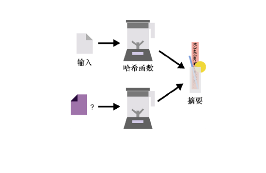
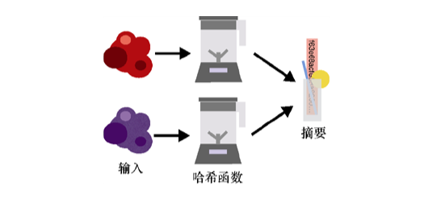
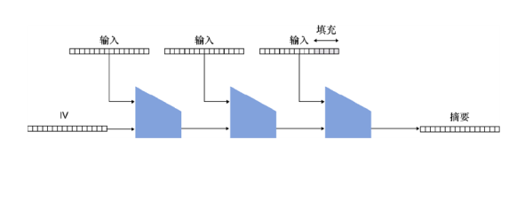
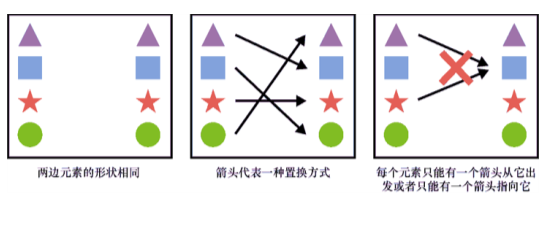
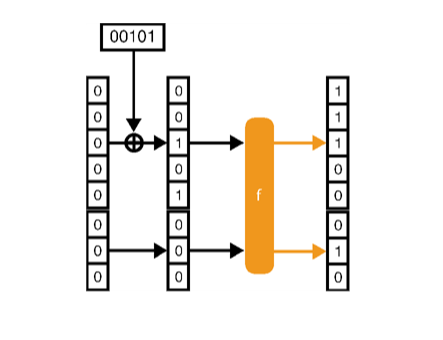
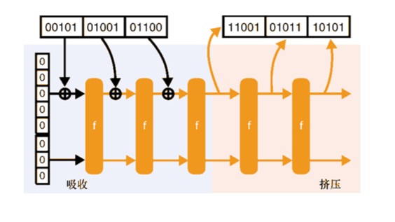
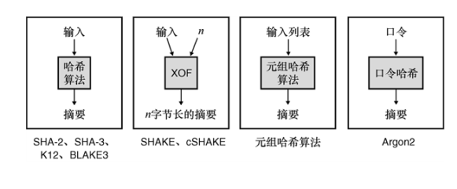

第 2 章　哈希函数
本章内容：
● 哈希函数的定义及其安全性质；
● 目前广泛采用的哈希函数；
● 现有的其他类型哈希函数。
在本章中我们学习的第一个密码学原语就是——哈希函数（Hash Function），它可以给任何数据生成一个全局唯一的标识符。哈希函数在密码学中随处可见！非正式地说，哈希函数以任意值为输入，并输出一个唯一的字节串。给定相同的输入，哈希函数总是产生相同的字节串。这可能看起来没什么，但在密码学中，许多算法都是基于哈希函数构造的。在本章中，我们将了解到关于哈希函数的所有知识，以及它应用广泛的原因。
++2.1　什么是哈希函数
现在，我们可以看到一个网页（见图 2.1），而下载（DOWNLOAD）按钮占据该网页的大部分空间。通过单击下载（DOWNLOAD）按钮，我们会跳转到一个包含待下载文件的网站。在这个按钮的下面有一长串难以理解的字符串：
f63e68ac0bf052ae923c03f5b12aedc6cca49874c1c9b0ccf3f39b662d1f487b
后面还有一串看起来像某种首字母缩略词的字符（sha256sum:）。这个字符串看起来是不是有点眼熟呢？在生活中，我们可能也下载过附带类似字符串格式的文件。
我们可以利用这个长字符串按照如下步骤来检测文件的完整性：
（1）点击按钮来下载文件；
（2）采用 SHA-256 算法来计算下载文件的哈希值；
（3）将哈希函数的输出（摘要）与网页上显示的字符串进行比较。
这个字符串还可以帮助我们验证下载的文件是否正确。

图 2.1　该网页链接到包含一个文件的外部网站。该网页提供了该文件的哈希值，因为哈希值可以保证外部网站无法随意修改文件内容而不被察觉。该文件的哈希或摘要确保了下载文件的完整性
注意：
哈希函数的输出通常被称为摘要（Digest）或哈希值（Hash）。本书将交替使用这两个词。其他书可能会称哈希函数为校验和（Checksum），但因为这个术语主要用于指代非密码学的哈希函数，所以本书没有使用这个名词。我们只需要牢记，不同的代码库或文件会使用不同的术语。
当我们想要尝试计算哈希值时，可以使用流行的 OpenSSL 库。该库提供了一个多用途的命令行接口（Command Line Interface，CLI），macOS 之类的许多系统中自带该命令行工具。例如，打开终端并输入如下命令：
$ openssl dgst -sha256 downloaded_file
f63e68ac0bf052ae923c03f5b12aedc6cca49874c1c9b0ccf3f39b662d1f487b
通过上述命令，我们可以使用 SHA-256 哈希函数把输入（下载的文件）转化为一个唯一的标识符（命令返回的值）。执行这些额外操作的目的是，检验文件的完整性（Integrity）和真实性（Authenticity），保证下载的文件确实是我们想要的。
这些工作，要归功于哈希函数的安全性质——抗第二原像性。这个术语意味着从这个哈希函数的长输出 f63e...中，我们无法推断出另一个文件也可以通过相同的哈希函数得到相同的输出 f63e...。在实践中，这意味着该摘要与正在下载的文件密切相关，没有攻击者能够不知不觉地将原文件替换为不同的文件。
十六进制编码
顺便说一下，上面的字符串 f63e...采用的是十六进制（Base16 编码，使用从 0 到 9 的数字和从 a 到 f 的字母来表示任意数据）表示形式。我们本可以用包含 0 和 1 的二进制编码方法表示哈希函数的输出，但这样会占用更多空间。十六进制编码允许我们将 8 比特（1 字节）数编码成 2 个字符。这种编码方式具有可读性强、占用的空间少的优点。我们还可以使用其他的编码方法将二进制数据编码成可读字符，但十六进制编码和 Base64 编码是使用最多的两种编码方式。在 Base 系列编码中，基越大，编码二进制数据需要的字符数就越多。当然，如果用的基过大，我们可能就无法用已有的可读字符编码二进制数据。
请注意，这个长字符串由网页的所有者控制，任何能够修改该网页的人都可修改该字符串。（如果不相信这一点，请花点儿时间思考一下原因。）因此，为了确保文件的完整性，我们需要信任包含摘要字符串的网页、网页的所有者以及获取网页页面的安全机制，而不必信任包含下载文件的网页。从这个意义上说，单独使用一个哈希函数并不能提供完整性。因为下载文件的完整性和真实性来自文件摘要以及摘要的可信机制（在本例中为 HTTPS）。我们将在第 9 章讨论 HTTPS，但现在我们先假设该协议允许我们与网站进行安全通信。
我们可以将哈希函数看作图 2.2 中的黑匣子。我们的黑匣子接收一个输入并产生一个输出。

图 2.2　哈希函数可以接收任意长度的输入（文件、消息、视频等）并产生固定长度的输出（例如，SHA-256 算法的输出为 256 比特）。对于同一个哈希函数，相同的输入会产生相同的摘要或哈希值
哈希函数的输入可以是任意大小，甚至可以是空值，而它的输出的长度总是固定的，且具有确定性：给定相同的输入，哈希函数总是产生相同的输出。在我们的示例中，SHA-256 始终提供 256 比特（32 字节）的输出，它的输出终被编码为 64 个十六进制字符。哈希函数的一个主要特性是无法求逆，也就是说无法从输出中找到输入。因此，我们说哈希函数是单向（One-way）的。
为了说明哈希函数在实践中的工作原理，我们将使用 OpenSSL 命令行工具中的 SHA-256 哈希函数计算不同输入的哈希值。在 OpenSSL 命令行工具中，SHA-256 算法的输入和输出如下所示：
$ echo -n 「hello」 | openssl dgst -sha256 
2cf24dba5fb0a30e26e83b2ac5b9e29e1b161e5c1fa7425e73043362938b9824 
$ echo -n 「hello」 | openssl dgst -sha256    ←---　对同样的输入计算哈希值，会得到相同的输出 
2cf24dba5fb0a30e26e83b2ac5b9e29e1b161e5c1fa7425e73043362938b9824
$ echo -n 「hella」 | openssl dgst -sha256    ←---　对哈希函数的输入内容的细微修改会得到完全不同的哈希值 
70de66401b1399d79b843521ee726dcec1e9a8cb5708ec1520f1f3bb4b1dd984
$ echo -n 「this is a very very very very very very    ←---　无论输入的消息有多长，哈希函数输出值的长度总是固定的 
  ➥ very very very long sentence」 | openssl dgst -sha256            
1166e94d8c45fd8b269ae9451c51547dddec4fc09a91f15a9e27b14afee30006
在 2.2 节中，我们将看到哈希函数的其他性质。
++2.2　哈希函数的安全属性
通常，应用密码学定义的哈希函数具有 3 个特定的安全属性。这个定义会随着时间的推移而改变，我们将在 2.3 节中给出这些性质的详细描述。但是现在，让我们先定义构成哈希函数的三大基础属性。这些内容对于了解哈希函数的适用场合非常重要。
哈希函数的第一个属性是抗第一原像性（Pre-image Resistance）。这一属性表示无法根据哈希函数的输出恢复其对应的输入。在图 2.3 中，我们可以把哈希函数想象成一个搅拌机，这种「单向性」意味着我们无法从「搅拌后的冰沙」中恢复出原始成分。

图 2.3　从技术上讲，给定哈希函数（图中表示为搅拌机）生成的摘要， 不可能推导出它的原始输入。这种安全属性称为抗第一原像性
注意：
如果输入值很小，那是否就能找到原始输入呢？假设输入的可取值是 oui 或 non，那么攻击者很容易对所有可能的 3 个字母的单词进行哈希并找出输入值。所以，当输入空间很小时，我们就需要对输入的变体计算哈希值。此外，当需要计算哈希值的内容是一个句子时，例如，「我将在星期一凌晨 3 点回家」，尽管攻击者不知道具体的时间，但是他可以尝试所有可能的时间组合，从而猜测出原始输入。因此，抗第一原像性有一个明显的前提：输入空间不能太小且要具有不可预测性。
哈希函数的第二个属性是抗第二原像性（Second Pre-image Resistance）。前面提到的文件完整性验证示例就用到这个安全性质。该性质说明如下：给定一个输入和它的哈希值，无法找到一个不同于该输入的新输入，使得这两个输入产生一样的哈希值。图 2.4 说明了哈希函数的这一性质。

图 2.4　给定一个输入及其摘要，无法找到哈希值相同的另一个不同的输入。这种安全属性称为抗第二原像性
请注意，在图 2.4 中，第一个输入是固定的，我们只能控制第二个输入。这对于理解哈希函数的下一个安全性质很重要。
哈希函数的第三个属性是抗碰撞性（Collision Resistance）。这个性质保证不能够产生哈希值相同的两个不同的输入（见图 2.5）。在图 2.5 中，攻击者可以改变两个输入，这与之前只准改变其中一个输入的要求不同。

图 2.5　无法找到哈希值（右侧）相同的两个不同的输入（在左侧表示为两个随机数据块）。 这种安全属性称为抗碰撞性
抗碰撞性和抗第二原像性很容易混淆。我们需要花点儿时间来了解它们之间的差异。
随机预言机（Random Oracle）
此外，我们认为哈希函数的输出是不可预测且随机的。这样的性质对证明协议的安全性非常有用，这一切都要归功于哈希函数具有的安全性质（例如抗碰撞性）。密码学中的许多协议都在随机预言机模型下被证明是安全的，证明过程中使用了一个虚构的理想参与者，即随机预言机。在这种类型的协议中，人们可以将任何输入作为请求发送到该随机预言机，它会返回完全随机的输出，且与哈希函数一样，对于两次相同的输入返回相同的输出。
用这样的模型证明算法的安全性有时会引起争议，因为我们不确定在实践中是否存在能够替换这些随机预言机的哈希函数。不过，许多合法协议已经被证明在随机预言机模型下是安全的，其中所使用的哈希函数比真实函数更理想。
++2.3　哈希函数的安全性考量
到目前为止，我们列举了哈希函数的 3 个安全属性：
● 抗第一原像性；
● 抗第二原像性；
● 抗碰撞性。
这些安全属性本身是没有意义的，哈希函数的安全性取决于我们使用它的方式。然而，在我们学习哈希函数的一些现实应用之前，需要了解哈希函数的一些局限性。
首先，哈希函数满足这些安全属性的前提是，我们应以正确的方式使用哈希函数。假设有一个场景，对单词 yes 或 no 进行哈希处理，然后发布它们的摘要。如果我们想知道哈希结果对应的是哪个单词，我们可以简单地对 yes 和 no 这两个单词进行哈希处理，并将计算的结果与发布的结果进行比较。这是因为这个过程不涉及任何秘密，而且我们使用的哈希算法是公开的。人们可能会认为这不符合哈希函数的抗第一原像性，但其实这是因为输入不够「随机」。此外，因为哈希函数可以接收任意长度的输入并且总是产生相同长度的输出，所以就可能有无数个输入会得到相同的输出值。这下人们可能会说，「好吧，这不是打破了抗第二原像性吗？」，但抗第二原像性的定义只是说很难找到另一个输出值相等的输入，所以我们假设它在实践中是不可能找到另一个输入的，但在理论上这并非不可能。
其次，哈希函数输出的摘要大小对其安全性也很重要，但这不仅仅是哈希函数的特性。所有密码算法在实践中都必须关心其参数的大小。让我们想象下面这个极端的例子。我们有一个哈希函数，它以均匀随机的方式产生长度为 2 比特的输出（这意味着它将在 25% 的时间内输出 00，在 25% 的时间内输出 01，以此类推）。在这种情况下，我们不需要做太多的工作来制造冲突。在对一些随机输入字符串进行「哈希」后，应该就能够找到两个哈希值相同的输入比特串。出于这个原因，在实践中会要求哈希函数的输出长度不能低于 256 比特。对于这么大的输出空间，除非在实际计算方面有所突破，否则几乎不可能发生碰撞。
那这个数字（256）是怎么得来的？在现实世界的密码学中，算法的安全级别不能低于 128 比特。这意味着想要破坏算法（提供 128 位安全性的算法）的攻击者必须执行大约 2128次操作（算法的输入长度为 128 比特，尝试所有可能的输入字符串将需要 2128次操作）。为了满足前面提到的 3 个安全属性，哈希函数的安全级别至少要是 128 比特。对哈希函数最简单的攻击通常是找到由于生日界限引起的碰撞。
生日界限（Birthday Bound）
生日界限源于概率论，其中生日问题（一个房间里至少需要多少人，才能使得两个人生日相同的概率至少达到 50%）揭示了一些不直观的结论。事实证明，随机抽取 23 个人，他们中有两个人生日相同的概率就足以达到 50%！这确实是个很奇怪的现象。
这个现象被称为生日悖论。实际上，当我们从 2N种可能性的空间中随机生成字符串时，在已经生成大约 2N/2个字符串后，发现碰撞的概率为 50%。
如果哈希函数产生 256 比特的随机输出，那么所有输出的空间大小为 2256。这意味着，在生成了 2128个摘要后（由于生日界限），发现碰撞的概率就很高了。但 2128就是我们想要达到安全目标所需要的最大操作次数。这就是哈希函数至少要提供 256 比特输出的原因。
受某些因素的限制，有时会促使开发者通过截断（Truncating）的方式（删除一些字节）减少摘要的长度。在理论上这是可行的，但是会大大降低哈希函数的安全性。为了实现 128 比特安全性这个最低的安全目标，在以下情况下不能截断摘要：
● 为了满足抗碰撞性，摘要长度至少是 256 比特；
● 为了满足抗第一原像性和抗第二原像性，摘要长度至少是 128 比特。
也就是说，哈希函数的摘要是否可以被截端取决于具体方案所依赖的哈希函数的属性。
++2.4　哈希函数的实际应用
正如我们前面所说，哈希函数在实践中很少单独使用。它们常与其他元素结合，以构建一个密码原语或密码协议。在本书中，我们将列举许多使用哈希函数来构建更复杂对象的例子，不过本节将介绍现实世界中使用哈希函数的几种不同方式。
2.4.1　承诺
想象一下，如果我们知道了市场上的一只股票会增值，并在未来一个月达到 50 美元/股，虽然我们不能在当时告诉朋友（也许是出于某种法律原因），却还是希望可以在事后告诉朋友我们早知道这件事了。那么，我们就可以对一句话生成一个承诺，如计算「股票 X 下个月将达到 50 美元/股」这句话的哈希值，并把输出结果交给朋友。一个月后当我们公开这句话时，朋友将能够通过计算这句话的哈希值，然后与我们一个月前公开的哈希值进行比较，从而判断我们所说的真伪。这就是承诺方案。密码学中的承诺需要具备以下两种性质。
● 隐蔽性（Hiding）：承诺必须隐蔽基础值。
● 绑定性（Binding）：承诺必须只隐藏一个值。换句话说，如果给定一个值x的承诺，那么之后无法公开另一个可以通过承诺验证的值y。
习题
如果把哈希函数作为一种承诺方案，它是否能提供隐蔽性和绑定性？2.4.2　子资源完整性
网页导入外部 JavaScript 文件的时候需要用哈希函数来验证子资源的完整性。例如，很多网站使用内容分发网络（Content Delivery Network，CDN）将 JavaScript 库或网络框架相关的文件导入网页中。这种 CDN 被部署在重要位置以便迅速将这些文件传递给访问者。然而，如果 CDN 不守规矩，故意为访问者提供恶意的 JavaScript 文件，则可能造成严重的问题。为了解决这个问题，网页可以使用子资源完整性（Subresource Integrity）的功能，允许在导入标签中包含一个摘要：

一旦检索到 JavaScript 文件，浏览器就会计算它的哈希值（使用 SHA-256 算法），并核实它是否与页面中硬编码的摘要一致。如果一致，则可以通过完整性验证，该 JavaScript 文件就会被执行。2.4.3　比特流
世界各地的用户使用比特流（BitTorrent）协议，在彼此之间直接分享文件（这种方式称为 Peer-to-Peer）。为了分发一个文件，首先将文件切割成块，每个块都被单独计算哈希值。之后这些哈希值作为共享的信任源，代表要下载的文件。
比特流协议有几种机制，使得一个 Peer 可以从不同的 Peer 中获得一个文件不同的块。最后，整个文件的完整性将通过以下方式得到验证：在将文件从块中重新组合之前，对每个块进行哈希运算，并将输出结果与各自已知的摘要进行比对。例如，下面的例子代表 Ubuntu 操作系统的 19.04 版本。它是通过对文件的元数据以及所有块的摘要进行哈希运算得到的一个摘要（用十六进制表示）：
magnet:?xt=urn:btih:b7b0fbab74a85d4ac170662c645982a8628264552.4.4　洋葱路由
洋葱路由（Tor）浏览器出现的目的是使个人可以匿名浏览互联网。它的另一个特点是，人们可以创建隐藏的网页，即网站的物理位置难以追踪。我们可以通过一个使用网页公钥的协议来保证与这些网页的安全连接。（第 9 章讨论会话加密时将列举更多关于该协议的工作原理）例如，毒品交易网站在被 FBI 查封之前，可以在 Tor 浏览器中通过 silkroad6ownowfk.onion 进行访问。这个 Base32 字符串实际上代表了丝绸之路网站公钥的哈希值。因此，可以通过洋葱路由地址来验证隐藏网页的公钥，并确定当前访问的网页是正确的（而不是一个冒名顶替者）。如果不能理解这一点也不必担心，我们将在第 9 章中再次提到这个问题。
习题
显而易见，silkroad6ownowfk.onion 这个字符串并没有 256 比特（32 字节），那么根据我们在 2.3 节中所学到的知识，这怎么能提供足够的安全性呢？
恐惧海盗罗伯茨（丝绸之路网站管理员的昵称）是如何设法获得一个包含网站名称的哈希值的呢？
在本节的所有例子中，哈希函数可以在以下场景中提供内容的完整性或真实性验证：
● 可能有人篡改哈希函数的输入；
● 能够安全传递哈希值。
我们有时也将内容完整性或者真实性验证称为对某事或某人进行认证。重要的是，如果不能安全地获得哈希值，那么任何人都可以用其他内容的哈希值来替换真实内容的哈希值。因此，哈希值本身并不提供完整性验证。在第 3 章「消息认证码」中，我们将通过引入秘密值来解决这个问题。接下来让我们来学习一些实际应用中的哈希函数算法。
++2.5　标准化的哈希函数
我们在前面的例子中提到了 SHA-256，它只是我们可以使用的哈希函数之一。在继续列举其他推荐使用的哈希函数之前，我们要先提一下，在现实世界应用的一些非密码哈希函数算法。
首先，像 CRC32 这样的函数不是密码哈希函数，而是错误检测码函数。虽然它们有助于检测一些简单的错误，但却没有提供前面提到的安全属性，也不能与我们所说的哈希函数混淆使用（尽管它们有时可能共用一个名字）。它们的输出通常被称为校验和。
其次，如 MD5 和 SHA-1 这类流行的哈希函数，现在被认为是有缺陷的。虽然在 20 世纪 90 年代，MD5 和 SHA-1 就已经标准化并且成为应用很广泛的哈希函数，但它们却分别在 2004 年和 2016 年被证明是有缺陷的，因为一些科研团队发布了在这些函数中找到攻击方法。这些攻击之所以成功，一部分是因为计算能力的进步，但主要还是因为在哈希函数的设计方式中发现了缺陷。
弃用以前的哈希函数的困难之处
在研究人员证明 MD5 和 SHA-1 缺乏抗碰撞的能力之前，它们都被认为是好的哈希函数。哪怕在今天，它们的抗第一原像性和抗第二原像性仍然没有受到任何攻击的影响。这对我们来说并不重要，因为我们在本书中只想讨论安全的算法。尽管如此，仍然有人在系统中使用 MD5 和 SHA-1，而这些系统只依赖于这些算法的抗第一原像性，而不是它们的抗碰撞性。使用这些算法的人经常争辩，他们是因为一些历史遗留和向后兼容的问题而无法将哈希函数升级到更安全的版本的。但是，由于本书旨在为实用密码学初学者提供一些在未来很长时间内都保持正确性的知识，因此，这将是本书最后一次提到这些有缺陷的哈希函数。
接下来的 2.5.1 小节和 2.5.2 小节将介绍 SHA-2 和 SHA-3 函数，它们是两个使用广泛的哈希函数。图 2.6 给出了这两个哈希函数的构造原理。

图 2.6　SHA-2 和 SHA-3 是两个使用广泛的哈希函数。SHA-2 基于 Merkle-Damgård 结构， 而 SHA-3 基于海绵结构2.5.1　SHA-2 哈希函数
SHA-2 是广泛应用的哈希函数。SHA-2 算法由 NSA 发明并在 2001 年由 NIST 进行了标准化。SHA-2 算法在设计上借鉴了由 NIST 标准化过的 SHA-1 算法。SHA-2 算法族共有 4 个不同的版本，它们分别产生 224、256、384 和 512 比特的输出。这些算法在命名上包含其输出的比特长但省略了算法的版本，它们的名字分别为 SHA-224、SHA-256、SHA-384 和 SHA-512。此外，SHA-512/224 和 SHA-512/256 算法是通过截断 SHA-512 算法的输出产生的两个变种算法，它们分别提供 224 比特和 256 比特的输出。
在下面的终端会话中，我们用 OpenSSL CLI 调用 SHA-2 算法的每个变体。通过观察算法的输出，我们可以发现：给定相同的输入，不同的变体产生的输出结果和长度均不同。
$ echo -n “hello world” | openssl dgst -sha224
2f05477fc24bb4faefd86517156dafdecec45b8ad3cf2522a563582b
$ echo -n “hello world” | openssl dgst -sha256
b94d27b9934d3e08a52e52d7da7dabfac484efe37a5380ee9088f7ace2efcde9
$ echo -n “hello world” | openssl dgst -sha384
fdbd8e75a67f29f701a4e040385e2e23986303ea10239211af907fcbb83578b3
  ➥ e417cb71ce646efd0819dd8c088de1bd
$ echo -n “hello world” | openssl dgst -sha512
309ecc489c12d6eb4cc40f50c902f2b4d0ed77ee511a7c7a9bcd3ca86d4cd86f
  ➥ 989dd35bc5ff499670da34255b45b0cfd830e81f605dcf7dc5542e93ae9cd76f
现在，应用非常广泛的哈希函数还有 SHA-256 算法，它满足前面提到的 3 个安全属性，且能提供 128 比特的安全性。对于高度敏感的应用，我们需要使用安全性更强的哈希函数 SHA-512。现在，让我们来看看 SHA-2 算法的工作原理。
XOR 操作
要理解下面的内容，我们需要先了解 XOR（异或）操作。XOR 是一种按位操作的运算。以下展示了它的运算规则。XOR 操作在密码学算法中很常见。
XOR（通常表示为 ⊕）的操作对象是 2 个比特。除两个操作数都是 1 的情况外，XOR 运算与 OR 运算的结果完全一样。
这一切都始于一个被称为压缩函数（Compression Function）的特殊函数。压缩函数以两个特定长度的数据为输入，产生与其中一个输入大小相同的输出。简单地说，它接收一些较长的数据，输出更短的数据。压缩函数的执行过程如图 2.7 所示。

图 2.7　压缩函数接收长度为X和Y的两个不同输入（这里都是 16 字节）并生成长度为X或Y的输出
虽然构造压缩函数的方法有很多，但 SHA-2 算法的压缩函数采用的是 Davies-Meyer 构造方法（见图 2.8），它在内部采用了一个分组密码算法。虽然第 1 章中提到了 AES 分组密码，但本书到目前为止并没有详细介绍这个算法。现在，请把压缩函数想象成一个黑匣子，我们在第 4 章介绍认证加密的内容时再详细阐述它。

图 2.8　基于 Davies-Meyer 结构设计压缩函数。该压缩函数的第一个输入块作为分组密码的密钥；第二个输入块作为分组密码的输入进行加密。然后，用第二个输入块与分组密码的输出进行异或操作
SHA-2 是一种采用 Merkle-Damgård 结构来构造的哈希函数。Merkle-Damgård 是一种算法（由 Ralph Merkle 和 Ivan Damgård 提出），通过迭代调用压缩函数来计算消息的哈希值。具体来说，SHA-2 的执行过程分为以下两个步骤。
首先，我们对需要进行哈希运算的输入做填充，然后将填充后的输入划分为等长的分组，每个分组的长度等于压缩函数的输入长度。填充是指在输入中添加特定的字节，使输入的长度变成分组大小的整数倍。这样一来，我们就可以把上述分组作为压缩函数的第一个输入参数。例如，SHA-256 算法输入的分组大小为 512 比特，如图 2.9 所示。

图 2.9　第一步是对输入消息进行填充。填充后消息的长度应该是压缩函数输入长度的倍数（例如，8 字节）。为了做到这一点，我们在输入的消息中额外加入 5 字节，使其成为 32 字节，然后我们把消息划分为 4 个 8 字节的分组
然后，将压缩函数应用于消息的所有分组，在每次迭代过程中，都将上一轮的输出作为压缩函数的第二个输入参数，而将消息的某个分组作为它的第一个输入参数。将压缩函数最终的输出作为消息的摘要。用压缩函数迭代计算消息摘要的过程如图 2.10 所示。

图 2.10　第二步是将一个压缩函数迭代地应用到消息分组，每次迭代都以前一个压缩函数的输出以及消息的一个分组作为压缩函数的输入。将最后一次调用压缩函数产生的输出作为摘要
以上就是 SHA-2 的工作原理，它在输入的消息分组上反复调用压缩函数直到生成最终的摘要。
注意：
如果压缩函数本身是抗碰撞的，那么我们就可以证明 Merkle-Damgård 结构是抗碰撞的。这样一来，输入长度不固定的哈希函数的安全性就简化为输入长度固定的压缩函数的安全性，因此该结构使我们更容易设计和分析哈希函数。这就是 Merkle-Damgård 结构的巧妙之处。
在第一次调用压缩函数时，它的第二个参数通常是固定的，且标准文件中将其指定为特定的值。具体来说，SHA-256 使用第一个素数的平方根来生成这个初始值。密码学专家相信这个特定的值不会让哈希函数安全性变弱（例如，故意留下一个后门）。这种提高算法参数可信度的做法在密码学中相当常见。
警告：
虽然 SHA-2 是一个非常完美的哈希函数，但它不适合用于计算秘密消息的哈希值。这是由于 Merkle-Damgård 构造存在一个缺点，使得 SHA-2 在计算秘密消息的哈希值时容易受到长度扩展（Length Extension）攻击。我们将在第 3 章更详细地讨论这个问题。2.5.2　SHA-3 哈希函数
正如前面提到的，MD5 和 SHA-1 哈希函数近来都被破解了。这两个函数都使用 2.5.1 小节提到的 Merkle-Damgård 构造。正因为如此，再加上 SHA-2 容易受到长度扩展攻击，2007 年 NIST 决定组织一次公开的竞赛，来选择一个新的哈希函数标准：SHA-3。本小节主要介绍这个新的标准，并从宏观上解释其内部原理。
2007 年，来自不同国家科研团队的 64 个候选算法进入 SHA-3 的竞赛。5 年后，经过多轮评审，其中的一个提交方案 Keccak 最终胜出，被命名为 SHA-3。2015 年，FIPS 202 将 SHA-3 指定为新的哈希函数标准。
SHA-3 算法满足了我们之前谈到的 3 个安全属性，并且和 SHA-2 的变体达到同样级别的安全性。此外，SHA-3 算法不容易受到长度扩展攻击，并可用于计算秘密消息的哈希值。正因如此，SHA-3 成为当前主要推荐使用的哈希函数。与 SHA-2 一样，SHA-3 也提供了一些变体，这些变体在名称中都包含 SHA-3 字样：SHA-3-224、SHA-3-256、SHA-3-384 和 SHA-3-512。例如，与 SHA-2 类似，SHA-3-256 提供了 256 比特的输出。现在我们来了解 SHA-3 的运行方式。
SHA-3 是一种建立在置换（Permutation）之上的密码算法。为了理解置换，我们可以想象一种简单的情况：假设左边有一组元素，在右边有一组同样的元素，现在，我们通过箭头让左边每个元素都指向右边的每个元素。假设每个元素只能有一个箭头从它出发或者只能有一个箭头指向它，这样元素之间进行了置换，如图 2.11 所示。根据定义，任何置换都是可逆的，也就是说，我们可以根据输出找到其对应的输入。

图 2.11　4 种形状之间的置换方式演示。我们可以根据中间图片中箭头的指示将左边某个形状 转换为右边的某个形状
SHA-3 是基于海绵结构（Sponge Construction）构造的，这是一种与 Merkle-Damgård 不同的结构。SHA-3 基于称为 keccak-f 的特殊置换，这个置换接收一个输入并产生一个与输入等长的输出。
注意：
本章不会解释 keccak-f 的设计过程，我们将在第 4 章对其概念进行介绍，因为它与 AES 算法十分相似（除了 keccak-f 没有密钥外）。两者结构相似并非偶然，AES 算法的发明者之一也参与了 SHA-3 算法的设计。
接下来，我们以 8 比特置换为例来说明海绵结构的工作原理。因为置换的方式是一成不变的，我们可以用图 2.12 中的示例表示基于 8 比特置换创建的映射函数。与图 2.11 所示的示例相对应，每个 8 比特串相当于不同形状（比如，000...表示三角形，100...表示正方形，等等）。
为了在海绵结构中使用置换，我们还需要将输入和输出的比特串都划分为比率比特串和容量比特串，如图 2.13 所示。这看起来有点儿奇怪，让我们来看看这样做的原因。
不同版本的 SHA-3 使用不同的划分方式。事实上，容量也看作秘密值，容量越大，海绵结构就越安全。
现在，就像所有哈希函数一样，我们需要使用这个结构来计算一些消息的哈希值，否则，这个结构就没有用处了。为此，我们只需将哈希函数的输入与置换输入的比率进行异或操作。一开始，这只是一串 0。正如我们之前指出的，容量被视为秘密值，因此我们不会对其进行任何异或操作，如图 2.14 所示。

图 2.12　一个使用特定置换函数 f 的海绵结构。通过依次输入所有可能的 8 比特串，示例中的置换可以创建一个从 8 比特输入到 8 比特输出的映射

图 2.13　置换函数 f 将大小为 8 比特的输入随机化为长度相同的输出。在海绵结构中，这种置换的输入和输出都分为两部分：比率（长度为r）和容量（长度为c）

图 2.14　为了吸收哈希函数输入的 00101 这 5 个比特，可以使用比率为 5 比特的海绵结构将 5 比特的输入与比率比特（初始化为 0）进行异或，然后将产生的结果作为置换函数的输入，实现对输入的随机化
现在我们得到的输出应该看起来是随机的（尽管我们可以很容易地找到输出对应的输入，这是因为置换是可逆的）。如果我们想计算更长输入的哈希值该怎么做呢？参考 SHA-2 的解决方式，具体做法如下：
（1）对输入进行填充（如有必要），然后将输入分成与比率比特串长度相等的分组；
（2）迭代调用置换函数，每次将消息分组与置换输入的比率比特串进行异或，然后将中间输出状态输入置换函数，直至处理完所有的消息分组为止。
为简化，我们忽略了填充的实现方式，但填充是非常重要的步骤，它必须保证一些特殊的输入（例如 0 和 00）在填充后依然可以区分。上述两个步骤的直观描述如图 2.15 所示。

图 2.15　为了吸收长度大于比率串长度的输入，海绵结构迭代地将输入块与速率异或并对产生的结果进行置换
到目前为止我们还没有讨论如何产生一个摘要。为此，我们可以简单地截取海绵结构的最后输出状态的比率比特串作为摘要（同样，我们不会使用容量比特串的值）。为了获得更长的摘要，我们可以继续读取输出状态的比率比特串部分，然后对其进行置换，如图 2.16 所示。

图 2.16　为了使用海绵结构生成输入消息的摘要，迭代地调用置换函数获取多个输出状态，并根据安全性需要，选择尽可能多的比率比特串（即截取状态的上部分比特串），将它们拼接成消息的摘要
这就是 SHA-3 算法的工作原理。因为该算法是基于海绵结构的，所以我们将它处理输入消息的过程也称为吸收（Absorbing），将创建消息摘要的过程称为挤压（Squeezing）。海绵结构使用 1600 比特的置换结构，并采用不同的 r 和 c 值，具体取决于不同版本的 SHA-3 所公布出来的安全等级。
SHA-3 是一个随机预言机
我们之前谈到了随机预言机：一种理想的虚拟结构，向随机预言机发出问询，它将返回完全随机的结果，如果两次查询的输入相同，它就会产生同样的输出。事实证明，只要海绵结构使用的置换看起来足够随机，海绵结构的行为就很接近随机预言机。那么我们如何证明这种置换结构足够随机呢？最好的方法就是不断尝试破解这种置换结构，直到我们可以相信它的设计足够安全为止（这就是在 SHA-3 竞赛期间每个候选算法需要接受的挑战）。SHA-3 可以被视为随机预言机这一事实赋予它一些安全属性，而这些安全属性正是我们期望哈希函数能够拥有的。2.5.3　SHAKE 和 cSHAKE：两个可扩展输出的函数
接下来我们介绍两个主要的哈希函数标准：SHA-2 和 SHA-3。这些是定义明确的哈希函数，它们接收任意长度的输入并分别产生随机和固定长度的输出。正如后面的章节中将要介绍的，密码协议通常需要这种类型的原语，但不希望受到哈希函数摘要为固定大小所带来的一些限制。出于这个原因，SHA-3 标准引入了一种更通用的原语，称为可扩展输出函数（Extendable Output Function）或 XOF（发音为「zoff 」）。本小节介绍两种标准化的 XOF：SHAKE 和 cSHAKE。
FIPS 202 和 SHA-3 标准中指定的 SHAKE 函数可以看作一个产生任意长度输出的哈希函数。SHAKE 与 SHA-3 的结构基本相同，不同之处在于 SHAKE 运行速度更快，并且在挤压阶段，可以根据不同的置换方式进行置换，而不是只能采用固定的方式进行置换。生成不同长度输出的哈希函数非常有用，它不仅可以用于生成摘要，还可以用于生成随机数、派生密钥等。本书后面将再次讨论 SHAKE 的不同应用场景（现在可以想象一下，除了 SHAKE 的输出为任意长度外）。我们可以把 SHAKE 函数和 SHA-3 算法视为两个一样的算法。
这种结构在密码学中非常有用，以至于在 SHA-3 标准化一年后，NIST 发布了其特别版本 800-185，其中包含一个名为 cSHAKE 的可定制 SHAKE 函数。cSHAKE 与 SHAKE 非常相似，不同之处在于前者需要一个自定义字符串。此自定义字符串可以为空，也可以是任何字符串。我们先来看一个在伪代码中使用 cSHAKE 的例子：
cSHAKE(input=”hello world”, output_length=256, custom_string=”my_hash”)
-> 72444fde79690f0cac19e866d7e6505c
cSHAKE(input=”hello world”, output_length=256, custom_string=”your_hash”)
-> 688a49e8c2a1e1ab4e78f887c1c73957
尽管 cSHAKE 与 SHAKE、SHA-3 都是确定性算法，但由于可以使用不同的自定义字符串，cSHAKE 算法能在相同的输入下产生不同的摘要。这样的特性使得我们可以自定义 XOF。这在某些协议中很有用，例如，必须使用不同的哈希函数才能使得安全性证明顺利执行的协议。我们称 cSHAKE 算法的这种特性为域隔离（Domain Separation）。
请记住密码学的黄金法则：如果在不同的应用实例中使用相同的密码原语，请不要使用相同的密钥（如果需要密钥），或者在使用同样的密钥时应用域分离。我们在后面的章节中介绍密码协议时，会介绍更多关于域分离的例子。
警告：
NIST 倾向于用比特来度量算法参数，而很少把字节当作算法参数的单位。在前面所给的示例中，要求输出的摘要长度为 256 比特。想象一下，我们要求输出的摘要长度是 16 字节，而程序只产生了 2 字节的摘要。这正是因为程序默认的单位是比特，而 16 比特恰好等于 2 字节。这种情况有时被称为比特攻击。
与密码学中的所有算法一样，密钥、参数和输出等的长度与系统的安全性密切相关。重要的是不能让 SHAKE 或 cSHAKE 的输出太短。使用 256 比特的输出永远不会出错，因为它提供了 128 比特的安全性以防止碰撞攻击。但现实世界中的密码方案可能由于运行环境的限制只能使用较短的输出。但如果能仔细分析系统的安全性，也可以将短输出的哈希函数用于系统中。例如，如果在该系统中抗碰撞性是无关紧要的，则只需要选择 SHAKE 或 cSHAKE 的 128 比特输出版本来保证抗第一原像性即可。2.5.4　使用元组哈希避免模糊哈希
本章已经讨论不同类型的密码原语和密码算法，具体内容如下：
● SHA-2 哈希函数，虽然它容易受到长度扩展攻击，但仍然被广泛使用，因为在有些场景下，我们不需要计算秘密消息的哈希值；
● SHA-3 哈希函数，这是目前推荐使用的哈希函数；
● SHAKE 和 cSHAKE 这两个可扩展的输出函数，是目前用途比哈希函数更广的工具，因为它们可以提供可变长度的输出。
接下来介绍一个更易使用的函数——元组哈希（TupleHash），它基于 cSHAKE 提出并与 cSHAKE 定义在相同的标准中。元组哈希是一个有趣的哈希函数，它允许对一个元组（某事物的列表）进行哈希。下面我们来了解一下元组哈希的概念以及它的使用方式。
几年前，我的一部分工作是审查一种「加密货币」。我审查的内容包括账户、支付等「加密货币」通用功能的实现情况。在「加密货币」中，用户之间的交易中包含记录「加密货币」的来源与去向、转账金额的元数据，以及一小笔用来补偿网络节点处理交易的费用。
例如，Alice 可以将交易发送到网络，但要让这些交易被各个节点接收，她需要提供证据证明交易由她发起。为此，她可以对交易进行哈希并签名（第 1 章中给出了类似的例子）。任何人都可以计算这笔交易的哈希值并验证哈希值上的签名，以查看这是否为 Alice 发起的交易，该过程如图 2.17 所示。在交易到达网络之前，试图拦截交易的中间人攻击者无法在不被察觉的前提下篡改交易内容。这是因为攻击者虽然可以篡改交易内容并生成对应的哈希值，却无法伪造 Alice 的签名，从而导致假的交易与真实的签名无法通过验证。

图 2.17　Alice 发送一个交易以及对交易哈希值的签名。如果中间人攻击者试图篡改交易， 那么交易的哈希值就会改变，原始附加的签名将无法通过验证
在第 7 章中我们会提到这样的攻击者无法在新摘要上伪造 Alice 的签名。这是因为「加密货币」中使用的哈希函数具有抗第二原像性，攻击者无法找到一个不同的交易，使其哈希值与原来的交易相同。
这能说明中间人攻击者不足为惧吗？很可惜，这个问题还没有定论。实际上，我正在审计的「加密货币」是通过简单地连接每个字段，然后将拼接后的字符串哈希值作为交易的哈希值：
$ echo -n “Alice””Bob””100””15” | openssl dgst -sha3-256
34d6b397c7f2e8a303fc8e39d283771c0397dad74cef08376e27483efc29bb02
这看起来虽然没问题，但完全破坏了「加密货币」的支付系统。这样做使得攻击者可以轻易攻破哈希函数的抗第二原像性。花点儿时间思考一下，如何找到哈希值同样为 34d6...的不同交易？
如果将费用字段的首位数字移除，并把它追加到总额字段的末位，我们会看到修改前后，两个交易生成相同的哈希值：
$ echo -n “Alice””Bob””1001””5” | openssl dgst -sha3-256
34d6b397c7f2e8a303fc8e39d283771c0397dad74cef08376e27483efc29bb02
因此，如果中间人攻击者希望 Bob 收到更多的钱，那他将能够在确保签名有效的情况下修改交易。这就是元组哈希要解决的问题：它允许我们使用非歧义编码，确定性地计算字段列表的哈希值。现实中采用以下方式计算交易的哈希值（使用 || 表示字符串连接操作）：
cSHAKE(input=”5”||”Alice”||”3”||”Bob”||”3”||”100”||”2”||”10”,
  ➥ output_length=256, custom_string=”TupleHash”+”anything you want”)
现在，在交易中的每个字段前面都加上本字段的长度，最终将这它们拼接在一起形成哈希函数的输入。让我们花些时间想想这种做法是如何解决上述问题的。通常，只要始终确保在计算哈希值之前，先对输入进行序列化（Serialize），就可以安全地使用任何哈希函数。将输入序列化意味着总是存在反序列化的方法（意味着根据序列化结果可以恢复原始输入）。如果可以反序列化输入的数据，就不会在字段的划分上产生任何歧义了。
++2.6　口令哈希
我们在本章中介绍了常见的函数，它们都属于哈希函数或者可扩展哈希函数。在进入第 3 章之前，我们需要学习口令哈希（Password Hashing）算法。
想象以下场景：如果有一个网站（你就是网站管理员），并且你希望用户注册并登录到该网站，因此你创建了两个网页来实现这两个功能。马上你就会想，网站要如何存储他们的口令？能否将它们以明文形式存储在数据库中？虽然一开始存储明文似乎也没什么问题，但是这样会带来安全威胁。由于人们倾向于在很多地方重复使用相同的口令，如果你的网站被攻破并且攻击者设法转储了你所有用户的口令，这将对你的用户不利，并且对你的平台声誉也不利。想得更深入一点，你就会意识到能够窃取此数据库的攻击者，将能够以任何用户身份登录。所以，以明文形式存储口令不太理想，你希望有更好的方法来处理这个问题。一种解决方案是计算所有口令的哈希值并仅存储用户对应的摘要。当用户登录网站时，流程类似于以下内容：
（1）收到用户的口令；
（2）计算口令的哈希值，然后去掉口令；
（3）将摘要与之前存储的用户对应的摘要进行比较，如果匹配，则用户可登录。
该流程允许网站在有限的时间内处理用户的口令。尽管如此，在你检测到悄悄进入你的服务器的攻击者之前，他们仍然可以悄悄地留下来并记录登录流程中出现的口令。这确实不是一个完美的防御方案，但这样仍然提高了网站的安全性。在安全方面，我们也称这种防御为纵深防御，即对不完善的防御进行分层的行为，寄希望于攻击者无法攻破所有的层。纵深防御也是实用密码学的意义所在。但是，这个解决方案还存在其他问题。
● 如果攻击者提取到口令的哈希值，则可以进行暴力攻击或穷举搜索（尝试所有可能的口令）。每次猜测口令时，都针对整个数据库进行比对。理想情况下，我们希望攻击者一次只能攻击一个口令的哈希值。
● 哈希函数运行速度应该是非常快的。攻击者可以利用它进行暴力破解（每秒可以产生很多口令）。理想情况下，我们会有一种机制来减缓此类攻击。
第一个问题通常通过使用加盐（Salts）技术来解决，盐值是指对每个用户公开且不同的随机值。我们要对加盐的口令计算哈希值，从某种意义上说，这就像在 cSHAKE 中使用每个用户自定义的字符串：该方法可以有效地为每个用户创建不同的哈希函数。由于每个用户使用不同的哈希函数，攻击者无法预先计算大型密码表（称为彩虹表），也无法针对整个被盗口令哈希值数据库进行测试。
第二个问题是用口令哈希解决的，口令哈希算法的运行速度很慢。目前最优的选择是 Argon2 算法，它是 2013 年至 2015 年口令哈希竞赛的获胜算法。在撰写本书时（2021 年），Argon2 有望在 RFC 系列文档中标准化。在实践中，还使用了其他非标准算法，如 PBKDF2、Bcrypt 和 Scrypt 算法。不过，这些算法使用的参数可能会不安全，因此在实践中这些算法使用起来很复杂。
此外，只有 Argon2 和 Scrypt 可以抵御攻击者大幅度优化过的攻击，因为其他算法不是内存困难的（Memory Hard）。内存困难意味着只能通过优化内存访问来优化算法。换句话说，优化算法的其余部分并不会给攻击算法带来太多好处。即使是专用硬件，通过优化内存访问来改善攻击效果，其改善程度也是有限的（CPU 周围只能放置这么多缓存），因此内存困难函数在任何类型的设备上都运行得很慢。当要防止攻击者在计算函数时获得不可忽视的速度优势时，内存困难函数就是我们的一个理想选择。
图 2.18 总结了本章中介绍的不同类型哈希函数。

图 2.18　在本章中，我们学习了 4 种类型的哈希函数：（1）为任意长度的输入提供唯一随机标识符的普通哈希函数；（2）提供任意长度输出的可扩展输出函数；（3）允许对输入进行非歧义编码的元组哈希函数；（4）为了安全地存储口令而设计的口令哈希函数。
++2.7　本章小结
● 哈希函数具有抗第一原像性、抗第二原像性、抗碰撞性。
❏ 抗第一原像性意味着无法从一个摘要找到它对应的输入。
❏ 抗第二原像性意味着根据一个输入和它的摘要不能够找到一个不同的输入，使哈希函数生成相同的摘要。
❏ 抗碰撞性是指，人们应该无法找到两个随机的输入，而这两个输入又能产生相同的哈希值。
● 当前，应用最广泛的哈希函数是 SHA-2，而本书推荐使用的哈希函数是 SHA-3。由于 SHA-2 无法抵抗长度扩展（Length Extension）攻击，因此本书建议使用 SHA-3 算法。
● SHAKE 是一个可扩展输出的函数（XOF），其作用类似于哈希函数，但可以输出任意长度的摘要。
● cSHAKE（customizable SHAKE）允许人们轻松地创建 SHAKE 算法的实例。这些实例就像许多个 XOF 函数，这就是所谓的域隔离。
● 消息应该在序列化之后再计算哈希值，以避免破坏哈希函数的第二抗原像性。像 TupleHash 这样的算法会自动对输入进行序列化。
● 对口令进行哈希时，应使用专门设计的、运行速度较慢的哈希函数，Argon2 算法就是口令哈希函数的最优选择。
