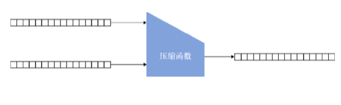

# 深入浅出密码学
## 第二章：哈希函数
-------------------
[幻灯片 1 - 封面]

# 哈希函数
- 基于《深入浅出密码学》第二章
- "让我们一起探索密码学中最基础的原语之一"
- 作者: [您的姓名]
- 日期: [当前日期]

## 引言语
"哈希函数是现代密码学的基石,它像一个神奇的单向函数,将任意信息转化为固定长度的数字指纹"
-------------------

[幻灯片 2 - 导言]

# 本章内容
1. 哈希函数的定义及安全性质
2. 主流哈希函数介绍
3. 其他类型哈希函数探讨

## 学习目标
- 理解哈希函数的基本概念
- 掌握哈希函数的安全特性
- 了解主流哈希函数的应用

## 预备知识
- 基础密码学概念
- 简单的数学知识
- 基本的计算机原理
-------------------

[幻灯片 3 - 哈希函数基础]

# 什么是哈希函数？

## 基本定义
- 接受任意长度输入
- 生成固定长度输出
- 输出称为哈希值或摘要
- 是一个确定性的数学函数

## 实际应用示例
- 文件完整性验证
  * 软件下载校验
  * 数据传输验证
  * 备份完整性检查
- 数字签名
  * 电子合同
  * 软件签名
  * 区块链交易
- 密码存储
  * 用户认证系统
  * 密码管理器
  * 访问控制

## 关键特点
- 相同输入产生相同输出
- 快速计算
- 确定性函数
- 雪崩效应(输入微小变化导致输出显著不同)
- 不可逆性(单向函数)
-------------------

[幻灯片 4 - 哈希函数的安全性质]

# 哈希函数的三大安全特性

## 1. 抗原像性(Pre-image Resistance)
- 给定哈希值h，难以找到消息m使得hash(m) = h
- 保护系统免受伪造攻击
- 数学表示: 给定Y,找X使得H(X)=Y在计算上不可行
- 应用: 密码存储系统

## 2. 抗第二原像性(Second Pre-image Resistance)
- 给定消息m1，难以找到m2≠m1，使得hash(m1) = hash(m2)
- 防止替换攻击
- 数学表示: 给定X1,找X2≠X1使得H(X1)=H(X2)在计算上不可行
- 应用: 数字签名系统

## 3. 抗碰撞性(Collision Resistance)
- 难以找到任意两个不同消息产生相同哈希值
- 最强的安全要求
- 数学表示: 找到任意X1≠X2使得H(X1)=H(X2)在计算上不可行
- 应用: 密码学证明系统

## 安全性层级关系
抗碰撞性 → 抗第二原像性 → 抗原像性
(从左到右安全性要求递减)
-------------------

[幻灯片 5 - 主流哈希函数]

# 常用哈希函数家族

## SHA-2家族
- SHA-256
  * 输出长度: 256位
  * 应用: Bitcoin挖矿
  * 性能: 高效
- SHA-384
  * 输出长度: 384位
  * 应用: 数字证书
  * 安全性: 更高
- SHA-512
  * 输出长度: 512位
  * 应用: 高安全性场景
  * 特点: 最长输出

## SHA-3家族
- 基于海绵结构
  * Keccak算法
  * 抗量子计算攻击
- 更现代的设计
  * 2015年正式标准化
  * 替代SHA-2的后备方案
- NIST新标准
  * 经过5年竞赛选出
  * 全球密码学家参与设计

## BLAKE2
- 高性能哈希函数
  * 比MD5更快
  * 比SHA-3更快
- 适用于现代应用
  * 并行计算优化
  * 支持salt和个性化
-------------------

[幻灯片 6 - 哈希函数应用场景]

# 实际应用场景

## 1. 密码存储
- 存储密码哈希值而非明文
  * 防止密码泄露
  * 保护用户隐私
- 加盐增加安全性
  * 防止彩虹表攻击
  * 增加破解难度
- 防止密码泄露
  * 数据库被盗时保护用户
  * 系统管理员也无法知道原密码

## 2. 数字签名
- 对消息摘要进行签名
  * 提高签名效率
  * 节省存储空间
- 提高签名效率
  * 只需对摘要签名
  * 而非整个文档
- 确保消息完整性
  * 防止篡改
  * 提供不可否认性

## 3. 区块链技术
- 区块链接
  * 形成信任链
  * 防止历史篡改
- 工作量证明
  * 挖矿机制
  * 共识算法
- 交易验证
  * Merkle树结构
  * 快速验证交易
-------------------

[幻灯片 7 - 哈希函数的攻击方式]

# 常见攻击方法

## 1. 暴力攻击(Brute Force Attack)
- 穷举所有可能的输入
  * 尝试所有可能性
  * 计算量随输出长度指数增长
- 计算量巨大
  * 256位输出需要2^256次尝试
  * 当前计算能力无法完成
- 针对短消息有效
  * 输入空间较小时可行
  * 常用于破解简单密码

## 2. 生日攻击(Birthday Attack)
- 基于生日悖论
  * 23人中有两人同一天生日的概率>50%
  * n位哈希值的碰撞概率与2^(n/2)相关
- 寻找碰撞更有效
  * 比暴力攻击效率高
  * 但仍需要大量计算
- 攻击复杂度为2^(n/2)
  * 对于SHA-256需要2^128次计算
  * 仍然难以实现

## 3. 长度扩展攻击(Length Extension Attack)
- 针对特定结构
  * Merkle-Damgård结构易受攻击
  * SHA-3不受影响
- 影响某些MAC构造
  * 需要特殊的构造方法
  * HMAC可以防御此攻击
- 需要特殊防护
  * 使用适当的填充方案
  * 选择合适的构造方法
-------------------

[幻灯片 8 - 最佳实践]

# 哈希函数使用建议

## 选择建议
- 使用标准算法
  * SHA-256/SHA-3
  * BLAKE2
  * 避免MD5/SHA-1
- 选择适当输出长度
  * 至少256位
  * 根据安全需求选择
- 考虑性能需求
  * 权衡安全性和效率
  * 考虑硬件支持情况

## 安全注意事项
- 定期更新算法
  * 跟踪安全公告
  * 及时升级系统
- 避免过时算法
  * 不要使用MD5
  * 避免使用SHA-1
- 关注安全公告
  * NIST建议
  * 学术研究进展

## 实现建议
- 使用成熟库
  * OpenSSL
  * Bouncy Castle
  * 避免自己实现
- 验证输入输出
  * 检查输入合法性
  * 验证输出格式
- 保持代码更新
  * 使用最新版本
  * 修复已知漏洞
-------------------

[幻灯片 9 - 总结]

# 本章小结

## 核心概念
1. 哈希函数基础
   - 单向性
     * 不可逆计算
     * 保护原始数据
   - 确定性
     * 相同输入得到相同输出
     * 可重复验证
   - 高效性
     * 快速计算
     * 适合实时处理

2. 安全特性
   - 抗原像性
     * 保护原始数据
     * 防止逆向推导
   - 抗第二原像性
     * 防止替换攻击
     * 确保唯一性
   - 抗碰撞性
     * 最强安全保证
     * 防止碰撞攻击

3. 实践应用
   - 选择合适算法
     * 考虑安全需求
     * 权衡性能要求
   - 遵循最佳实践
     * 使用标准实现
     * 定期更新维护
   - 持续关注发展
     * 跟踪最新进展
     * 了解行业动态

## 下一步建议
- 深入学习具体算法
  * 理解内部结构
  * 掌握实现细节
- 实践标准应用方案
  * 动手实现示例
  * 理解实际应用
- 关注最新发展动态
  * 跟踪学术进展
  * 了解行业动态
-------------------

[幻灯片 10 - 哈希函数工作原理]

# 哈希函数的工作原理图解

## 基本流程
输入消息 -----> [哈希函数] -----> 固定长度输出
任意长度     (内部处理)        (如256位)

## SHA-256内部结构
输入 -> [预处理] -> [消息扩展] -> [压缩函数] -> [最终输出]
         填充     生成消息块    迭代处理      256位哈希值

## 实际示例
输入: "hello"
SHA-256输出: 2cf24dba5fb0a30e26e83b2ac5b9e29e1b161e5c1fa7425e73043362938b9824

输入: "hello!"  // 仅改变一个字符
SHA-256输出: ce06092fb948d9ffac7d1a376e404b26b7575bcc8a8f48a1d0b843f307c2f9a2
-------------------

[幻灯片 11 - 哈希函数内部结构]

# 哈希函数的内部构造

## Merkle-Damgård结构 (SHA-2使用)
     [消息块1]   [消息块2]   [消息块3]
         ↓          ↓          ↓
IV → [压缩函数] → [压缩函数] → [压缩函数] → 哈希值

## 海绵结构 (SHA-3使用)
吸收阶段:
消息块 → [XOR] → [置换] → [XOR] → [置换] →
挤出阶段:
→ [置换] → 输出1 → [置换] → 输出2 → ...
-------------------

[幻灯片 12 - 实际应用详解]

# 哈希函数在实际中的应用

## 1. 密码存储最佳实践
# 不安全的存储方式
password_hash = sha256(password)

# 安全的存储方式
salt = generate_random_salt()
password_hash = sha256(password + salt)
store_in_database(password_hash, salt)

## 2. 区块链中的应用
Block N         Block N+1
[交易数据]      [交易数据]
[时间戳]   →    [时间戳]
[前块哈希] ←    [当前哈希]
[Nonce]         [Nonce]

## 3. 数字签名流程
文档 → [哈希函数] → 摘要 → [私钥加密] → 签名
-------------------

[幻灯片 13 - 安全性分析]

# 哈希函数的安全性分析

## 生日攻击概率
对于n位输出的哈希函数:
- 暴力攻击复杂度: O(2^n)
- 生日攻击复杂度: O(2^(n/2))

示例(SHA-256):
- 暴力攻击: 2^256 次计算
- 生日攻击: 2^128 次计算

## 常见攻击向量
1. 长度扩展攻击
已知: H(M) 和 len(M)
可以计算: H(M || padding || M')

2. 多重碰撞攻击
寻找多个消息 M1,M2,...,Mk
使得: H(M1) = H(M2) = ... = H(Mk)
-------------------

[幻灯片 14 - 性能对比]

# 主流哈希函数性能对比

## 速度对比 (GB/s, 在现代CPU上)
BLAKE2b    : 3.08 GB/s
SHA-256    : 1.42 GB/s
SHA-3-256  : 0.71 GB/s

## 输出长度对比
SHA-256    : 256位固定输出
SHA-512    : 512位固定输出
SHAKE128   : 可变长度输出
SHAKE256   : 可变长度输出

## 安全性对比
SHA-2: 
- 经典设计
- 受长度扩展攻击影响
- 广泛使用

SHA-3:
- 现代设计
- 抵抗长度扩展攻击
- 更高安全性
------------------- 