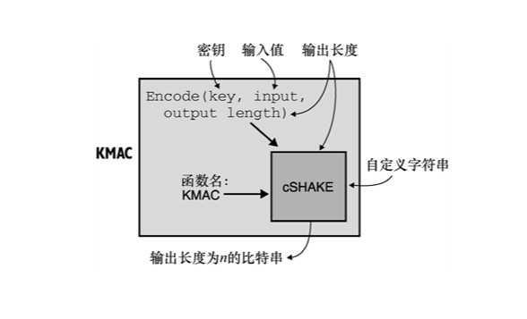
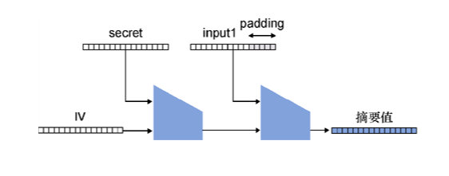

第 3 章　消息认证码
本章内容：
● 消息认证码；
● 消息认证码的安全特性与隐患；
● 广泛应用的消息认证码标准。
如果把第 2 章学习的哈希函数和密钥结合起来，我们将得到一个新的保护数据完整性的密码学原语——消息认证码（Message Authentication Code，MAC）。密钥是安全的基础：没有密钥就无法保证机密性，也无法实现认证性。虽然哈希函数可以为任意数据提供认证性或完整性，但它需要依赖于一个不可篡改的可信信道。在本章中，我们将了解使用消息认证码算法创建可信信道的方法，以及消息认证码算法的其他功能。
注意：
在阅读本章之前，需要先阅读第 2 章「哈希函数」。
++3.1　无状态 cookie——一个引入 MAC 的范例
让我们想象以下场景：你是一个网页，服务的对象都是诚实的社区用户。访问者与你进行交互时，首先必须向你提交他们的登录凭据，然后你对这些凭据进行验证。如果凭据与用户首次注册时使用的凭据匹配，则表示你已成功认证该用户。
当然，用户浏览网页时往往由多个请求组成，为了避免用户在每个请求中重新验证，你可以让他们的浏览器存储用户凭据，并在每个请求中自动重新发送凭据。浏览器有一个专门的功能叫作 cookie，就可以用于实现上述功能！cookie 不仅可以用作用户凭据，还可以存储任何你希望用户在每个请求中发送的内容。利用 cookie 登录网站的过程如图 3.1 所示。
虽然这种简单的方法效果很好，但通常人们不希望将敏感信息（如用户密码）以明文形式存储在浏览器中。因此，会话 cookie 一般会携带一个用户登录时随机生成的字符串，Web 服务器会将这个随机字符串和用户名对应起来并存到一个临时数据库中。这样一来，哪怕浏览器以某种方式公开会话，cookie 也不会泄露用户密码的任何信息（该随机字符串依然可以用来模拟用户）。此外，Web 服务器还可以通过删除本端的 cookie 来终止会话。

图 3.1　用户首次登录网站后可以获取一个 cookie，之后再登录网站时，只需要出示 cookie 即可登录网站
这种方法看似没有问题，但在某些情况下，它可能无法很好地扩展。比如，在有许多服务器的情况下，让所有服务器共享用户与随机字符串之间的关联可能会很烦琐。为了解决这个难题，可以让浏览器端存储更多信息。让我们看看应该怎么做。
简单来讲，就是在 cookie 中直接存储用户名，而不是存储与用户相关的随机字符串，但这使得任何用户都可以通过手动修改 cookie 中的用户名来模拟其他用户。也许第 2 章学到的哈希函数可以帮助我们解决这个问题，不如用几分钟时间来思考一下哈希函数是如何防止用户篡改自己的 cookie 的呢？
对上述方法做一些改进，我们不仅在 cookie 中存储用户名，还存储用户的哈希值。我们可以使用类似 SHA-3 的哈希函数计算用户名的哈希值，如图 3.2 所示。这样的方式可行吗？

图 3.2　为了验证用户对浏览器的请求，Web 服务器要求浏览器在 cookie 中存储 用户名及其对应的哈希值，用户将在后续的每个请求中发送该 cookie
上述方法存在一个严重的问题。哈希函数是一种公开算法，恶意用户可以计算新用户名的哈希值，所以用户名的哈希值也变得不可信。如果哈希值的来源变得不可信，那么它也就无法确保数据的完整性！如果恶意用户试图修改其 cookie 中的用户名，他们只需要重新计算新用户名的哈希值，并替代 cookie 中原来的哈希值就会使修改后的 cookie 变得合法，如图 3.3 所示。

图 3.3　恶意用户可以修改 cookie 中的信息。若 cookie 中仅包含用户名及用户名的哈希值， 则可以通过修改这些信息来模拟不同的用户
不过，这并不能说明使用哈希值进行验证的做法是错误的。那我们还能在这个基础上再做些什么呢？事实上，消息认证码这个密码学原语可以满足我们的要求，它的概念与哈希函数很类似。消息认证码算法属于一种密钥算法（或对称密码原语），它与哈希函数的相同之处在于将消息作为输入，不同之处在于消息认证码算法还需要输入密钥（思考为什么要用密钥），最后算法会输出一个唯一的认证标签。这个算法是确定性的，即给定相同的密钥和消息，将产生相同的认证标签。该过程的描述如图 3.4 所示。

图 3.4　消息认证码算法的接口。该算法输入密钥和消息，并输出一个唯一的认证标签。 如果没有密钥，就不可能生成该认证标签
为了确保用户的 cookie 不被随意更改，我们可以使用上面提到的密码学原语。当用户第一次登录网站时，网站根据密钥和用户名生成一个认证标签，并让用户将用户名和认证标签存储在 cookie 中。由于不知道密钥，所以用户无法伪造其他用户名的有效认证标签。
我们可以执行相同的操作来验证用户的 cookie。首先，根据密钥和 cookie 中的用户名生成认证标签；然后，判断所生成的认证标签是否与 cookie 中该用户名对应的认证标签相同。如果两者相同，则表明 cookie 中的认证标签是由我们生成的。这是因为只有我们才能生成合法的认证标签。整个过程如图 3.5 所示。

图 3.5　恶意用户试图篡改其 cookie，但无法为新 cookie 生成有效的认证标签。随后，由于 cookie 的真实性和完整性无法通过 Web 服务器的验证，请求被丢弃
消息认证码算法就像一个私有的哈希函数，只有拥有密钥的人才能计算该消息在该密钥下对应的哈希值。从某种意义上说，使用密钥相当于对哈希函数进行个性化设置，但消息认证码算法与哈希函数的关系并不止于此，大多数消息认证码算法都是基于哈希函数构造的。接下来，让我们看一个具体的代码示例。
++3.2　一个代码示例
到目前为止，在上述场景中，我们能够使用的只有消息认证码算法。接下来我们增加访问服务器的用户数量，并在此基础之上通过编写代码来了解 MAC 算法在实践中的使用方法。想象这样一个场景，我们想和别人交流，但并不在乎别人是否读过我们的消息，我们真正关心的是消息的完整性：消息不能被篡改！一个解决方案是让我们与通信的用户使用相同的密钥来计算消息的 MAC，从而保护通信过程中消息的完整性。
在本例中，我们将使用由 Rust 语言编写的、基于哈希函数的 HMAC 算法来演示消息认证码算法的使用方法。HMAC 算法的核心是哈希函数，它可以与不同的哈希函数兼容，但在实践中，它常用的哈希函数是 SHA-2。发送方只需输入密钥和消息，最后算法就会输出认证标签，如代码清单 3.1 所示。
代码清单 3.1　用 Rust 语言演示发送经过认证的消息
use sha2::Sha256；
use hmac::{Hmac， Mac， NewMac}；
　
fn send_message（key: &[u8], message: &[u8]） -> Vec<u8> {
    let mut mac = Hmac::<Sha256>::new（key.into()）；    ←---　使用密钥和 SHA-256 来实例化 HMAC 算法 
　
    mac.update（message）；    ←---　为 HMAC 算法的输入提供更多缓冲空间 
　
    mac.finalize().into_bytes().to_vec()    ←---　返回认证标签 
}
对于接收方，它所做的与发送方类似。在收到消息及其认证标签后，接收方可以使用相同的密钥对消息生成自己的认证标签，然后，判断接收到的认证标签是否与自己计算的认证标签相同。与对称加密类似，双方需要共享相同的密钥才能判断消息是否被篡改。该过程如代码清单 3.2 所示。
代码清单 3.2　用 Rust 语言演示接收经过认证的消息
use sha2::Sha256；
use hmac::{Hmac， Mac， NewMac}；
　
fn receive_message（key: &[u8], message: &[u8],
  authentication_tag: &[u8]） -> bool {
    let mut mac = Hmac::<Sha256>::new（key）；    ←---　接收者使用密钥和消息重构认证标签 
    mac.update（message）；    ←---　检查重构的认证标签与接收到的认证标签是否相同 
　
    mac.verify（&authentication_tag）.is_ok()
}
值得注意的是，这个协议并不完美：它可能会遭受重放攻击。也就是说，如果随后重新发送该消息及其认证标签，那么消息仍然能够通过验证，该协议无法判断该消息是否是已接收的旧消息。在本章后面，我们将学习解决该问题的一个方法。到目前为止，我们已经知道 MAC 算法的用途，3.3 节我们讨论消息认证码算法的一些缺陷。
++3.3　MAC 的安全属性
与所有密码学原语一样，消息认证码算法自身也有缺点。在我们进行更深入的学习之前，有必要对消息认证码算法提供的安全属性及其正确使用方法进行解释。本节内容如下：
● 消息认证码算法可以防止伪造认证标签；
● 认证标签长度不应该小于 128 比特，避免出现认证标签碰撞和伪造的问题；
● 如果只是使用消息认证码对消息进行简单的认证，那么无法检测重放的消息；
● 认证标签在验证过程中容易遭到攻击。3.3.1　伪造认证标签
一般来讲，消息认证码算法的安全目标是防止攻击者伪造认证标签。这意味着在不知道密钥k的情况下，用户无法计算消息m的认证标签t=MAC(k,m)。因为如果缺少参数，就无法计算函数的正确结果。
不过，消息认证码算法提供的安全保障远不止这些。实际应用中攻击者可以拥有某些消息及其认证标签。图 3.1 正展示了这样的场景，用户只要使用合法的用户名注册就可以获得几乎任意的认证标签。因此，即便面对拥有某些消息及其认证标签的攻击者，消息认证码算法也必须是安全的。为了确保消息认证码算法的安全性，消息认证码算法通常需要证明即使攻击者拥有大量消息及其认证标签，也无法伪造新消息对应的认证标签。
注意：
也许有人会疑惑，为何要证明这样一个极端情况下的性质呢？如果攻击者可以直接请求任意消息的认证标签，那么还需要消息认证码算法来保护什么呢？但这就是密码学中安全性证明的工作原理：我们假设攻击者有强大的计算能力，并证明即便如此攻击者也不可能攻破算法。而在实际应用中，攻击者通常是较弱的，因此我们相信如果一个强大的攻击者都无法攻破算法，那么一个较弱的攻击者就更不可能做到了。
因此，只要消息认证码算法使用的密钥是保密的，就可以防止认证标签伪造。这就意味着密钥必须足够随机（第 8 章对此有更详细的说明）并且足够长（通常为 16 字节）。此外，第 2 章提到的模糊攻击也同样适用于攻击消息认证算法。如果想要计算某种结构体的认证标签，需要在使用消息认证码算法之前将其序列化；否则，敌手也许可以轻而易举伪造认证标签。3.3.2　认证标签的长度
另一种针对消息认证码算法的攻击是碰撞。哈希函数的碰撞定义为：当两个不同的输入 X和Y满足 HASH(X) = HASH(Y)时，则称X和Y发生了哈希碰撞。那么我们可以将该定义扩展到消息认证码算法的碰撞，将其定义为：当两个不同的输入X和Y满足 MAC(k,X) = MAC(k,Y)时，则称X和Y发生了哈希碰撞。
正如第 2 章提及的生日界限，如果消息认证码算法输出的长度很小，就有很高的概率发现碰撞。以消息认证码算法为例，如果攻击者访问一个产生 64 比特认证标签的网站，那么他只需要进行少量（232相比 264是少量）的请求就可以有很大的概率发现碰撞。虽然上述示例的碰撞在实际应用中很少出现，但在某些场景中，抗碰撞的性质至关重要。因此，我们需要规定认证标签的长度来限制碰撞攻击。一般来讲，我们会使用 128 比特认证标签，因为它们保证了足够的抗碰撞性。
在保持 1Gbit/s 的链路上请求 264个认证标签需要 250000 年，并且在此期间还不能更改密钥k。
——RFC 2014（“HMAC: Keyed-Hashing for Message Authentication”，1997）
只使用 128 比特的认证标签看似有违直觉，因为我们对哈希函数的输出要求是 256 比特。但别忘了哈希函数是可以离线计算的公开算法，攻击者自己就可以产生大量的消息及其对应的哈希值，这使得攻击者能在很大程度上对攻击进行优化和并行化。而使用消息认证码算法这类带密钥的算法，攻击者在离线的情况下无法有效地优化攻击方式，只能直接向服务器请求认证标签，这就使攻击速度大大降低。128 比特的认证标签需要攻击者进行 264次在线请求才有 50% 的机会发现碰撞，而我们认为 264次询问的开销已经足够大。尽管如此，人们仍然希望将认证标签增加到 256 比特，当然这也是有可能实现的。3.3.3　重放攻击
针对消息认证码算法还有一种攻击是重放攻击。让我们来看一个容易受到重放攻击的场景，想象一下，Alice 和 Bob 要在不安全的信道进行公开通信。为了确保消息不被篡改，他们在每个消息后面都附加了一个认证标签。具体来说，他们各自使用两个不同的密钥来确保自己发送的消息的完整性。具体说明如图 3.6 所示。

图 3.6　两个用户共享两个密钥 k1 和 k2，双方通信时都会在消息后附带一个认证标签。这些标签根据消息传递的方向由密钥 k1 或者 k2 计算。攻击者会将用户通信中的某个消息重新发送给用户
在上述场景中，只要攻击者将之前的某个消息重新发送给其接收者，就可以成功欺骗接收者，因为这个消息一定能通过验证。所以使用消息认证码算法的协议必须考虑到重放攻击，并对此类攻击进行防御。一种解决方法是在消息认证码算法的输入中增加递增计数器的值，如图 3.7 所示。

图 3.7　两个用户共享两个密钥 k1 和 k2，双方通信时都会在消息后附带一个认证标签。这些认证标签根据消息传递的方向由密钥 k1 或者 k2 计算。恶意的观察者会将用户通信中的某个消息重放给用户。但由于用户会让计数器的值加 1，此时应该计算「2, Fine, and you？」这一消息的认证标签，这与攻击者发送的认证标签不相同，因此用户可以成功拒绝重放的消息
当然，如果共享密钥频繁轮换（意味着在发送 X 条消息后，通信参与者同意使用新的共享密钥），则可以选择长度更短的计数器，并在每次密钥轮换后将计数器的值置为 0。（当数值相同时，使用两个不同的密钥计算认证标签是合法的。）此外，为避免二义性攻击，计数器的值的长度应该是固定不变的。
习题
为什么可变长度计数器让攻击者更容易伪造认证标签？3.3.4　在固定时间内验证认证标签
最后一种攻击非常重要，因为在审核一些安全类应用程序时，我多次发现这种漏洞。验证认证标签时，比较接收的认证标签与计算所得的认证标签必须在恒定时间内完成。这意味着，只要接收到的数据大小正确，无论两个标签相同与否，比较操作花费的时间都是恒定的。如果两次比较认证标签所需的时间不一样，可能是因为在每次比较中两个标签开始产生差异的位置不同，从而导致算法返回的时间不同。这就给攻击者提供足够的信息，使他能够通过服务器响应的时间推断伪造的认证标签首次出现错误的位置，从而逐字节地重新构造有效的认证标签。我们称这些类型的攻击为时序攻击（Timing Attack）。
图 3.8 所示的漫画对这种攻击进行详细解释。
幸运的是，实现消息认证码算法的密码库也提供了可以在恒定时间内验证认证标签的函数。代码清单 3.3 是用 Go 语言实现在恒定时间内完成认证标签的比较代码示例。
代码清单 3.3　用 Go 语言实现在恒定时间内完成认证标签的比较
for i := 0;i < len(x); i++ {
    v |= x[i] ^ y[i]
}
实现在恒定时间内比较认证标签的诀窍是永远不出现分支。具体的实现方法留给读者作为练习。
++3.4　现实世界中的 MAC
现在，我们已经知道 MAC 的定义及其提供的安全属性，接下来看看在现实世界中使用 MAC 的方法。3.4.1　消息认证码
许多场景都会使用 MAC 来确保两台机器或两个用户之间的消息完整性。确保消息完整性在明文通信和加密通信两种情况下都是必要的。此前我们已经了解过明文通信时使用 MAC 来确保消息完整性的方法，而在第 4 章中，我们将了解加密通信时使用 MAC 确保消息完整性的方法。

图 3.8　给定一个消息，敌手将逐字节地猜测对应的消息认证码，通过收到响应的时间判断当前字节是否猜测正确，从而逐字节地构造一个正确的消息认证码3.4.2　密钥派生
消息认证码算法是一种生成一些看似随机的字节（就像哈希函数一样）的算法。利用这种属性，我们可以用一个密钥来生成看似随机的数字或更多密钥。在第 8 章中，我们将学习基于 HMAC 的密钥派生函数（HKDF），它使用 HMAC 实现密钥派生，其中 HMAC 是我们将在本章中讨论的消息认证码算法之一。
伪随机函数
想象一下我们拥有这样一个集合，它包含所有以可变长度数据为输入并输出固定大小随机数的函数。如果我们可以从这个集合中随机选取一个函数，并将其用作消息认证码函数（没有密钥），那么它将是非常强大的消息认证码算法。通信参与者只需要在函数选择上达成一致（有点儿像在密钥选择上达成一致）。不过很遗憾，我们无法拥有这样一个庞大的集合，但我们可以设计非常接近它的构造来模拟选择随机函数的过程，我们称这种构造为伪随机函数（Pseudo Random Function，PRF）。HMAC 算法和大部分实用的 MAC 算法就是这样的构造。与真随机函数不同，伪随机函数通过随机选择一个密钥来实现随机化，选择不同的密钥就像选择了一个随机函数。
习题
并非所有的消息认证码算法都是 PRF。请思考为什么？3.4.3　cookie 的完整性
正如本章开始时介绍的示例，如果服务器想要跟踪用户的浏览器会话，只需要给每个用户发送一个与他们的元数据（例如用户名）相关联的随机字符串或直接发送元数据，并附上认证标签就可以确保用户无法修改 cookie。3.4.4　哈希表
编程语言通常会公开一种被称为哈希表（也称为哈希映射、字典、关联数组等）的数据结构，它使用非密码学哈希函数将输入映射到哈希表中的数据。如果服务器公开这种数据结构时允许攻击者控制非密码学哈希函数的输入，则可能导致拒绝服务（Denial of Service，DoS）攻击，这意味着攻击者使服务器无法为用户提供正常服务。为了避免这种情况，非密码学哈希函数通常在程序开始时就进行随机化。
许多应用程序都使用带有随机密钥的消息认证码算法代替非密码学哈希函数。许多编程语言（如 Rust、Python 和 Ruby）或主流应用程序（如 Linux 内核）都使用了 SipHash，并在程序开始时生成了一个随机密钥。其中，SipHash 并不是一个哈希函数，而是一个消息认证码算法，它是一种优化的短认证标签的消息认证码算法。
++3.5　实际应用中的消息认证码
我们已经知道消息认证码算法是在一方或多方通信中用来保护信息的完整性和真实性的密码算法。而由于主流的消息认证码算法还表现出良好的随机性，因此它还经常在其他算法（例如，第 11 章中基于时间的一次性密码[TOTP]算法）中用来生成随机数。在本节中，我们将研究两种标准化消息认证码算法——HMAC 和 KMAC。3.5.1　HMAC——一个基于哈希函数的消息认证码算法
HMAC 算法（基于哈希的消息认证码算法）是使用最广泛的消息认证码算法，它由 M.Bellare、R.Canetti 和 H.Krawczyk 于 1996 年提出，并包含在 RFC 2104、FIPS Publication 198 和 ANSI X9.71 标准文档中。HMAC，顾名思义，是一种将密钥与哈希函数结合使用的算法。利用哈希函数来构建消息认证码算法是一种流行的做法，因为哈希函数拥有如下优点：存在被广泛接受的实现方式、在软件上运行速度快、大多数系统硬件都支持。我们在第 2 章中学到由于长度扩展攻击，SHA-2 不能被直接用来计算秘密消息的哈希值（本章末尾将详细介绍）。那么如何将哈希函数转换为密钥算法呢？这正是 HMAC 为我们解决的问题。HAMC 算法在底层的运行步骤如图 3.9 所示。

图 3.9　HMAC 算法的工作原理是将密钥 k1 和待认证消息串联（|| 表示串联）并计算哈希值，然后将密钥 k2 与前一步骤的输出串联并计算哈希值。其中 k1 和 k2 都是从秘密密钥 k 派生而来的
（1）由主密钥生成两个密钥：，。其中 ipad（内部填充）以及 opad（外部填充）是常量，表示异或操作。
（2）将密钥 k1 和 message（待认证消息）串联在一起，计算串联结果的哈希值。
（3）将密钥 k2 与第（2）步的输出串联在一起后，再次计算串联结果的哈希值。
（4）将第（3）步输出的哈希值作为最终的认证标签。
HMAC 算法允许定制所使用的哈希函数，因此其认证标签的大小由算法使用的哈希函数决定。例如，HMAC-SHA256 使用 SHA-256 函数产生 256 位的认证标签，而 HMAC-SHA512 算法产生 512 位的认证标签。
注意：
虽然截断 HMAC 算法的输出可以减小认证标签的长度，但正如我们之前所讨论的，认证标签应至少为 128 比特。但现实中并不总是遵守这个限制，而且由于显式查询可以限制查询次数，某些应用程序甚至将认证标签的位数降低至 64 比特。这种方法关注的是对安全与效率的权衡。不过必须再次强调的是，在做一些不符合标准的操作之前必须注重细枝末节处对安全性的影响。
以上述方式构造的 HMAC 算法很容易证明其安全性。一些论文证明了只要底层的哈希函数具有某些良好的属性，HMAC 算法就是安全的，而这些良好的属性是所有在密码学上安全的哈希函数都应拥有的。因此，我们可以将 HMAC 算法与许多哈希函数结合使用。不过，目前 HMAC 算法主要与 SHA-2 函数结合使用。3.5.2　KMAC——基于 cSHAKE 的消息认证码算法
由于 SHA-3 不易遭受长度扩展攻击（这是 SHA-3 竞赛中的要求），所以使用 SHA-3 来构造 HMAC 算法还不如直接使用 SHA-3-256（key||message）。而这正是 KMAC 算法的做法。
KMAC 算法使用了 cSHAKE 来构造消息认证码算法，其中的 cSHAKE 是第 2 章介绍的 SHAKE 可扩展输出函数的自定义版本。KMAC 算法对密钥、输入以及输出的长度（KMAC 算法是某种输出可扩展的消息认证码算法）进行编码，并将其作为 cSHAKE 的输入（见图 3.10）。KMAC 算法可以使用「KMAC」作为函数名（用于自定义 cSHAKE），也可以使用用户自定义的字符串作为函数名。

图 3.10　KMAC 算法只是 cSHAKE 函数的包装器。为了使用密钥，KMAC 算法将密钥、输入以及输出长度进行编码并作为 cSHAKE 的输入
有趣的是，由于 KMAC 算法还把输出的长度作为输入的一部分，因此调用 KMAC 算法时输入不同输出长度会产生完全不同的结果，这在一般可扩展输出函数中很少出现，也使得 KMAC 算法在实践中可以提供更多的功能。
++3.6　SHA-2 和长度扩展攻击
此前我们反复强调，由于 SHA-2 不能够抵抗长度扩展攻击，因此不应直接使用 SHA-2 计算秘密消息的哈希值。在本节中，我们将简单地介绍长度扩展攻击的过程。
让我们回到本章开始时引入的场景，那时我们试图只使用 SHA-2 来保护 cookie 的完整性。但这样做是不够安全的，因为 SHA-2 是一个公开的函数，我们无法阻止用户的行为，所以用户就可以随意篡改 cookie（例如，通过添加 admin = true 字段），只需要重新计算 cookie 的哈希值，就可以使得伪造的 cookie 通过验证。长度扩展攻击的过程如图 3.11 所示。
我们首先尝试计算密钥与 cookie 串联后的哈希值。这样一来，哈希值的计算就需要用到密钥，那么没有密钥的用户就无法重新计算哈希值，这就像消息认证码算法一样。收到篡改的 cookie 后，Web 服务器计算 SHA-256（key||tamperedcookie），并且通过比较发现重新计算的哈希值与恶意用户提交的哈希值不相等，于是 Web 服务器丢弃这个请求。该过程如图 3.12 所示。

图 3.11　Web 服务器向用户发送一个 cookie，后面加上 cookie 的哈希值。此后每个请求中用户都需要发送 cookie，以便 Web 服务器对自己进行认证。糟糕的是，恶意用户可以篡改 cookie 并重新计算其哈希值，导致伪造的 cookie 也能通过完整性验证，让 Web 服务器接收伪造的 cookie

图 3.12　通过计算 key||cookie 的哈希值，使得想要篡改 cookie 的恶意用户无法计算新 cookie 的正确哈希值。但对 SHA-256 而言这个结论并不成立
遗憾的是，SHA-2 有一个缺点：如果拥有一个消息的哈希值，就可以计算更多由该消息扩展的消息的哈希值。如图 3.13 所示，图中 SHA-256 哈希函数表示为 SHA-256（secret||input1）。

图 3.13 所示的过程将 input1 的内容简化为只有字符串「user = bob」。需要注意的是，此时获得的哈希值实际上也可以当作哈希函数的中间状态。因为我们可以认为填充（图中表示为 padding）的内容也是输入的一部分，从而继续使用 Merkle-Damgård 结构进行迭代计算。在长度扩展攻击中，攻击者利用图 3.13 输出的摘要以及 input2 可以计算 input1||padding||input2 的哈希值，攻击的演示过程如图 3.14 所示。在示例中，input2 表示输入内容为「&admin = true」。
图 3.13　SHA-256 计算 cookie（此处命名为 input1）和秘密值（此处命名为 secret）串联的哈希值。请记住，SHA-256 采用 Merkle-Damgård 结构，从初始化向量（Initialization Vector, IV）开始迭代地调用压缩函数，每次压缩函数的输出作为下一次输入的一部分。其中 Padding 表示填充数据

图 3.14　已知原 cookie 的 SHA-256 哈希值（中间哈希值），就可以计算中间哈希值与 input2 串联的哈希值，最后得到的哈希值是 secret||input1||padding||input2 的合法哈希值，即该哈希值与消息 input1||padding||input2 可以通过验证
此漏洞使得敌手可以将已有的哈希值当作运算的中间结果并继续进行哈希运算，就像运算尚未完成一样。这就破坏了我们之前的协议，如图 3.15 所示。

图 3.15　一个攻击者利用原 cookie 的哈希值计算出伪造的 cookie 的正确哈希值，成功地使用长度扩展攻击篡改自己的 cookie
为了避免这种攻击，padding 部分也必须成为输入的一部分，这意味着验证方需要检查输入的格式以确保它们是有意义的数据，这就限制了某些协议的使用。但由于微小的更改也可能会重新引入漏洞，协议也就不能轻易改变，因此我们认为永远不要直接用 SHA-2 计算秘密消息的哈希值。当然，HMAC 算法还提供了其他可行的方法（例如，SHA-256（k||message||k））。如果想使用 SHA-2 函数，可以将它与 HMAC 算法结合使用；如果更喜欢使用 SHA-3 函数，可以将其与 KMAC 算法结合使用。
++3.7　本章小结
● 消息认证码算法是对称密码算法，它允许共享同一密钥的一方或多方验证消息的完整性和真实性。
❏ 验证消息及其认证标签的真实性时，需要利用共享密钥重新计算消息的认证标签，然后对重新计算的认证标签以及接收到的认证标签进行比较。如果它们不一致，则说明消息已被篡改。
❏ 始终用恒定时间完成两个认证标签的比较。
● 默认情况下，消息认证码算法会保护消息的完整性，但不会检测它是否属于重放的消息。
● HMAC 和 KMAC 是两个已标准化且广泛应用的消息认证码算法。
● HMAC 算法可以与不同的哈希函数一起使用。不过实际应用中，HMAC 算法通常与 SHA-2 哈希函数结合使用。
● 为了防止碰撞和伪造的发生，认证标签的长度应该至少是 128 比特。
● 不要直接使用 SHA-256 算法来构造消息认证码算法，这会带来一些风险，要使用类似 HMAC 的结构来构造消息认证码算法。
