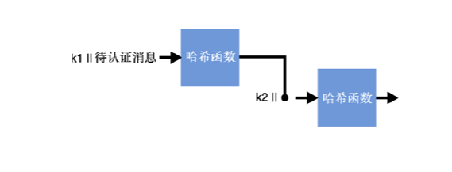
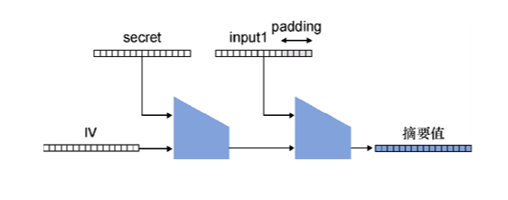
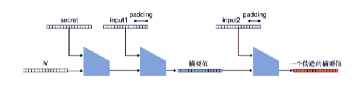

# 深入浅出密码学
## 第三章：消息认证码
-------------------
[幻灯片 1 - 封面]

# 消息认证码(MAC)
- 基于《深入浅出密码学》第三章
- "让我们探索如何确保消息的完整性和真实性"
- 作者: [您的姓名]
- 日期: [当前日期]

## 引言语
"消息认证码是密码学中保护数据完整性的基石，它将哈希函数和密钥巧妙结合，为通信提供可靠的认证机制"
-------------------

[幻灯片 2 - 导言]

# 本章内容
1. 消息认证码的定义与应用
2. MAC的安全特性与隐患
3. 主流MAC算法介绍

## 学习目标
- 理解MAC的基本概念和用途
- 掌握MAC的安全属性
- 了解MAC的实际应用场景

## 预备知识
- 哈希函数基础(第2章)
- 基本密码学概念
- 简单的协议设计思想
-------------------

[幻灯片 3 - MAC基础概念]

# 什么是消息认证码？

## 基本定义
- 带密钥的哈希函数
- 接受消息和密钥作为输入
- 生成固定长度的认证标签
- 确保消息完整性和真实性

## 核心特点
- 确定性：相同输入产生相同输出
- 高效性：快速计算认证标签
- 密钥依赖：需要密钥才能生成/验证
- 不可伪造：无密钥无法生成有效标签

## 基本工作流程
消息 + 密钥 → [MAC算法] → 认证标签
验证：比较新生成标签和接收到的标签
-------------------

[幻灯片 4 - 实际应用示例]

# MAC的典型应用场景

## 1. Cookie认证
- 防止用户篡改Cookie
  * 存储用户身份信息
  * 添加MAC保护完整性
  * 服务器验证真实性
- 无状态会话管理
  * 减少服务器存储负担
  * 提高系统扩展性
  * 简化分布式部署

## 2. 消息完整性保护
- 通信消息认证
  * 检测消息篡改
  * 验证发送者身份
  * 确保端到端完整性
- 应用场景
  * 安全通信协议
  * 电子支付系统
  * 数字签名辅助

## 3. 密钥派生
- HKDF应用
  * 扩展密钥材料
  * 生成会话密钥
  * 派生子密钥
- 安全考虑
  * 熵损失最小化
  * 密钥隔离保证
  * 前向安全性
-------------------

[幻灯片 5 - MAC的安全特性]

# MAC的安全属性

## 1. 抗伪造性
- 无密钥无法生成有效标签
  * 防止消息篡改
  * 确保来源可信
  * 密钥保密性要求

## 2. 认证标签长度
- 最小128位推荐
  * 防止碰撞攻击
  * 抵抗生日攻击
  * 安全性权衡

## 3. 重放攻击防护
- 计数器机制
  * 递增序列号
  * 时间戳验证
  * 防止消息重放

## 4. 时序攻击防护
- 恒定时间比较
  * 避免时间泄露
  * 防止侧信道攻击
  * 安全实现要求
-------------------

[幻灯片 6 - 主流MAC算法]

# 标准MAC算法详解

## 1. HMAC
- 结构特点
  * 基于哈希函数
  * 双重哈希处理
  * 密钥派生机制
- 安全性分析
  * 依赖哈希函数安全性
  * 抵抗长度扩展攻击
  * 广泛密码学分析

## 2. KMAC
- 技术特点
  * 基于SHA-3
  * 可变长度输出
  * 简化的构造
- 优势
  * 现代化设计
  * 性能优化
  * 灵活性高

## 3. SipHash
- 设计目标
  * 高性能实现
  * 短消息优化
  * DoS攻击防护
- 应用场景
  * 编程语言哈希表
  * 高性能系统
  * 网络协议
-------------------

[幻灯片 7 - MAC的内部结构]

# MAC算法内部构造

## HMAC结构

1. 密钥处理:
   k1 = key ⊕ ipad
   k2 = key ⊕ opad

2. 双重哈希:
   hash1 = H(k1 || message)
   tag = H(k2 || hash1)

## KMAC结构

1. 输入编码:
   encoded = encode(key || message || length)

2. 单次处理:
   tag = cSHAKE(encoded)

## 安全性比较
- HMAC
  * 经典设计
  * 广泛验证
  * 成熟可靠
- KMAC
  * 新型设计
  * 理论优势
  * 待更多验证
-------------------

[幻灯片 8 - 实现注意事项]

# MAC使用建议

## 密钥管理
- 密钥长度要求
  * 至少128位
  * 随机生成
  * 定期更新
- 存储保护
  * 安全存储
  * 访问控制
  * 备份机制

## 认证标签处理
- 验证过程
  * 恒定时间比较
  * 完整性验证
  * 长度检查
- 错误处理
  * 统一错误消息
  * 避免信息泄露
  * 日志记录

## 协议设计
- 安全机制
  * 防重放设计
  * 时序攻击防护
  * 密钥更新机制
- 实现建议
  * 使用标准库
  * 避免自定义
  * 代码审计
-------------------

[幻灯片 9 - 总结]

# 本章小结

## 核心概念
1. MAC基础
   * 密钥依赖性
   * 完整性保护
   * 认证机制

2. 安全特性
   * 抗伪造性
   * 防重放机制
   * 时序攻击防护

3. 实践应用
   * Cookie保护
   * 消息认证
   * 密钥派生

## 最佳实践
- 算法选择
  * 使用标准算法
  * 合适的参数
  * 正确的实现
- 安全考虑
  * 密钥管理
  * 攻击防护
  * 更新机制

## 下一步建议
- 深入学习
  * 具体算法细节
  * 安全性分析
  * 实现技巧
- 实践应用
  * 编写示例代码
  * 测试验证
  * 性能优化
-------------------