第 4 章　认证加密
本章内容：
● 对称加密 vs.认证加密；
● 主流的认证加密算法；
● 其他类型对称加密。
机密性是指向无权访问数据者隐藏真实数据，而加密可以实现这一目标。发明密码学的初衷就是加密，加密也是早期的密码学家最关心的技术，他们经常会问自己：「如何才能向观察者隐藏我们的对话内容？」虽然科学和一些先进技术最初是在闭门造车的情况下发展起来的，而且只能惠及政府及其军队，但是现在科学的大门已向全世界的研究者们开放。如今，为了增加隐私性和安全性，加密技术几乎应用到现代生活的各个方面。在本章中，我们将了解加密的本质、加密能解决的问题，以及在现代应用中大量使用加密原语的原因。
注意：
在阅读本章内容前，请先阅读第 3 章关于消息认证码的内容。
++4.1　密码的定义
密码就像我们用俚语和兄弟姐妹谈论放学后要做什么，而我们的妈妈不知道我们说的是什么。
——Natanael L.（2020）
想象这样一个场景：Alice 和 Bob 想要秘密地交换一些信息。在现实中，他们两个有许多媒介（邮件、电话、互联网等）可以使用，但是在默认情况下，这些媒介都是不安全的。邮递员可以随意打开他们的信件；电信运营商可以监听他们的电话和短信；网络服务提供商、Alice 和 Bob 之间的任何服务器都可以获得他们在网上交换的数据包。
不必过多解释，让我们赶快认识一下 Alice 和 Bob 的「好帮手」：加密算法（也称为密码）。现在，让我们把这个新算法想象成一个黑匣子，Alice 可以用它加密发送给 Bob 的消息。通过加密消息，Alice 将消息转换成看起来随机的数字序列。加密算法的输入如下。
● 密钥（Secret Key）——加密算法的安全性直接依赖于密钥的保密性，因此密钥应该具备不可预测性和随机性，并且要受到良好的保护。第 8 章将会对保密性和随机性做更深入的讨论。
● 明文（Plaintext）——明文是指待加密的消息。明文可以是文本、图片和视频，还可以是任何能够转换成比特串的数据。
明文加密完成后会产生密文（Ciphertext）。Alice 可以使用前面提到的方式将该密文安全地发送给 Bob。对于任何不知道密钥的人来说，密文看起来是随机的，并且不会泄露有关明文的任何信息。Bob 收到密文后，利用解密算法从密文中恢复出原始明文，解密算法的输入如下。
● 密钥——该密钥与 Alice 加密明文时使用的密钥一样。正是由于加密算法和解密算法使用完全相同的密钥，我们才称这样的密钥为对称密钥（Symmetric Secret Key）。这也是我们把这样的加密方式称为对称加密的原因。
● 密文——从 Alice 接收到的已加密消息。
解密过程会恢复出已加密的原始消息，加密和解密的完整过程如图 4.1 所示。
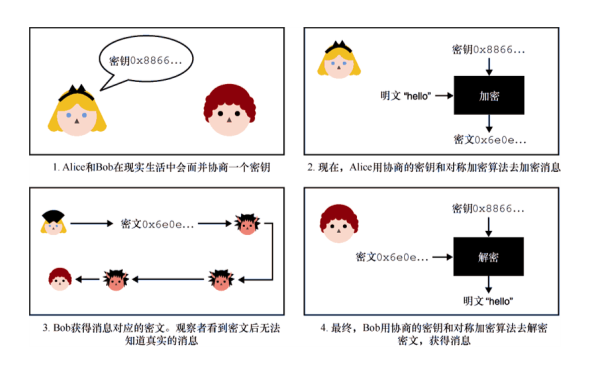
图 4.1　Alice 用密钥 0x8866…（十六进制简写）加密明文「hello」（右上图）。然后，Alice 把密文发给 Bob。Bob 用同样的密钥解密接收到的密文（右下图）
Alice 通过加密将消息转换为内容看似随机的数字序列的消息，而后可以安全地发送给 Bob。Bob 通过解密操作将加密后的消息还原回原始消息。这种新的加密原语保证了 Alice 和 Bob 之间传输的消息的机密性（也称为保密性、隐私性）。
注意：
Alice 和 Bob 如何协商使用相同的密钥？现在，假设 Alice 或 Bob 可以使用不可预测算法去生成密钥，然后他们两个通过线下见面的方式让另一方获得这个密钥。在实际应用中，对公司来说，共享密钥生成协议也是需要解决的重大挑战之一。在本书中，我们会看到该问题有许多的解决办法。
注意，到现在为止，我们还没有介绍与本章主题「认证加密」相关的内容。尽管只对消息加密是一种不安全的做法（稍后将对这一问题进行详细说明），但在介绍认证加密原语之前，有必要解释加密的工作原理。因此，请先耐心地阅读 4.2 节对主流加密算法（高级加密标准）的介绍。
++4.2　高级加密标准
1997 年，NIST 启动了一场高级加密标准（AES）的公开竞赛，旨在取代 NIST 20 年前公布的数据加密标准（DES）算法。整个竞赛持续了 3 年，期间来自不同国家和地区的密码学团队共提交了 15 个算法。最终，Vincent Rijmen 和 Joan Daemen 提交的 Rijndael 算法胜出。2001 年，NIST 将 AES 作为联邦信息处理标准 FIPS 197 的一部分公开发布。当今，FIPS 197 标准中的 AES 算法仍然是一个重要的加密算法。本节将解释 AES 算法的工作原理。4.2.1　AES 算法的安全级别
AES 算法有 3 种不同的版本：AES-128 的密钥长度为 128 比特（16 字节），AES-192 的密钥长度为 192 比特（24 字节），AES-256 的密钥长度为 256 比特（32 字节）。密钥长度决定了 AES 的安全级别——密钥越长，安全级别越高。通常，128 比特的安全性已经足够安全，因此大多数应用程序都使用 AES-128 算法。
加密算法常用比特安全性来度量算法的安全性。例如，使用最好的攻击方法成功攻击 AES-128 算法大约需要 2128次操作。这是一个巨大的数字，这样的安全级别能满足几乎所有的应用。
比特安全是安全性的上界
128 比特密钥提供 128 比特安全性的事实是 AES 算法特有的，然而，这并非一成不变。在某些算法中，128 比特密钥理论上提供的安全性会小于 128 比特。虽然 128 比特密钥提供的安全性可能小于 128 比特，但是它永远无法提供大于 128 比特的安全性（暴力攻击方法总是有效的）。毕竟，尝试所有可能的密钥最多需要 2128次操作。
2128到底有多大？2 的两个相邻次幂在数量上是两倍的关系。例如，23是 22的两倍。如果执行 2100次操作是不可能实现的，那么实现这一目标的两倍（2101）就更加不可能了。操作的次数要想达到 2128，需要将初始值以两倍的扩张量连续扩大 128 次。2 的 128 次幂是 340282366920938463463374607431768211456。很难想象这个数字有多大，在实践中可以假设我们永远无法达到这样的数字。我们也不考虑任何大型复杂攻击所需的内存空间，在实践中这种大型攻击方法需要的内存空间也同样是个巨大的数字。
可以预见，在未来很长的一段时间内 AES-128 将仍然安全。除非在密码分析领域取得重大进步，致使密码分析者发现了 AES 一个至今尚未发现的漏洞，从而大幅减少攻击该算法所需的操作次数。4.2.2　AES 算法的接口
观察 AES 算法的加密接口，我们注意到以下几点：
● 算法要求输入一个变长密钥（如先前提到的那样）；
● 算法还要求输入一段长度恰好为 128 比特的明文；
● 算法输出一段长度恰好为 128 比特的密文。
由于 AES 算法加密的明文长度总是固定的，所以我们称它为分组密码（Block Cipher）。在本章后面我们会看到，有些密码算法可以加密任意长度的明文。
解密操作是加密操作的逆过程。向解密算法输入与加密时相同的密钥和 128 比特密文，它会输出密文对应的 128 比特原始消息。实际上，解密操作会还原加密结果。这是可以实现的，加密和解密都是确定性的。无论调用它们多少次，只要密钥不变，相同的明文总是产生相同的密文。
从技术层面讲，带密钥的分组密码实质是一种置换关系：它将所有可能的明文映射到所有可能的密文（见图 4.2）。改变分组密码的密钥就相当于改变了映射关系。置换关系是可逆的。我们可以将密文映射到它对应的明文（否则，这意味着无法正确解密密文）。
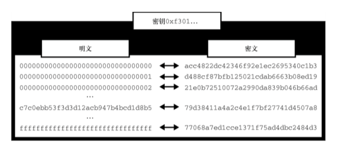
图 4.2　带密钥的分组密码可以看作一种置换关系：它将所有可能的明文映射到所有可能到的密文
当然，我们无法完全列出所有可能的明文及其对应的密文。对于密钥长度为 128 比特的分组密码，映射关系的数量是 2128。相反，我们设计了像 AES 这样的算法，它的功能类似于置换，并在密钥的作用下实现置换的随机化。我们把这样的置换称为伪随机置换（Pseudorandom Permutation）。4.2.3　AES 内部构造
让我们深入探究 AES 算法的内部构造。注意，在加密过程中，AES 将明文状态视为 4 × 4 的字节型矩阵（见图 4.3）。
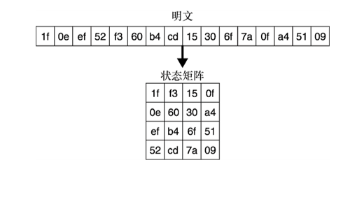
图 4.3　当将明文输入 AES 算法，16 字节的明文会被转换成一个 4×4 的矩阵。然后，把这个状态矩阵加密。最终，得到 16 字节的密文
在实践中这并不重要，但 AES 算法本身就是这样定义的。本质上，AES 算法的工作原理与对称密码算法中的其他分组密码类似，它们都属于加密固定大小分组的密码算法。AES 还有一个以明文为输入且迭代多次的轮函数，如图 4.4 所示。
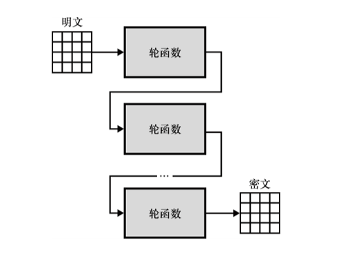
图 4.4　为了加密状态矩阵，AES 算法在状态矩阵上迭代轮函数。轮函数有多个输入参数，其中包括私钥（为了简化图例，没有在图中标出密钥）
每调用一次轮函数，内部状态就会发生一次转换，最终生成密文。每一轮都会使用一个由主对称密钥生成的不同轮密钥［轮密钥在密钥编排（Key Schedule）中产生］。这样一来，对称密钥即使稍微变化几个比特，加密结果也会完全不同（即扩散原则）。
轮函数由多个混合和变换内部状态字节的操作组成。具体来说，AES 算法的轮函数由 4 个不同的子函数组成。这里将这 4 个函数分别命名为 SubBytes、ShiftRows、MixColumns 和 AddRoundKey，但本书中不会解释这些子函数的执行细节（可以在其他关于 AES 的书中找到它们的细节描述）。前 3 个函数很容易求逆（根据输出可以找到对应的输入），但最后一个函数需要密钥才可以求逆。该函数将输入的内部状态矩阵和轮密钥的异或值作为输出，因此需要逆序使用轮密钥来恢复状态矩阵。图 4.5 描述了轮函数的内部执行细节。
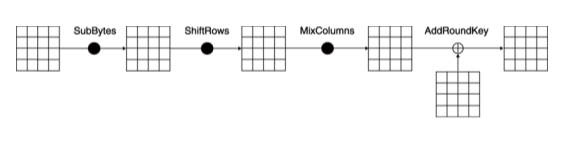
图 4.5　AES 算法的轮函数执行过程（忽略第一轮之前和最后一轮之后涉及的操作）。每轮会用 4 个不同的函数对内部状态进行变换。每个函数都是可逆的，否则无法解密。表示 XOR 操作
为了抵抗密码分析，AES 算法规定了轮函数的迭代次数（通常情况下，减少执行轮次也是可行的）。例如，存在高效的方法（恢复密钥攻击）可以完全攻破 AES-128 的三轮变体。通过多次迭代，分组密码将明文转换为完全不同于原始明文的字节序列。明文的细微改变也会导致产生完全不同的密文。这一原则被称为雪崩效应（Avalanche Effect）。
注意：
通常，我们通过比较加密算法提供的安全级别、分组大小和执行效率来判断它们的优劣。我们已经讨论过 AES 算法的安全性和分组大小。AES 算法的安全性依赖于密钥大小，它每次可加密 128 比特分组大小的数据。就加密速度而言，许多 CPU 供应商已经在硬件中实现了 AES 算法。例如，英特尔和 AMD 的 CPU 中集成了一组关于 AES 的新指令集（AES-NI），基于这些指令可以高效地实现 AES 的加密和解密。这些特殊指令使得 AES 算法在实践中拥有极高的执行速度。
现在，我们可能还有一个问题：AES 算法怎么加密小于或者超过 128 比特的消息呢？4.3 节内容会回答这个问题。
++4.3　加密企鹅图片和 CBC 操作模式
我们刚刚了解一点 AES 算法的内部结构，现在让我们看看它在实践中的使用方法。分组密码每次只能加密一个消息分块。如果要加密的消息长度小于 128 比特，就必须对消息进行填充，并且还要使用特定的操作模式（Mode of Operation）。下面先来介绍这两个概念的具体含义。
假如，我们想加密一个非常长的消息。最简单的方法就是，把消息分成长度为 16 字节的块（每块长度等于 AES 算法的分组大小）。如果最后一块明文小于 16 字节，则可以在其末尾追加一些字节，使得明文长度刚好为 16 字节。填充消息的目的就在于此。
用于填充字节的方法有很多种，但是对填充方法最重要的要求是它必须可逆。这样一来，解密完密文后就能够剔除填充的字节，进而提取出原始消息。例如，简单地填充一些随机字节是不可行的，这是因为解密后无法判断随机字节是否是原始消息。
最常见的填充方法是 PKCS#7 填充，该方法最早出现在 RSA 公司发布的 PKCS#7 标准中。PKCS#7 填充指定了一条填充规则：将每个作为填充的字节的值设置为所需填充字节的长度。倘若明文长度已是 16 字节呢？这时需要追加一个空的消息块，且每个字节的值都是 16。图 4.6 给出了这个填充规则的使用示例。删除填充的字节时，只需检查明文最后一个字节的值，并将其当作要删除的填充字节长度。
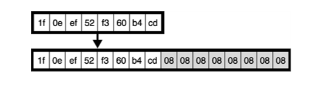
图 4.6　如果明文不是分组的整数倍，需要将其填充成分组的整数倍。图中明文长度为 8 字节，因此需要额外 8 字节（每个字节的值均为 8）才能将其填充到 16 字节长，这样明文就满足 AES 算法分组长度的整数倍
现在，还有一个问题需要探讨。到目前为止，为了加密一个更长的消息，我们选择将长消息拆分成 16 字节的块（或许，需要对最后一个块进行填充），再逐块加密。这种加密消息的方式称为电码本（Electronic Codebook，ECB）模式。正如先前提到的那样，这种加密方法是确定性的，因此对相同的明文进行加密会产生相同的密文。这意味着，当选择逐块加密消息时，可能会出现重复的密文。
用这种操作模式加密消息可能会导致密文重复出现，从而引发许多安全问题。最明显的问题之一就是，这些重复的密文会泄露明文的一些信息。这一问题的典型案例就是企鹅图片的 ECB 模式加密，如图 4.7 所示。

图 4.7　用 ECB 模式加密企鹅图片（源于维基百科）。ECB 操作模式无法隐藏重复的密文，仅仅通过观察密文就可以猜测加密的消息本身
为了安全地加密长度大于 128 比特的明文，我们需要一个支持「随机化」加密的操作模式。其实，AES 算法最常用的操作模式是密码块链接（Cipher Block Chaining，CBC）模式。CBC 模式适用于任何确定性分组密码（不止有 AES 算法），它有个额外的输入，称为初始向量（Initialization Vector，IV）。IV 可对加密结果进行随机化。因此，IV 的大小应等于分组密码的分组长度（例如，AES 算法的 IV 应为 16 字节），而且 IV 必须是唯一的、不可预测的。
为了使用 CBC 模式加密消息，必须先生成一个长度为 16 字节的 IV（第 8 章会介绍生成 IV 的方法），然后用生成的初始向量和明文的前 16 字节进行异或操作。这样一来，可以有效地随机化加密结果。因为如果用两个不同的 IV 去加密两个相同的明文，在 CBC 模式的作用下会生成两个不同的密文。
如果还有其他的明文需要加密，就用前一步生成的密文和下一个明文分组进行异或操作（如同前一步用 IV 和明文异或一样），然后对异或操作结果进行加密。这样就对下一个分组的加密结果也进行了随机化。鉴于 IV 是完全随机的，因此使用这种加密方式生成的密文也是不可预测的。图 4.8 给出了 CBC 模式的加密过程。
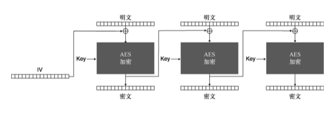
图 4.8　AES 算法的 CBC 操作模式。在执行加密操作前，除了需要对明文进行填充外，还需要生成一个随机的 IV
当执行 CBC 操作模式的解密操作时，颠倒异或操作和加密操作的顺序即可。考虑到解密时仍需要 IV，因此传送密文时，必须以明文形式发送 IV。由于 IV 是随机的，所以观察到 IV 也不会泄露任何信息。CBC 操作模式的解密过程如图 4.9 所示。
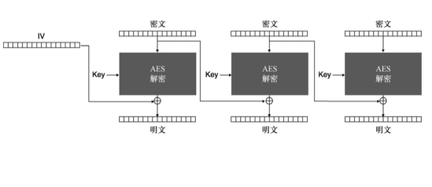
图 4.9　AES 算法的 CBC 模式。为了解密，必须以明文形式发送 IV
其他密码算法也会经常用到诸如 IV 这样的额外参数。然而，人们往往对这些参数的重要性知之甚少，并且这些参数的误用也是引发安全漏洞的主要原因。在 CBC 操作模式下，IV 必须是唯一的（不能重复）、不可预测的（随机的）。这些基本要求可能因为多种原因而无法得到满足。例如，密码产品开发人员可能不清楚 IV 的使用要求，一些密码程序库甚至不允许在使用 CBC 模式时指定 IV 的值，而是自动随机生成一个 IV。
警告：
当 IV 重复出现或变得可预测时，加密过程就又变成确定性的，此时加密结果可能面临多种攻击。针对 TLS 协议的攻击 BEAST（针对 SSL/TLS 的浏览器攻击）就是在这种情况下才发生的。需要注意的是，其他的算法可能会对 IV 有不同的要求。这就是我们需要经常翻阅算法或协议手册的原因所在。需要注意的危险问题都描述在这种手册里。
注意，即便对加密算法用上了操作模式和填充策略，算法也还不能用于实际加密。在 4.4 节中，我们会知道不能这样做的原因。
++4.4　选用具有认证机制的 AES-CBC-HMAC 算法
到目前为止，有一个基本的问题始终未得到解决：攻击者可能修改 CBC 操作模式加密下的密文，也可能改变以明文形式发送的 IV。确实，我们还没有采用任何的完整性校验机制去阻止这样的攻击。解密者不希望密文和 IV 有任何的改变。例如，采用 AES-CBC（以 CBC 操作模式运行 AES）算法加密消息时，攻击者通过翻转 IV 和密文中的某些比特，进而实现翻转密文中的某些比特。这种攻击的原理如图 4.10 所示。
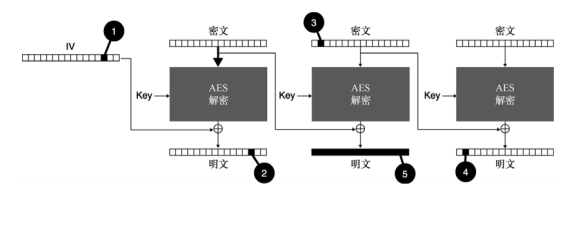
图 4.10　攻击者截获 AES-CBC 算法的密文后可以执行如下操作。（1）IV 是公开的，翻转 IV 的某个比特（例如，将 1 变成 0）（2）会导致明文的第一个分组相应的比特发生翻转。（3）也可以对密文的某些比特进行这样的翻转。（4）这样的翻转操作会影响后面要解密的明文块。（5）注意，修改密文块会直接影响该密文块的解密
因此，密码算法和操作模式不能按照原始方式使用。原始的加密算法和操作模式缺乏某种完整性保护机制，算法应该确保敌手无法在未被察觉的情况下修改密文及其相关参数（此处为 IV）。
为了检测密文的改变，我们可以使用第 3 章介绍的消息认证码（MAC）算法。对于 AES-CBC 算法，通常使用 HMAC（基于哈希的 MAC 算法）结合哈希函数 SHA-256 来提供完整性校验。具体来说，先对完成填充的明文进行加密，再用 MAC 算法认证密文和 IV。这样一来，即便敌手篡改了密文和 IV，也无法生成合法的认证标签。
警告：
这样的构造称为先加密再认证（Encrypt-then-MAC，EtMAC）。其他认证方式，如先认证再加密（MAC-then-Encrypt，MACtE），有时会导致巧妙的攻击（如 Vaudenay 填充预言机攻击），因此在实践中应避免采用这种先认证再加密的方法。
生成认证标签后，我们可以把认证标签、IV 及密文一起发送给接收方，它们会按如图 4.11 所示的方式拼接在一起。还需要注意的是，在实践中加密算法 AES-CBC 和认证算法 HMAC 应该使用不同的密钥。
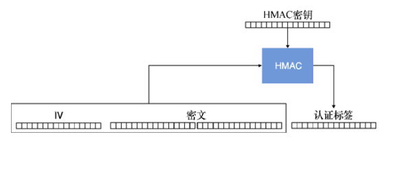
图 4.11　AES-CBC-HMAC 算法生成的 3 种类型输出会按 IV、密文和认证标签的顺序拼接在一起
在解密前，接收方会先验证标签的合法性。这些算法最终组合成的算法被称为 AES-CBC-HMAC，在更新型的一体式构造出现之前，该算法是应用最广泛的认证加密算法之一。
警告：
AES-CBC-HMAC 算法不是开发者友好型的密码算法。即便该算法实现完成后，开发者也很容易误用。如果没有以正确方式使用该算法，开发者很容易误入算法存在的一些陷阱（例如，每次加密时，IV 必须是不可预测的）。该算法现在仍被广泛使用，因此本书占用少量篇幅介绍这个算法。但是本书建议不要在实际应用中使用这个算法，我们应该使用接下来要介绍的新型认证加密算法。
++4.5　认证加密算法的一体式构造
加密技术的发展史并非一帆风顺。人们不仅没有充分认识到只加密而不认证带来的危险性，有时还会误用认证技术。考虑到这些情况，许多研究者开始试图采用标准化一体式的认证加密方案，以达到简化开发人员所使用的加密技术的目的。本节将重点介绍这一新概念以及它对应的两个广泛使用的标准算法：AES-GCM 算法和 ChaCha20-Poly1305 算法。4.5.1　有附加数据的认证加密
加密数据的最新方法是使用一种称为一体式结构的认证加密算法，该结构也称为有附加数据的认证加密（Authenticated Encryption With Associated Data，AEAD）。这种结构与 AES-CBC-HMAC 的构造方式非常接近，它不仅可以保证明文的机密性，还可以检测到对密文所做的任何修改。此外，该构造还允许对附加数据进行认证。
附加数据参数是可选的，它既可以为空，也可以包含加密和解密明文相关的数据。附加数据不会被加密，但是会与密文一起发送给对方。此外，密文会包含一个附加的认证标签（通常会附加到密文的末尾），因此密文的长度要大于明文。
为了解密密文，需要使用与加密过程相同的附加数据。解密成功时得到原始的明文，解密发生错误时表明密文在传输过程中被修改。图 4.12 解释了相关的工作原理。
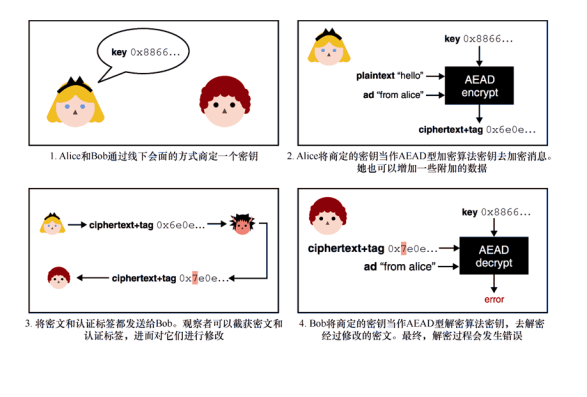
图 4.12　Alice 和 Bob 通过线下会面的方式商定一个共享密钥。Alice 将这个密钥当作 AEAD 型加密算法的密钥，并用它加密发送给 Bob 的消息。Alice 可以选择是否认证附加数据，例如，认证消息的发送者。收到密文和认证标签后，Bob 用商定的密钥和附加数据解密密文。如果附加数据不正确或者密文在传输中被修改，则解密会失败
现在，让我们通过密码学程序库来了解使用认证加密原语执行加密和解密操作的方法。为此，我们使用 JavaScript 编程语言和 Web Crypto API（大多数浏览器都支持的底层密码函数接口）来演示这一过程，如代码清单 4.1 所示。
代码清单 4.1　JavaScript 语言中的 AES-GCM 认证加密原语使用示例
let config = {
    name: 『AES-GCM』，
    length: 128    ←---　为了达到 128 比特安全性，生成一个 128 比特长的密钥 
}；
let keyUsages = [『encrypt』， 『decrypt』]；
let key = await crypto.subtle.generateKey（config, false, keyUsages）；
　
let iv = new Uint8Array(12)；
await crypto.getRandomValues（iv）；    ←---　随机地生成一个 12 字节的 IV
　
let te = new TextEncoder()；
let ad = te.encode（“some associated data”）；    ←---　加密明文时会使用一些附加数据。解密时必须使用与加密过程相同的 IV 和附加数据 
let plaintext = te.encode（“hello world”）；
　
let param = {
    name: 『AES-GCM』，
    iv: iv，
    additionalData: ad
}；
let ciphertext = await crypto.subtle.encrypt（param, key, plaintext）；
　
let result = await window.crypto.subtle.decrypt（    ←---　如果 IV、密文或者附加数据被篡改，解密时会抛出一个异常 
    param， key， ciphertext）；                                  
new TextDecoder（“utf-8”）.decode（result）；
注意，Web Crypto API 是一套底层的密码学 API，因此它并不能帮助开发人员避免错误。例如，它要求开发人员显式指定一个 IV，这是一种相当危险的使用方式。在代码清单 4.1 中，我们使用的 AES-GCM 算法是一种应用广泛的 AEAD 型加密算法。接下来，让我们深入探讨 AES-GCM 算法。4.5.2　AEAD 型算法 AES-GCM
应用最广泛的 AEAD 型算法是以伽罗瓦/计数器操作模式运行 AES（也称为 AES-GCM）算法的。利用硬件 AES 指令可以极大地提高算法的加密效率，并基于 AES 实现高效的 MAC 算法 GMAC。
AES-GCM 算法于 2007 年纳入 NIST 的 SP 800-38D 标准。该算法广泛应用于各种加密协议，如网络安全连接的 TLS 协议就用到该算法。实际上，我们可以说 AES-GCM 算法对整个网络通信进行了加密。
AES-GCM 算法是计数器（CTR）操作模式与 GMAC 的组合。首先，我们先来了解以 CTR 模式运行 AES 算法的过程。图 4.13 所示是 AES 算法的 CTR 模式运行流程。
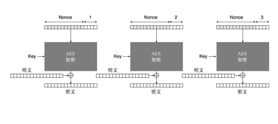
图 4.13　AES-CTR 算法以 CTR 模式运行 AES 算法。首先将一个具有唯一性的 Nonce 和计数器的值串联并使用 AES 算法对其加密以生成密钥流。然后，用密钥流与实际的 明文进行异或操作产生密文
AES-CTR 算法使用 AES 算法来加密由计数值和 Nonce 拼接起来的分组，并且计数器的初始值为 1。这个「仅使用一次」的附加参数 Nonce 与 IV 的作用相同，即通过操作模式来随机化 AES 加密结果。但是，与 CBC 模式对 IV 参数的要求相比，CTR 模式对 Nonce 参数的要求略有不同，它只要求 Nonce 是唯一的，不要求该参数具备不可预测性。我们把 16 字节分块的加密结果称为密钥流，将密钥流与实际的明文异或生成密文。
注意：
与 IV 一样，Nonce 也是密码学中的一个常见术语，它应用于许多不同的密码学原语中。尽管 Nonce 的名字意味着其不能重复，但是不同的应用场景对该参数有着不同的要求。我们应该按照不同原语的使用手册要求来设定参数，而不能只理解表面意义。实际应用中，有时我们也将 AES-GCM 算法的 Nonce 称为 IV。
AES-CTR 算法的 Nonce 长度是 96 比特（12 字节），每次允许加密的最大分组长度为 16 字节。16 字节分组的最后 32 比特被当作计数器，其从 1 开始计数，每执行一次加密计数器的值也会加 1，直到计数器的值达到最大值 24×8 −1 = 4294967295。这意味着，同一个 Nonce 最多可加密 4294967295 个长度为 128 比特（约为 69GB）的消息。
如果重复使用同一个 Nonce，则会产生完全相同的密钥流。将相同密钥流生成的密文相异或，密钥流就会被消掉，这样就可以得到两个明文相异或的结果。特别是当两个明文中的一个已知时，这可能会造成灾难性的后果。
图 4.14 展示了 CTR 模式有趣的一面：不需要任何填充。对于这样的情形，我们称 CTR 模式将分组密码转换成了流密码，使分组密码算法可以实现逐字节加密。
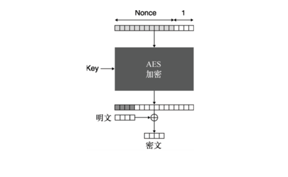
图 4.14　如果 AES-CTR 算法的密钥流长于明文，将其先截成与明文相同长度的字节流，再与明文相异或。这使得 AES-CTR 算法不需要任何填充
流密码
流密码是另一种类型的加密算法。与分组密码不同，流密码通过将密钥流与明文异或，实现对明文的直接加密。用流密码加密消息前无须对消息进行填充，也不需要指定操作模式，并且生成的密文与明文等长。
在实践中，这两类加密算法也没有特别明显的不同，分组密码通过 CTR 操作模式很容易转换成流密码。不过，从理论上讲，分组密码更加有用，因为它可以用于构造其他的密码学原语（如第 2 章中的哈希函数）。
另外需要注意的一点是，默认情况下，加密不会隐藏消息的实际长度。因此，如果攻击者能够影响所加密消息的部分内容，则在加密之前对消息进行压缩可能会致使一些攻击奏效。
AES-GCM 算法的第二个组成部分是 GMAC 算法。这是一个由带密钥哈希函数（也称为 GHASH）构造而成的 MAC 算法。从技术角度来讲，GHASH 是一个近乎通过异或方式实现的通用哈希（Almost XORed Universal Hash，AXU Hash）函数，这样的函数也称为差分不可预测函数（Difference Unpredictable Function，DUF）。密码学上对这种函数的安全要求低于哈希函数。例如，不要求 AXU 函数满足抗碰撞性。正是出于这个原因，GHASH 函数有很高的执行效率。图 4.15 给出 GHASH 算法的一般结构。
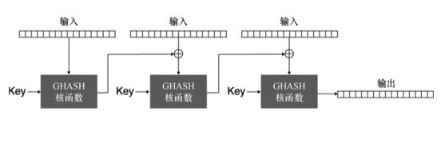
图 4.15　GHASH 算法以一个密钥输入，以类似于 CBC 操作模式的方式逐块处理输入消息。该算法最终会产生一个 16 字节的消息摘要
为了用 GHASH 算法处理输入消息，需要将消息拆分成 16 字节的块，再以类似 CBC 模式的方式逐块处理消息。由于 GHASH 算法还需要输入一个密钥，所以理论上可以将它视作一个 MAC 算法。不过，其密钥仅能使用一次（否则，该算法就会被攻破），因此也称 GHASH 为一次性 MAC 算法。这样的 MAC 算法并不理想。但是，采用由 Wegman Carte 提出的技术可以把 GHASH 算法转换成多次性 MAC 算法。图 4.16 展示了 Wegman Carte 提出的转换技术原理。
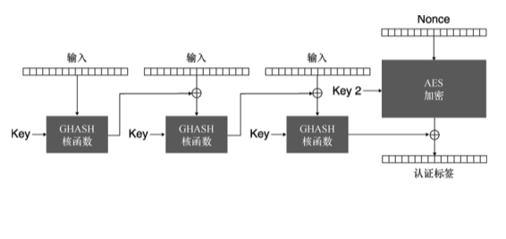
图 4.16　GMAC 算法用带密钥的 GHASH 函数逐块处理输入消息，再用另外一个新的密钥作为 AES-CTR 算法的密钥，并用该算法加密 GHASH 函数的输出，最终将加密产生的密文当作认证标签
GMAC 有效地使用 AES-CTR（采用不同于 GHASH 使用的密钥）算法对 GHASH 算法输出进行加密。需要再次强调的是，GMAC 算法使用的 Nonce 必须是唯一的。否则，攻击者可以恢复 GHASH 算法使用的认证密钥，这将引发灾难性的后果，即敌手可以轻松伪造认证标签。
事实上，AES-GCM 算法可以看作 CTR 模式和 GMAC 算法的有机组合，这种组合类似于前面讨论的先加密再认证类型的构造。图 4.17 展示了整个 AES-CTR 算法的详细工作原理。
AES-CTR 算法在加密消息时计数器从 1 开始计数，计数器的值为 0 时产生的密钥流用于加密 GHASH 算法的输出，从而生成认证标签。GHASH 算法需要一个独立的密钥 H，密钥 H 是通过使用密钥 K 加密一个值为全 0 的分块而产生的。这样一来，AES-CTR 算法就不需要输入两个不同的密钥，这是因为密钥 K 足以派生出另外一个密钥。
如前文提到的那样，12 字节的 Nonce 必须是唯一的，即不出现任何重复。需要注意的是，该算法不要求 Nonce 是随机的。因此，有些人喜欢将其当作计数器，并且计数器的值从 1 开始，每加密一次计数器的值也会加 1。在这种情况下，构建具体应用时必须选用一个能使用户自由选择 Nonce 的密码库。在 Nonce 达到最大值前，允许用户加密的最大消息数量为 212×8−1，但在实践中加密的消息数量不可能达到这样多。
另一方面，计数器意味着算法可以记录加密状态。如果机器在不恰当的时间崩溃，则可能发生 Nonce 重用。考虑到这个原因，有时会更倾向于使用随机的 Nonce。实际上，有些密码程序库不允许开发者选择 Nonce，它会自动生成随机的 Nonce。这样做可以在很大程度上避免 Nonce 重复，以至于在实践中几乎不会发生 Nonce 重复这种情况。然而，加密的消息越多，使用的 Nonce 就会越多，Nonce 重复出现的可能性就会越高。根据第 2 章讨论的生日界限问题，当以随机方式生成 Nonce 时，建议用同一密钥加密的消息数量不要超过 292/3≈230。
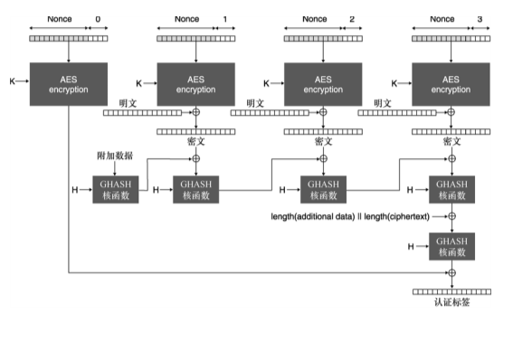
图 4.17　AES-GCM 算法的加密和认证消息的具体方式为：把密钥 K 作为 AES-CTR 算法的密钥，并用该加密算法加密明文，把密钥 H 作为 GMAC 算法的密钥，用该算法去认证附加数据和密文
超出生日界限安全
230条消息意味着消息的数量相当庞大。在许多情况下可能永远无法加密这么多数量的消息，但现实世界的密码学通常会超出人们的合理认知范围。一些需要长时间连接的系统每秒都会加密许多消息，最终达到允许加密的消息数量上限。例如，Visa 每天处理 1.5 亿笔交易。如果用一个唯一的密钥加密这些消息，那么在一周内就能达到 230条消息。在这些情况下，重置密钥（更改用于加密的密钥）是一种可行的解决方案。有一个叫作生日上界安全的领域，该领域旨在提高同一密钥可加密的最大消息数量。4.5.3　ChaCha20-Poly1305 算法
我们将要探讨的第二个 AEAD 型认证加密算法是 ChaCha20-Poly1305。该算法由 ChaCha20 流密码和 Poly1305 消息认证码算法组合而成。这两个算法都由 Daniel J.Bernstein 单独设计，它们的软件实现运行速度很快。这与 AES 算法有着明显的不同。AES 算法在没有硬件支持时，它的运行速度会很慢。为了便于在依赖低端处理器的 Android 手机上使用 AEAD 型算法，2013 年，谷歌对 ChaCha20-Poly1305 算法进行标准化。如今，该算法广泛应用于诸如 OpenSSH、TLS 和 Noise 之类的安全协议中。
ChaCha20 算法是流密码 Salsa20 的改进版，Daniel J. Bernstein 大约在 2005 年设计了 Salsa20 算法。ChaCha20 算法属于 ESTREAM 竞赛中被提名的算法之一。与所有流密码一样，该算法也会生成一个与明文等长的随机密钥流，通过将明文与密钥流相异或的方式来生成密文。在解密时，该算法也会生成一个与加密时完全一样的密钥流，通过把密文与密钥流相异或就可恢复出原始明文。ChaCha20 算法的加解密过程如图 4.18 所示。
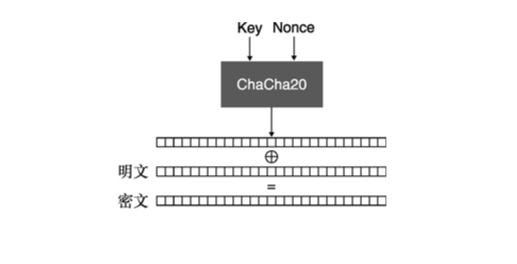
图 4.18　ChaCha20 算法以一个对称密钥和取值唯一的 Nonce 为输入。该算法生成一个密钥流，将密钥流与明文（密文）异或生成密文（明文）。由于所得密文与明文等长，所以该加密算法是长度保留的
ChaCha20 算法在底层反复调用 block()函数生成一系列的密钥流。每调用一次 block()函数就可以生成一个 64 字节的密钥流块。block()函数的输入如下：
● 256 比特（32 字节）长的密钥（与 AES 算法类似）；
● 92 比特（12 字节）长的 Nonce（与 AES-GCM 算法类似）；
● 32 比特（4 字节）长的计数器（与 AES-GCM 算法类似）。
ChaCha20 算法的加密过程与 AES-CTR 算法类似（见图 4.19）。
（1）每调用一次 block()函数，就将计数器的值加 1，直到生成足够多的密钥流；
（2）截取与明文等长的密钥流；
（3）将明文与密钥流异或。
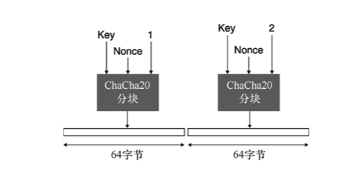
图 4.19　ChaCha20 算法通过调用内部的 block()函数来产生密钥流，直到生成足够多的随机字节为止。每调用一次 block()函数可以生成 64 字节长的随机密钥流
考虑计数器可取值的上界，ChaCha20 算法可以加密的消息数量与 AES-GCM 算法一样多（两个算法对 Nonce 参数有着相似的要求）。block()函数输出的字节块更多，这会影响允许加密的单个消息的大小。ChaCha20 算法允许加密的单个消息可达 232×64（字节）≈274GB。当发生 Nonce 重用时，ChaCha20 算法也会出现与 AES-GCM 算法一样的问题，即观察者通过异或两个加密的密文就可以得到它们对应的两个明文的异或结果，也可以恢复出认证密钥。这些问题可能造成严重的后果，导致攻击者可以成功伪造消息！
Nonce 和计数器的大小
对于同一个算法，它的 Nonce 和计数器大小并非一成不变，根据其所属标准的推荐参数可以适当改变这些参数的大小。有些密码程序库允许输入不同大小的 Nonce，而另一些应用为了增大算法允许加密的消息数量，选择增加 Nonce 的大小。事实上，增大这两个参数中的一个，必然意味着缩短另一个参数。
为了避免这些缺点，同时允许单个密钥下加密更多数量的消息，可以使用像 XChaCha20-Poly1305 之类的算法。这些算法允许增加 Nonce 的大小，但是保持计数器等其他参数不变，这一点对于需要随机生成 Nonce 的系统来说非常重要，系统内部无须以计数器的方式标记 Nonce 取值。
ChaCha20 算法的 block()函数内部维持着一个状态，如图 4.20 所示。
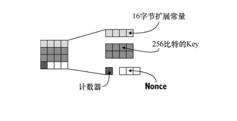
图 4.20　ChaCha20 算法的 block()函数内部状态。它的状态可用 16 个字组成的正方形来表示，每个字都由 4 个字节组成。第一行由一些常量构成，第二行和第三行保存着 32 字节的对称密钥，最后一行开头的 4 个字节表示计数器，剩余 12 个字节表示 Nonce
ChaCha20 算法的轮函数每执行一次会使 block()函数迭代 20 次（ChaCha20 算法名称中 20 的含义就在于此），之后将该算法的状态转换为 64 字节的密钥流。这个过程与 AES 算法的轮函数功能很相似。ChaCha20 算法的轮函数每轮会调用 4 次 Quarter Round（QR）函数，根据轮函数执行次数的奇偶性，每次 QR 函数会作用在内部状态的不同的字上。该过程如图 4.21 所示。
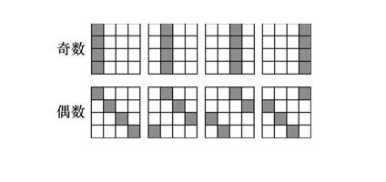
图 4.21　轮函数每执行一次会影响 ChaCha20 算法内部状态中的所有字。由于 QR 函数的输入只有 4 个参数，所以至少要调用该函数 4 次才能达到修改内部状态中 16 个字的目的
QR 函数以 4 个不同的参数为输入，并通过加（Add）、循环移位（Rotate Shift）和异或（XOR）的方式更新 4 个输入参数。我们称这样的密码算法为 ARX 型流密码。这使得 ChaCha20 算法非常容易实现，并且软件实现的执行效率很高。
Ploy1305 是一个利用 Wegman-Carter 技术设计的 MAC 算法，与我们先前讨论的 GMAC 算法原理十分类似。该算法的执行过程如图 4.22 所示。
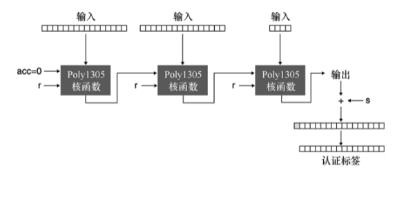
图 4.22　Poly1305 算法的核函数以一个初始值为 0 的累加器（acc）和认证密钥 r 为输入，每次处理输入消息中的一个分组。核函数的本轮输出作为下一轮核函数输入中的累加器。将核函数最终的输出加上一个随机值 s，生成认证标签
在图 4.22 中，r 可以视为方案的认证密钥，它类似于 GMAC 算法中的密钥 H。s 用于加密核函数最后一轮的输出，它可以确保 Poly1305 消息认证码算法在重复使用的情况下仍然安全，因此必须保证 s 具备唯一性。
Ploy1305 算法的核函数将密钥、累加器以及要认证的消息混合在一起。核函数涉及的主要操作就是模常量 P 的简单乘法。
注意：
显然，在描述这些算法的过程中，我们忽略了算法涉及的许多细节。我们很少提及数据的编码方法以及参数的填充方式。这些实现上的细节对我们来说无关紧要，我们的目的是从直观上了解算法的运行过程。
最终，我们可以用 ChaCha20 算法和一个值为 0 的计数器去生成密钥流，并为 Poly1305 算法派生出 16 字节的认证密钥 r 和 16 字节的 s。ChaCha20-Poly1305 认证加密算法的完整执行流程如图 4.23 所示。
首先，使用 ChaCha20 算法派生 Ploy1305 算法需要的认证密钥 r 和 s。然后，计数器的值加 1，用 ChaCha20 算法生成密钥流，进而加密明文。最后，Ploy1305 算法对密文和附加数据进行认证，并生成认证标签。
为了完成解密，我们需要执行类似加密过程中的操作。ChaCha20-Poly1305 算法先通过认证标签验证密文和附加数据的真实性，然后解密密文。
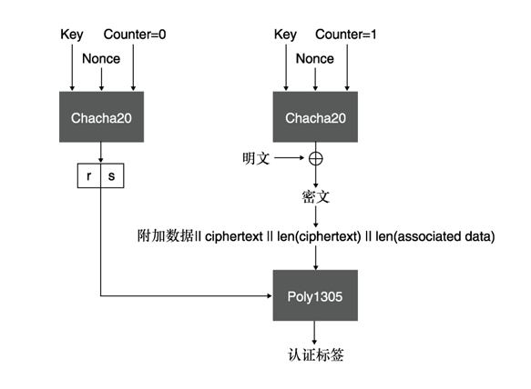
图 4.23　ChaCha20-Poly1305 算法的工作原理是，用 ChaCha20 算法加密明文，并派生出 Poly1305 算法所需的密钥。之后，用 Poly1305 算法去认证密文和附加数据
++4.6　其他类型的对称加密
让我们一起回顾到目前为止学过的对称加密算法。
● 非认证加密算法——以某种操作模式运行 AES 算法，但是不会为消息生成认证标签。在实践中，密文可能会被篡改，因此这种做法是不安全的。
● 认证加密——AES-GCM 和 ChaCha20-Poly1305 是两个应用广泛的认证加密算法。
然而，实用密码学探讨的范围并非只有已确定的密码标准。密码原语的实用性还与密文尺寸、算法执行速度、算法输出格式等有关。为此，本节简要介绍一下在 AES-GCM 和 ChaCha20-Poly1305 算法不适用时，我们可能会用到的其他对称加密算法。4.6.1　密钥包装
基于 Nonce 的 AEAD 型认证加密算法存在的主要问题之一是：这些算法均需要一个占用额外存储空间的 Nonce。想象这样一个场景：当加密一个密钥时，可能并不需要 Nonce 之类的额外输入来提高随机性，待加密的内容（密钥）本身已经足够随机，并且会以很大的概率保证不重复出现（当然，即便重复出现，也不是什么大事）。NIST SP 800-38F（“Recommendation for Block Cipher Modes of Operation: Methods for Key Wrapping”）标准包含一些著名的密钥包装（Key Wrapping）算法。这些算法不需要额外的 Nonce 和 IV，它们基于待加密的内容来随机化加密结果。正是基于这一原因，这些算法不需要额外空间来保存 Nonce 和 IV。4.6.2　抗 Nonce 误用的认证加密算法
2006 年，Phillip Rogaway 提出了一个称为合成初始向量（Synthetic Initialization Vector，SIV）的密钥包装算法。Rogaway 认为 SIV 不仅可以用于加密密钥，而且可以作为一种抗 Nonce 误用的 AEAD 型认证加密算法。通过本章前面的内容，我们已经知道在 AES-GCM 和 ChaCha20-Poly1305 算法中重复使用一个 Nonce 可能会带来灾难性后果。这不但会让攻击者获得两个明文的异或结果，还可能会让攻击者获得认证密钥，进而伪造出可通过验证的消息。
抗 Nonce 误用算法的主要特点在于，通过用相同的 Nonce 加密两个明文，只能够判断两个明文是否相等。这种算法也并非完美，但是总比泄露认证密钥要好得多。Rogaway 提出的这个密钥包装算法受到广泛关注，并且在 RFC 8452（“AES-GCM-SIV: Nonce Misuse-Resistant Authenticated Encryption”）中对其进行标准化。SIV 密钥包装算法的关键在于，AEAD 型加密算法中使用的 Nonce 是通过待加密的明文产生的，这使得两个不同的明文几乎不会产生一样的 Nonce。4.6.3　磁盘加密
对笔记本电脑和移动电话的存储介质进行加密有一些特殊的要求：加密速度必须快（否则，用户会感受到延迟），而且只能进行原地加密（对于很多设备来说，节省存储空间非常重要）。这意味着加密后消息占据的空间不会变大，需要 Nonce 的 AEAD 型认证加密算法显然不适合这种用途。替代的做法是，使用不支持认证功能的加密方案。
为了抵抗比特翻转攻击，加密大数据块时应该保证一个比特的翻转就会扰乱整个数据块的解密。这样一来，相比于实现攻击目的，攻击者更有可能使设备崩溃。这样的加密算法称为宽分组密码（Wide-block Cipher），也被称为穷人认证（Poor Man’s Authentication）。
Linux 系统和一些 Android 设备使用一种包装了 ChaCha 密码的 Adiantum 式宽分组密码来加密磁盘数据。早在 2019 年，谷歌公司对这个密码算法就进行了标准化。尽管如此，大多数设备使用的磁盘加密算法都不太理想：Windows 系统和苹果系统都使用一种不支持认证的 AES-XTS 算法，而且该算法不属于宽分组密码。4.6.4　数据库加密
加密数据库中的数据是一件棘手的事情。加密数据库的目的是防止数据库数据泄露，因此用于加密和解密数据的密钥必须存储在远离数据库服务器的地方。另外，客户端查询数据的方式也会十分受限。
最简单的解决方法是使用透明数据加密（Transparent Data Encryption，TDE），即仅仅对选定列进行加密。尽管这样做需要验证附加数据，以确保所加密数据的行和列未被篡改，但是在某些情况下这种算法相当实用。如果不对行列号进行验证，那么加密的内容就可以随意调换。此外，透明数据加密仍然无法在加密的条件下搜索数据，所以查询数据时，不能加密要获取的列值。
可搜索加密（Searchable Encryption）是一个旨在研究加密条件下检索数据的领域。目前，密码学家已经提出了许多不同的可搜索加密方案，但几乎没有一种算法是完美的。不同的方案具有不同级别的「可搜索性」，相应地它们支持的安全等级也不同。例如，索引盲化方案只允许进行精确匹配搜索，而保序加密和显序加密只允许对加密结果进行排序。这类方案的安全性确实需要仔细考虑，并在安全级别和搜索能力之间权衡。
++4.7　本章小结
● 对称加密是一种可以保证数据机密性的密码学原语，其安全性依赖于密钥的保密性。
● 出于安全性考虑，对称加密的密文需要被认证（也称为认证加密），否则无法检测密文是否被篡改。
● 利用基于对称加密的消息认证码可以构造认证加密。在实践中，最好使用支持附加数据的一体式认证加密算法，误用这种算法的概率很低。
● 只要通信双方有共同的对称密钥，他们就可以用认证加密算法去隐藏通信内容。
● AES-GCM 算法和 ChaCha20-Poly1305 算法是最流行的 AEAD 型算法。当今，很多流行的应用都采用了这两种认证加密算法的其中之一。
● 重复使用 Nonce 会破坏 AES-GCM 算法和 ChaCha20-Poly1305 算法的认证性。AES-GCM-SIV 之类的认证加密方案可以防止 Nonce 误用，这主要是因为加密密钥时不需要 Nonce 来确保其随机性。
● 实用密码学的应用场景总是很受限，因此 AEAD 型认证加密算法并不能满足所有应用。例如，该算法不适合数据库加密和磁盘加密，针对这些应用场景需要构造新的密码算法。