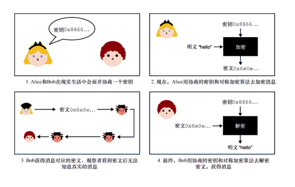
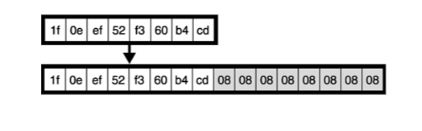
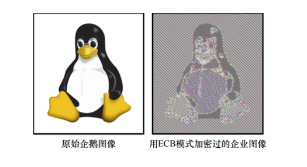
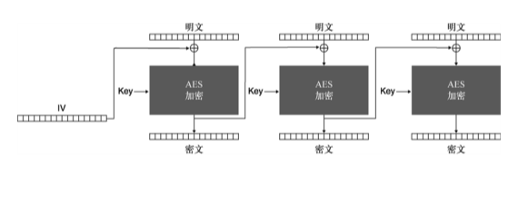
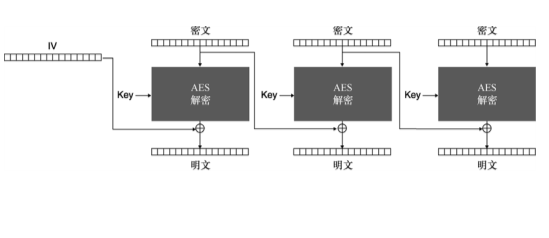
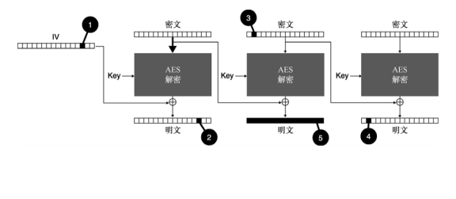

# 深入浅出密码学
## 第四章：认证加密
-------------------
[幻灯片 1 - 封面]

# 认证加密

- 基于《深入浅出密码学》第四章
- "让我们探索如何同时实现机密性和完整性"
- 作者: [您的姓名]
- 日期: [当前日期]

## 引言语
"认证加密将加密和认证巧妙结合，不仅保护数据的机密性，还能确保数据的完整性和真实性"
-------------------

[幻灯片 2 - 导言]

# 本章内容
1. 对称加密基础
2. 主流认证加密算法
3. 特殊场景加密方案

## 学习目标
- 理解对称加密的基本概念
- 掌握认证加密的工作原理
- 了解不同场景的加密需求

## 预备知识
- 消息认证码(第3章)
- 基本密码学概念
- 简单的协议设计思想
-------------------

[幻灯片 3 - 对称加密基础]

# 什么是对称加密？

## 基本组件
- 密钥(Secret Key)
  * 加解密共用同一密钥
  * 需要保持高度机密
  * 具备随机性和不可预测性
- 明文(Plaintext)
  * 待加密的原始消息
  * 可以是任意数据
  * 长度不限
- 密文(Ciphertext)
  * 加密后的数据
  * 看似随机的比特串
  * 不泄露明文信息

## 工作流程
加密: 明文 + 密钥 → [加密算法] → 密文
解密: 密文 + 密钥 → [解密算法] → 明文
-------------------

[幻灯片 4 - AES算法详解]

# 高级加密标准(AES)

## 1. 基本特征
- 分组密码
  * 固定分组大小(128位)
  * 支持不同密钥长度
  * 迭代轮函数设计

## 2. 安全级别
- AES-128
  * 128位密钥
  * 10轮变换
  * 标准选择
- AES-192
  * 192位密钥
  * 12轮变换
  * 中等安全级别
- AES-256
  * 256位密钥
  * 14轮变换
  * 最高安全级别

## 3. 内部结构
- 状态矩阵
  * 4×4字节矩阵
  * 16字节数据块
  * 矩阵运算基础

- 轮函数组件
  * SubBytes(字节替换)
  * ShiftRows(行移位)
  * MixColumns(列混合)
  * AddRoundKey(轮密钥加)
-------------------

[幻灯片 5 - AES工作模式]

# AES的操作模式

## 1. 电子密码本(ECB)
- 特点
  * 最简单的模式
  * 直接分组加密
  * 相同明文产生相同密文
- 缺点
  * 不隐藏数据模式
  * 容易受到重放攻击
  * 不推荐使用

## 2. 密码分组链接(CBC)
- 工作原理
  * 使用初始向量(IV)
  * 分组间链式依赖
  * 密文反馈机制
- 安全要求
  * IV必须随机
  * IV不可重用
  * IV必须不可预测

## 3. 计数器模式(CTR)
- 优势
  * 支持并行处理
  * 无需填充
  * 可预生成密钥流
- 实现细节
  * 使用计数器
  * 每块独立加密
  * 流密码特性
-------------------

[幻灯片 6 - 认证加密基础]

# 认证加密的必要性

## 1. 为什么需要认证？
- 单纯加密的问题
  * 无法检测篡改
  * 容易受到攻击
  * 不保证完整性

## 2. 认证加密方案
- 分离式
  * 独立的加密和MAC
  * 使用不同密钥
  * 实现较为复杂

- 复合式
  * 先加密后认证
  * 共用密钥
  * 更高效安全

- AEAD(一体式)
  * 同时加密和认证
  * 支持附加数据
  * 最佳实践选择
-------------------

[幻灯片 7 - 主流认证加密算法]

# 现代认证加密算法

## 1. AES-GCM
- 结构组成
  * AES-CTR加密
  * GMAC认证
  * 一体化设计
- 性能特点
  * 硬件加速
  * 并行处理
  * 高效实现

## 2. ChaCha20-Poly1305
- 设计特点
  * 软件友好
  * 高性能实现
  * 移动设备优化
- 组成部分
  * ChaCha20流密码
  * Poly1305认证器
  * 现代化设计
-------------------

[幻灯片 8 - 特殊应用场景]

# 特殊场景加密方案

## 1. 密钥包装
- 特点
  * 无需额外Nonce
  * 紧凑密文
  * 专门加密密钥

## 2. 抗Nonce误用
- SIV模式
  * 合成IV
  * 容忍Nonce重用
  * 更强安全保证

## 3. 磁盘加密
- 要求
  * 原地加密
  * 快速访问
  * 空间效率
- 方案
  * 宽分组密码
  * XTS模式
  * Adiantum

## 4. 数据库加密
- TDE
  * 透明加密
  * 列级保护
  * 性能优化
- 可搜索加密
  * 支持查询
  * 安全性权衡
  * 特定场景使用
-------------------

[幻灯片 9 - 安全实践]

# 实践中的安全考虑

## 1. Nonce管理
- 基本要求
  * 不可重用
  * 保证唯一性
  * 12字节推荐长度
- 生成方式
  * 计数器方式
  * 随机生成
  * 混合方案

## 2. 密钥管理
- 生命周期
  * 安全生成
  * 安全存储
  * 定期更新
  * 安全销毁
- 保护措施
  * 访问控制
  * 备份机制
  * 审计日志

## 3. 错误处理
- 原则
  * 统一错误消息
  * 避免信息泄露
  * 安全日志记录
- 注意事项
  * 时序攻击防护
  * 侧信道防护
  * 错误恢复机制
-------------------

[幻灯片 10 - 总结]

# 本章小结

## 核心概念
1. 对称加密基础
   * 密钥共享机制
   * 加解密过程
   * 安全性保证

2. 认证加密特性
   * 完整性保护
   * 真实性验证
   * AEAD模式优势

3. 实践要点
   * 正确使用模式
   * Nonce管理
   * 错误处理

## 最佳实践
- 算法选择
  * 使用标准算法
  * 选择AEAD模式
  * 适合场景需求
- 实现安全
  * 正确参数设置
  * 安全密钥管理
  * 完整性验证

## 下一步建议
- 深入学习
  * 算法细节
  * 安全性分析
  * 实现技巧
- 实践应用
  * 示例代码
  * 测试验证
  * 性能优化
------------------- 