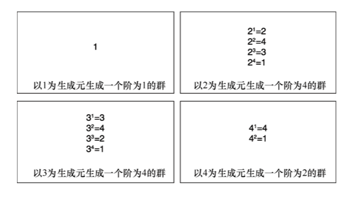
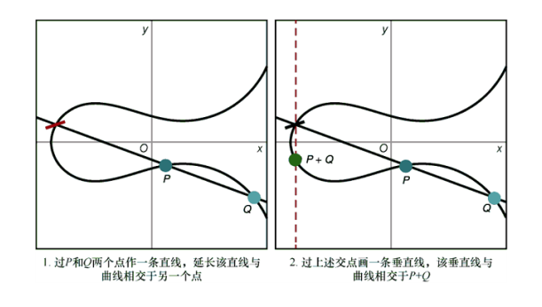
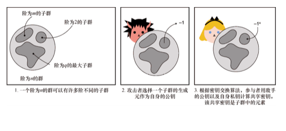

第 5 章　密钥交换
本章内容：
● 密钥交换的定义以及用法；
● DH 密钥交换与 ECDH 密钥交换；
● 使用密钥交换协议需要注意的安全问题。
现在，我们开始学习非对称密码（也称为公钥密码）。我们学习的第一个非对称密码原语是密钥交换。顾名思义，密钥交换是一个通信双方交换密钥并建立共享密钥的过程。例如，Alice 和 Bob 各自向对方发送自己的公钥，然后双方通过计算得到共享密钥，最后将共享密钥作为认证加密算法的密钥。
警告：
正如本书引言所提到的那样，非对称密码相比对称密码涉及的数学问题更多；因此，对于一些读者来说，接下来的章节会有点儿困难。但不要泄气！本章的内容将有助于读者理解其他密码原语。
注意：
阅读本章之前，请先阅读第 3 章「消息认证码」和第 4 章「认证加密」。
++5.1　密钥交换的定义
让我们考虑这样一个场景：Alice 和 Bob 想要进行秘密通信，但他们此前却从未通信过。这就是密钥交换协议常见的应用场景。
为了确保通信内容的机密性，Alice 可以使用第 4 章介绍的认证加密原语。在使用认证加密之前，Bob 与 Alice 需要知道一个相同的对称密钥，所以 Alice 可以生成一个对称密钥并将其发送给 Bob，他们将这个密钥当作认证加密算法的密钥。但如果一个敌手窥探到他们的通信过程并截获到 Alice 与 Bob 的对称密钥，那么敌手可以对 Alice 和 Bob 的所有通信内容进行解密！这就是密钥交换算法对 Alice 和 Bob 至关重要的原因。通过使用密钥交换协议，通信双方可以安全地获得一个对称密钥，而敌手却无法知道这个对称密钥。
密钥交换开始时，Alice 和 Bob 都使用密钥生成算法生成一对密钥，即私钥和公钥。然后，双方将各自的公钥发送给对方。此处的公钥是敌手可以观察到的信息，但不会暴露双方私钥或者共享密钥。最后，Alice 使用 Bob 的公钥和她自己的私钥来计算出一个共享密钥。类似地，Bob 可以使用他的私钥和 Alice 的公钥来生成相同的共享密钥。该过程如图 5.1 所示。

图 5.1　密钥交换算法提供这样的接口：该接口以对方的公钥和己方的私钥为输入，生成共享密钥
到目前为止，我们已经从宏观上了解了密钥交换的工作原理，那如何使用密钥交换协议解决刚才所提场景中的问题呢？通信开始前双方通过密钥交换算法生成一个共享密钥，并将其用作认证加密原语的密钥。由于任何中间人（Man-In-The-Middle）敌手都无法获得相同的共享密钥，因此无法对通信内容进行解密。详细说明如图 5.2 所示。

图 5.2　密钥交换使得通信双方能生成相同的共享密钥，且中间人敌手通过被动地观察密钥交换的 过程无法生成相同的共享密钥
需要注意的是，这里提到的中间人属于被动敌手，被动敌手只对通信信道进行窃听，而不会修改通信双方发送的内容，而主动敌手会介入密钥交换的过程并冒充成通信双方。在主动敌手攻击中，Alice 和 Bob 将分别与中间人进行密钥交换，并且双方都以为自己同对方生成同样的共享密钥。这之所以成为可能，是因为上述场景中的通信双方都无法验证对方公钥的合法性，即密钥交换过程未经验证！攻击过程如图 5.3 所示。

图 5.3　未经验证的密钥交换易受到主动敌手攻击。攻击者只需要冒充连接双方并执行两次单独的密钥交换即可实现攻击
我们用另一个场景来引入认证密钥交换的概念。想象一下，我们有一个可为用户提供时间信息服务的服务器，但我们不希望时间信息在传输过程中遭到中间人敌手的篡改。最好的办法是使用第 3 章学到的消息认证码算法对收到的消息进行认证。消息认证码算法需要一个密钥，因此服务器只需生成一个密钥并以物理方式共享给所有用户。但是，如此一来任何用户都拥有服务器与其他人共享的密钥，这意味着当服务器与某一用户通信时，任何用户都有可能成为中间人敌手。为每个用户设置不同的共享密钥可以有效地防止这种攻击，但现实应用中其效果不尽如人意。因为对于每个想要使用服务的新用户，服务器都需要以物理方式与用户共享新的消息认证码算法密钥。这已经耗费大量的服务器资源，而服务器的主要工作是响应大量的时间信息请求。
密钥交换可以解决上述问题！服务器可以生成用于密钥交换的密钥对，并将公钥发送给新用户，这就是认证密钥交换。由于用户知道服务器的公钥，因此主动敌手无法在密钥交换的过程中冒充服务器。但恶意用户可以作为客户端与服务器进行密钥交换，这是因为客户端没有经过认证。顺便说一下，当通信双方都进行认证时，这个过程称为相互认证的密钥交换。
一个服务器面对多个客户端的情况十分常见，当用户数量增加时，密钥交换原语在单服务器多客户端场景中可扩展性很强。但如果在多服务器多用户的场景下，密钥交换原语的可扩展性就较弱！互联网就是一个很好的例子。互联网中有许多浏览器会与许多网站进行安全通信。想象一下，如果我们必须将浏览器可能访问的网站的公钥编码到硬件中，那么当互联网上出现新的网站时，我们该如何与它们建立安全信道呢？
如果密钥交换算法没有与数字签名结合使用，那么它的可扩展性往往比较差。在第 7 章中，我们就将了解到数字签名的定义，以及利用它增加通信系统中参与者信任度的方法。密钥交换算法十分重要，但在实践中却很少直接使用，它通常充当更复杂协议的基础模块。话虽如此，在某些情况下，密钥交换协议自身仍然可以发挥作用（例如，我们之前提到的只存在被动敌手的场景）。
接下来，让我们通过一个例子了解密钥交换协议的实际应用方法。libsodium 是一个广泛应用的 C/C++ 密码库，使用 libsodium 执行密钥交换协议的示例如代码清单 5.1 所示。
代码清单 5.1　C 语言实现密钥交换协议
unsigned char client_pk[crypto_kx_PUBLICKEYBYTES]；    ←---　生成用户的密钥对 
unsigned char client_sk[crypto_kx_SECRETKEYBYTES]； 
crypto_kx_keypair（client_pk, client_sk）；                     
　
unsigned char server_pk[crypto_kx_PUBLICKEYBYTES]；    ←---　假设我们可以获得服务方的公钥 
obtain（server_pk）；                                            
　
unsigned char decrypt_key[crypto_kx_SESSIONKEYBYTES]；    ←---　在 libsodium 库中，按照实践中最佳的实现方式派生两个对称密钥 
unsigned char encrypt_key[crypto_kx_SESSIONKEYBYTES]；      
　
if （crypto_kx_client_session_keys(decrypt_key, encrypt_key,
    client_pk, client_sk, server_pk) != 0） {    ←---　用户用自己的私钥和服务器的公钥执行密钥交换协议 
    abort_session()；    ←---　如果公钥格式不正确，函数将返回错误 
}
libsodium 库对开发人员隐藏了很多细节，同时还公开了安全的接口。在本例中，libsodium 库使用了 X25519 密钥交换算法，接下来会介绍更多关于该算法的内容。在本章的其余部分中，我们将了解密钥交换算法的不同标准，以及密钥交换算法的底层工作过程。
++5.2　Diffie-Hellman（DH）密钥交换
1976 年，Whitfield Diffie 和 Martin E.Hellman 撰写了一篇关于 Diffie-Hellman（DH）密钥交换算法的开创性论文，论文题目为「New Direction in Cryptography」。DH 算法是第一个密钥交换算法，也是第一个得到形式化描述的公钥密码算法。在本节中，我们将学习该算法涉及的数学知识，解释其工作原理，最后讨论该算法可在应用程序中使用的标准。5.2.1　群论
DH 密钥交换算法基于数学中的群论，群论也是当今大多数公钥密码的基础。出于这个原因，我们将在本章花一些时间了解群论的基础知识。本节会尽可能用浅显的语言来描述这些算法的工作过程，但有些数学知识仍需要我们深入学习。
我们首先需要了解什么是群。群的本质如下。
● 一组元素的集合。
● 在这些元素上定义的特殊二元运算（如 + 或 ×）。
如果这个集合以及在集合上定义的运算满足某些性质，我们就可以得到一个群。一旦拥有一个群，我们就可以做一些神奇的事情，稍后将仔细介绍这一点。请注意，DH 算法在乘法群中运行，乘法群意味着定义在集合上的二元运算是乘法。因此，对于接下来讨论的示例，其运算都发生在乘法群上。此外，文中有时会省略 × 符号（例如，将a × b写成ab）。
接下来我们对群进行更加准确的定义。要使集合及其运算成为一个群，需要满足以下性质。（图 5.4 以直观的方式说明了这些性质，这将有利于我们掌握这一新概念。）
● 封闭性：群中两个元素运算的结果仍是集合中的元素。例如，对于群中的两个元素a和b，a × b也是群中的元素。
● 结合律：多个元素同时进行运算时，可以按任何顺序执行运算。例如，对于群元素a、b和c，a(bc)和(ab)c运算得到的是相同的群元素。
● 单位元：群中有且仅有一个元素是单位元，单位元与群中任一元素运算时都不会改变该元素。例如，我们在乘法群中将单位元定义为 1，那么对于任何群元素a，都有a × 1 = a。
● 逆元：群中的元素均有逆元，群元素及其逆元的运算结果等于单位元。所有的群元素都存在逆元。例如，对于任何群元素a，都存在一个逆元素a−1（也写为），使得a × a−1 = 1（也写为）。

图 5.4　群的 4 个性质：封闭性、结合律、单位元、逆元
上述对群的描述可能有点抽象，我们可以通过 DH 密钥交换算法理解群在现实中的应用。首先，DH 密钥交换算法使用一个正整数集合{1,2,3,4，…，p−1}，其中p是素数，1 是单位元。不同的标准对素数p的选择有不同的规定，但直观地说，它必须是一个大素数才能保证算法的安全。
素数
一个数是素数说明它只能被 1 或自身整除。素数包括 2、3、5、7、11 等。素数在非对称密码中无处不在！幸运的是，我们有高效的算法来找到大素数。为了加快生成素数的速度，大多数加密库会用伪素数（有很高的概率是素数）来代替素数。然而，这种伪素数生成算法曾多次被攻破，其中「臭名昭著」的事件之一是 2017 年发现的 ROCA 漏洞，该漏洞导致超过 100 万台设备将错误的素数用于密码应用程序。
其次，DH 密钥交换算法使用模乘这种特殊运算。在解释模乘的定义之前，我们需要先了解模运算的定义。简而言之，模运算通过不断地消去模数，最终得到一个小于模数的值。例如，如果将模数设为 5，则超过 5 的数字模 5 就会重新从 1 开始增加。例如，6 模 5 等于 1，7 模 5 等于 2，以此类推。（我们也把 5 记为 0，但由于它不在乘法群中，所以不必太关心它。）
借助欧几里得除法等式和除法余数，我们就可以构造模运算的数学等式。以数字 7 为例，将其除以 5 的欧几里得除法写成 7 = 5 × 1 + 2，其中余数是 2。然后我们说 7 = 2 mod 5（有时写为(mod 5)）。这个方程可理解为 7 与 2 模 5 同余。类似地，
● 8 = 1 mod 7；
● 54 = 2 mod 13；
● 170 = 0 mod 17。
我们常用时钟来描述模运算概念，如图 5.5 所示。

图 5.5　以 5 为模数的整数群可以表示拥有 0～4 共 5 个刻度的时钟，时钟走过 4 后就重置为 0。因此，5 表示为 0，6 表示为 1，7 表示为 2，8 表示为 3，9 表示为 4，10 表示为 0，以此类推
有了模运算的概念，自然而然可以在群上定义模乘的概念。以下面的乘法为例：
根据模运算，我们知道 6 与 1 模 5 同余，因此可以将上述等式改写为：
注意，上述等式还表明了 3 与 2 在模数下互为逆元。我们可以将其表示为：
在不引起误解时，本书有时会忽略模数部分（此处为 mod 5）。
注意：
若正整数模一个素数的结果构成一个集合时，只有 0 没有逆元。（比如，无法找到一个元素b，使得。）这就是我们不将 0 作为群元素的原因。
现在我们拥有一个群，它包括一个由正整数构成的集合{1,2,3,4，…， p−1}以及定义在这个集合上的模乘运算，其中p是一个素数。我们构造的群也恰好满足如下性质。
● 交换性：模乘运算中元素的顺序可交换。例如，给定两个群元素a和b，则ab = ba。具有此性质的群通常称为伽罗瓦群。
● 有限域：伽罗瓦群比普通群拥有更多的性质，并且在群上定义了加法运算。
根据上述第二条性质，在群上定义的 DH 算法也称为有限域 DH（Finite Field Diffie-Hellman，FFDH）算法。如果理解群的定义，那么子群的定义也就呼之欲出。子群是原始群的子集，与原始群类似，对子群也满足封闭性、结合律、单位元、逆元 4 个性质。
循环子群是一种可由一个生成元（或称为基）生成的群。生成元通过自身多次相乘来生成循环子群的所有元素。例如，在模数为 5 的前提下，生成元 4 可生成由 1 和 4 构成的子群：
● ；
● ；
● （返回原处）；
● 。
注意：
可将 4 × 4 × 4 写为 43。
若群的模数是素数，则群中每个元素都是群的某个子群的生成元。这些子群的元素个数可以不相等，群的元素个数也称为群的阶。详细说明如图 5.6 所示。

图 5.6　模 5 乘法群的所有子群。这些子群中都包含 1（即单位元），并且具有不同的阶（元素的个数不同）
目前，我们已知道：
● 群是一个定义了二元运算的集合，这些二元运算满足某些性质（封闭性、结合律、单位元、逆元）；
● DH 算法在伽罗瓦群（一个具有交换性的群）中运行，该群由一组小于某个素数的正整数集合以及模乘构成；
● 在 DH 算法用到的群中，每一个群元素都是某个子群的生成元。
群是许多密码原语的核心。如果想了解其他密码原语的工作原理，那么需要对群论有基本的了解。5.2.2　离散对数问题：DH 算法的基础
DH 密钥交换算法的安全性基于群上的离散对数问题，该问题是公认的困难问题。本节将介绍离散对数问题。
对于一个模数为 5 的群，选定群的一个生成元 3 并随机选择一个群元素 2，求解 2 = 3x mod 5 中未知的x就是在求解离散对数问题。因此，群中的离散对数问题计算的是生成元生成某个群元素时需要与自身相乘的次数。这是一个重要的概念，请务必花些时间思考离散对数问题。
在上述的例子中，我们可以轻易猜出x的值是 3（2 = 33 mod 5）。但如果我们选择一个更大的模数，问题就变得十分困难了。这就是 DH 问题困难的原因。我们之前学习 DH 算法生成密钥对的方法如下。
（1）所有参与者协商使用一个大素数p和一个生成元g作为公共参数。
（2）每个参与者随机产生一个数x作为私钥。
（3）每个参与者通过计算gx = h mod p生成自身的公钥h。
基于离散对数问题的困难性，没有人可以从用户的公钥中推测出对应的私钥，如图 5.7 所示。

图 5.7　在 DH 密钥交换算法中，选择私钥x就像在g生成的元素列表中按照索引选择一个元素（离散对数问题就是仅通过表元素查找该元素的索引）
虽然目前有一些算法可用于求解离散对数问题，但它们在实践中效率不高。另一方面，如果给定了离散对数问题的解x，很容易通过计算gx = hmod p验证x的正确性。如果读者对解决离散对数问题的新算法感兴趣，可以去了解一种称为平方-乘算法的模幂计算方法，它通过逐比特遍历x高效地计算离散对数。
注意：
与密码学中的其他原语一样，仅通过猜测找到问题的答案并非不可能。但通过选择足够大的参数（在 DH 密钥交换算法中是一个大的素数），可以将猜测到正确答案的可能性降低到忽略不计。这意味着，即使经过数百年的随机尝试，恰好猜到正确结果的概率在统计学上仍然接近于 0。
如何将上述的所有数学知识应用在 DH 密钥交换算法中呢？可以想象下面的场景：
● Alice 有一个私钥a及其对应的公钥；
● Bob 有一个私钥b及其对应的公钥。
Alice 可以根据 Bob 的公钥和自身的私钥计算双方的共享密钥，Bob 也可以进行类似的操作，计算。显而易见，双方最终会得到相同的结果：
这就是 DH 密钥交换算法的神奇之处。对于观察者而言，仅获得通信双方的公钥A和B，无法计算。接下来，我们将了解在实际应用程序中 DH 密钥交换算法的使用方式和现有的 DH 密钥交换协议标准。
计算性 DH 问题和判定性 DH 问题
顺便说一句，在理论密码学中，根据gamod p和gbmod p无法计算gabmod p称为计算性 DH（Computational Diffie-Hellman，CDH）假设。它容易与假设性更强的判定性 DH（Decisional Diffie-Hellman, DDH）假设混淆，后者表示对于集合{0,1,2,3，…，q-1}中的元素a、b、c，根据ga mod p、gb mod p以及gc mod p，无法区分gc mod p是密钥交换的结果（即gab mod p），还是群中一个随机元素。这两个假设常用于构建各种各样的密码学算法。5.2.3　DH 密钥交换标准
根据 DH 密钥交换算法的工作原理，算法参与者需要协商一个素数p和群生成元g作为公共参数。本小节将介绍 DH 密钥交换算法实际应用中选择公共参数的方法以及现有的不同标准。
首先，应该选择尽可能大的素数p。由于 DH 密钥交换算法的安全性基于离散对数问题的困难性，因此对离散对数问题的最佳攻击直接影响到 DH 算法的安全性。离散对数问题攻击算法的任何进展都会削弱 DH 算法的安全性。随着时间的推移，我们对攻击进展的速度及其对安全性的影响程度已有足够的了解。目前，在实践中，常将p设置为 2048 比特的素数。
注意：
一般来说，许多机构和组织都给出了相应的密码算法参数的推荐长度。相关总结来自研究机构或政府机构（如法国国家网络安全局、美国国家标准与技术研究院和德国联帮信息安全办公室）编制的权威文件。这些权威文件中的建议虽然并不总是一致的，但它们推荐的参数尺寸基本保持一致。
在过去，许多密码程序库和软件通常将生成的参数编码到硬件中。而这种做法有时导致算法很脆弱，甚至完全可以被攻破。2016 年，有人发现主流的命令行工具 Socat 在一年前将默认的 DH 群更改为一个不安全的 DH 群，这引发了一个问题：这是一个无意的错误还是故意设置的后门。按照我们以往的经验，使用标准化的群参数是为了预防某些攻击的有效手段，但这在 DH 群却是个例外。在 Socat 问题出现后的几个月内，Antonio Sanso 在阅读 RFC 5114 时发现，该标准指定的 DH 群参数也不安全。
由于上述的问题，较新的协议和密码库都更倾向于选择椭圆曲线 DH 算法（Elliptic Curve Diffie-Hellman，ECDH），或者使用更安全的标准（如 RFC 7919）中定义的群参数。目前的最佳做法是使用 RFC 7919 中定义的群，这些群的阶和安全性均不同。例如，ffdhe2048 是一个模数为 2048 比特的素数、生成元为 2 的群，其中素数p的取值如下：
p = 32317006071311007300153513477825163362488057133489075174588434139269806834136210002792056362640164685458556357935330816928829023080573472625273554742461245741026202527916572972862706300325263428213145766931414223654220941111348629991657478268034230553086349050635557712219187890332729569696129743856241741236237225197346402691855797767976823014625397933058015226858730761197532436467475855460715043896844940366130497697812854295958659597567051283852132784468522925504568272879113720098931873959143374175837826000278034973198552060607533234122603254684088120031105907484281003994966956119696956248629032338072839127039
注意：
通常选择 2 作为生成元，因为计算机使用简单的左移（<<）指令非常高效地实现了乘 2 计算。
群的阶通常是q = (p−1)/2。这意味着私钥和公钥的大小都在 2048 比特左右，这样的密钥长度已经足够大（例如，与 128 比特的对称密钥相比）。5.3 节中我们使用椭圆曲线上定义的群，可以令 DH 算法使用更短的密钥实现相同的安全性。
++5.3　基于椭圆曲线的 DH 密钥交换算法
DH 算法可以在不同类型的群中实现，而不仅仅是模数为素数的乘法群。椭圆曲线是数学中经常研究的一种曲线，它也可以构成一个群。这个想法在 1985 年由尼尔·科布利茨（Neal Koblitz）和维克多·米勒（Victor S.Miller）提出，但直到 2000 年，基于椭圆曲线的密码算法开始标准化时，这一想法才被采纳。
应用密码学领域很快接受椭圆曲线密码（Elliptic Curve Cryptography，ECC），因为它的密钥长度比上一代公钥密码更短。与 DH 算法中推荐的 2048 比特参数相比，ECDH 算法的参数只需要 256 比特。5.3.1　椭圆曲线的定义
我们首先需要了解椭圆曲线在算法中的作用。椭圆曲线不过是曲线的一种，它包含的坐标x和y满足如下方程：
其中、、、和是常数。当今实际应用的大多数曲线的方程可简化为短 Weierstrass 方程：
其中，。
虽然有两种类型的曲线（二元曲线和特征曲线 3）无法简化为短的 Weierstrass 方程，但这些曲线很少使用，因此在本章的其余部分将使用 Weierstrass 形式表示曲线方程。一个椭圆曲线以及曲线上随机选取的两个点如图 5.8 所示。

图 5.8　由方程定义的椭圆曲线示例
人们在对椭圆曲线的研究过程中发现可以基于椭圆曲线构造一个群。从那时起，在这些群上实现 DH 算法也变得十分简单。本节将以非常直观的方式解释椭圆曲线密码底层的原理。
椭圆曲线上的群通常定义为加法群，有别于 5.2 节定义的乘法群，它定义在群上的运算是加法，通常表示为 +。
注意：
在实践中使用加法符号或乘法符号表示群运算并不重要，这只是个人偏好的问题。虽然大多数密码学算法都使用乘法符号，但有关椭圆曲线的文献都使用加法符号，因此本书中提到椭圆曲线群时将用加法符号来表示群运算。
这次，我们在定义群元素之前先定义群运算。群的加法运算定义如图 5.9 所示。

图 5.9　利用几何方法在椭圆曲线的点上定义加法操作
（1）过两个参与运算的点做一条直线，延长该直线与曲线相交于另一个点。
（2）过步骤 1 的新交点画一条垂直线，该垂直线与曲线相交于另一点。
（3）步骤 2 产生的新交点就是两点相加的结果。
在两种特殊情况下，运算不能满足上述规则。
● 某个点与自身相加的情况。在这种情况下，应该过该点作一条与曲线相切的直线（而非过两点作直线）后再继续步骤 2、步骤 3 的操作。
● 步骤 1（或步骤 2）中所作的直线没有与曲线相交的情况。椭圆曲线上的加法需要在这种特殊的情况下也能运行并产生结果。解决方案是将该情况下的结果定义为一个虚构的点，称为无穷远点（通常用大写字母O来表示）。
上述两种特殊情况如图 5.10 所示。

图 5.10　在图 5.9 的基础上，定义了椭圆曲线上某点自加以及两个点相加产生无穷大点O的运算结果
无穷远点的概念看似怪异，但我们只需理解这只是为了加法运算能顺利运行。它的作用类似于加法运算中的 0，是椭圆曲线上群的单位元。无穷远点满足：
对于任意一个曲线上的点P满足
到目前为止，我们了解到在椭圆曲线上构造一个群需要满足如下条件。
● 由一个椭圆曲线方程定义一个点的集合。
● 定义这个集合上的加法运算。
● 定义一个虚构的无穷远点。
虽然我们已从上面学了许多椭圆曲线的知识点，但我们还需要了解最后这部分内容。椭圆曲线密码的运算作用在之前讨论的有限域群上。实际上，这意味着坐标的值只能选取集合{1,2，…， p−1}中的元素，其中p是一个大素数。因此，理解椭圆曲线密码时，我们脑中浮现的应该是图 5.11 所示的右图。

图 5.11　椭圆曲线密码在实践中用坐标系下的椭圆曲线表示，该椭圆曲线的方程需要模大素数p。这意味着椭圆曲线群中使用的群看起来更像右图而非左图
至此，我们可以对椭圆曲线群进行密码学设计，如同之前在模素数p的乘法群上实现 DH 密钥交换算法一样。那么我们如何用椭圆曲线上定义的群来实现 DH 算法呢？首先了解离散对数问题在椭圆曲线群中的定义形式。
取一个点G，定义加法为将其自身相加x次生成另一个点P。我们可以把它写成P = G + … + G（x个G相加）或者简写为P = [x]G，读作G的x倍。椭圆曲线离散对数问题（Elliptic Curve Discrete Logarithm Problem，ECDLP）是在只知道P和G的情况下求解x。
注意：
我们称[x]G为标量乘法，因为在这类群中，x通常被称为标量。5.3.2　ECDH 密钥交换算法的实现
现在我们构造一个椭圆曲线群，就可以在这个群上实现 DH 密钥交换算法。产生 ECDH 算法密钥对的方法如下。
（1）所有参与者协商一个椭圆曲线方程、一个有限域（最有可能是一个素数）和一个群生成元G（在椭圆曲线密码中通常称为基点）。
（2）每个参与者生成一个随机数x作为自身的私钥。
（3）参与者各自生成自己的公钥[x]G。
基于 ECDLP 的困难性，攻击者无法仅从公钥恢复其对应的私钥，如图 5.12 所示。
图 5.12　在 ECDH 密钥交换算法中，选择私钥x就像在G生成的元素列表中按照索引选择一个元素（求解椭圆曲线离散对数问题就是仅通过表元素查找该元素的索引）
上述内容可能有些难理解，因为我们为 DH 群定义的运算是乘法，而 ECDH 群上定义的运算是加法。但加法和乘法的区别并不重要，它们只不过是群上定义的某种运算。DH 群和 ECDH 群之间的比较如图 5.13 所示。

图 5.13　DH 群与 ECDH 群之间的比较
现在我们可以确信，对于密码学来说唯一重要的事情是，拥有一个定义了某种运算的群，并且这个群上的离散对数问题很困难。最后，DH 群和 ECDH 群中离散对数问题之间的差异如图 5.14 所示。

图 5.14　模大素数的离散对数问题与椭圆曲线密码中的离散对数问题的比较。两者都与 DH 密钥交换算法相关，因为它们的安全性都依赖于从公钥中恢复私钥的困难性
可见 ECDH 群与 DH 群是不同的。正是由于这些差异，使得已知的针对 DH 算法的最有效的攻击（称为 Index Calculus 算法或数域筛选攻击）在 ECDH 群上不起作用。这就是 ECDH 算法的参数在相同安全级别下比 DH 算法的参数小得多的主要原因。
现在我们已经完成了理论学习，可以开始定义 ECDH 密钥交换算法。想象如下场景。
● Alice 拥有私钥a以及公钥[a]G。
● Bob 拥有私钥b以及公钥[b]G。
Alice 可以根据 Bob 的公钥以及自身的私钥a计算共享密钥[a]B。Bob 也可以使用类似的计算得到[b]A。很明显，双方最终计算出相同的结果：
任何被动敌手都无法仅通过观察公钥来生成共享密钥，这与 DH 密钥交换算法相同。接下来我们讨论 ECDH 标准相关的问题。5.3.3　ECDH 算法的标准
自从 1985 年首次提出椭圆曲线密码以来，它一直保持着强大的性能。美国、英国、加拿大等国家都相继使用椭圆曲线密码系统，以保护政府内部和政府之间的机密信息。
——美国国家安全局（NSA）（“The Case for Elliptic Curve Cryptography”，2005）
ECDH 算法的标准化相当混乱。许多标准化机构致力于将不同的曲线制定为标准，并随后引发对哪一个曲线更安全、更有效的辩论。Daniel J.Bernstein 主导的大量研究指出，NIST 制定的许多标准化曲线并不安全，这类不安全的曲线的漏洞可能只有 NSA 知道。
我不再相信标准中给出的常数。因为我认为 NSA 联合工业界操纵了这些标准。
——Bruce Schneier（“The NSA Is Breaking Most Encryption on the Internet”，2013）
如今，实际使用的大部分曲线都遵循 SEC 和 RFC7748 两个标准，大多数应用程序也都固定使用两条曲线：P-256 和 Curve25519。在本小节的其余部分中，我们将讨论这些曲线。
2000 年 NIST FIPS 186-4 首次将「数字签名标准」（Digital Signature Standard）规定为签名标准，它包含的附录中规定了 ECDH 算法中使用的 15 条曲线。其中 P-256 是使用最广泛的曲线。该曲线也在 2010 年以 secp256r1 之名在高效密码标准（Standards for Efficient Cryptography，SEC）第 2 版的「椭圆曲线域参数建议」（Recommended Elliptic Curve Domain Parameters）中发布。P-256 可由短 Weierstrass 方程表示如下：
其中，a = −3，b = 41058363725152142129326129780047268409114441015993725554835256314 039467401291，。
该椭圆曲线群的阶n = 11579208921035624876269744694940757352999695522413576034242 2259061068512044369，这意味着在内群中有n个点（包含无穷远点）。
群的基点为G = (48439561293906451759052585252797914202762949526041747995844080717082 404635286,36134250956749795798585127919587881956611106672985015071877198253568414405109)。
该曲线提供 128 比特密钥。对于其他需要 256 比特安全性的应用（例如，具有 256 比特密钥的 AES），则可以使用 SEC 标准中的 P-521 曲线。
P-256 曲线是否可信？
有趣的是，P-256 以及其他在 FIPS 186-4 标准中定义的曲线都是由种子生成的。就 P-256 而言，种子是一个已知的字符串：
0xc49d360886e704936a6678e1139d26b7819f7e90
这个字符串的选择本应该能够证明算法在设计上不存在后门。而不幸的是，FIPS 186-4 标准并未对 P-256 曲线种子选取做出明确解释，我们只知道该标准直接以参数形式指定了该种子。
出版于 2016 年的 RFC 7748，也称为《安全椭圆曲线》（Elliptic Curves for Security），规定了两条曲线：Curve25519 和 Curve448。Curve25519 曲线提供的安全级别大约为 128 比特，而 Curve448 曲线提供的安全级别大约为 224 比特，它可以避免不断强化的椭圆曲线攻击算法带来的威胁。这里我们只讨论 Curve 25519，它是由方程定义的蒙哥马利曲线：
其中。
Curve25519 的阶，使用的基点是。
ECDH 算法与 Curve25519 的结合通常称为 X25519。
++5.4　小子群攻击以及其他安全注意事项
当今，我们常使用的是 ECDH 算法而非 DH 算法，这是因为 ECDH 算法的密钥更短、已知的有效攻击更少、实现方式的质量更高，以及椭圆曲线受到的标准化更好（这与 DH 群令人眼花缭乱的标准相反）。最后一点很重要！使用 DH 群会面对不安全的标准（如前面提到的 RFC 5114）、过于宽松的协议（许多协议，如 TLS 的旧版本，不强制 DH 群的选择）以及使用不安全的自定义 DH 群（如前面提到的 Socat 问题）等潜在威胁。
如果必须使用 DH 算法，那么要确保遵守标准。前面提到的标准使用安全素数作为模数，即形式为p = 2q + 1 的素数，其中q也是一个素数。关键是，这种形式的群只有两个子群：一个阶为 2 的小群（由 −1 生成）和一个阶为q的大群。（顺便说一句，这是我们能得到的最好结果，因为 DH 算法中存在没有素数阶群的情况。）小子群的稀缺性可以避免小子群攻击（稍后将详细介绍此攻击）。使用安全素数能够构造安全的群有两个原因：
● 模素数p的乘法群的阶是p − 1；
● 模素数p的乘法群的子群的阶是原始群阶的因子。
因此，模安全素数的乘法群的阶是p − 1 = (2q + 1) −1 = 2q，它的因子只有 2 和q，即子群的阶只能是 2 或q。在这类群中，由于没有足够多的小子群可用，因此可以抵抗小子群攻击。小子群攻击是一种对密钥交换算法的攻击，如果小子群的个数过多，攻击者可以通过发送多个无效公钥使私钥逐比特泄露，其中无效公钥是小子群的生成元。
例如，攻击者选择 −1（−1 作为生成元生成一个阶为 2 的子群）作为公钥发送给算法参与者，算法参与者会使用攻击者发来的公钥以及自身的私钥计算共享密钥。由于算法参与者只需对小子群的生成元（攻击者的公钥）进行模幂运算，其中幂的次数就是私钥，因此共享密钥在子群{1，−1}中。随后根据算法参与者应用共享密钥的事实，攻击者可以猜出该共享密钥，并从中获取算法参与者私钥的信息。
上述示例中，若私钥为偶数，则共享密钥为 1；若私钥为奇数，则共享密钥为 −1。这样一来，攻击者就可以得知私钥的最低有效位的信息。此外，将许多不同阶的子群用于攻击可以让攻击者有更多机会获取私钥信息，直至恢复整个密钥。该问题如图 5.15 所示。

图 5.15　拥有子群多的 DH 群更容易被小子群攻击攻破，通过选择小子群的生成元作为公钥，攻击者可以逐比特恢复私钥信息
虽然验证接收到的公钥是否在正确的子群中可以有效抵抗小子群攻击，但并非所有的算法都这样做。2016 年，研究人员分析了 20 种不同的 DH 算法实现，发现它们竟然都没有验证公钥的正确性（请参阅 Valenta 等人的文章「Measuring small subgroup attacks against Diffie-Hellman」）。因此选择包含公钥验证的 DH 算法实现十分重要。我们对公钥进行模幂运算，其中幂的次数是某个小子群的阶，若得到的结果是群的单位元，则可说明该公钥属于该小子群。
另一方面，椭圆曲线只允许素数阶的群。也就是说，椭圆曲线群没有小子群（除了由单位元生成的阶为 1 的子群），因此可以抵抗小子群攻击。不过，2000 年 Biehl、Meyer 和 Muller 发现无效曲线攻击可以对素数阶椭圆曲线群发起小子群攻击。
无效曲线攻击背后的思想如下。首先，使用短 Weierstrass 方程（如 NIST 的 P-256）表示的椭圆曲线群的标量乘法与 b 无关。这意味着攻击者可以找到除 b 之外与上述方程式相同的其他曲线，且其中一些曲线有许多小子群。攻击的方法如下：攻击者在另一条曲线中的小子群中选择一个点，并将其发送到目标服务器。服务器用自身的私钥与给定点执行标量乘法，从而实现在不同的曲线上执行密钥交换。这个缺点使得小子群攻击在椭圆曲线群上重新成为可能，即使在素数阶椭圆曲线群上也是如此。
很明显，解决这个问题的方法还是验证公钥。通过检查公钥是否满足非无穷远处点的限制，并将接收到的坐标代入曲线方程以检查其是否满足方程，可以有效抵御无效曲线攻击。遗憾的是，2015 年，Jager、Schwenk 和 Somorovsky 在「Practical Invalid Curve Attacks on TLS-ECDH」中指出，一些流行的 ECDH 算法实现中没有执行公钥检查。本书建议使用 ECDH 算法时选择 X25519 密钥交换算法，因为该算法的设计（考虑了无效曲线攻击）、实现方式以及对定时攻击的抵抗力均优于其他算法。
Curve25519 曲线不是一个素数阶群。该曲线有两个子群：一个阶为 8 的小子群和用于 ECDH 算法的大子群。除此之外，原始设计没有规定需要验证接收到的公钥，而且密码学库中也没有实现这些检查。这导致不同类型的协议由于使用原语的方式不规范产生许多问题。（矩阵消息传递协议就属于这样的协议，第 11 章将对此进行讨论。）
不验证公钥还可能会导致 X25519 出现意外行为。这是因为密钥交换算法没有规定参与者的贡献行为：它并不要求双方的运算都对密钥交换的结果有贡献。具体地说，其中一个参与者可以通过选择小子群中的点作为公钥发送，强制密钥交换的结果为全 0。RFC 7748 确实提到了这个问题，并建议检查生成的共享密钥是否为全 0，不过检查与否由实现者来决定！虽然只有违反标准使用 X25519 时才有较大可能遇到安全威胁，但本书仍建议执行公钥验证。
由于许多协议都依赖于 Curve25519，因此 Curve25519 的安全性不仅关系到密钥交换算法的安全性，还关系到使用该曲线的协议的安全性。此外，即将成为 RFC 的互联网草案的 Ristretto 是一种在 Curve25519 中添加额外编码层的结构，它能有效地模拟生成素数阶曲线。由于 Ristretto 简化了一些密码学原语（这些原语往往想要使用 Curve25519 却苦于没有可用的素数阶域）的安全假设，因此获得广泛的关注。
++5.5　本章小结
● 没有验证的密钥交换算法不仅可以实现双方生成一致的共享密钥，还可以防止任何被动敌手根据公开信息生成该共享密钥。
● 认证的密钥交换算法可防止主动敌手伪装成其中一个参与方，而相互认证的密钥交换算法可防止主动敌手伪装成协议的实际参与方。
● 拥有对方的公钥就可以执行认证的密钥交换算法，但有时算法不能进行良好的扩展。不过认证的密钥交换算法与数字签名（参见第 7 章）的结合将给我们展示更多的应用场景。
● DH 密钥交换算法是第一个提出的密钥交换算法，目前仍使用广泛。
● 推荐使用的 DH 算法标准是 RFC 7919，该标准中包括几个可供选择的参数。推荐参数中最小的尺寸是 2048 比特的素数。
● ECDH 算法的密钥尺寸比 DH 小得多。为了实现 128 比特的安全性，DH 算法需要 2048 比特的参数，而 ECDH 算法只需要 256 比特的参数。
● ECDH 算法使用最广泛的曲线是 P-256 和 Curve25519。两者都实现了 128 比特的安全性。而在同样的标准中，P-521 和 Curve448 两条曲线都能实现 256 比特的安全性。
● 无效的公钥是引起许多安全问题的根源，因此验证公钥的有效性十分重要。