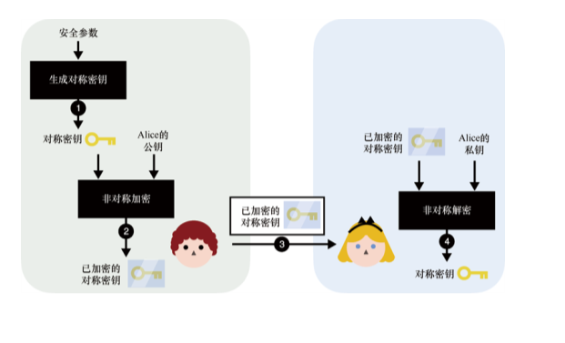
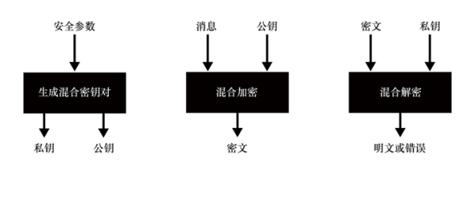
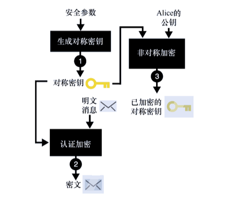
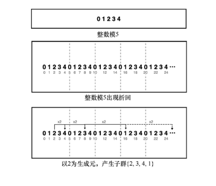
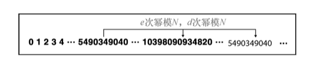
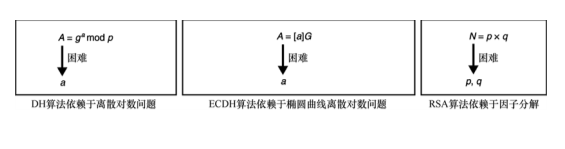
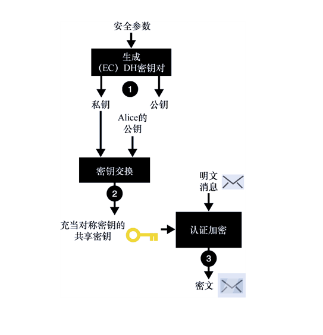

第 6 章　非对称加密和混合加密
本章内容：
● 用非对称密码加密密钥；
● 用混合加密技术加密数据；
● 非对称加密和混合加密标准。
在第 4 章中，我们学习了对称密码中的认证加密算法。该类算法的局限性在于通信双方必须共享同一密钥。本章通过引入非对称加密技术来消除认证加密算法的这一局限性。非对称加密原语可以在不知道对方解密密钥的情况下，使用加密密钥对发送给对方的数据进行加密，并确保对方可以解密。此前我们已经了解到，对称加密只能使用一个对称密钥加密消息，而非对称加密算法有一对公私钥，并用公钥加密消息。
通过学习本章内容，大家将会知道非对称加密也存在局限性，这主要表现在它允许加密的数据长度有限并且加密效率也不高。本章通过将非对称加密和认证加密技术结合起来形成混合加密（Hybrid Encryption），消除这两类算法各自的缺点。
注意：
在学习本章之前，必须先阅读认证加密（见第 4 章）和密钥交换（见第 5 章）这两部分内容。
++6.1　非对称加密简介
首先，让我们先了解非对称加密算法加密消息的方式。非对称加密也称为公钥加密（Public Key Encryption）。本节主要介绍此类密码学原语的性质。现在，让我们通过加密邮件这个实际场景来了解对称加密。
所有的电子邮件都是「明文」发送的，邮件发送者和邮件服务提供商都可以阅读邮件的内容。这样的邮件系统确实不太安全！那么如何提供更安全的邮件服务呢？我们可能会想到使用 AES-GCM 这类第 4 章中的密码原语。为了使用该算法，我们需要事先和每个向我们发送邮件的人共享一个对称密钥。
习题
与通信的每一方都共享相同的密钥是一种非常糟糕的做法，请说明其原因。
然而，我们无法事先知道谁会给我们发邮件。另外，随着向我们发送加密邮件人数的增加，生成和交换新对称密钥也会变成一种非常烦琐的操作。借助非对称加密技术，我们可以有效避免这样的麻烦。非对称加密允许任何知道我们公钥的人向我们发送加密邮件。然而，只有拥有私钥者才能完成解密，即只有我们可以解密已加密的邮件。用非对称加密算法加密消息的过程如图 6.1 所示。

图 6.1　利用非对称加密技术，任何人都可以使用 Alice 的公钥加密发向她的消息。由于只有 Alice 拥有该公钥对应的私钥，所以只有 Alice 可以解密这些消息
在非对称加密原语初始化时，首先需要使用密钥生成算法产生一个密钥对。与密码算法的其他初始化函数一样，密钥生成算法也以安全参数为输入。安全参数的含义是密钥尺寸有多大。一般来讲，密钥越长，密码算法就越安全。图 6.2 展示了密钥生成过程。

图 6.2　在使用非对称加密之前，首先需要生成一个密钥对。输入不同的安全参数，算法可以生成不同安全强度的密钥
密钥生成算法生成的密钥对由两部分组成，即允许公开的公钥和必须保密的私钥。类似于其他密码原语的密钥生成算法，我们也需要向非对称密钥对生成算法输入一个安全参数。任何人都可以使用这个公钥加密消息，而只有私钥拥有者才可以解密已加密消息，该过程如图 6.3 所示。与认证加密算法的解密过程一样，如果密文本身不合法，解密就会失败。

图 6.3　非对称加密算法允许使用接收者的公钥加密消息。接收者可以用公钥对应的私钥解密密文
需要注意的是，到现在为止，我们还没有考虑认证性问题。考虑如下情形：
● 任何人都可以使用 Alice 的公钥加密发向她的消息；
● Alice 无法知道是谁向她发了这条消息。
现在，假设我们可以通过某种方法安全地获得 Alice 的公钥。在第 7 章中，我们会了解在现实协议中解决上述认证性问题的方法。此外，我们还会学习通过密码学方式确定与我们通信的就是 Alice 本人。之后我们就会了解到，只需对发送的消息进行签名即可实现认证。
让我们进入 6.2 节内容，了解非对称加密在实践中的具体使用方式，以及在实践中很少利用它加密消息的原因。
++6.2　实践中的非对称加密和混合加密
我们可能会认为仅仅使用非对称加密技术就足以保证电子邮件安全。实际上，非对称加密算法允许加密的消息长度是有限的。与对称加密相比，非对称加密和解密的速度相当慢。这主要是因为对称加密的操作是面向比特的，而非对称加密的操作常涉及大量复杂的数学运算。
本节先介绍非对称加密的局限性及在实践中的具体用途，再介绍解决非对称加密局限性的方法。本节分为两个部分，分别介绍非对称加密的两种主要用途。
● 密钥交换——使用非对称加密技术进行密钥交换是非常自然的。
● 混合加密——非对称加密可加密的消息长度严重限制了它的实际用途。为了加密更长的消息，我们将会学习更有价值的混合加密原语。6.2.1　密钥交换和密钥封装
非对称加密可以用于密钥交换。执行密钥交换时，首先生成一个对称密钥，然后用 Alice 的公钥加密该对称密钥（该过程称为密钥封装），该过程如图 6.4 所示。
Alice 收到密文后，通过解密密文来获得对称密码密钥。之后，我们和 Alice 之间便有了共享密钥。完整过程如图 6.5 所示。

图 6.4　为了用非对称加密实现密钥交换原语，（1）我们需要先生成一个对称密钥，（2）然后用 Alice 的公钥加密这个对称密钥

图 6.5　为了用非对称加密实现密钥交换原语，（1）我们首先会生成一个对称密钥，（2）再用 Alice 的公钥加密该对称密钥，（3）之后，把加密后的对称密钥发送给 Alice，（4）她可以使用相应的私钥解密密文，获得对称密钥。最终，我们和 Alice 都获得共享密钥。任何人仅仅通过观察加密的对称密钥无法获得这个共享密钥
在许多网络协议中，RSA 算法是利用非对称加密进行密钥交换的常用算法。如今，使用 RSA 算法进行密钥交换的协议越来越少。取而代之的是使用基于椭圆曲线的 ECDH 协议进行密钥交换。这主要是因为基于 RSA 算法的密钥交换协议标准及其实现存在诸多漏洞，以及 ECDH 算法的参数尺寸相对较小。6.2.2　混合加密
在实践中，非对称加密算法仅能加密长度不超过特定上限的消息。例如，RSA 算法允许加密的明文长度上限取决于密钥对生成期间设定的安全参数。更具体地说，非对称加密算法允许的明文长度上限与 RSA 算法模数的大小有关。当前，我们广泛使用的安全参数（模数的长度为 4096 位）允许加密的消息最大长度大约为 500 个 ASCII 字符（这是一条相当短的消息）。因此，大部分的应用会采用混合加密技术，它允许加密的最大消息长度等价于认证加密算法的消息长度上限。
在实践中，混合加密和非对称加密有着一致的接口（见图 6.6）。我们用公钥加密消息，拥有该公钥对应私钥的人可以解密密文。两类加密方式的主要区别在于允许加密的消息长度上限。

图 6.6　除允许加密的消息最大长度不同外，混合加密和非对称加密有相同的接口
实质上，混合加密是非对称加密原语和对称加密原语的组合。具体来说，混合加密相当于先与消息接收者执行非交互式的密钥交换协议，然后使用认证加密算法对消息进行加密和认证。
警告：
在混合加密中，我们可能会使用简单的对称加密算法而非使用认证加密算法去加密消息。然而，对称加密算法不能验证已加密消息是否被篡改。这也是我们在实践中不提倡单独使用对称加密算法加密消息的原因（参见第 4 章内容）。
现在，让我们一起来了解混合加密技术的原理。如果要加密一个发送给 Alice 的消息，首先要生成一个对称密钥，并把该密钥当作认证加密算法的密钥，之后用认证加密算法加密要发送的消息，如图 6.7 所示。
即使 Alice 收到了加密的消息，在没有对称密钥的情况下，她也无法解密消息。我们该如何向 Alice 提供这个对称密钥？答案是使用非对称加密技术，即用 Alice 的公钥加密该对称密钥。该过程如图 6.8 所示。

图 6.7　使用混合加密技术加密发送给 Alice 的消息时，（1）我们先为认证加密算法生成一个对称密钥，（2）再用认证加密算法去加密发送给 Alice 的消息

图 6.8　紧接图 6.7，（3）使用非对称加密算法的公钥加密对称密钥
最终，我们可以将这两个密文都发送给 Alice，它们分别为：
● 用非对称加密算法加密的对称密钥；
● 用对称加密算法加密的消息。
收到上面两个密文后，Alice 通过私钥解密获得对称密钥，再用对称密钥解密已加密的消息。整个过程如图 6.9 所示。
这就是我们使用这两种密码原语的最佳方式：混合使用非对称加密算法和对称加密算法，并用对称加密算法去加密数据。我们常称混合加密算法中第一部分的非对称加密算法为密钥封装机制（Key Encapsulation Mechanism，KEM），称第二部分中的对称加密算法为数据封装机制（Data Encapsulation Mechanism，DEM）。

图 6.9　紧接图 6.8，（4）将加密的对称密钥和消息发送给 Alice 后，（5）Alice 先用私钥解密已加密的对称密钥，（6）再用对称密钥去解密已加密的消息。注意：如果中间人攻击者在第（4）步对通信信道传输的消息进行篡改，第（5）步和第（6）步都会出错
从 6.3 节起，我们将会了解各种各样的非对称加密和混合加密算法（标准）。在进入 6.3 节之前，让我们看一个密码学库中混合加密的使用示例。在该例子中，我们使用 Tink 密码程序库。Tink 由谷歌的密码学家开发，该库的目标是支持本公司和其他外部公司开发大型的密码学应用。由于 Tink 项目规模庞大，因此开发人员在设计上进行精心选择，只向使用者暴露必要的函数，从而达到防止开发人员误用加密原语的目的。另外，Tink 库还支持多种编程语言，如 Java（参见代码清单 6.1）、C++、Objective-C 和 Go 语言。
代码清单 6.1　用 Java 语言实现混合加密
import com.google.crypto.tink.HybridDecrypt；
import com.google.crypto.tink.HybridEncrypt；
import com.google.crypto.tink.hybrid.HybridKeyTemplates
➥ .ECIES_P256_HKDF_HMAC_SHA256_AES128_GCM；
import com.google.crypto.tink.KeysetHandle；
　
KeysetHandle privkey = KeysetHandle.generateNew（   ←---　为一个具体的混合加密实例生成密钥 
   ECIES_P256_HKDF_HMAC_SHA256_AES128_GCM）；          
　
KeysetHandle publicKeysetHandle =    ←---　获得公钥 
   privkey.getPublicKeysetHandle()；      
　
HybridEncrypt hybridEncrypt =    ←---　任何知道这个公钥的人都可以用它加密明文并认证附加数据 
   publicKeysetHandle.getPrimitive（
      HybridEncrypt.class）；
byte[] ciphertext = hybridEncrypt.encrypt（
   plaintext, associatedData）；                             
　
HybridDecrypt hybridDecrypt =    ←---　利用附加数据去解密已加密的消息。如果解密失败，程序会抛出异常 
   privkey.getPrimitive（HybridDecrypt.class）；
byte[] plaintext = hybridDecrypt.decrypt（
   ciphertext, associatedData）；                   
参考代码注释，有助于我们理解字符串 ECIES_P256_HKDF_HMAC_SHA256_AES128_GCM 的含义：ECIES 是一个基于椭圆曲线的混合加密标准的简写。在本章后面的内容中，我们会进一步介绍该算法。这个字符串其余字符表示实例化 ECIES 算法所使用的具体算法。
● P-256 是 NIST 指定的一条椭圆曲线标准，参见第 5 章内容。
● HKDF 是一个密钥派生函数，参见第 8 章内容。
● HMAC 是一个消息认证码算法，参见第 3 章内容。
● SHA-256 是一个哈希函数，参见第 2 章内容。
● AES-128-GCM 是一个使用 128 比特密钥的 AES-GCM 认证加密算法。
想知道这些算法是如何结合在一起的吗？在 6.3 节和 6.4 节，我们将学习两个广泛应用的标准：RSA 非对称加密和 ECIES 混合加密。
++6.3　RSA 非对称加密的优缺点
现在，让我们一起了解非对称加密算法对应的标准。从历史上看，这两种密码原语都没有经受住密码分析人员的严谨分析，密码分析者在这些算法相关的标准和实现中都发现了许多漏洞和弱点。这就是本章先介绍非对称加密算法 RSA 并且不建议使用它的原因。本章剩余部分将介绍可以使用的非对称加密实际标准。6.3.1　教科书式 RSA 算法
在本小节中，我们将了解 RSA 公钥加密算法以及它的标准化历程。这有助于我们理解其他基于 RSA 算法的非对称加密方案的安全性。
RSA 算法自 1977 年首次发布以来，受到了相当多的批评。一种流行的说法是 RSA 算法太容易理解和实现，因此许多人尝试亲自实现该算法，这导致很多协议在实现上存在弱点。这是一个有趣的论断，但是这种论断忽略了一些事实。不仅教科书式的 RSA 算法是不安全的，一些标准中的 RSA 算法也出现被攻破的情况！若想知道 RSA 算法在实现上总出现弱点的原因，我们还得先了解它的工作原理。
还记得我们在第 5 章提到的模数为素数p的乘法群吗？这个群由正整数组成：
我们将这些数中的一个当作消息。当p足够大（比如为 4096 位）时，消息可以包含多达 500 个字符。
注意：
对于计算机来说，消息既可以看作由一系列的字节组成，也可以解释为一个数字。
我们已经知道，通过计算一个数字的幂可以生成其他数字，而这些数字可以构成一个子群，如图 6.10 所示。

图 6.10　模素数 5 的整数被划分成不同的子群。挑选一个元素作为生成元（比如 2），通过计算它的幂可以得到一个子群。对于 RSA 算法而言，子群的生成元就是消息
当定义 RSA 算法的加密函数时，子群的概念非常有用。为了描述加密过程，我们公开一个指数e和素数p（实际上，不要求p一定是素数）。当加密消息m时，我们可以执行如下计算：
例如，当取e = 2、p = 5 时，加密m = 2：
这就是 RSA 算法的加密原理。
注意：
通常，为了快速加密，我们会选择一个较小的公开指数e。历史经验表明，在一些标准和实现中，常将公开指数e设置为 65537。
现在，我们掌握了一种可以让他人向我们发送加密消息的方法。然而，我们怎么才能解密这些已加密的消息呢？我们可以注意到，如果继续对生成元求幂，我们可能会得到原始的数字（见图 6.11）。
这给我们实现解密提供了思路：找出恢复到原始生成元需要对密文求幂的次数。假定这样的幂次已知，我们称它为秘密指数d。如果我们收到密文c：
通过计算c的d次幂，我们可以恢复出原始消息m：

图 6.11　假定消息是数字 2。通过计算该数字的幂，我们可以得到群中的其他数字。如果对它进行足够多次的求幂，我们就可以得到原来的消息 2。这样的群称为循环群。群的这个性质使得通过对密文求幂可以恢复出原始消息
从数学上来看，找到秘密指数d需要一定的技巧。简单地说，我们需要获得公开指数e在模群阶（群中元素的个数）下的逆元：
我们有高效的算法去计算这个逆元，如扩展欧几里得算法，因此计算逆元并不是难事。但是，我们还需要知道群的阶。对于素数p，它的阶（order）是p−1，所以在这种情况下计算秘密指数比较容易。这是因为上述等式中包括d在内的所有值都是公开的。
欧拉定理
我们如何通过计算前面的等式来得到秘密指数d？欧拉定理表明，对任何与p互素的m有：
morder = 1 mod p
其中，order 表示模p整数乘法群中元素的个数。这意味着，对于任意整数乘法：
m1+multiple×order = m × (morder) multiple mod p = m mod p
因此，我们要计算的等式等价于：
me×d = m mod p
上述等式可进一步写成：
e × d = 1 + multiple × order
可以重写成：
e × d = 1 mod order
由定义可知，d是e在模 order 下的逆元。
通过隐藏群的阶，我们可以防止其他人利用公开指数计算出秘密指数。RSA 算法就巧妙地利用了这一思想：如果我们使用的模不是素数，而是两个素数的乘积N = p × q，那么只要不知道p和q，我们就不容易计算出乘法群的阶。
RSA 类型群的阶
欧拉函数(N )会返回与N互素的数的个数，基于该函数，我们可以计算出模N的乘法群的阶。例如，5 和 6 是互素的，因为能够整除这两个数的整数只有 1。而 10 和 15 却不是互素的，这是因为 1 和 5 都是它们的公因子。一个模为N = p × q的 RSA 乘法群的阶为：
(N ) = (p − 1) × (q − 1)
当然，如果N的因子分解未知，那么计算模N乘法群的阶是非常困难的。
综上所述，RSA 算法的工作原理可以概括如下。
（1）密钥生成。
● 生成两个大素数p和q。
● 随机选择一个公开指数e，或者将公开指数e设置为固定值，如e = 65537。
● 公钥由公开指数e和公开的模N = p × q组成。
● 生成秘密指数。
● 私钥就是秘密指数。
（2）加密消息m：计算。
（3）解密密文c：计算。
RSA 算法的实际工作原理如图 6.12 所示。

图 6.12　RSA 算法通过对消息执行模N = p × q的e次幂运算来加密消息，通过对密文执行模N的d次幂运算解密出原始消息
我们常说 RSA 算法依赖因子分解问题（Factorization Problem）。当p和q未知时，任何人都无法计算出模N的乘法群的阶。因此，当公开指数e已知时，没有人可以计算出秘密指数d。这类似于基于离散对数的 DH 算法，如图 6.13 所示。

图 6.13　DH 算法、ECDH 算法和 RSA 算法是依赖于 3 个不同数学困难问题的非对称密码算法。问题的困难性意味着，当用较大的参数实例化这些问题时，我们没有高效的算法可以解决它们
因此，教科书式 RSA 算法需要模一个合数N = p × q，其中p和q均为大素数，且需要保密。现在，我们已了解 RSA 算法的工作原理。接下来，让我们来进一步了解 RSA 算法在实践中不安全的原因，以及标准中的 RSA 算法如何变得安全。6.3.2　切勿使用 PKCS#1 v1.5 标准中的 RSA 算法
我们已经了解教科书式 RSA 算法的基本原理。不过，该算法是不安全的。在了解安全版本的 RSA 算法之前，让我们看看在使用该算法的过程中应该避免哪些问题。
不建议直接使用教科书式 RSA 算法的原因有许多。例如，当加密的消息取值较小（m = 2）时，恶意敌手可以加密取值在 0～100 的所有消息。通过观察已加密消息是否与这些数值中的某个密文相匹配，我们很容易得出密文对应的消息取值。
在 RSA 算法的相关标准中，通过将消息扩展成很大的值，从而使这种类型的暴力攻击失效。具体来说，就是利用非确定性填充方法将消息扩展到算法允许的最大长度。例如，在 PKCS#1 v1.5 标准中，填充消息的方式就是向消息添加一些随机字节，如图 6.14 所示。

图 6.14　PKCS#1 v1.5 标准指定了一种在加密前对消息进行填充的方法。为了避免暴力攻击，必须向消息末尾添加一些随机字节，同时要求填充方法必须是可逆的（保证解密后可以移除填充）
PKCS#1 标准实际上是第一个基于 RSA 算法的标准，该标准属于 RSA 公司在 20 世纪 90 年代初编写的公钥加密标准（PKCS）系列文档的一部分。尽管 PKCS#1 标准修复和完善了一些已知问题，但是在 1998 年，Bleichenbacher 发现了一些针对 PKCS#1 v1.5 的实际攻击，即攻击者可以解密采用标准中指定方法填充过的加密消息。由于这一攻击方法需要近百万条消息，因此该攻击方法也称为百万消息攻击（Million Message Attack）。后来，研究者找到了修复该问题的方法。然而，近年来，重复发生着一件有趣的事情：类似的问题每次被修复后，研究者们就会再次发现新的攻击方法，完全消除这种攻击变成一件不可能实现的事。
适应性选择密文攻击
在理论密码学中，Bleichenbacher 发现的百万消息攻击属于典型的适应性选择密文攻击（Adaptjve Chosen Ciphertext Attack，CCA2）。CCA2 意味着攻击者可以提交任意 RSA 密文（选择的密文），敌手通过观察不同密文对解密的影响，并根据先前的观察继续执行攻击（自适应部分）。在密码学安全证明中，CCA2 常用于刻画敌手行为。
为了理解百万消息攻击奏效的原因，我们需要知道 RSA 算法的密文具有可延展性：我们可以修改 RSA 算法的密文，同时还能保证解密成功。如果获得密文，我们就可以生成如下密文：
解密该密文，我们可以得到如下明文：
在本示例中，我们将原始消息乘 3，但在实践中我们可以对原始消息乘任何数。在实践中，必须严格定义消息的格式（会对消息进行填充），如果直接对密文进行修改，可能会造成密文解密后无法保持正确格式。然而，有时也会出现例外，即对密文的恶意修改不会破坏消息的格式。
Bleichenbacher 正是利用这一性质对 PKCS#1 v1.5 中定义的 RSA 算法进行百万消息攻击的。这种攻击方式的执行过程是：先截获并修改已加密消息，再将其发送给解密者。通过观察解密者是否可以解密消息（即填充格式是否有效），我们可以得到消息范围。由于明文的前两个字节是 0x0002，我们知道解密结果小于某个值。通过迭代执行该过程，我们可以逐步缩小消息范围，直到得到最终的消息。
尽管 Bleichenbacher 的攻击方法影响深远，但是有很多安全系统仍在使用 PKCS#1 v1.5 标准中的 RSA 算法。作为一名安全顾问，我发现许多应用程序容易遭受这种攻击。因此，使用该算法时一定要小心！6.3.3　非对称加密 RSA-OAEP
1998 年，PKCS#1 标准的 2.0 版本正式发布，该标准中包含一个称为最优非对称加密填充（Optimal Asymmetric Encryption Padding，OAEP）的 RSA 算法填充方法。与 PKCS#1 v1.5 标准不同，此版本中的 OAEP 方案不易受到百万消息攻击。因此，该版本指定的 RSA 算法标准更加安全。现在，让我们一起了解 OAEP 的工作原理，以及它能防御百万消息攻击的原因。
与大多数密码算法一样，RSA 的 OAEP 方案也有一个密钥生成算法。该算法以一个安全参数为输入，如图 6.15 所示。
RSA-OAEP 算法的密钥生成算法以一个安全参数为输入。与 Diffile-Hellman 算法一样，RSA-OAEP 算法涉及的所有运算都是模一个大整数下的运算。当谈到 RSA 算法时，常用模数的比特长度度量其安全性。这种做法与先前评估 DH 算法安全性的做法十分类似。
目前，大多数安全指南声称模数在 2048 和 4096 比特之间才能提供 128 比特的安全性。然而，鉴于这些指南的安全性评估方法千差万别，许多应用程序都保守地将模数的长度设为 4096 比特。

图 6.15　与其他公钥加密算法类似，RSA-OAEP 算法需要先生成一个密钥对。之后，该公私钥对可用于该密码学原语的其他算法
注意：
我们知道 RSA 算法的模数不是一个大素数，而是两个大素数的乘积N = p × q。若模数取 4096 比特，密钥生成算法会生成两个长度近似于 2048 比特的大素数p和q。
在执行加密前，算法会先对消息进行填充，再用一些随机数与已填充消息进行混合。然后，用 RSA 算法对预处理过的消息进行加密。解密密文的过程与加密过程刚好相反，如图 6.16 所示。

图 6.16　在加密前，RSA-OAEP 算法会将消息和随机数进行混合。该混合结果在解密后是可逆的。RSA-OAEP 算法的核心是一个可增大和减小输入长度的随机掩码生成函数
将已填充消息和随机数混合后，RSA-OAEP 算法可以确保即便密文泄露一些信息，敌手也无法获得明文本身的任何信息。的确如此，为了剔除 OAEP 方案的填充，我们需要获得填充的所有字节。另外，对密文的任何修改将会产生不正确的明文格式，因此百万消息攻击失效。
注意：
明文自检特性使攻击者很难根据密文生成一个格式正确的可解密密文。OAEP 填充方案正是提供了这种明文自检机制使百万消息攻击方法不再有效。
在 OAEP 填充方案内部，MGF（Mask Generation Function）表示掩码生成函数。在实践中，MGF 是一种可扩展输出函数（eXtendable Output Function，XOF）。在第 2 章中，我们已经学过这类函数。MGF 早于 XOF 出现，它们的基本结构都是反复计算输入数据和一个计数器的哈希值。OAEP 填充方案的工作原理如图 6.17 所示。

图 6.17　MGF 以任意长度的数据为输入产生任意长度的伪随机输出。该函数通过迭代计算输入数据和计数器的哈希值，并将哈希值拼接在一起，得到所需长度的输出
Manger 填充预言机攻击
在 OAEP 标准发布的第 3 年，James Manger 发现了针对 OAEP 方案的时序攻击方法。这种攻击方法与 Bleichenbacher 的百万消息攻击十分类似，且只在 OAEP 方案没有正确实现时才有效。事实上，与 PKCS#1 v1.5 标准相比，OAEP 标准的安全实现更加简单，因此 OAEP 方案在实现上的弱点也更少。
进一步来说，OAEP 方案也并不完美。在随后的几年里，密码学家相继构造出一些更好的方案，并且也对它们进行了标准化。RSA-KEM 算法就属于其中之一，该算法具有更高的安全性，而且其安全实现也更加简单。这个算法的原理如图 6.18 所示。

图 6.18　RSA-KEM 是一个利用 RSA 算法加密随机数的方案。该方案无须对消息进行填充。通过将随机数输入 KDF 算法，产生对称密钥。之后，我们可以使用对称加密算法加密和认证消息
值得注意的是，RSA-KEM 方案用到密钥派生函数（Key Derivation Function，KDF）。KDF 属于另外一种密码学原语，也可以用 MGF 和 XOF 代替该函数。在第 8 章，我们会深入了解 KDF。
当今的许多协议和应用仍在使用不安全的 PKCS#1 v1.5 方案或安全的 OAEP 方案；不过，越来越多的协议不再使用基于 RSA 算法的非对称加密算法，它们倾向于使用 ECDH 密钥交换算法和混合加密算法。这种现象很好理解，ECDH 算法的公钥尺寸更小，该协议的安全实现也相对简单。
++6.4　混合加密 ECIES
目前，密码学家已经提出了许多混合加密方案，而基于椭圆曲线的混合加密标准（Elliptic Curve Integrated Encryption Scheme，ECIES）是应用最为广泛的方案之一。ECIES 方案指定 ECDH 算法为密钥交换协议，该方案已包含在诸如 ANSI X9.63、ISO/IEC 18033-2、IEEE 1363a 和 SECG SEC 1 之类的标准中。不幸的是，每个标准似乎都实现了该方案的不同变体，而不同密码程序库对该混合加密的实现也存在差别。
鉴于这一原因，同一混合加密方案能在实现上保持一致的情形很少出现。尽管这种情况十分令人不悦，但是知道混合加密方案在实现上面临的问题也很重要。如果参与某一协议的所有实现者使用完全相同的实现，并给出混合加密方案详细实现文档，那么所实现协议就不会有问题。
ECIES 方案的工作原理类似于 6.2 节提到的混合加密方案。两个混合加密方案的不同之处在于 KEM 部分的实现，6.2 节提到混合加密方案使用非对称加密算法进行密钥交换，而 ECIES 方案使用 ECDH 算法进行密钥交换。下面让我们来看看 ECIES 方案的详细执行过程。
首先，在加密消息前，我们需要运行 ECDH 算法完成密钥交换，即使用 Alice 的公钥和己方的私钥生成一个临时共享密钥。之后，将共享密钥当作 AES-GCM 这类认证加密算法密钥，对发向 Alice 的消息进行加密。整个过程如图 6.19 所示。

图 6.19　为了使用混合加密方案 ECDH 加密一个发送给 Alice 的消息，（1）需要先生成一个临时的（EC）DH 密钥对。（2）之后，用 Alice 的公钥和己方的私钥生成临时共享密钥。（3）将共享密钥作为对称加密算法密钥，对发送给 Alice 的消息进行认证加密
加密完消息后，将临时公钥和密文一起发送给 Alice。Alice 先用收到的临时公钥和自己的私钥进行密钥交换，生成共享密钥。然后，用这个共享密钥解密密文，恢复出原始消息。如果消息在传输过程中遭到篡改，解密就会出现错误。图 6.20 给出该过程的完整示意。

图 6.20　紧接图 6.19，（4）当己方将临时公钥和密文发给 Alice 后，（5）Alice 可以使用自己的私钥和接收到的公钥执行密钥交换，生成共享密钥。（6）最终，她将共享密钥当作认证加密算法的密钥去解密密文，恢复出原始消息
这就是 ECIES 方案的工作原理。ECIES 方案还存在一个基于 DH 密钥交换协议的变种。该变种算法称为 IES，其工作原理与 ECIES 方案一样，但很少有人使用 IES 混合加密算法。
消除密钥交换输出中的偏差
值得注意的是，图 6.20 所示是 ECIES 方案执行过程的简化版。大多数认证加密原语都要求其使用的对称密钥是均匀随机的。正是因为密钥交换协议输出的密钥是非均匀随机分布的，我们才会用 KDF 和 XOF 进一步处理生成的共享密钥。在第 8 章中，我们会对此有更深入的讲解。
非均匀随机意味着，共享密钥的比特分布在统计上存在 0 多于 1 或者 1 多于 0 的情形。例如，共享密钥的前几个比特总是为 0。
上述方案中将密钥交换协议由 ECDH 变为 DH，就相当于得到一种新的混合加密标准。在第 7 章中，我们将学习数字签名原语，它是本书第一部分中介绍的最后一个公钥密码算法。
习题
为什么不能直接将密钥交换的输出当作对称密码算法的密钥？
++6.5　本章小结
● 我们很少直接使用非对称加密算法加密消息。这主要是因为非对称加密算法允许加密的消息长度相对较小。
● 混合加密由非对称加密算法和对称密码中的认证加密算法组合而成，它可以加密的消息长度与认证加密算法允许加密的消息长度相同。
● 非对称加密标准 RSA PKCS#1 v1.5 中的算法已被攻破。因此，我们应该在新的应用中使用 RSA PKCS#1 v2.2 中的 RSA-OAEP 算法。
● ECIES 是一个广泛应用的混合加密方案。由于 ECIES 算法的参数尺寸较小，并且算法的可靠性更强，所以该算法比基于 RSA 的混合加密方案更受欢迎。
● 不同的密码程序库可能会实现不同的混合加密方案。在实践中，如果使用相同的实现，应用程序之间就不会出现无法互操作的现象。
