# 深入浅出密码学
## 第六章：非对称加密和混合加密
-------------------
[幻灯片 1 - 封面]

# 非对称加密与混合加密
- 基于《深入浅出密码学》第六章
- "探索更强大的加密范式"
- 作者: [您的姓名]
- 日期: [当前日期]

## 引言语
"非对称加密突破了传统对称加密的局限,而混合加密则巧妙结合两者优势,为现代通信提供更完善的安全保障"
-------------------

[幻灯片 2 - 导言]

# 本章内容
1. 非对称加密基础
2. 混合加密技术
3. 主流加密标准

## 学习目标
- 理解非对称加密的工作原理
- 掌握混合加密的应用场景
- 了解RSA和ECIES等标准

## 预备知识
- 认证加密(第4章)
- 密钥交换(第5章)
- 基础密码学概念
-------------------

[幻灯片 3 - 非对称加密简介]

# 非对称加密的基本概念

## 核心特点
- 使用密钥对(公钥/私钥)
- 公钥用于加密
- 私钥用于解密
- 公私钥数学关联

## 典型应用
- 加密电子邮件
- 安全通信
- 数字证书
- 密钥分发

## 优势
- 无需预共享密钥
- 密钥管理更简单
- 支持多方通信

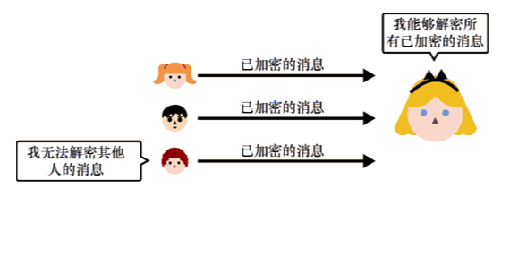
-------------------

[幻灯片 4 - 非对称加密工作流程]

# 工作原理

## 密钥生成
- 生成密钥对
  * 基于安全参数
  * 确保密钥强度
  * 保护私钥安全

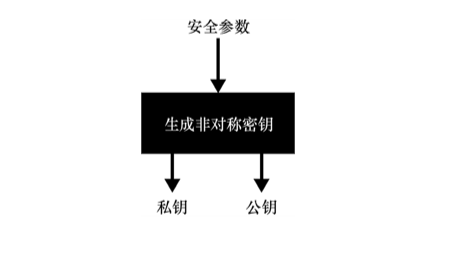

## 加密过程
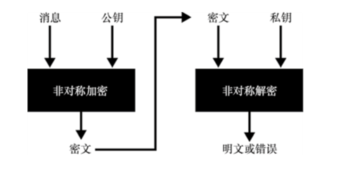
-------------------

[幻灯片 5 - 密钥交换]

# 密钥交换机制

## 基本流程
- 生成对称密钥
- 使用公钥加密
- 安全传输
- 私钥解密获取

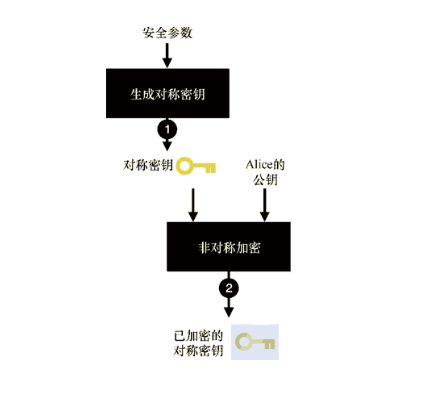
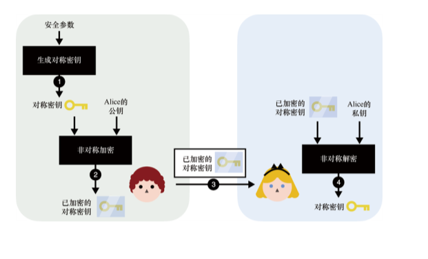
-------------------

[幻灯片 6 - 混合加密]

# 混合加密技术

## 工作原理
- 结合非对称和对称加密
- 克服各自局限性
- 提高加密效率

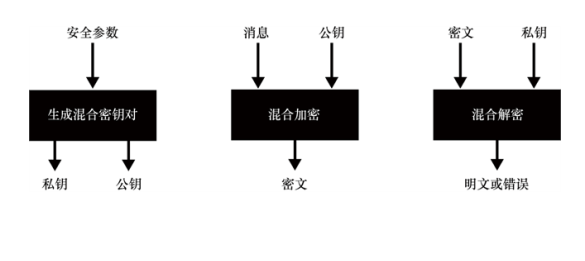
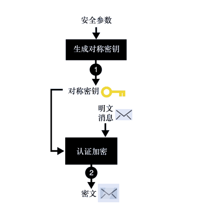
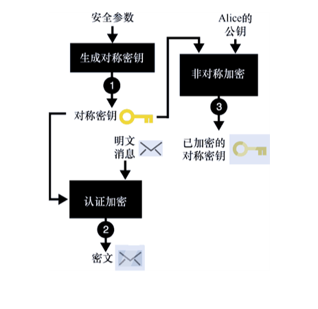
-------------------

[幻灯片 7 - RSA算法]

# RSA加密算法

## 基本原理
- 基于大数分解
- 模幂运算
- 公私钥生成

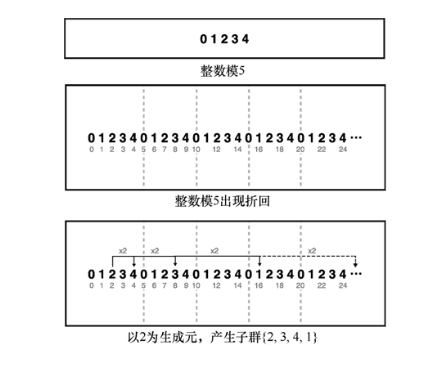
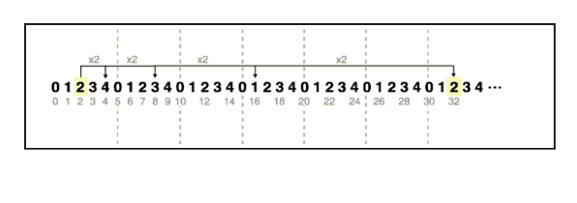
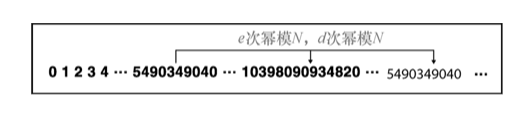
-------------------

[幻灯片 8 - ECIES方案]

# ECIES混合加密

## 特点
- 基于椭圆曲线
- 更小的密钥尺寸
- 更高的安全性

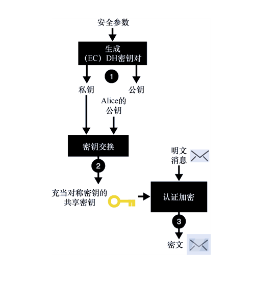
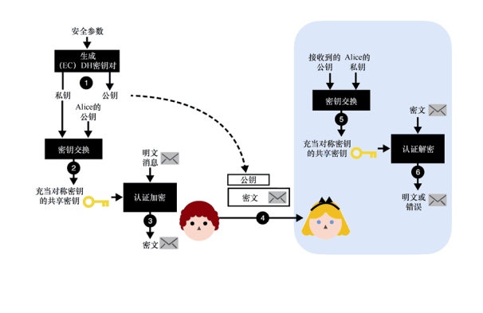
-------------------

[幻灯片 9 - 总结]

# 本章要点

- 非对称加密的基本概念和应用
- 混合加密的工作原理和优势
- RSA和ECIES等主流标准
- 实践中的安全考虑

## 关键收获
- 理解非对称加密的核心机制
- 掌握混合加密的应用场景
- 了解主流加密标准的特点 