第 7 章　数字签名与零知识证明
本章内容：
● 密码学数字签名的概念以及零知识证明；
● 现有的密码学数字签名算法的标准；
● 数字签名的相关细节及避免误用其的方法。
本章我们将学习一种功能强大且应用普遍的密码学原语——数字签名。简单地说，数字签名的作用类似于现实生活中在支票和合同上的签名。当然数字签名是一种密码学技术，相比手写签名，它提供了更多的安全保证。
当数字签名应用在各种各样的协议中时，它会让这些协议具有更加强大的功能。在本书的第二部分，我们将多次遇到数字签名。本章将介绍数字签名的概念、数字签名在现实世界中的使用方法以及现代数字签名算法的标准。最后，我们将讨论使用数字签名时需要注意的安全问题和误用数字签名的危害。
注意：
密码学中的签名通常表示数字签名或签名方案。本书将交替使用这两个术语。
阅读本章之前，需要先学习：
● 第 2 章；
● 第 5 章；
● 第 6 章。
++7.1　数字签名的定义
通过学习第 1 章内容，我们知道数字签名与现实生活中的签名非常相似。该密码学原语是在直观上很容易理解的密码原语之一。
● 只有签名者本人可以对任意消息生成签名。
● 任何人都可以验证签名者对消息的签名。
在非对称密码领域，我们很容易想到数字签名的这种非对称性实现方式。签名方案通常由 3 种不同的算法组成。
● 密钥对生成算法：签名者使用该算法生成新的私钥和公钥（公钥可以共享出去）。
● 签名算法：该算法以私钥和消息为输入，输出消息的签名。
● 验证算法：该算法以公钥、消息以及消息的签名为输入，输出验证结果（通过或不通过）。
有时我们也将私钥称为签名密钥，将公钥称为验证密钥。上述 3 种算法的原理如图 7.1 所示。
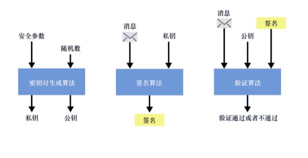
图 7.1　与其他公钥密码算法一样，签名方案首先需要通过密钥对生成算法生成密钥对，该算法要求输入安全参数和一些随机数。然后，在签名算法中输入私钥和消息生成签名，在验证算法中输入公钥、消息以及消息的签名对签名进行验证。任何没有私钥的人都无法伪造出可以通过验证的签名
那么为什么数字签名应用如此广泛呢？这是因为数字签名可以用于验证消息的来源以及完整性。
● 来源：如果这个消息中包含某个人的签名，那么说明该消息源于这个人。
● 完整性：如果有人篡改了消息，签名就会失效。
注意：
虽然数字签名的这两个性质都属于认证性，但通常认为它们是两个不同的性质：来源认证性和消息认证性（或完整性）。
在某种意义上，数字签名类似于我们在第 3 章中学习的消息认证码（MAC）算法。但与 MAC 算法不同的是，数字签名可以让我们以不对称的方式验证消息：参与者可以在不知道私钥或签名密钥的情况下验证消息是否被篡改。接下来，我们将学习数字签名算法在实践中的使用方式。
习题
正如我们在第 3 章中学到的，MAC 算法生成的认证标签必须在固定时间内完成验证，以避免时序攻击。那么数字签名需要在固定时间内完成验证吗？7.1.1　现实应用中计算和验证签名的方法
首先，让我们来看一个实际的例子。在代码清单 7.1 中，我们使用著名的 Python 库 pyca/cryptography 来实现签名方案。代码清单 7.1 中的代码的功能是，先简单地生成一个密钥对，然后使用私钥对消息进行签名，最后使用公钥来验证消息的签名。
代码清单 7.1　使用 Python 实现签名的生成以及验证
from cryptography.hazmat.primitives.asymmetric.ed25519 import （ 
    Ed25519PrivateKey    ←---　使用流行的 Ed25519 数字签名算法 
） 
　
private_key = Ed25519PrivateKey.generate()    ←---　先生成私钥，再生成公钥 
public_key = private_key.public_key()              
　
message = b」example.com has the public key 0xab70...」    ←---　以私钥为输入，运行签名算法对消息进行签名 
signature = private_key.sign（message）                       
　
try:    ←---　以公钥以及消息为输入，运行验证算法对签名进行验证 
    public_key.verify（signature， message） 
    print（「valid signature」） 
except InvalidSignature: 
    print（「invalid signature」）               
正如我们前面所说的那样，数字签名使得许多协议在现实世界中的可扩展性更强。我们将在 7.1.2 小节的示例中理解数字签名提高协议可扩展性的方法。7.1.2　数字签名应用案例：认证密钥交换
第 5 章和第 6 章介绍了协议双方进行密钥交换的两种方式。在这些章中，我们也了解到密钥交换对于协商共享密钥非常有用，而共享密钥可以在后续用于认证加密算法，实现对通信过程的保护。然而，主动敌手可以轻易伪装成密钥交换的双方，因此密钥交换并没有完全解决在两个参与者之间建立安全连接的问题。数字签名算法可以解决中间人伪装成密钥交换双方的问题。
假设 Alice 和 Bob 正试图在彼此之间建立一个安全的通信通道，且 Bob 知道 Alice 的验证密钥。那么，Alice 可以使用签名密钥来向 Bob 认证自己的公钥：Alice 生成密钥交换的密钥对，使用自己的签名密钥对用于密钥交换的公钥进行签名，然后 Alice 将用于密钥交换的公钥及其签名一起发送给 Bob。Bob 可以使用已知的 Alice 的验证密钥去验证签名是否有效，验证通过后就可以使用 Alice 的密钥交换公钥来执行密钥交换。
我们将上述的密钥交换过程称为认证密钥交换（Authenticated Key Exchange）。如果 Bob 验证签名后发现签名无效，他就可以认为有主动敌手干预密钥交换过程。认证密钥交换的过程如图 7.2 所示。
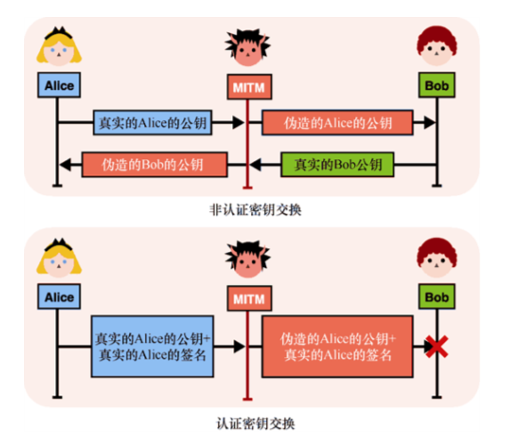
图 7.2　第一张图（上方的图）表示非认证密钥交换，这在主动敌手存在的场景中是不安全的，攻击者可以将通信双方的公钥都换成自己的公钥，从而伪装成通信双方。第二张图片（下方的图）表示认证密钥交换，在密钥交换开始时，Alice 通过对自己的公钥进行签名实现对公钥的认证。由于中间人攻击者篡改过消息后，签名将无法通过 Bob（知道 Alice 的验证密钥）的验证，因此 Bob 可以在签名验证失败时终止密钥交换
注意，在本例中，认证密钥交换中只对一方进行认证：虽然主动敌手不能伪装成 Alice，但却可以伪装成 Bob。如果交换双方都经过认证（Bob 对他的交换公钥进行签名），则该过程称为相互认证的密钥交换（Mutually-Authenticated Key Exchange）。不过到目前为止，数字签名对密钥交换的帮助还不明显。因为我们似乎只是将无法相信 Alice 的密钥交换公钥的问题转化成无法相信 Alice 的验证密钥的问题。7.1.3 小节将介绍认证密钥交换在实际中的使用方式，这将更有意义。7.1.3　数字签名的实际用法：公钥基础设施
在信任可传递的假设下，数字签名将变得更加强大。简而言之，如果你相信我，而我相信 Alice，那么你就可以相信 Alice。
信任的传递性使得系统中的信任关系得到极大地扩展。想象一下，假设我们信任某些权威机构及其验证密钥。那么，假设该权威机构对某些消息进行签名，比如 Charles 或者 David 的公钥信息等，我们就可以选择相信这个签名与消息的映射关系！这种映射称为公钥基础设施（Public Key Infrastructure，PKI）。例如，当我们尝试与 Charles 进行密钥交换，且他声称自己的公钥是 3848 时，可以通过检查我们信任的权威机构是否对类似「Charles 的公钥是 3848…」的消息进行签名来验证 Charles 的公钥的真实性。
PKI 在实践中的一个应用是 Web PKI。浏览器每天都通过 Web PKI 对我们与网站的密钥交换过程进行认证。Web PKI 可以简化如下（见图 7.3）过程：当我们下载浏览器时，它附带了一些内置在浏览器中的验证密钥。此验证密钥与一个权威机构相关联，该机构负责对成千上万个网站的公钥进行签名，以便网络用户可以信任这些公钥，而不必知道权威机构的存在。而用户不能观察到的是，这些网站在获得它们公钥的签名之前，必须向权威机构证明它们确实拥有自己所声称的域名。（事实上，浏览器信任许多权威机构而不仅只有一个。）
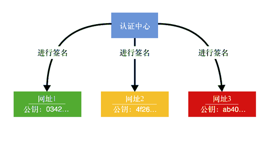
图 7.3　在 Web PKI 中，浏览器相信权威机构可以证明某个域名确实对应于某个公钥。安全访问网站时，浏览器可以通过验证权威机构的签名来验证网站公钥的真实性（即公钥不是来自某些中间人敌手）
在本节中，我们从宏观上了解了数字签名。接下来让我们更深入地了解签名的工作原理。不过在此之前，我们还需要了解零知识证明（Zero-Knowledge Proof，ZKP）的相关知识。
++7.2　零知识证明：数字签名的起源
在密码学中，了解数字签名工作原理的最好方法是了解它的起源。因此，让我们花点儿时间简要介绍一下零知识证明（ZKP），然后重新讨论数字签名。
想象一下，Peggy 想向 Victor 证明自己拥有一些信息。例如，Peggy 想证明她知道某个群元素的离散对数。换句话说，对于一个给定的Y以及群生成元g，Peggy 想要证明她知道一个x，满足Y = gx。
当然，最简单的解决方案是 Peggy 把x（称为见证）发送给 Victor。这就是一个简单的知识证明，但如果 Peggy 不想让 Victor 得到这个x，这个方案就不适用了。
注意：
从理论上讲，如果在一个协议中 Peggy 能向 Victor 证明她知道某个证据，我们就说该协议是完备的。如果 Peggy 不能用协议来证明她确实知道某个见证，那么这个方案就不实用。
在密码学中，我们最感兴趣的是不会将证据泄露给验证者的知识证明，这种证明称为零知识证明，其原理可参考图 7.4。

图 7.4　通过直接公开秘密值，证明者可以向验证者证明自己知道秘密值，但同时也暴露了秘密值7.2.1　Schnorr 身份识别协议：一种交互式零知识证明
在接下来的几页中，我们将从被攻破的协议中逐步构建一个 ZKP，并演示 Peggy 如何证明自己知道x而不透露x。
密码学中处理这类问题的典型方法是使用一些随机值来「隐藏」见证（例如，通过加密）。但我们所做的不仅仅是隐藏：我们还想证明这个见证确实存在。要做到这一点，我们需要一种代数方法来隐藏见证。一个简单的解决方案是将随机生成的值k与见证相加：
然后，Peggy 可以将隐藏了见证的s和随机值k一起发送给 Victor。如果仅仅如此，Victor 没有理由相信 Peggy 确实把见证隐藏在了s中。因为如果 Peggy 不知道见证x，那么s可能只是一些随机值，而 Victor 并无法区分隐藏了x的值与随机值。因此 Victor 还需要知道见证x隐藏在g的指数中，即他需要知道Y = gx。
为了判断 Peggy 是否真的知道见证，Victor 可以检查 Peggy 给他的值是否与他所知道的相符，而且这必须在g的指数中进行（因为见证就隐藏在指数中）。换句话说，Victor 可以检查下面两个数字是否相等：
gS= gk+x
Y×gk= gx×gk= gk+x
这个方案的思想是，只有知道见证x的人才能构造出满足这个等式的「盲」证据s。因此，这是知识的证明。该 ZKP 方案的描述如图 7.5 所示。
但这个方案存在一个问题，显然它是不安全的！事实上，由于隐藏见证x的等式只有一个未知项（x本身），因此 Victor 仅通过移项就可以求出x值：
为了解决这个问题，Peggy 可以把随机值k隐藏起来！这一次，Peggy 将随机值k隐藏在g的指数中（而不是把它与另一个随机值相加），以确保 Victor 的等式仍然有效。
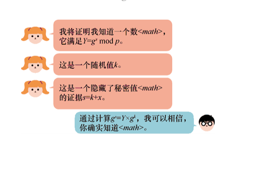
图 7.5　为了向 Victor 证明自己知道证据x，Peggy 将x隐藏（将其与随机值k相加）， 并将隐藏了x的见证发送给 Victor
这样一来，Victor 就无法获得k的值（基于第 5 章提到的离散对数问题的困难程度），也就无法恢复x的值。不过他依然可以验证 Peggy 是否知道x的值！Victor 只需要检查与是否相等。我们构造 ZKP 的第二次尝试如图 7.6 所示。
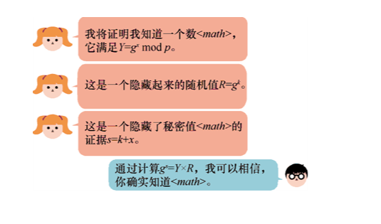
图 7.6　为了使知识证明的过程不透露见证本身，验证人可以用随机值k隐藏见证x， 再将随机值k隐藏在指数中
我们的方案还有最后一个问题，那就是 Peggy 会作弊。她可以在不知道x的情况下让 Victor 相信她知道x！她所要做的就是颠倒她计算证明的步骤。Peggy 首先生成一个随机值s，然后根据s计算R值：
Victor 验证时计算，可以得到与gs相等的结果，因此相信 Peggy 拥有见证x。（这种使用逆运算来计算一个值的技巧也用于密码学中的许多攻击。）
注意：
从理论上讲，如果 Peggy 不能作弊（说明如果 Peggy 不知道x，那么她就不能欺骗 Victor），我们说这个方案是「可靠的」。
如果要确保 ZKP 方案是可靠的，Victor 必须能够确保 Peggy 通过R来计算s，而不是通过s计算R。为此，Victor 使协议具有交互性。
（1）Peggy 必须对随机值k做出承诺，以确保 Peggy 以后无法更改k的值。
（2）在收到 Peggy 的承诺后，Victor 在协议中引入了他自己的一些随机数。他生成一个随机值c（称为挑战），并将其发送给 Peggy。
（3）然后，Peggy 可以根据随机值k和挑战c计算她隐藏了见证x的承诺。
注意：
我们在第 2 章中已经学习了承诺方案，承诺方案使用了哈希函数对一个值做出承诺，稍后揭示该值时该承诺可以证明前后两个值的一致性。但是基于哈希函数的承诺方案不允许我们对隐藏值进行有趣的运算。不过，我们可以简单地将随机值放到生成元（gk）的指数上，以此作为该随机值的承诺。
由于 Peggy 在没有 Victor 的挑战c的情况下无法执行最后一步操作，而 Victor 在没有看到随机值k的承诺的情况下不会将挑战c发送给 Peggy，因此 Peggy 不得不使用k来计算s。最后构成的协议（见图 7.7）通常称为 Schnorr 身份识别协议。
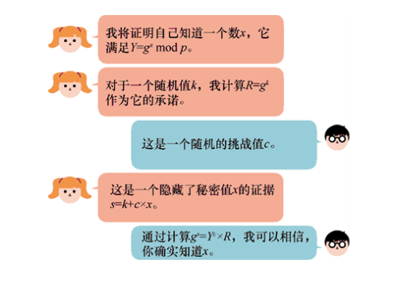
图 7.7　Schnorr 身份识别协议是一个交互式 ZKP，它满足了完备性（Peggy 可以证明她知道一些见证x）、可靠性（Peggy 不知道见证x时无法证明她知道x）、零知识性（Victor 对见证x一无所知）
所谓的交互式 ZKP 方案通常包含 3 个步骤（承诺、挑战和证明），在文献中通常被称为 Sigma 协议，有时写成 ∑（Sigma 的希腊字母表示方法）协议。那么这与数字签名有什么关系呢？
注意：
Schnorr 身份识别协议运行在诚实验证者零知识（Honest Verifier Zero-Knowledge，HVZK）模型下：如果验证者（Victor）不诚实并且没有随机选择挑战c，那么他可以得到见证x的一些信息。一些更强的 ZKP 方案可以确保即使在验证者是恶意的情况下知识证明也是零知识的。7.2.2　数字签名作为非交互式零知识证明
上述的交互式 ZKP 的问题在于它是交互式的，而现实世界中人们通常不希望协议是交互式的。交互式协议增加了一些不可忽略的开销，因为它需要双方发送多条消息（通过网络），并在参与双方不同时在线时会增加无法限制的延迟。因此，应用密码学领域几乎不使用交互式 ZKP。
但这并不说明之前的讨论毫无意义！1986 年，Amos Fiat 和 Adi Shamir 提出了一项技术，该技术可以轻松地将交互式 ZKP 转换为非交互式 ZKP。这项技术（称为 Fiat-Shamir 启发式或 Fiat-Shamir 转换）的关键是让证明者以他们无法控制的方式自己计算挑战。
这项技术的实现方法是，由证明者计算发送和接收的所有消息的哈希值（我们称之为脚本），这个哈希值可以视为交互式协议中的挑战。如果哈希函数的输出与随机数无法区分（即哈希函数的输出看起来是随机的），那么它可以成功地模拟验证者的角色。
Schnorr 在上面的基础之上又注意到任何信息都可以计算哈希值！例如，对一条消息计算哈希值。这样一来，我们得到的不仅是一个能证明我们知道某个见证x的证据，还是对一个与证据相关联（指在密码学上的关联）的消息的承诺。换句话说，如果证据是正确的，那么只有知道见证（此处见证成为签名密钥）的人才能对该消息做出承诺。
那就是签名！数字签名就是非交互式 ZKP。将 Fiat-Shamir 转换应用于 Schnorr 身份识别协议，我们就可以得到 Schnorr 签名方案，如图 7.8 所示。
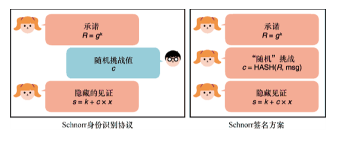
图 7.8　左边的协议是 Schnorr 身份识别协议，它是一个交互式协议。右边的协议是 Schnorr 签名方案，它是 Schnorr 身份识别协议的非交互式版本（其中证明者用脚本的哈希值来代替验证者的挑战消息）
总而言之，Schnorr 签名本质上是两个值，R和s，其中R是对某个秘密随机值的承诺（通常称秘密值为 nonce，因为它需要对每个签名都是唯一的），s是通过承诺R、私钥（见证x）和消息计算的值。接下来，让我们了解一些现代签名算法标准。
++7.3　签名算法的标准
与其他密码原语一样，数字签名也有许多标准，而且有时很难选择具体要使用的标准。这也是本节要讨论的核心问题！好在签名算法的类型与密钥交换算法相似：有基于模大整数运算的算法，如 Diffie-Hellman（DH）和 RSA，也有基于椭圆曲线的算法，如椭圆曲线 DH（ECDH）。
阅读本节之前请读者确保自己充分理解了第 5 章和第 6 章中的算法，因为我们要在这些算法的基础上构造签名算法。有趣的是，提出 DH 密钥交换算法的论文也提出了数字签名的概念（但没有给出解决方案）：
为了开发一种能够用某种纯数字通信形式取代现有书面合同的系统，我们必须找到一种与书面签名具有相同性质的数字形式的签名。任何人都可以很容易地识别签名的真实性，但除了合法签名人之外，其他人都不可能出示有效签名。我们将此类技术统称为单向认证。由于任何数字数据都可以精确复制，因此真正的数字签名必须使任何人都可以在不被察觉的情况下识别其真伪。
——Diffie 和 Hellman（“New Directions in Cryptography”，1976）
一年后（1977 年），第一个签名算法（称为 RSA 签名算法）与 RSA 非对称加密算法（第 6 章讨论了该算法）一起提出。RSA 签名是我们将学习的第一个签名算法。
1991 年，NIST 为了避开使用 Schnorr 签名算法的专利提出了数字签名算法（DSA）。DSA 是 Schnorr 签名算法的一个奇怪变体，它在没有安全性证明的情况下就发布了（尽管到目前为止还没有发现任何攻击）。该算法发布后被广泛采用，但很快被其椭圆曲线版本——ECDSA（椭圆曲线数字签名算法）所取代，其原因与 ECDH 因其密钥较小而取代 DH（见第 5 章）是一样的。ECDSA 是本节将要讨论的第二个数字签名算法。
Schnorr 签名算法的专利于 2008 年到期后，ChaCha20-Poly1305（见第 4 章）和 X25519（见第 5 章）的发明者 Daniel J.Bernstein 基于 Schnorr 签名算法提出了一种新的签名方案，称为 EdDSA（表示 Edwards 曲线数字签名算法）。EdDSA 自提出以来，很快就被广泛接受，并在实用密码学上被认为是最先进的数字签名。EdDSA 是本节将讨论的第 3 个也是最后一个签名算法。7.3.1　RSA PKCS#1 v1.5：一个有漏洞的标准
RSA 签名目前被广泛使用，尽管在某些场景下不应该使用这个算法（在本节我们会看到因滥用 RSA 签名算法引起的许多安全问题）。这是因为该算法是第一个被标准化的签名方案，而现实世界中的应用程序很难更新到更优的算法。在学习实用密码学的过程中很可能会遇到 RSA 签名，因此我们不得不解释它的工作原理及其广泛接受的标准。此外，如果读者在第 6 章中对 RSA 加密的工作原理有较好的理解，那么理解本小节的内容应该很容易，因为 RSA 签名与 RSA 加密的使用方式刚好相反。
● 在签名过程中，我们使用私钥（而非公钥）对消息进行加密，加密的结果是签名（一个群中的随机元素）。
● 在验证过程中，我们使用公钥（而非私钥）对签名进行解密，如果解密的结果是原始的密文，说明这个签名是有效的。
注意：
实际应用中通常是对消息的哈希值计算签名，因为哈希值占用的空间较少（RSA 只能对小于其模数的消息进行签名）。签名的结果用一个大整数表示，以便用于数学运算。
假设我们的私钥是一个秘密的指数值d，公钥是一个公开的指数值e，公开的模数是N，我们可以通过如下方式计算签名和验证签名。
● 计算签名：。
● 验证签名：计算并比较它与 message 是否相等。
上述过程的直观描述如图 7.9 所示。
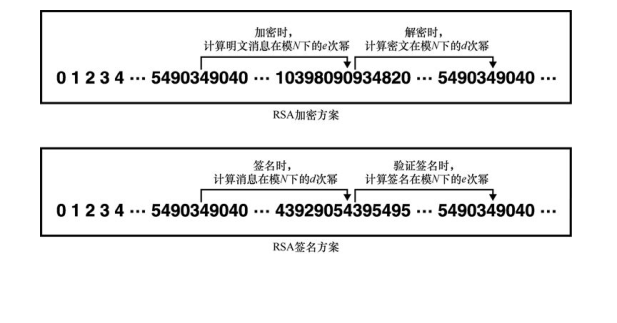
图 7.9　如果要使用 RSA 签名算法，我们只需执行与 RSA 加密算法的相反操作：签名时使用秘密的指数值对消息进行幂运算，验证签名时使用公开的指数值对签名进行幂运算，对比运算的返回值与初始消息即可知道签名是否有效
之所以可以通过 RSA 加密算法构造 RSA 签名算法，是因为只有知道秘密指数值d的人才能生成消息的签名。而且，与 RSA 加密一样，RSA 签名算法的安全性与大整数分解问题的难度密切相关。
那么将 RSA 用于签名的标准是什么呢？它与 RSA 加密算法遵循相同的模式。
● PKCS#1 v1.5 文档对用于加密算法的 RSA 进行了宽松的标准化，该文档还规范化了 RSA 签名算法（但没有安全证明）。
● 然后，PKCS#1 v2 文档将一个结构更好的 RSA 算法（称为 RSA-OAEP）指定为标准。PKCS#1 v2 文档同时也将更优的 RSA-PSS 指定为标准（具有安全性证明）。
我们在第 6 章谈到了 RSA PKCS#1 v1.5。该文档中标准化的签名方案与加密方案几乎相同。对消息进行签名时，首先使用我们选择的哈希函数计算消息的哈希值，然后根据 PKCS#1 v1.5 规定的签名填充方式（类似于同一标准中的加密填充方式）对哈希值进行填充。接下来，用秘密的指数值对填充后的哈希值进行加密。此过程如图 7.10 所示。
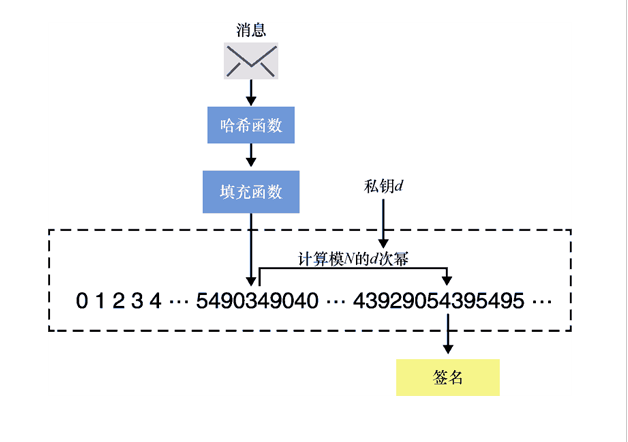
图 7.10　用于签名的 RSA PKCS#1 v1.5 标准。对消息进行签名时，首先计算消息的哈希值，然后根据 PKCS#1 v1.5 规定的填充方式对哈希值进行填充。最后一步是在模N下计算填充后哈希值的d（秘密的指数值）次幂。对签名进行验证时，只需在模N下计算签名的e（公开的指数值）次幂，并验证输出的结果是否与填充的哈希值相等
RSA 拥有许多含义
请注意，不要被与 RSA 相关的各种术语弄糊涂了。RSA 可以指一种非对称加密原语，也可以指一种签名原语。除此之外，RSA 还可以表示由 RSA 的提出者创建的公司。当我们提到 RSA 加密时，大多数人都会想到 RSA PKCS#1 v1.5 和 RSA-OAEP 方案。当提到 RSA 签名时，大多数人都会想到 RSA PKCS#1 v1.5 和 RSA-PSS 方案。
想必上述的内容会让读者感到困惑，尤其是 PKCS#1 v1.5 标准。虽然 PKCS#1 v1.5 中有官方名称来区分加密和签名算法（RSAES-PKCS1-v1#5 加密算法，RSASSA-PKCS1-v1#5 签名算法），但实际中很少看到人们使用这些名称。
我们在第 6 章提到 RSA PKCS#1 v1.5 标准的加密算法容易受到攻击，而且很不幸，该种攻击对 RSA PKCS#1 v1.5 标准的签名算法也同样奏效。1998 年，Bleichenbacher 发现对 RSA PKCS#1 v1.5 标准的加密算法的攻击后，他决定研究针对签名标准的攻击。2006 年，Bleichenbacher 对 RSA PKCS#1 v1.5 的签名标准进行了一次签名伪造攻击，这是针对签名算法的最严重攻击类型之一。攻击者可以在不知道私钥的情况下伪造签名！与直接破坏加密算法不同，伪造签名攻击是对算法具体实现的攻击，安全的签名方案（根据规范）必须抵抗签名伪造攻击。
只要算法实现的漏洞很容易避免并且不会影响其他的实现方式，在算法实现上出现漏洞就没有算法本身的漏洞那么糟糕。不过，2019 年的研究表明，许多 RSA PKCS#1 v1.5 签名算法的开源实现都存在这种漏洞，并以错误的方式实现了该标准（参见 Chau 等人的「Analyzing Semantic Correctness with Symbolic Execution: A Case Study on PKCS#1 v1.5 Signature Verification」）。Bleichenbacher 进行的签名伪造攻击也因为各种算法实现中出现的不同漏洞产生了不同变体。
然而，RSA PKCS#1 v1.5 的签名标准仍然被广泛使用。在出于向后兼容的原因而必须使用此算法时，我们一定要注意上述问题。尽管如此，这并不能说明 RSA 签名是不安全的。接下来我们将继续对 RSA 签名进行更深入的探讨。7.3.2　RSA-PSS：更优的标准
较新的 PKCS#1 v2.1 标准对 RSA-PSS 算法进行了标准化，标准中还包含 RSA-PSS 算法的安全性证明（与之前 PKCS#1 v1.5 中标准化的签名方案不同）。新的签名方案的工作原理如下。
● 使用 PSS 编码算法对消息进行编码。
● 使用 RSA 签名对编码后的消息进行签名（与之前 PKCS#1 v1.5 中标准化的签名方案相同）。
PSS 编码算法有点儿复杂，它类似于 OAEP（最优非对称加密填充）。PSS 算法的流程如图 7.11 所示。
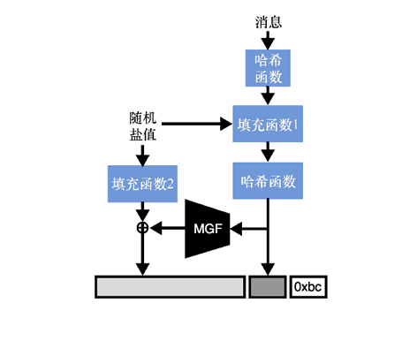
图 7.11　RSA-PSS 签名方案首先使用掩码生成函数（Mask Generation Function，MGF）对消息进行编码，就像第 6 章学习的 RSA-OAEP 算法一样，然后以常规的 RSA 签名方式对其进行签名
验证 RSA-PSS 算法生成的签名时，只需在模N（公开模数）下计算签名的e（公钥）次幂后反编码即可。
PSS 的可证明安全性
PSS（表示概率签名方案）是可证明安全的，即任何人都不能在不知道私钥的情况下伪造签名。RSA-PSS 的安全性证明并不是直接证明「如果 RSA 是安全的，那么 RSA-PSS 就是安全的」这一结论，相反，它证明的是该结论的逆否命题：如果敌手可以攻破 RSA-PSS 算法，那么敌手也可以攻破 RSA 算法。这是密码学中证明某种结论的常用方法。当然，这个结论只有在 RSA 是安全的情况下才有效，因此我们必须在证明中先假设 RSA 是安全的。
我们在第 6 章中还谈到了 RSA 加密的第 3 种算法（称为 RSA-KEM 算法）——一种更简单的算法，虽然没有人使用过这种算法，但它也被证明是安全的。有趣的是，RSA 签名也经历过类似 RSA 加密的发展历史，RSA 签名有一个非常简单的算法，但几乎无人使用，它被称为全域哈希（Full Domain Hash，FDH）。FDH 的工作原理是先计算消息的哈希值，然后使用 RSA 对消息的哈希值进行签名（将摘要表示为一个数字）。
尽管 RSA-PSS 算法和 FDH 算法都提供了安全性证明，并且在算法实现时不容易出错，但现今的大多数协议仍然使用 RSA PKCS#1 v1.5 进行签名。这是另一个由于算法没有得到普遍认同而导致算法更新缓慢的例子。由于较旧的算法实现必须与较新的算法实现配合使用，因此很难完全删除或替换旧算法。想一想不更新应用程序的用户、不提供软件新版本的供应商、无法更新的硬件设备等，我们就可以理解这个问题了。接下来，让我们了解最新的数字签名算法。7.3.3　椭圆曲线数字签名算法
本小节我们将学习椭圆曲线数字签名算法（Elliptic Curve Digital Signature Algorithm，ECDSA），它是 DSA 的一种椭圆曲线变体，其发明初衷只是避免使用 Schnorr 签名的专利。许多标准中都规定了签名方案，这些标准包括 ISO 14888-3、ANSI X9.62、NIST 的 FIPS 186-2、IEEE P1363 等。但是并非所有标准都是兼容的，这可能会给签名方案的使用带来问题，因为想要进行交互的应用程序必须使用相同的签名算法标准。
ECDSA 的缺点和 DSA 一样，它也没有提供安全性证明，但 Schnorr 签名却提供了安全性证明。尽管如此，ECDSA 已经被广泛采用，并且是最常用的签名方案之一。在本小节中，我们将学习 ECDSA 的工作原理以及使用方法。与此类方案中的其他算法一样，ECDSA 几乎总是根据相同的公式生成公钥：
● 私钥是随机生成的一个大数；
● 公钥是通过计算群生成元与x的乘积得到的。
具体来说，在 ECDSA 中，公钥通过计算[x]G获得，它是标量x与基点G的标量乘积。
加法还是乘法？
在椭圆曲线中，我们常使用加法符号表示群运算（根据椭圆曲线的语法，将标量放在括号里），但是如果想使用乘法表示法，我们也可以写为 public_key = Gx。这些差异在实践中并不重要。大多数情况下，加密协议并不关心群的基本性质，它们往往使用乘法表示群运算，但在基于椭圆曲线群定义的协议更倾向于使用加法表示群运算。
与 Schnorr 签名相同，计算 ECDSA 签名时需要的输入也为待签名消息的哈希值H(m)、私钥x和唯一的随机数k。ECDSA 产生的签名包含r和s两个整数，其计算方式如下：
● r是[k]G曲线的横坐标；
● s=k−1(H(m) + xr)mod p。
ECDSA 签名的验证过程输入是：验证方需要计算相同消息的哈希值H(m)、签名者的公钥以及签名值r和s。签名验证流程如下：
● 计算[H(m)s−1]G + [rs−1]public_key；
● 验证上述运算得到的点的横坐标是否与签名值中的r相等。
很明显，ECDSA 签名与 Schnorr 签名有一些相似之处。随机数k有时被称为 nonce，因为它是只能使用一次的数字，而且由于它必须保密，有时也称其为临时密钥。
注意：
此处必须重申一个问题：k永远不能重复使用，它必须是不可预测的！否则，恢复私钥将变得十分简单。
通常，nonce（k值）会由密码学库在后台生成，但有时也会由算法调用方来提供。而由算法调用方提供 nonce 正是产生安全风险的原因。例如，在 2010 年，索尼的 Playstation 3 被发现在使用 ECDSA 时应用了重复的 nonce，从而导致私钥的泄露。
注意：
另一种更不易察觉的风险是，如果 nonce（k值）不是均匀随机选取的（比如能够预测 nonce 的前几位），那么仍然存在能够立即恢复私钥的有效攻击（格攻击算法）。理论上，我们称这些类型的密钥检索攻击为完全攻破攻击（因为它攻破了整个方案！）。这样的完全攻破攻击在实践中是非常罕见的，往往使得 ECDSA 以出乎意料的方式被攻破。
出于上述原因，许多人尝试寻找避免 nonce 重复使用的方法。例如，RFC 6979 指定了一个确定性 ECDSA 方案，该方案基于消息和私钥生成一个 nonce。这种做法使得同一消息的两次签名使用的 nonce 是相同的，因此会产生两个相同的签名（不过这显然不会产生安全问题）。
ECDSA 中经常使用的椭圆曲线与 ECDH 密钥交换算法（见第 5 章）经常使用的曲线几乎相同，但有一个例外：Secp256k1 曲线。Secp256k1 曲线在《高效密码群标准》（Standards for Efficient Cryptography Group，SECG）的第二节「Recommended Elliptic Curve Domain Parameters」中定义。由于我们在第 5 章中提到的 NIST 曲线缺乏信任的问题，在比特币决定使用 Secp256k1 曲线而不使用更为流行的 NIST 曲线后，Secp256k1 曲线就获得了很多关注。
Secp256k1 是 Koblitz 类型的椭圆曲线，该曲线是一条参数受到约束的椭圆曲线，它实现了对椭圆曲线上某些操作的优化。这个椭圆曲线表示为如下等式：
其中a固定为 0，b固定为 7，x和y是集合{0,1,2,3，…， p−1}中的元素，p定义为：
这定义了一个素数阶群，就像 NIST 曲线一样。现在我们有了一个有效公式，可以计算椭圆曲线上点的数量。Secp256k1 曲线中点的数量（包括无穷远处的点）是下面的素数值：
115792089237316195423570985008687907852837564279074904382605163141518161494337
我们使用一个固定坐标的点G作为生成元（或者基点），该点的横纵坐标如下：
尽管如此，如今 ECDSA 主要使用 NIST 的曲线 P-256（有时称为 Secp256r1；注意它与 Secp256k1 的命名区别）。接下来，让我们看看另一个广受欢迎的签名方案。7.3.4　Edwards 曲线数字签名算法
接下来我们介绍本节的最后一个签名算法，Edwards 曲线数字签名算法（Edwards-curve Digital Signature Algorithm，EdDSA）。在 NIST 和美国政府机构公布的曲线存在信任问题的背景下，Daniel J.Bernstein 于 2011 年提出 EdDSA。从 EdDSA 的名称看起来似乎表示它与 ECDSA 一样基于 DSA，但其实不是。由于 Schnorr 签名的专利在 2008 年初到期，因此 EdDSA 实际上是基于 Schnorr 签名构造的。
EdDSA 的一个特殊之处在于，该方案不要求每次签名都使用全新的随机数。EdDSA 是确定性的。这使得该算法非常有吸引力，因此自提出以来，许多协议和标准都相继采用该算法。
EdDSA 有望纳入 NIST 即将更新的 FIPS 186-5 标准（截至 2021 年初仍为草案）。目前的官方标准是 RFC 8032，它定义了可以用于 EdDSA 的两条不同安全级别的曲线。这两条曲线属于扭曲的 Edwards 曲线（是一种在实现时可以进行有效优化的椭圆曲线）。
● Edwards25519 是基于 Daniel J.Bernstein 提出的 Curve25519（见第 5 章）设计的。由于这种类型的椭圆曲线可以进行优化，因此 Edwards25519 的曲线操作在实现上比 Curve25519 更快。但由于这种类型的曲线是在 Curve25519 之后提出的，因此基于 Curve25519 的密钥交换曲线 X25519 并没有从中受益。与 Curve25519 一样，Edwards25519 的安全级别达到 128 比特。
● Edwards448 是基于 Mike Hamburg 提出的 Ed448-Goldilocks 曲线设计的，它的安全级别达到 224 比特。
实际上，实例化 EdDSA 时通常使用的是 Edwards25519 曲线，将这个实例化的算法称为 Ed25519（使用 Edwards448 曲线的 EdDSA 实例简称为 Ed448）。EdDSA 生成的密钥与现有的其他方案略有不同。EdDSA 不直接生成签名密钥，而是首先生成一个密钥并用它派生实际的签名密钥和 nonce 密钥。这个 nonce 密钥很重要，它会以确定性的方式生成每个签名所需要的 nonce。
注意：
不同的密码学库会采用不同的方式存储签名密钥和 nonce 密钥，有些库将它们存储成一个密钥，而另外一些库则单独存储这两个密钥。当了解这一点后，再遇到 Ed25519 密钥被存储为 32 字节或 64 字节（取决于所使用的实现）的情况，我们就不会感到困惑了。
计算签名时，EdDSA 首先计算 nonce 密钥（nonce key）与待签名消息的哈希值作为 nonce 值。算法之后的执行过程类似于 Schnorr 签名，其流程如下。
（1）计算 nonce：nonce 值为。
（2）计算R值：R值（也即承诺值 commitment）为[nonce]G，其中G是群的基点。
（3）计算挑战：挑战值为。
（4）计算证据：证据S为。
最终的签名是(R, S)。EdDSA 的签名流程如图 7.12 所示。
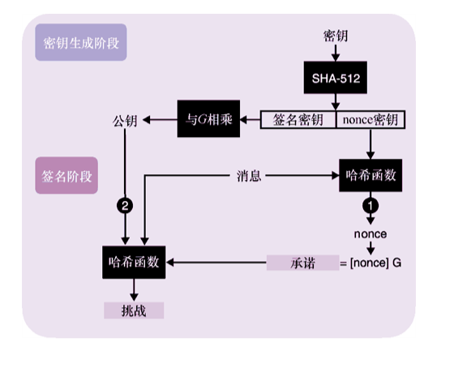
图 7.12　EdDSA 的密钥生成算法生成一个密钥，然后用它派生另外两个密钥。算法生成的第一个密钥是实际的签名密钥，该签名密钥可用于生成公钥；算法生成的另一个密钥是 nonce 密钥，用于在签名时确定性地生成 nonce。EdDSA 签名与 Schnorr 签名类似，不同之处在于（1）EdDSA 用 nonce 密钥和消息确定性地生成 nonce，以及（2）签名者的公钥包含在挑战中
我们还需要知道从 nonce 密钥和给定消息中确定性地生成 nonce（或临时密钥）的方法。上述做法使得对两个不同的消息签名时使用的 nonce 也是不相同的，巧妙地防止了签名者由于重用 nonce，导致泄露密钥的问题（ECDSA 可能会出现这种问题）。对同一消息进行两次签名使用的是相同的 nonce，也会产生两次相同的签名。不过这显然不会产生安全问题。签名可通过计算以下两个值进行验证：
如果上面两个值相等，则说明签名是有效的。这就是 Schnorr 签名的工作原理，区别仅仅是 EdDSA 使用椭圆曲线群，并且使用加法符号表示群运算。
Ed25519 算法是应用最广泛的 EdDSA 实例，它指定使用 Edwards25519 曲线以及 SHA-512 哈希函数。Edwards25519 曲线上的所有点均满足以下等式：
其中，d是一个大整数，其值如下：
变量x和y是在模大素数p下的值，该大数表示为 2255−19（与 Curve25519 中使用的素数相同）。基点G的坐标如下：
RFC 8032 定义了基于 Edwards25519 曲线的 EdDSA 的 3 种变体。这 3 种变体都使用相同的密钥生成算法，但签名和验证算法则不同。
● Ed25519（或 pureEd25519）：这就是之前学习的算法。
● Ed25519ctx：此算法引入了强制自定义字符串，而且在现实中很少使用。它与上一个算法唯一的区别是，在消息中添加一些用户选择的前缀之后再调用哈希函数计算消息的哈希值。
● Ed25519ph（或 HashEd25519）：该算法允许应用程序在对消息签名之前对其进行预哈希化（该算法名称中 ph 的含义就是指预哈希）。此外，它是基于 Ed25519ctx 算法构造的，允许调用方输入可选的自定义字符串。
在密码方案中添加自定义字符串在密码学中非常常见，正如我们在第 2 章中看到过的一些哈希函数，以及即将在第 8 章学习的密钥派生函数。当协议中的参与者在不同的上下文中使用相同的密钥对消息进行签名时，自定义字符串是一个很有效的补充。假如有这样一个应用程序，它允许我们使用私钥对交易内容进行签名，也允许我们向通信的对方发送一些私有消息的签名。如果我们把一个看似交易的信息当作秘密消息进行签名并发送给敌手 Eve，他就无法区分签名对应的两种不同类型的有效负载，敌手 Eve 可能会尝试将私人信息的签名当作有效交易信息重新发布。
Ed25519ph 算法的提出完全是为了满足对大消息签名的需求。正如我们在第 2 章中学到的，哈希函数通常提供一组「init()、update()、finalize()」接口，允许连续地计算数据流的哈希值，而不必将整个输入数据保存在内存中。
到目前为止，本章已经介绍完现实世界中常用的签名算法。接下来，让我们看看在使用这些签名算法时，可能会出现的误用情况。但首先我们需要回顾一下。
● RSA PKCS#1 v1.5 算法仍在广泛使用，但该算法在实现上很容易出现错误，它的许多实现已被攻破。
● RSA-PSS 算法具有安全性证明，易于实现，但由于新的基于椭圆曲线的方案性能更好，因此采用该算法的应用程序也比较少。
● ECDSA 是 RSA PKCS#1 v1.5 的主要竞争对手，它在实现时主要使用 NIST 的 P-256 曲线，但在「加密货币」领域它主要使用 Secp256k1 曲线。
● Ed25519 是基于 Schnorr 签名方案构造的，已被广泛采用，与 ECDSA 相比它更易于实现。Ed25519 不要求每次签名都选择新的随机值。我们应该尽量使用该算法。
++7.4　签名方案特殊性质
签名方案可能具有许多特殊的性质。虽然这些性质在大多数协议中可能并不重要，但在设计更复杂和非常规的协议时，如果没有意识到这些「陷阱」，最终可能会导致协议出现安全漏洞。本章末尾将重点介绍数字签名中已知的安全问题。7.4.1　对签名的替换攻击
数字签名不能唯一标识一个密钥或消息。
——Andrew Ayer（“Duplicate Signature Key Selection Attack in Let’s Encrypt”，2015）
替换攻击，也称为重复签名密钥选择（Duplicate Signature Key Selection，DSKS），这种攻击对 RSA PKCS#1 v1.5 算法和 RSA-PSS 算法也都奏效。DSKS 攻击有两种变体。
● 密钥替换攻击：给定一个签名以及消息，敌手可以找到新的密钥对或公钥，使得给定的签名和消息能够通过验证。
● 消息密钥替换攻击：给定一个签名，敌手可以找到新的密钥对或公钥，使得给定签名与一个新消息能够通过验证。
第一种攻击要求消息和签名不变；第二种攻击只要求签名不变。这两种攻击的过程如图 7.13 所示。
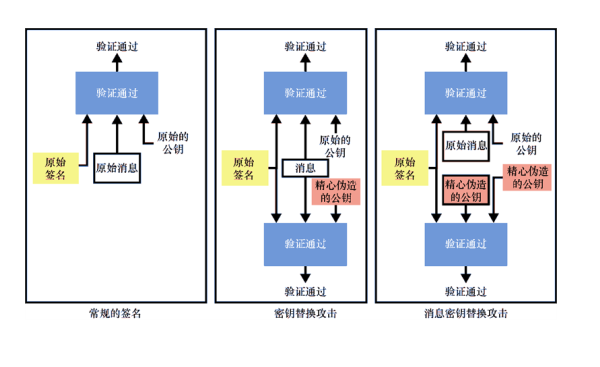
图 7.13　RSA 等签名算法容易受到密钥替换攻击，大多数密码算法使用者都不希望发生这样的事情。密钥替换攻击允许敌手获取某个消息的签名，并创建新的密钥对来验证原始签名。密钥替换攻击有一种称为消息密钥替换攻击的变体，它允许攻击者生成一个新的密钥对和一个能够使得原始签名通过验证的新消息
自适应选择消息攻击下的存在不可伪造性（Existential Unforgeability under Adaptive Chosen Message Attack，EUF-CMA）
替换攻击是理论密码学和应用密码学之间存在不同的典型表现。在密码学中通常使用 EUF-CMA 模型分析签名的安全性，该模型表示自适应选择消息攻击下的存在不可伪造性。在这个模型中，我们生成一个密钥对，然后敌手向我们询问对多个任意消息的签名。当敌手获取签名后，如果能够在某个时间点生成一个有效的签名，而且该签名对应的消息是敌手之前没有询问过的，那么敌手获胜。不过，EUF-CMA 模型似乎并没有涵盖特殊的攻击情况，并且没有考虑到像替换这样隐蔽的威胁。7.4.2　签名的可延展性
2014 年 2 月，曾经最大的比特币交易所 MtGox 关闭并申请破产，声称攻击者利用延展攻击来耗尽其账户。
——Christian Decker 和 Roger Wattenhofer（“Bitcoin Transaction Malleability and MtGox”，2014）
大多数签名方案都是可延展的：给定一个有效的签名，敌手可以修改该签名，使其成为不同的但仍然有效的签名。虽然敌手不知道签名密钥是什么，但却可以设法生成一个新的有效签名。
不可延展性并不要求签名一定是唯一的：签名者通常可以为同一条消息生成不同的签名。可验证随机函数（我们将在第 8 章中看到）之类的构造依赖于签名的唯一性，因此这些构造必须解决签名的唯一性问题或使用具有唯一性的签名方案（如 Boneh-Lynn-Shacham 或 BLS 签名方案）。
那么这些事情能说明什么问题呢？请放心，现有的签名方案绝对不会因可延展性而被攻破，如果我们使用的不是开箱即用的签名方案，可能就不必担心这个问题。但是，如果正在设计密码协议，或者正在实现一个比常见密码协议更复杂的协议，我们需要把这些细节牢记在心。
强 EUF-CMA 安全模型
SUF-CMA（表示强 EUF-CMA 安全）是一种新的安全模型，它在签名方案的安全定义中包含不可延展性（或抗延展性）的要求。最近的一些标准，如 RFC 8032，其中规定了 Ed25519 方案，它包括针对延展性攻击的缓解措施。但由于这些缓解措施并非总是存在或通用，因此我们永远不应该让协议的安全性依赖于签名的不可延展性这一假设。
++7.5　本章小结
● 数字签名的作用类似于手写签名，但在密码学签名中，任何没有签名密钥（私钥）的人都无法伪造数字签名。
● 数字签名可用于验证来源（例如，密钥交换的一方）以及提供可传递的信任（如果我信任 Alice，而 Alice 信任 Bob，那么我可以信任 Bob）。
● 零知识证明（ZKP）允许证明人证明自己知道某一特定信息（称为「证据」），而无须透露该信息。签名可以被视为非交互式 ZKP，因为在签名操作期间，它们不要求验证方在线。
● 我们可以使用的签名算法标准有如下几种。
❏ RSA PKCS#1 v1.5 算法目前被广泛使用，但由于该方案在实现上很容易出现漏洞，因此并不推荐使用该方案。
❏ RSA-PSS 算法是一个更好的签名方案，它更易于实现，并且具有安全性证明。不过，由于它的椭圆曲线变体支持更短密钥，因此 RSA-PSS 算法现在并不流行。
❏ 目前最流行的签名方案是基于椭圆曲线的 ECDSA 和 EdDSA 算法。ECDSA 算法常使用 NIST 的 P-256 曲线实现，EdDSA 算法常使用 Edwards25519 曲线（该方案与曲线的结合称为 Ed25519 方案）实现。
● 如果以非常规方式使用签名算法，则签名算法的某些性质可能会带来安全问题。
❏ 始终避免消息的签名者不明确的问题，因为某些签名方案容易受到密钥替换攻击。敌手可以生成一个新的密钥对，用于验证给定消息已经存在的签名，或者生成一个新的密钥对和一条新消息，用于验证给定的签名。
❏ 不要依赖于签名的唯一性。首先，在大多数签名方案中，签名者可以为同一消息创建任意数量的签名。其次，大多数签名方案是可延展的，这意味着敌手可以获取签名并为同一消息生成另一个有效签名。