第 8 章　随机性和秘密性
本章内容：
● 随机性的定义及其重要性；
● 获得强随机性及产生秘密信息的方法；
● 随机性的隐患。
本章是第一部分的最后一章。在第二部分，我们将学习一些在现实中广泛应用的协议。在进入本书第二部分之前，我们还要重点介绍一个知识点，即随机性。
我们已经注意到，在密码学的算法（除哈希函数外）中，密钥、Nonce、初始向量（IV）、大素数生成等都会涉及随机性这个概念。当生成这些密码学信息时，我们总是假定随机数来源于一个神奇的黑盒子。这并非反常之事。在密码学白皮书中，通常用一个顶部带美元符号的箭头（）来表示随机性。但在某个时刻，我们的心头会有这样的疑问「这种随机性究竟来自何方？」
本章将给出随机性在密码学中的准确定义。本章还会告诉我们在现实世界中产生密码算法所需随机性的方法。
注意：
在阅读本章内容之前，需要先阅读第 2 章「哈希函数」和第 3 章「消息认证码」这两章的内容。
++8.1　随机性的定义
每个人都知道随机性这个概念，但是对随机性的理解存在较大差别。无论是掷骰子还是买彩票，最终结果都会呈现出随机性。我第一次意识到随机性时年龄还很小。当时我在按计算器上的 RAND 按钮，每次按下都会产生不同的数字。这件事情一直困扰着我。尽管那时我对电子学知之甚少，但我意识到这个计算器在产生随机数方面存在一些局限性。当我把 4 和 5 加在一起时，肯定有一些电路会做数学运算并给出结果。但是，当按下 RAND 按钮时会发生什么呢？随机数从哪里来？我无法弄清楚它的本质。
在花了一些时间之后，我找到了问题的正确答案，并知道计算器实际上在以作弊的方式产生随机数！计算器内部硬编码了大量的随机数，当按下 RAND 按钮时，它会逐一显示这些随机数。这些随机数列表现出良好的随机性，这意味着如果观察得到的随机数，我们会发现 1 和 9、1 和 2（以此类推）出现的次数几乎一样多。这些随机数列模拟了均匀分布（Uniform Distribution），这些数字出现的概率几乎相同。
在安全类和密码学应用中，随机数表现出的随机性必须不可预测。当然，没有人会将这些计算器产生的「随机数」用于任何与安全相关的应用中。通常，我们会从不可预测的物理现象中提取密码学应用所需的随机数。
例如，掷骰子的结果就很难预测（即便掷骰子是一个确定的过程）。如果知道所有的初始条件（如骰子投掷方式、骰子本身特性、空气摩擦、桌子的抓地力等），我们或许可以预测抛掷结果。也就是说，所有这些因素对最终结果的影响很大，以至于对初始条件的微小变动都会影响最终的投掷结果。若某种结果对其初始条件极端敏感，我们称之为混沌现象。这也是超过一定天数之后无法准确预测天气情况的原因。
在访问 Cloudflare 公司的加利福尼亚州总部时，我无意间拍到下面这张照片（图 8.1）。LavaRand 是一面摆着熔岩灯的墙，而每个熔岩灯的外观都像凝固的蜡一样，呈现出不可预测性。在墙前放置一个摄像头，获得这些熔岩灯的图像，就可从中提取出一些随机字节。

图 8.1　形状呈现出随机性的熔岩灯
通常，应用程序会利用操作系统来获取其所需的随机性，而操作系统会利用其所运行的软硬件设备来收集随机性。随机性的常见来源（也称为熵源）可能是硬件中断时间（如鼠标移动时间间隔）、软件中断时间、硬盘寻道时间等。
熵源
在信息论中，熵用来度量一系列数字或者数据包含的随机性大小。这个术语是克劳德·香农（Claude Shannon）创造的，他提出了熵的计算公式。数列越表现出不可预测性，熵值公式计算结果就会越大（熵值为 0 表示完全可预测）。我们对熵值及其计算公式并不感兴趣，但在密码学中，我们会经常听到「此数列具有的熵值较低」（意味着它是可预测的）或「此数列具有的熵较高」（意味着它是不可预测的）。
通过观察，我们会发现在计算机里中断和其他事件都无法产生很大的随机性；当设备启动时，这些事件往往表现出高度可预测性，同时这些设备也很容易受到外部因素的影响。今天，越来越多的设备使用额外的传感器和硬件辅助设备来提供更好的熵源。这些硬件随机数发生器通常被称为真随机数发生器（True Random Number Generator，TRNG），它们利用外部不可预测的物理现象（如热噪声）来获取随机性。
通常，从这些设备获得的噪声都不会有很好的随机性，有时它们甚至不能提供足够的熵。例如，从噪声源获得的随机比特有较大的概率是 0，或者连续好多比特都一样。因此，必须从多个随机噪声源提取随机信息，才能获得足够的随机性，并将其应用于密码学算法。例如，我们可以用哈希函数计算每个噪声源输出的摘要，并将这些摘要进行异或运算，最终得到密码算法所需的随机信息。
这是获得随机性的完整过程吗？答案是否定的。从噪声中提取随机性是一个相当缓慢的过程。对于一些需要快速产生大量随机数的应用程序而言，提取随机性操作可能会成为应用程序的性能瓶颈。在 8.2 节中，我们将介绍操作系统及一些应用程序提升随机数生成速度的方法。
++8.2　伪随机数发生器
在密码学中，随机性无处不在。然而，并非只有密码学大量用到随机数。例如，像 ls 这样的简单 Unix 命令也用到随机性！如果程序中的 bug 被利用，就可能对系统造成毁灭性的后果。因此，二进制软件试图使用各种技巧抵御底层攻击。地址空间布局随机化（Address Space Layout Randomization，ASLR）就是这些技术中的一种，该技术会在进程每次运行时用随机数随机化进程的内存布局。另一个应用随机数的例子是，网络协议 TCP 每次会在创建连接时使用随机数来产生不可预测的数字序列，达到阻止连接劫持攻击的目的。在实际应用环境中，我们往往希望知道安全系统的随机性有多强。
在 8.1 节中，我们了解了这样一个事实：获取不可预测的随机数是一个缓慢的过程。这主要是因为通过熵源产生噪声的速度往往很慢。考虑到这个因素，操作系统常用伪随机数发生器（Pseudorandom Number Generator，PRNG）来产生随机数，从而提高随机数生成效率。
注意：
为了区分密码学和非密码学用途的 PRNG，密码学用途的 PRNG 有时也称为 CSPRNG（Cryptographically Secure PRNG）。在随机数命名这方面，NIST 采用与众不同的做法，它将 PRNG 命名为确定性随机比特发生器（Deterministic Random Bit Generator，DRBG）。
通常，伪随机数发生器需要一个初始的秘密信息，常称之为种子（Seed），我们可以从多个不同的熵源中提取出这样的种子，然后用伪随机数发生器快速生成大量随机数。利用伪随机数发生器生成随机数的过程如图 8.2 所示。
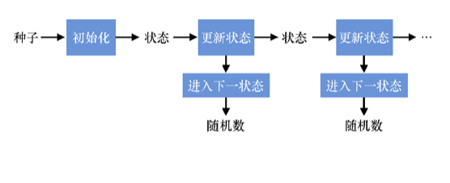
图 8.2　伪随机数发生器基于种子来生成随机数列。如果两次输入的种子相同，伪随机数发生器会产生两个完全一样的随机数列。根据随机数发生器的已有输出，任何人都无法恢复出它的内部状态。因此，仅仅通过观察已产生的随机数来预测将要产生的随机数或恢复先前已产生的随机数也是不可能的
密码学伪随机数发生器常有如下特性。
● 确定性。如果两次输入的种子相同，那么伪随机数发生器会产生两个完全一样的随机数列。这不同于先前讨论的不可预测的随机性。一旦知道伪随机数发生器使用的种子，那么它所产生的随机序列就变得完全可预测。这就是我们称这样的随机性为伪随机性的原因，也正因为如此，伪随机数发生器才变得非常高效。
● 与真随机不可区分。在实践中，我们无法区分伪随机数发生器输出的随机数和从均匀分布中选择的随机数。因此，仅仅通过观察伪随机数发生器生成的随机数无法恢复其内部状态。
第二种特性非常重要。伪随机数发生器可以有效模拟从真随机分布中均匀挑选一个数的过程，这意味着集合中每个数被选中的概率都相同。例如，当伪随机数发生器生成的随机数为 8 字节时，则整个随机数集合由所有可能的 8 字节数构成，并且每个 8 字节的数都有相同的概率成为伪随机数发生器的下一个输出。
此外，许多伪随机数发生器还满足一些其他的安全性质。当攻击者知道伪随机数发生器某时刻的内部状态，但无法恢复出伪随机数发生器先前生成的随机数时，则称这样的伪随机数发生器满足前向保密性（Forward Secrecy），如图 8.3 所示。
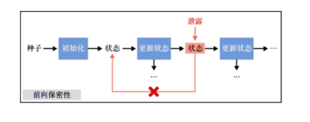
图 8.3　即使已知伪随机数发生器某时刻的内部状态，仍无法恢复出其先前产生的随机数，我们称这样的伪随机数发生器具有前向保密性
获得伪随机数发生器的状态意味着可以确定它接下来生成的所有伪随机数。为了防止这种情况，一些伪随机数发生器引入周期性「愈合」机制，即重置伪随机数发生器的种子，向其注入新的熵。这种属性称为后向保密性（Backward Secrecy），如图 8.4 所示。
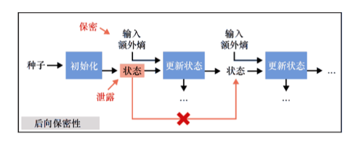
图 8.4　即使已知伪随机数发生器某时刻的内部状态，仍无法预测出其接下来产生的随机数，我们称这样的伪随机数发生器具有后向保密性。只有在伪随机数发生器的状态泄露之后立即将新的熵注入才能保证后向保密性
注意：
前向保密性和后向保密性概念非常容易混淆。阅读本节后，我们可能会产生这样的疑惑：前向保密性应该称为后向保密性，而后向保密性才应该称为前向保密性。为了区别这两个概念，我们有时也称后向保密性为未来保密性（Future Secrecy）。
如果用符合要求的种子初始化伪随机数发生器，则它可以快速产生大量能够用于密码学的随机数。显然，我们不能把一个可预测的数字或一个取值很小的数字当作伪随机数发生器的种子。伪随机数发生器意味着我们可以采用一些密码方法快速将适当大小的秘密扩展成数十亿个这样的秘密。大多数安全类应用程序不直接从噪声中提取随机数，而是将提取来的随机数作为伪随机数发生器的种子，然后在需要随机数时，用伪随机数发生器生成随机数。
Dual-EC 算法后门
如今，大多数伪随机数发生器都是基于启发式方法构造的。这是因为基于数学困难问题（如离散对数问题）构造的随机数发生器速度太慢，几乎没有实用价值。一个「臭名昭著」的伪随机数算法例子就是，NSA 发明的基于椭圆曲线的 Dual-EC 算法。NSA 将 Dual-EC 伪随机数发生器算法推行到各种标准中，如 NIST 在 2006 年前后发布的一些标准。很快，一些研究人员就发现 Dual-EC 算法存在后门。后来，2013 年的斯诺登事件也印证了该算法存在后门的事实。一年后，许多标准都相继撤销了该算法。
为了确保安全，必须用不可预测的秘密种子初始化伪随机数发生器。更准确地说，我们可以认为伪随机数发生器有一个从随机均匀分布中选取的n字节长密钥。这意味着伪随机数发生器的密钥应该从所有可能的n字节长的字节串中选择，其中每个字节串选中的概率都一样。
在本书中，我们讨论的许多密码算法的输出都与均匀随机不可区分。那么我们可以使用这些算法来生成随机数吗？这或许是个好主意。哈希函数、可扩展输出函数、分组密码、流密码和消息认证码算法可用于生成随机数。在理论上，哈希函数和消息认证码算法的输出都不能保证与真随机不可区分，但在实践中我们认为这两类算法的输出与真随机不可区分。此外，像密钥交换和签名这样的非对称算法的输出无论是在理论上还是在实践中都不是与真随机不可区分的。因此，需要用哈希函数处理上述算法的输出，最后把得到的哈希值当作实际输出。
事实上，由于大多数的机器硬件都支持 AES 算法，因此，我们通常把 AES-CTR 算法当作随机数发生器。此时，对称密码的密钥是该随机数发生器的种子，算法输出的密文就是随机数（明文是一个无限长的全 0 字符串）。在实践中，为了提供前向和后向保密性，实际的构造可能会更加复杂。现在，我们已经为学习 8.3 节内容储备了足够多的知识，8.3 节将会告诉我们在实践中获取随机性的具体方法。
++8.3　获取随机性的方法
我们已经知道了操作系统为其程序提供安全随机数所需的 3 个要素。
● 噪声源。操作系统中原始的随机数来自不可预测的噪声源，常见的噪声源有设备温度、鼠标移动位置。
● 清洗和混合。虽然原始随机数的随机性可能很差，但是操作系统会对各个噪声源的输出进行清洗，将得到的输出混合在一起，以产生一个高质量的随机数。
● 伪随机数发生器。前两个要素会产生一个高质量的随机数，但执行起来非常耗时。我们可以将前两个步骤产生的随机数当作伪随机数发生器的种子，用伪随机数发生器快速生成大量随机数。
本节将解释操作系统把这 3 个要素结合在一起构成随机数发生器的底层原理，以及操作系统为应用程序开发人员提供的随机数发生器接口。操作系统允许我们通过公开函数进行系统调用，从而从系统内置的随机数发生器中获得随机数。实际上，系统调用的背后是一个由噪声源（熵源）、清洗和混合以及伪随机数发生器组成的系统，如图 8.5 所示。
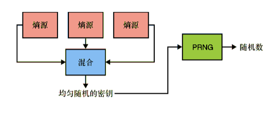
图 8.5　操作系统生成随机数的过程可以概括为：将不同噪声源的熵混合在一起，获得一个随机数，再将该随机数当作伪随机数发生器的种子
根据操作系统和可用硬件的不同，这 3 个要素的实现方式可能也会有所不同。2021 年，Linux 系统采用的伪随机数发生器是基于 ChaCha20 流密码算法的，而 macOS 系统则把哈希函数 SHA-1 当作伪随机数发生器。此外，不同的操作系统向开发人员公开的随机数发生器接口也会有所不同。在 Windows 系统上，使用 BCryptGenRandom()系统调用可以产生安全随机数，而在 macOS 和 Linux 系统上，通过读取特殊文件/dev/urandom 可以产生随机数。例如，在 Linux 或 macOS 系统上，我们可以使用 dd 命令行工具从终端读取 16 个随机字节：
$ dd if=/dev/urandom bs=16 count=1 2> /dev/null | xxd -p
40b1654b12320e2e0105f0b1d61e77b1
如果在设备启动后过早地通过读取/dev/urandom 文件来产生随机数，那么我们得到的随机数可能无法包含足够的熵，即产生的随机数不够随机。像 Linux 和 FreeBSD 等操作系统都提供了一个额外的系统调用 getrandom()，它提供的功能几乎与/dev/urandom 文件一样。如果没有足够的熵可用于初始化 getrandom()内置的伪随机数发生器，getrandom()就会等待系统重置其种子，从而阻止程序继续运行。考虑到这一点，我们建议在生成随机数时首选 getrandom()函数。一个利用 getrandom()生成随机数的 C 语言程序如代码清单 8.1 所示。
代码清单 8.1　用 C 语言获得随机数
#include <sys/random.h>
　
uint8_t secret[16]；    ←---　用随机字节填充字节型数组（注意：每次调用 getrandom()允许获得的随机数最大长度为 256 字节）
int len = getrandom（secret, sizeof(secret), 0）；    ←---　最后一个参数 0 表示：调用 getrandom()不会发生阻塞 
　
if （len != sizeof(secret)） {
    abort()；    ←---　当函数调用失败，或者返回的随机字节小于期望长度时，表明系统可能发生错误，此时最好的做法就是，让程序退出 
　
}
需要指出的是，许多编程语言都有自己的标准库和加密库，它们对随机数发生器接口也都进行了更好的抽象。这使我们容易忘记一些细节。例如，我们很容易忘记每次调用 getrandom()函数最多只返回 256 字节长的随机数。因此，我们也应该尽可能地使用编程语言的标准库来生成随机数。
警告：
注意，许多编程语言都提供了生成可预测随机数的函数和库。然而，这些函数和库并不适合用于密码学算法。切记，我们使用的随机数库要能够生成密码学上安全的随机数。通常，库的名称有助于我们辨识随机数的用途（例如，对于 Go 语言中的 math/rand 和 crypto/rand 随机数软件包，我们应该更倾向于使用 crypto/rand）。然而，为了避免误用随机数库，最好的做法是阅读库的用户手册，了解该库的详情。
代码清单 8.2 给出用 PHP 语言生成随机数的方法。这些随机数可用于任何密码学算法。例如，将这些随机数作为认证加密算法的密钥。每种编程语言生成随机数的方式都不同，因此请务必查阅编程语言的帮助文档，找到生成安全随机数的最佳方法。
代码清单 8.2　用 PHP 语言获得随机数
<？php
$bad_random_number = rand（0, 10）；    ←---　产生一个 0～10 的随机整数，rand()函数产生随机数的速度很快，但是生成的随机数不适合用于密码学 
　
$secret_key = random_bytes(16)；    ←---　用 16 字节长的随机字节填充内存区，产生的随机数可用于密码学算法和协议 
？>
我们已经知道了在程序中生成安全随机数的方法。现在，让我们思考一下生成随机数时需要注意的事项。
++8.4　生成随机数和安全性考虑
请记住，任何基于密码算法构造的协议都需要良好的随机性，一个差的伪随机数发生器可能会导致整个密码协议或算法不安全。我们应该清楚，消息认证码算法的安全性取决于它的密钥的随机性，哪怕一丁点儿的可预测性都会危及 ECDSA 等签名方案的安全性。
到目前为止，我们可能会认为生成随机数只是应用密码学的一个小步骤，但实际上，生成随机数对应用密码学非常重要。随机数误用实际上是造成实用密码学中各种安全问题的主要根源，包括使用非密码学的伪随机数发生器、没有用符合要求的种子初始化伪随机数发生器等，例如用可预测的系统当前时间来初始化伪随机数发生器。
一个随机数误用的例子就是，程序使用用户环境下的函数来生成密码算法所需的随机数，而不是通过系统的内核调用来产生随机数。通常，使用用户自定义的伪随机数发生器会引起不必要的安全性争议，如果使用不当会破坏整个安全系统。OpenSSL 库提供的伪随机数发生器就是一个典型的例子：2006 年，该伪随机数发生器以补丁形式添加到操作系统中，导致使用这个伪随机数发生器生成密钥的 SSL 和 SSH 协议极易受到攻击。
移除补丁代码后会对 OpenSSL 库中的伪随机数发生器种子重置过程产生影响。具体来说，OpenSSL 库不再向初始种子中混入随机数，而是只将当前进程的 ID 当作随机种子。而在 Linux 系统上，默认的进程 ID 可取的最大值为 32768，致使伪随机数发生器使用的种子随机性很差。
——H. D. Moore（“Debian OpenSSL Predictable PRNG Toys”，2008）
考虑到这些因素，建议尽量使用操作系统提供的随机数生成接口，避免使用用户自定义的随机数生成函数。在大多数情况下，编程语言标准库和一些著名的密码学程序库就足以提供我们所需的随机性。
开发人员在日常编写代码时需要注意：对于一些基础的算法，不能在已有最佳实践的情况下，自定义新的最佳实践[1]。
——Martin Boßlet（“OpenSSL PRNG is Not (Really) Fork-safe”，2013）
[1]　译者注：不建议开发人员亲自实现已有的密码算法（伪随机数发生器），这容易引发安全问题。
不幸的是，即便本书给出再多的建议，在实践中开发者仍可能误用随机数发生器。随机性是确保各类密码算法安全的根源，任何疏忽都可能导致系统易受攻击。为了确保安全，请牢记如下几种情形。
● 进程分叉。当使用用户定义的伪随机数发生器接口时，进程分叉会生成新的子进程，而这个子进程会复制其父进程的伪随机数发生器状态。这会导致两个进程自此之后产生完全一样的随机数列。因此，当程序中出现进程分叉操作后，正确的做法是用新的种子重新初始化伪随机数发生器。
● 在虚拟机中复制状态。当使用系统内置的伪随机数发生器时，复制伪随机数发生器的状态可能会引发错误。这样的情况在虚拟机中可能会出现。如果虚拟机的整个状态被保存起来，那么虚拟机的每个实例也都会从此状态开始运行，这可能会导致它们产生一样的随机数列。尽管很多操作系统和虚拟机管理程序已经修复了该问题，但是最好的做法是，在运行需要随机数的应用程序前，检查虚拟机系统是否存在这样的问题。
● 早期启动熵。用户与设备的交互过程是噪声的主要产生源。在用户操作设备的过程中，操作系统不存在收集不到熵的问题，但是在嵌入式设备和无外设系统中，要想在系统启动时收集到高质量熵，我们还需要克服许多的困难。历史经验表明，一些设备在启动时往往以相似的方式从系统中收集初始噪声，导致伪随机数发生器获得相同的种子，最终生成相同的随机数序列。
Linux 系统在启动初期存在一个熵漏洞，此时 urandom 文件产生的随机数是完全可预测的。当我们禁用那些无外设系统和嵌入式设备的不可用熵源时，Linux 系统的伪随机数发生器在每次启动时都会产生相同的可预测随机字节流。
——Heninger 等（「Mining Your Ps and Qs: Detection of
Widespread Weak Keys in Network Devices”，2012）
在系统启动过程中，应用程序几乎不会用到随机数。如果确实需要用到随机数，我们可以从另一台已用高质量熵初始化过的机器上获得需要的熵，如通过调用 getrandom()接口或从文件/dev/urandom 中获取需要的熵。不同的操作系统都为用户提供了获取随机数的方法，我们可以通过阅读它的参考手册来解决生成随机数过程中遇到的各种问题。
真随机数发生器为我们提供了另一种生成不可预测随机数的方案。例如，英特尔的新型 CPU 都内置了一种特殊的硬件芯片，我们可以从该芯片的热噪声中提取随机性。在程序中，我们可以用 RDRAND 指令获取这样的随机性。
对 RDRAND 指令的分歧
有趣的是，由于用户担心英特尔硬件芯片留有后门，所以伪随机数发生器指令 RDRAND 一直备受争议。当前，大多数操作系统都将 RDRAND 当作熵源，并将它与其他可贡献熵的随机源混合在一起使用。一个随机源以「贡献」的方式与其他随机源混合时，说明该随机源不能决定最终生成的随机数。
习题
将不同熵源的输出通过异或操作混合在一起。试问为什么不以「贡献」的方式混合随机源？
为了避免在安全协议中误用随机数，我们应该尽量少用那些依赖随机数的密码算法。例如，在第 7 章中我们会看到，ECDSA 算法要求每次签名时必须生成一个随机的 Nonce，而 EdDSA 则没有这样的要求。另一个示例是第 4 章提到的 AES-GCM-SIV 算法，如果该算法重复使用同一个 Nonce 不会发生严重的安全问题，而在 AES-GCM 算法中，重复使用同一个 Nonce 会泄露认证密钥，导致密文的完整性无法得到保障。
++8.5　公开的随机性
到目前为止，我们主要讨论了秘密信息的随机性，即生成私钥所需的随机性。有时我们不需要考虑机密性，此时允许随机性是公开的。在本节中，我将简要介绍一些获得这种公开随机性的方法。我们将公开随机性分为如下两种：
● 一对多——我们想为其他应用产生随机性；
● 多对多——一组参与者想共同产生随机性。
首先，假设我们想以一种许多参与者都可以验证的方式生成随机数列。换句话说，该随机数列应该具备不可预测性，随机数列的生成者在数列输出后也无法在不被察觉的情况下改变随机数列。现在，假设我们有一个基于密钥对和消息生成唯一签名的签名方案。基于该签名方案，利用可验证随机函数（Verifiable Random Function，VRF）能使我们以可验证的方式获得随机数，其原理如图 8.6 所示。
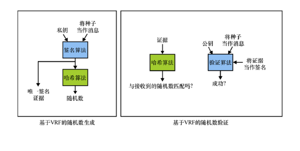
图 8.6　基于公钥密码，我们可以使用 VRF 生成可验证的随机数。为了生成一个这样的随机数，我们可以先使用数字签名算法（如 BLS 签名）对一个种子进行签名，再计算该签名的哈希值，并将这个哈希值当作公开随机数输出。为了验证最终的随机数，并确保种子签名的哈希值是一个随机数，我们可以利用签名算法来验证种子签名的合法性
可验证随机数的生成过程具体如下。
（1）生成签名算法的公私钥对，将验证签名合法性的公钥公开，同时还要公开种子。
（2）为了生成公开随机数，需要对公开种子进行签名并计算签名的哈希值。哈希值就是公开的随机数，签名就是该随机数的证据。
（3）为了验证该随机数，任何人都可以计算签名的哈希值，并比较其是否与公开的随机数相同，同时利用验证密钥检查公开种子是否合法。
将公开种子当作计数器，我们可以使用这种构造产生许多随机数。由于签名的唯一性和公开种子的确定性，签名者无法生成不同的随机数。
习题
像 BLS（参见图 8.6 和第 7 章内容）这样的签名方案会为同一消息生成唯一的签名。然而，ECDSA 和 EdDSA 为消息生成的签名则不唯一。思考这两类算法为什么会有这样的不同？
为了解决这个问题，网络草案（现已称为 RFC 文档）已对实现 VRF 的方法进行标准化。在某些场景下（例如，彩票游戏），参与者可能希望随机决定中奖者。此时，VRF 的作用是产生一致的可验证随机性，我们也称这样的可验证随机性为去中心化随机信标。在这个过程中，允许协议的某些参与者不参与生成随机性。通常，我们会使用前面提到的 VRF 构造去中心化随机信标，而不会使用门限型分布式单密钥签名算法构造这样的信标。分布式密钥意味着密钥被分割后由所有参与者共同持有，只有超过门限数量的签名者对消息进行了签名，才能为消息生成一个唯一且有效的签名。这是本书第一次提及分布式密钥这一概念，因此听起来可能有点儿令人困惑。稍后，我们会在本章学习更多分布式密钥的相关知识。
目前，去中心化随机信标 drand 受到广泛关注，该信标由多个组织和大学共同构建。
高质量随机性生成面临的主要挑战是：参与随机性生成过程的任何一方应该都不能够预测最终输出。去中心化随机信标 drand 网络不受任何参与成员的控制。该信标也不存在单点故障问题，任何 drand 服务器运营商都无法影响网络最终的随机性。
——“How drand works”，2021
到目前为止，本书广泛地讨论了随机性以及在程序中获得随机性的常用方法。现在，让我们继续探讨机密性在密码学中的作用以及处理机密性相关问题的方法。
++8.6　用 HKDF 算法派生密钥
从一个秘密生成更多秘密信息（也称密钥拉伸）的密码原语有许多，伪随机数发生器只是这些算法中的一种。实际上，从一个秘密派生更多秘密信息在密码学中很常见，我们通常称这个过程为「密钥派生」。下面让我们深入学习密钥派生算法。
除了下面列出的一些不同点以外，密钥派生函数（Key Derivation Function，KDF）和伪随机数发生器有许多共同点。两种原语的不同之处如图 8.7 所示。
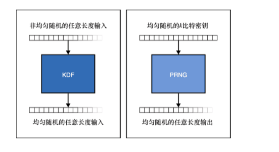
图 8.7　密钥派生函数和伪随机数发生器非常相似。两者的主要差别在于：密钥派生函数不要求输入的秘密信息完全随机，它只要求秘密信息中包含足够高的熵，此外也不要求密钥派生函数产生太多的输出
● 密钥派生函数不要求秘密信息均匀分布，但要保证秘密信息中包含足够高的熵。密钥交换协议的输出就包含很高的熵，但是其输出在统计上存在偏差（参见第 5 章），因此密钥派生函数可以使用密钥交换的输出来生成更长的秘密信息。
● 密钥派生函数常用于要求协议参与者能多次派生相同密钥的场景。从这个意义上说，密钥派生函数是确定性的算法，而伪随机数发生器可以通过频繁地注入更多的熵来提供后向保密性。
● 通常，不会使用密钥派生函数来产生大量的随机数。实际上，密钥派生函数多用于派生数量有限的密钥。
当前，最常用的密钥派生函数是基于 HMAC 算法的 HKDF。在第 3 章中，我们已学过 HMAC 算法。HKDF 算法是基于 HMAC 实现的，该算法的完整描述参见 RFC 5869。鉴于 HMAC 算法支持使用不同的哈希函数进行实例化，所以我们也可用不同的哈希函数实例化 HKDF 算法，当然最常用的哈希函数是 SHA-2。HKDF 算法由如下两个函数组成。
● HKDF-Extract ()：消除秘密输入中的统计偏差，产生均匀随机秘密信息。
● HKDF-Expand ()：产生任意长度的均匀随机输出。与伪随机数发生器一样，该函数要求输入的秘密信息必须均匀随机，因此该函数常在 HKDF-Extract 函数执行后才会被调用。
首先，让我们来了解 HKDF-Extract 函数，该函数的工作原理如图 8.8 所示。从技术上讲，经过哈希函数处理后输入的字节串会变得均匀随机（通常认为哈希函数的输出与均匀随机不可区分），而 HKDF 函数会接收一个称为盐值（Salt）的额外输入，因此它具有更强的随机化能力。与口令哈希算法一样，可以用不同的 Salt 来区分同一协议中不同的 HKDF-Extract 函数用法。不过，Salt 参数是可选的，如果不输入该参数，算法会将该参数设置为全 0 的字节串。但在实践中，我们建议使用 Salt 参数。HKDF 算法不要求 Salt 参数保密，该算法允许敌手在内的任何人知道该参数。HKDF-Extract 在随机化输入时并没有使用哈希函数，而是使用 HMAC 来随机化输入，HMAC 算法恰好有一个接收两个参数的接口。
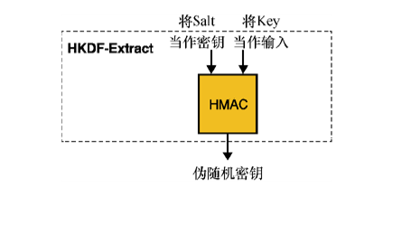
图 8.8　HKDF-Extract 是 HKDF 算法中的第一个函数。该函数将可选参数 Salt 当作 HMAC 算法的密钥，输入的秘密信息可以是非均匀随机的。当输入 Key 相同时，不同的 Salt 参数会产生不同的输出
接下来，让我们了解 HKDF-Expand 函数的构造，该函数的原理如图 8.9 所示。如果图 8.8 中输入的 Key 已经是均匀随机的，我们可以跳过 HKDF-Extract 函数，直接执行 HKDF-Expand 函数。
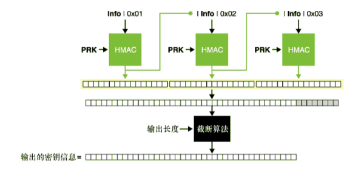
图 8.9　HKDF-Expand 是 HKDF 算法中包含的第二个函数。该函数以一个称为 Info 的字节串和均匀随机的秘密值为输入。给定相同的秘密输入，使用的 Info 字节串不同会产生不同的输出。该函数的输出长度由 length 参数决定
与 HKDF-Extract 函数一样，HKDF-Expand 函数也有一个称为 Info 的额外可选参数。Salt 参数旨在为同一协议内多次调用 HKDF 提供域分离，而 Info 参数主要用于区分依赖于 HKDF 的协议版本。当然，我们还可以指定 HKDF 的输出长度，但请记住 HKDF 与伪随机数发生器不同，它的设计初衷不是生成大量的随机数。HKDF 允许产生的输出长度与其使用的哈希函数有关。更准确地说，如果 HKDF 使用的哈希函数为 SHA-512（输出的哈希值长度为 512 比特），对于给定的输入 Key 和 Info 字节串，HKDF 的最大输出不能超过 512 × 255 比特，即 16320 字节。
除输出长度不同外，以相同的参数调用 HKDF 会产生内容相同的输出，只是这些输出被截断为不同的长度，如图 8.10 所示。该性质称为输出相关性（Related Output）。请牢记 HKDF 的这一性质。
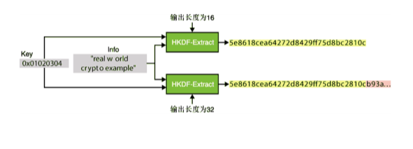
图 8.10　HKDF 具有输出相关性。这意味着将输出长度参数设置为不同的值时，HKDF 只是将相同的输出内容截断为要求的长度
在许多密码学库中，库的开发者常将 HKDF-Extract 函数和 HKDF-Expand 函数组合在一起，如图 8.11 所示。在使用密码学库提供的 HKDF 算法之前，建议先阅读密码库提供的帮助手册。
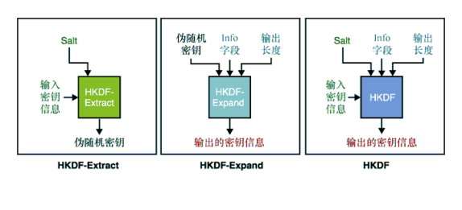
图 8.11　在密码学库中，开发者常将 HKDF 设计成一个由 HKDF-Extract 函数（从秘密输入中提取随机信息）和 HKDF-Expand 函数（生成任意长度的输出）组成的独立函数
从单个秘密信息派生多个秘密信息的函数并非只有 HKDF。另一种派生秘密信息的「平凡」方法是使用哈希函数。哈希函数不要求输入均匀随机，但会产生均匀随机的输出。哈希函数的这一性质使其非常适用于派生秘密信息。不过，哈希函数也存在诸多缺陷，它的接口不支持域分离（无自定义字符串参数），同时它的输出长度还是固定的。在实践中，最好的做法就是用 KDF 算法替代哈希函数。然而，一些常用的密码算法确实是使用哈希函数来派生秘密信息的。例如，在第 7 章中，我们会看到 Ed25519 签名方案用 SHA-512 算法从 256 比特长的密钥中派生出两个 256 比特长的密钥。
HKDF 和哈希函数能产生随机输出吗？
从理论上讲，哈希函数的性质并不能保证其输出是均匀随机的，其性质仅仅表明它满足抗碰撞性、抗第一原像性和抗第二原像性。在现实世界中，我们会将哈希函数当作随机预言机（参见第 2 章内容）的一种实现，因此我们常假设它的输出是均匀随机的。这与消息认证码算法十分类似，从理论上来说，该算法并不能产生均匀随机的输出，但是在实践中，我们默认它的输出是均匀随机的。这就是基于 HMAC 算法构造 HKDF 的原因。在本书的剩余部分，我们假定常见的哈希函数（SHA-2、SHA-3）和消息认证码算法（HMAC、KMAC）产生的输出都是随机的。
我们也可以把第 2 章提到的可扩展输出函数（XOF）也当作密钥派生函数！请记住，一般可扩展输出函数满足如下性质：
● 不要求输入满足均匀随机分布；
● 输出空间无限大且满足均匀随机分布。
另外需要记住的是，KMAC 算法（参见第 3 章）不存在前面所说的输出相关性问题。事实上，KMAC 算法的输出长度参数具有随机化算法输出的功能，该参数有效地起到了自定义字符串的作用。
最后，还有一种派生密钥的特殊情形，即基于熵值较低的输入来派生密钥。例如将口令作为输入，因为相比于 128 比特长的密钥，口令明显更容易猜测（口令本身较短）。基于口令的密钥派生函数利用口令哈希函数（第 2 章）来派生密钥。
++8.7　管理密钥和秘密信息
现在，我们已经知道生成密码学随机数的方法，也知道在不同情形下派生密钥应该使用哪种算法。但是，我们并没有完全解决密钥生成过程中的问题。
为了使用密码算法，我们不得不生成很多密钥。我们该如何存储这些密钥呢？我们又该如何防止这些极度敏感的密钥泄露呢？倘若密钥泄露，我们又该如何补救呢？这些问题统称为密钥管理（Key Management）。
密码学是将一系列安全问题转化为密钥管理问题的工具。
——Lea Kissner（2019）
虽然许多系统选择将密钥保留在使用它们的应用程序中，但这并不一定意味着在发生安全问题时应用程序没有追索权。为了防范那些可能泄露密钥的问题，大多数高安全性的应用程序都会采用如下两种深度防御技术。
● 密钥更新。通过设定密钥的失效日期，并定期用新密钥替换旧密钥，可以起到避免密钥泄露的作用。密钥有效期设置得越短，或者说密钥更新越频繁，就可以更快地替换敌手可能已经知道的密钥。
● 密钥撤销。只进行密钥更新还远不能保障系统的安全性，有时我们想在得知密钥泄露的第一时间就撤销密钥。因此，一些系统允许我们在使用密钥之前查询密钥是否已被撤销（在第 9 章中，我们会了解更多有关密钥撤销的知识）。
自动化的密钥更新和撤销对于成功使用这两种深度防御技术来说至关重要。此外，我们还可以将密钥和特定的用途进行绑定，从而降低密钥泄露带来的危害。例如，我们可以将应用程序中使用的两个公钥分别称为公钥 1（仅用于签名交易）和公钥 2（仅用于密钥交换）。这样一来，即便公钥 2 关联的私钥泄露也不会对签名交易造成影响。
如果不想将密钥留在设备的存储介质内，我们可以采用抵抗密钥提取之类的解决方案。在第 13 章基于硬件的密码技术中我们可以了解更多这方面的内容。
最后需要注意的一点是，代理密钥管理的方法有很多。这种情况经常出现在提供密钥存储或密钥链的移动操作系统上，该系统不仅会存储密钥，甚至还会执行一些密码学操作！
在云服务上运行的应用程序有时需要访问云密钥管理服务。这些服务允许应用程序委托创建密钥和执行密码操作，并会采用多种方法来防御这些密钥和密码操作可能遭受的攻击。然而，与基于密码学硬件的解决方案一样，如果应用程序受到破坏，它仍然能够对委托服务执行任何类型的请求。
注意：
世界上没有灵丹妙药，我们应该不断地提出新的密钥泄露检测和应对策略。
密钥管理是一个难题，超出了本书的范围，所以我们不会过多地讨论这个话题。在 8.8 节中，我将介绍一些试图避免密钥管理问题的密码技术。
++8.8　分布式门限密码技术
密钥管理是一个复杂的研究领域，由于该领域既不存在可供用户参考的最佳实践，也没有完全可信赖的工具可用，因此研究密钥管理可能会是一件令人苦恼的事情。幸运的是，密码学存在一些减轻密钥管理负担的方法。我想介绍的第一个方法是秘密分享（Secret Sharing）。秘密分享是指将秘钥拆分为多个份额，并允许将这些份额分发给系统的参与者。这里说的秘密可以是对称密钥、签名算法私钥之类的任何秘密信息。
通常情况下，一个称为分派者的人会生成秘密，然后将该秘密拆分成多个份额并在删除该秘密之前把这些秘密份额分发给所有参与者。著名的秘密分享方案由 Adi Shamir 提出，该方案也称为 Shamir 秘密分享（Shamir’s Secret Sharing，SSS）。Shamir 秘密分享方案的过程如图 8.12 所示。
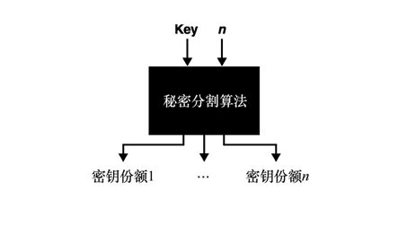
图 8.12　给定密钥 Key 和份额数量n，Shamir 秘密分享方案可以创建n个与原密钥大小相同的部分密钥
当需要使用原始秘密执行某些密码学操作（加密、签名等）时，每个秘密份额的持有者需要将它们各自的份额返还给分派者。基于这些秘密份额，分派者可以恢复出原始秘密。由于获得秘密的单个份额对于恢复出原始秘密没有任何帮助，所以这样的方案不但可以阻止攻击者发起以单个用户为目标的攻击，还会迫使攻击者在恢复出原始秘密之前必须对所有参与者发起攻击，该过程如图 8.13 所示。
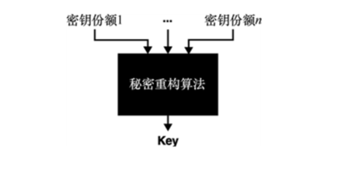
图 8.13　Shamir 秘密分享方案将秘密分成n个份额，因此它要求拥有秘密的n个份额才能恢复出原始秘密
该方案背后的数学原理并不难理解！让我们来简单解释该方案的思想。
想象二维空间内的一条秘密随机直线，将直线表示为y = ax + b。让两个参与者分别持有该直线的一个随机点，他们两个可以联合起来恢复出这条直线。该方案可推广到任意次数的多项式，相应地我们可将秘密分成任意数量的份额，其原理如图 8.14 所示。
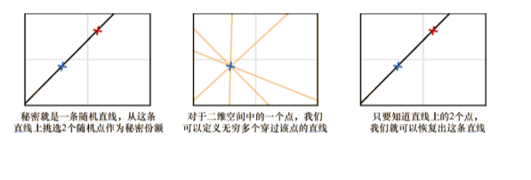
图 8.14　Shamir 秘密共享方案背后的思想是，将定义曲线的多项式视为秘密，而把曲线上的随机点视为部分秘密（秘密份额）。要恢复出n次多项式形式的曲线，我们至少需要知道曲线上的n +1 个点。例如，对于一次多项式f(x) = 3x + 5，需要 2 个点(x,f(x))才能恢复出该多项式，而对于二次多项式f(x) = 5x2 + 2x + 3，需要 3 个点才能恢复出该多项式
由于简单易懂，秘密共享技术得到广泛应用。然而，每次想将该秘密当作密码算法的密钥时，必须将各个份额收集起来才能重新恢复出原始秘密。这为秘密泄露创造了新的可能，从而使我们再次回到单点失效模式。为了避免这种单点故障问题，针对不同的场景我们可以使用不同的密码技术。
例如，假设有这样一个协议，只有 Alice 对交易签名了，该交易才被认为是合法的。这种要求会给 Alice 带来很大负担，她也很可能成为攻击者的攻击目标。为了减轻 Alice 被攻击的压力，我们可以将协议改为必须由包括 Alice 在内的n个人同时对交易进行签名，该交易才被认为是合法的。此时，攻击者必须同时伪造交易的n个签名，才能使该笔交易被接受！这种密码系统称为多重签名方案，其在「加密货币」领域应用非常广泛。
不过，平凡的多重签名方案比普通签名方案会多一些额外开销。事实上，在所给示例中，交易的大小会随着所需的签名次数呈线性增长。为了解决这个问题，一些签名方案（如 BLS 签名方案）可以将多个签名压缩为单个签名。这种特性称为签名聚合（Signature Aggregation）。一些多重签名方案通过将n个公钥聚合为单个公钥，从而实现压缩签名大小的目的。这种技术称为分布式密钥生成（Distributed Key Generation，DKG）。该技术属于密码学中安全多方计算领域的研究内容，第 15 章将会介绍一些安全多方计算相关的内容。
分布式密钥生成技术允许 n 个参与者在不知道其他参与者私钥的情况下通过协作计算出一个公钥。如果想对消息进行签名，那么各个参与者可以使用他们各自持有的私钥份额协作生成消息的签名，同时他们还可以使用先前创建的公钥来验证签名的合法性。在这样的情况下，参与者都不需要传输私钥，因此避免了 Shamir 秘密分享方案的单点故障问题。在第 7 章中我们已经学过 Schnorr 签名，Schnorr 签名的分布式密钥生成方案原理如图 8.15 所示。
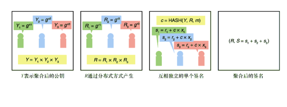
图 8.15　Schnorr 签名方案可以转换成一个去中心化的分布式密钥生成方案
最后，需要注意如下要点。
● 对于前面提到的每个方案，如果n个参与者中有m（门限值）个参与者参与，方案也能保证其正确性。现实世界中的大多数系统都必须具备容忍大量恶意或不活跃参与者的能力，因此这一性质非常重要。
● 这些方案可以与其他非对称密码算法一起使用。例如，使用门限加密方案，一群参与者可以以非对称的方式解密密文。
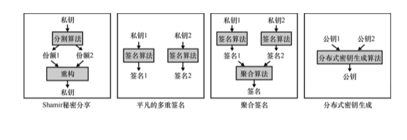
图 8.16 汇总了前面所给的示例。
图 8.16　现有技术可以总结为：将对一个参与者的信任分割成对多个参与者的信任
门限方案提供了一种新的密钥管理范式，是一门值得完善和发展的技术。目前，NIST 有一个门限加密小组，该小组不仅负责组织与门限方案相关的研讨会，同时还将长期致力于标准化门限方案原语和协议。++8.9　本章小结
● 若从集合中选取任意一个元素的概率都相同，则该集合中的元素服从均匀分布。
● 熵是一个度量字节串随机性程度的指标。熵值越高，表明字节串分布越均匀；熵值越低，则越容易猜测和预测字符串。
● 伪随机数发生器是一种以均匀随机种子为输入并生成任意长度随机数的算法。如果这个种子足够长，则它生成的随机数可用于密码学算法（例如，将其作为加密密钥）。
● 记住，我们应该使用编程语言的标准库和著名的密码库来生成所需的随机数。如果这两种方法都不可用，我们也可以使用操作系统提供的特定接口来获得随机数：
❏ 在 Windows 系统上，使用 BCryptGenRandom()系统调用获得随机数；
❏ 在 Linux 和 FreeBSD 系统上，使用 getrandom()系统调用获得随机数；
❏ 在其他类 Unix 系统上，通过读取/dev/urandom 文件获得随机数。
● 密钥派生函数适用于与均匀随机有统计偏差但高熵的秘密信息中派生新秘密。
● HKDF 是一个基于 HMAC 算法的密钥派生函数。该密钥派生函数有着广泛的应用。
● 密钥管理旨在保护密钥等秘密信息的机密性。密钥管理主要包括安全存储密钥、主动终止和更换密钥、处理密钥泄露等事项。
● 为了减轻密钥管理者的负担，可以将系统的信任关系从一个参与者转换到多个参与者身上。