第 9 章　安全传输
本章内容：
● 安全传输协议；
● 传输层安全（Transport Layer Security，TLS）协议；
● Noise 协议框架。
当今密码学最重要的用途可能就是加密通信，毕竟密码学的目标就是实现安全通信。为此，应用程序通常不直接使用单独的密码原语（如认证加密），而是使用由多种密码原语组合在一起的复杂协议，这些协议称为安全传输协议。
本章我们将学习广泛应用的安全传输协议：传输层安全（TLS）协议。我们还将简单了解其他的安全传输协议以及它们与 TLS 的不同之处。
++9.1　SSL 和 TLS 协议
首先我们通过一个场景来理解传输协议（用于主机之间加密通信的协议）的重要之处。当我们在浏览器中输入一个网址，并按下「Enter」键，浏览器将会通过多种协议连接到 Web 服务器并检索我们请求的页面。这些协议中就包括超文本传输协议（Hypertext Transfer Protocol，HTTP），浏览器通过 HTTP 告诉 Web 服务器自己想要检索的页面。HTTP 的格式可读性较强，这意味着在没有其他工具的辅助下，也可以理解网络上的 HTTP 消息。但这还不足以让浏览器与 Web 服务器通信。
HTTP 消息会被封装到 TCP 帧消息中，其中，TCP 帧是在传输控制协议（Transmission Control Protocol，TCP）中定义的消息。TCP 是一个二进制协议，它的可读性差，我们需借助其他工具来理解 TCP 帧中各字段的含义。而 TCP 消息会由互联网协议（Internet Protocol，IP）进一步封装，其后 IP 消息还会使用其他协议继续进行封装。以上协议统称为网际互连协议套件，由于详细介绍此内容的图书已经有很多，所以本书不深入讨论这些协议。
回到刚才提到的场景中，我们需要讨论通信过程中的机密性。任何一个被动敌手都可以观察和读取浏览器的请求和 Web 服务器的响应。更糟糕的是，主动敌手还可以篡改消息以及更改消息的发送顺序。这种攻击会对通信机密性造成严重威胁。
想象一下，如果消息在这样的信道传输，那么每次上网购物时，我们的信用卡信息都会泄露；每次登录网站时，敌手都可以轻易获取我们的账号和密码；每次与朋友通信时，我们的私人照片和信息都会被窃取。这十分令人害怕，因此在 20 世纪 90 年代，TLS 协议的前身，即安全套接字层（Secure Socket Layer，SSL）协议诞生了。SSL 协议可以在许多场景中使用，但它最早应用于浏览器与 Web 服务器的安全通信。SSL 协议最开始与 HTTP 结合使用，将 HTTP 扩展到超文本传输安全协议（Hypertext Transfer Protocol Secure，HTTPS）。HTTPS 可以保护浏览器与许多服务器之间的通信。9.1.1　从 SSL 到 TLS 的转化
虽然 SSL 协议并非唯一可用于保护 Web 安全的协议，但它确实引人注目，并且经过时间的验证成为事实上的标准。不过，SSL 协议在第一个版本和最新的版本之间，做出了很多调整。由于协议中使用了不安全的设计和加密算法，SSL 的所有版本（最后一个版本是 SSL v3.0）都能被攻破（RFC 7457 中总结了针对 SSL 协议的许多攻击）。
SSL 3.0 之后，该协议正式移交给因特网工程任务组（Internet Engineering Task Force，IETF），该组织负责发布征求意见（Request For Comment，RFC）标准。之后，SSL 协议改名为 TLS 协议，1999 年 TLS 1.0 随 RFC 2246 发布。2018 年，RFC 8446 中规定 TLS 协议的最新版本——TLS 1.3。TLS 1.3 不同于 SSL，它源于业界和学术界之间的紧密合作。然而，现今由于服务器更新缓慢，互联网中仍然有许多不同版本的 SSL 协议和 TLS 协议在运行。
注意：
SSL 协议和 TLS 协议这两个名词经常混淆。前者现在被称为 TLS 协议，但许多文章甚至密码学库仍然选择使用 SSL 协议。
TLS 协议已经不仅仅用于保护网络安全，还在许多不同的场景以及不同类型的应用程序和设备中作为安全通信协议。因此，本章中关于 TLS 协议的内容不仅适用于访问网站的场景，而且适用于任何需要两个应用程序之间进行安全通信的场景。9.1.2　TLS 的实际应用
为了理解 TLS 的实际应用，首先要定义一些术语。在 TLS 协议中，进行安全通信的双方称为客户端和服务器。TLS 协议与其他网络协议（如 TCP 或 IP）的工作方式相同：客户端是发起连接的人，服务器是等待连接的人。创建一个 TLS 客户端需要两部分参数。
● 配置参数：客户端设置了自身支持的 SSL 协议和 TLS 协议版本、用于保护通信的加密算法以及客户端对服务器进行身份验证的方式等。
● 目标服务器的信息：需要获取的信息至少包括一个 IP 地址和一个端口，对于 Web 服务器而言，通常还需要一个完全限定域名（比如 example.com）。
给定上述两个参数，客户端向服务器发起连接以生成安全会话，双方可以使用这个安全会话信道共享加密消息。在某些情况下，安全会话可能会中断，导致连接创建失败。例如，如果攻击者篡改安全连接中传输的信息，或者服务器的配置与客户端不兼容（稍后将详细介绍），那么客户端与服务器端将无法建立安全会话。
TLS 协议中服务器的操作通常更简单，它只需要使用与客户端相同的配置。然后，服务器只需等待客户端发起连接请求，再建立安全会话信道。实际上，客户端可通过代码清单 9.1 所示的代码使用 TLS 协议（以 Go 语言为例）。
代码清单 9.1　用 Go 语言演示在客户端使用 TLS 协议
import 「crypto/tls」
　
func main() {
    destination := 「google.com:443」    ←---　完全限定域名和服务器端口（433 是 HTTPS 的默认端口号）
     TLSconfig := &tls.Config{}    ←---　空的 config 表示默认的配置 
     conn， err := tls.Dial（“tcp”, destination, TLSconfig）
    if err ！= nil {
        panic(「failed to connect: 「 + err.Error())
    }
    conn.Close()
}
那么客户端如何确定与它建立连接的确实是目标服务器，而非冒名顶替的敌手呢？默认情况下，使用 Go 语言实现 TLS 协议时，客户端使用操作系统的配置对 TLS 服务器进行身份验证（后续我们将详细了解 TLS 协议中实现身份验证的方法）。在服务器端使用 TLS 协议也非常简单，如代码清单 9.2 所示。
代码清单 9.2　用 Go 语言演示在服务器端使用 TLS 协议
import （ 
    “crypto/tls” 
    “net/http” 
） 
　
func hello（rw http.ResponseWriter, req *http.Request） { 
    rw.Write（[]byte(“Hello, world\n”)） 
} 
　
func main() {                                  
    config := &tls.Config{    ←---　保证 TLS 1.3 服务器安全的最低版本的 TLS 协议 
         MinVersion: tls.VersionTLS13，    
     } 
　
    http.HandleFunc（“/”, hello）    ←---　一个显示「Hello, world」的页面 
　
    server := &http.Server{    ←---　运行 HTTPS 时，服务器在 8080 端口上启动 
         Addr: 「:8080」， 
         TLSConfig: config，              
     } 
　
    cert := 「cert.pem」                               
    key := 「key.pem」 
    err := server.ListenAndServeTLS（cert, key）    ←---　一些包含证书和私钥的.pem 文件（稍后将对此进行详细介绍）
     if err ！= nil {          
        panic（err）                                    
    } 
}
Go 语言及其标准库在内部已经为我们封装了许多实现细节。不幸的是，并非所有编程语言的标准库都提供易于使用的 TLS 实现方式，而且也并非所有 TLS 的实现都选择安全的参数作为默认配置！因此，根据标准库的不同，TLS 服务器的配置有时很复杂。在 9.2 节中，我们将了解 TLS 协议的内部工作原理及其不同之处。
注意：
TLS 协议运行在 TCP 之上。为了确保 UDP（User Datagram Protocol，用户数据报协议）连接的安全性，我们可以使用 DTLS（D 代表数据报，即 UDP 消息），它与 TLS 协议非常相似。因此，我在本章中没有讨论 DTLS 协议。
++9.2　TLS 协议的工作原理
正如之前提到的，如今 TLS 协议是保证应用程序之间安全通信的现实标准。在本节中，我们将了解更多关于 TLS 协议的底层工作原理及其在实践中的使用方式。本节对于学习 TLS 协议的正确使用方式以及大多数安全传输协议的工作原理非常有用。此外，我们还能了解到重新设计或重新实现此类协议的困难（并且被强烈反对）之处。
宏观来看，TLS 协议可以分为下面的两个阶段，如图 9.1 所示。
● 握手阶段：两个参与者协商并创建一个安全通信连接。
● 安全通信阶段：两个参与者的通信内容是加密的。
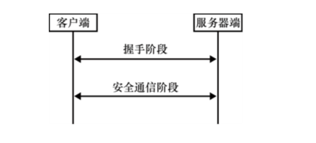
图 9.1　宏观来看，TLS 协议首先在握手阶段创建安全连接。之后，参与者可以进行安全通信
根据第 6 章介绍的混合加密，我们应该对上述两个步骤的工作原理有以下直观的理解。
● 握手阶段的核心是密钥交换。握手结束时，参与双方就生成共享的对称密钥集合。
● 安全通信阶段是参与双方之间传输密文的过程。此阶段使用认证加密算法和握手阶段生成的密钥集合来加密消息。
大多数安全传输协议都是这样运行的，它们有趣的部分往往是握手阶段。接下来，让我们看看握手阶段的工作流程。9.2.1　TLS 协议的握手阶段
TLS 协议（以及大多数传输安全协议）可以分为两个部分：握手阶段和安全通信阶段。在本小节我们将首先了解握手阶段的四项内容。
● 协商：TLS 协议是高度可配置的，客户端和服务器都使用协商好的 SSL 和 TLS 版本以及加密算法作为通信过程的配置参数。握手的协商阶段旨在找到客户端和服务器之间可选配置参数的共同点，以确保连接的双方是对等的。
● 密钥交换：握手阶段的核心是两个参与者之间的密钥交换。使用何种密钥交换算法是客户端与服务器协商过程中要确定的事项之一。
● 认证：正如我们在第 5 章密钥交换了解到的那样，中间人攻击者可以轻易模拟密钥交换过程中的任何一方，因此，密钥交换必须经过认证。例如，浏览器必须能够确保自身是在与 google.com 通信，而非与互联网服务提供商（Internet Service Provider，ISP）通信。
● 会话恢复：由于浏览器经常重复连接到同一个网站，如果每次都进行密钥交换可能产生高昂的计算代价，并且会降低用户体验，因此，TLS 协议中集成了无须重复密钥交换即可快速跟踪安全会话的机制。
这是一个详尽的列表！让我们马上开始学习第一项内容。
1．协商：选择什么样的协议版本和密码算法？
TLS 协议之所以复杂，绝大程度上是因为协议中需要协商的内容往往有很多种选择。而协商阶段的不完善也是过去 TLS 协议出现许多问题的根源。像 FREAK、LOGJAM、DROWN 等攻击可以利用旧版本协议的弱点来破坏新版本协议的运行（有时甚至在服务器不支持旧版本协议时也能实现攻击！）。虽然并非所有协议都有很多版本或允许协商不同的算法，但 SSL/TLS 协议是为 Web 系统设计的，因此，SSL/TLS 协议需要一种方法来保持 Web 系统对更新速度较慢的旧客户端和服务器的后向兼容性。
今天在 Web 系统上经常发生这样的情况：用户的浏览器可能是最新的版本，并且支持 TLS 1.3，但是用户访问一些旧网页时，网页背后的服务器可能只支持 TLS 1.2 或 1.1（或更旧的版本）。反之亦然，许多网站必须支持较旧的网页访问，也就是要支持较旧版本的 TLS 协议（因为一些用户仍然使用旧版 TLS 协议）。
旧版本的 SSL 协议和 TLS 协议是否安全？
除了 TLS 的 1.2 和 1.3 版本以外，SSL 和 TLS 协议的大多数版本都存在安全问题。那么为何不能只支持最新版本（TLS 1.3）而不再使用旧版本协议呢？原因是有些公司需要为一些无法轻易更新协议的老客户提供服务。因此，许多密码学库为了安全地支持旧版本协议，尝试把一些已知攻击的防御措施移植到旧版本的协议上。不幸的是，这些防御措施往往由于过于复杂而难以正确实施。
例如，为了抵抗 Lucky13 和 Bleichenbacher98 这样著名的攻击，安全研究人员多次尝试在 TLS 协议的实现过程中修复其弱点，却还是发现这些攻击能攻破已优化的协议。虽然在实现上修复弱点可以弱化对旧版本 TLS 协议的许多攻击，但本书不建议继续使用旧版本协议，因为 2021 年 3 月，IETF 发布了 RFC 8996，即「弃用 TLS 1.0 和 TLS 1.1」，正式声明要弃用 TLS 协议的旧版本。
开始协商时，客户端向服务器发送第一个请求（称为 ClientHello）。ClientHello 包含一系列客户端支持的 SSL 和 TLS 协议版本、客户端可以使用的密码算法套件，以及一些关于握手阶段的剩余步骤或应用程序的更多信息。密码算法套件包括如下内容。
● 一种或者多种密钥交换算法：TLS 1.3 中可以选择的密钥交换算法包括使用 P-256、P-384、P-521、X25519、X448 等曲线的 ECDH 算法，以及 RFC 7919 中定义的 FFDH 算法。ECDH 算法和 FFDH 算法相关的内容我们在第 5 章都已经了解过。旧版本的 TLS 协议还提供了 RSA 密钥交换算法（第 6 章中有详细介绍），不过最新版本的 TLS 协议已移除了这个算法。
● 两种（握手的双方选择各自的算法）或者多种数字签名算法：TLS 1.3 可选的数字签名算法包括 RSA PKCS#1 v1.5 算法、新推出的 RSA-PSS 算法，以及 ECDSA 和 EdDSA 等较新的椭圆曲线算法。我们在第 7 章已对此做过介绍。请注意，数字签名算法是通过哈希函数指定的，在协商的过程中需要选择数字签名算法使用的哈希算法，例如 RSA-PSS 算法可以使用 SHA-256 或 SHA-512 函数实现。
● HMAC 和 HKDF 算法使用的一个或多个哈希函数：TLS 1.3 规定了 SHA-256 和 SHA-384 两个可选的哈希函数，它们都是 SHA-2 哈希函数族的实例（第 2 章对此有介绍）。此处选择的哈希函数与数字签名算法使用的哈希函数无关。HMAC 和 HKDF 两个算法分别在第 3 章和第 8 章中有过介绍。
● 一个或者多个认证加密算法：可选的认证加密算法包括具有 128 或 256 比特密钥的 AES-GCM、ChaCha20-Poly1305。我们在第 4 章中已了解上述所有算法。
接下来，服务器用 ServerHello 消息进行响应，该消息包含上述 4 种类型的算法（即服务器选定的密钥交换算法、数字签名算法、哈希函数以及认证加密算法），它们是服务器根据客户端支持的密码算法进行选择的结果。图 9.2 描述了上述响应过程。
如果服务器在客户端发来的算法列表中找不到自身支持的算法，那么它将中止连接。不过在某些情况下，服务器不必中止连接，而是要求客户端提供更多信息。为此，服务器会回复 HelloRetryRequest 消息，向客户端询问缺少的信息。然后，客户端会重新发送 ClientHello 消息，这一次添加了新请求的信息。
2．TLS 以及前向安全的密钥交换算法
密钥交换的过程是 TLS 握手阶段中最重要的部分！没有这个过程，双方就无法生成对称密钥。但要进行密钥交换，客户端和服务器必须先交换各自的公钥。
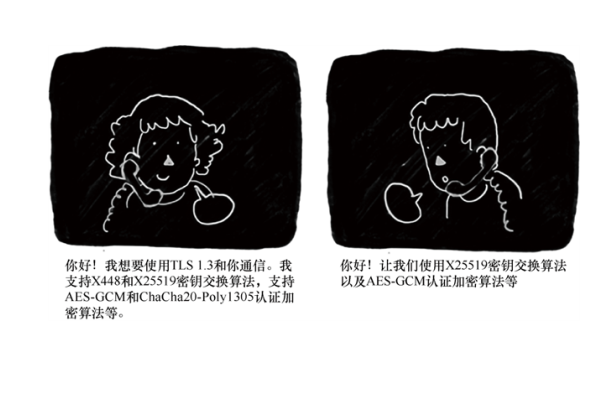
图 9.2　客户端首先向服务器发送自己支持的密码算法列表，之后服务器在可选的密码算法中选定自己要使用的算法并告知客户端
在 TLS 1.2 及以前的版本中，只有在客户端和服务器双方协商好密钥交换算法后才能开始密钥交换。而算法的协商发生在协商阶段。因此 TLS 1.3 尝试通过同时进行协商和密钥交换来优化密钥交换的流程：客户端推测性地选择一个密钥交换算法，并在第一条消息（ClientHello）中发送自己对应于该算法的公钥。如果客户端没有正确预测服务器选择的密钥交换算法，则客户端转而使用协商好的算法，并向服务器发送包含正确公钥的新 ClientHello 消息。下面的步骤直观描述上述流程。两个不同版本的 TLS 协议的密钥交换流程差异如图 9.3 所示。
（1）客户端使用 TLS 1.3 的协议，向服务器发送 ClientHello 消息以说明自己支持 X25519 和 X448 密钥交换算法，并附加客户端自身的 X25519 算法公钥。
（2）服务器并不支持 X25519 算法，只能支持 X448 算法。因此，服务器向客户端发送 HelloRetryRequest 消息，告诉客户端自己只能支持 X448 密钥交换算法。
（3）客户端重新发送 ClientHello 消息，将自己的 X448 算法公钥告知服务器。
（4）握手结束。
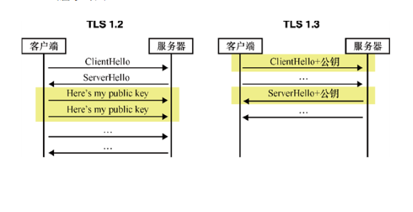
图 9.3　在 TLS 1.2 中，客户端在发送公钥之前必须等待服务器选择要使用的密钥交换算法。而在 TLS 1.3 中，客户端会推测服务器可能采用的密钥交换算法，并在第一条消息中发送一个（或多个）对应于该算法的公钥，从而可以避免额外的交互
TLS 1.3 中有许多诸如此类的优化方法，这对 Web 来说非常重要。由于在现实世界中，许多人连接网络时都会出现网络不稳定或缓慢的情况，因此尽量减少非应用程序所需的通信次数非常重要。此外，在 TLS 1.3 中（与旧版本的 TLS 协议不同），每次密钥交换算法生成的密钥都是临时的。对于每个新会话，客户端和服务器都会生成新的密钥对，然后在密钥交换完成后立即将其删除。这为密钥交换提供了前向保密性：如果客户端或服务器的长期密钥泄露了，那么只要每次都安全地删除会话临时私钥，攻击者就无法解密之前的会话，因为每次会话都是用临时密钥加密的。
我们假设 TLS 服务器每次与客户端执行密钥交换算法时都使用同样的私钥，那么一旦服务器的私钥泄露，攻击者将可以生成之前的会话临时密钥从而获取之前的会话内容。通过执行临时的密钥交换算法，并在握手结束后立即删除私钥，服务器可以抵御此类攻击。该攻击过程如图 9.4 所示。
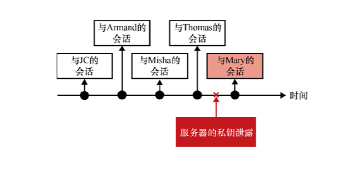
图 9.4　在 TLS 1.3 中，每个会话都从临时密钥交换开始。如果服务器在会话的某个时间点出现私钥泄露的事件，并不会泄露之前的会话内容
习题
在某些时间点泄露服务器的私钥将带来毁灭性的灾难，因为中间人攻击者将能够解密之前记录的所有会话。思考一下这是怎么发生的。
通信双方交换临时的公钥后，就会开始执行密钥交换算法生成对称密钥。在 TLS 1.3 中，在不同的时间点运行 TLS 协议会派生不同且独立的密钥，这些密钥用于对协议不同阶段的内容加密。
ClientHello 和 ServerHello 这两个消息是无法加密的，因为此时通信双方尚未交换公钥。一旦双方完成密钥交换，TLS 1.3 在握手阶段的其余内容都会加密。（这与旧版本的 TLS 协议不同，旧版本没有对任何握手阶段的消息加密。）
为了派生不同的密钥，TLS 1.3 使用双方协商的哈希函数构造 HKDF。HKDF-Extract 可以消除任何密钥交换算法输出的偏差，而 HKDF-Expand 通过使用不同的 Info 参数可以生成不同的派生密钥。例如，tls13 c hs traffic 命令（表示「客户端握手通信」）用于生成客户端与服务器的握手阶段的对称密钥；tls13 s ap traffic 命令（表示「服务器应用通信」）用于生成客户端与服务器的安全通信阶段的对称密钥。但请记住，未经验证的密钥交换算法是不安全的！接下来，我们将了解 TLS 协议解决这个问题的方法。
3．TLS 认证以及 Web 公钥基础设施
协商和密钥交换结束后，握手阶段会继续往下进行。接下来进行 TLS 协议认证过程。根据我们在第 5 章中了解的知识，在密钥交换过程中，攻击者可以轻而易举地拦截密钥交换过程的消息并伪装成密钥交换的一方或双方。在本节中，我们将了解浏览器通过密码算法验证服务器身份真实性的方法。不过，在这之前，我们还需要对握手的整个阶段做一些补充。TLS 1.3 协议的握手阶段实际上分为 3 个不同的阶段（见图 9.5）。
（1）密钥交换：此阶段的消息内容包含 ClientHello 和 ServerHello 消息，双方在这个阶段进行协商并执行密钥交换算法。此阶段之后的所有消息（包括握手消息）都将加密传输。
（2）服务器参数协商：此阶段中的消息内容包含服务器其他需要协商的数据。这些协商数据不必包含在 ServerHello 中，并且可以根据上一个阶段协商的结果进行加密。
（3）认证：此阶段的消息内容包括服务器和客户端双方的认证消息。
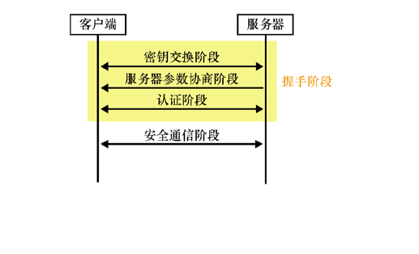
图 9.5　TLS 1.3 协议握手阶段分为 3 个阶段：密钥交换阶段、服务器参数协商阶段，以及认证阶段
在 Web 系统上，TLS 协议中的认证通常是单向的。例如，只有浏览器才能验证 google.com 是否确实是 google.com，但 google.com 不会验证浏览器的身份（或者说至少这个步骤不会作为 TLS 协议的一部分）。
相互认证的 TLS 协议
对客户端的认证通常委托给 Web 的应用程序层来完成，最常见的方式是通过发送一个表单要求提交客户端的身份凭证。也就是说在 TLS 协议中，服务器可以在服务器参数协商阶段请求认证客户端的身份。当 TLS 协议连接的双方都经过认证时，我们称之为相互认证的 MTLS（Mutually-authenticated TLS）协议。
认证客户端与认证服务器的方式相同，对客户端的认证可能发生在认证服务器后的任何时间点（例如，在握手或安全通信阶段）。
当浏览器连接到 google.com 时，它如何验证自己是否是在与真实的 google.com 进行握手呢？答案是使用 Web 公钥基础设施（PKI）。
在第 7 章学习数字签名时，我们了解了公钥基础设施的概念，此处将简单地重新介绍这个概念，这对理解 Web 的工作原理非常重要。Web PKI 包含两部分内容。首先，浏览器必须信任一组证书认证机构（Certification Authority，CA）的根公钥。通常，浏览器会使用一组硬编码的公钥或由操作系统提供的可信公钥。
Web PKI
在 Web 系统中，世界各地有数百个由不同的公司和组织独立运行的 CA。这样一个系统分析起来相当复杂，这些 CA 有时还可以对中间 CA 的公钥进行签名，而中间 CA 也有权对网站的公钥进行签名。因此，像证书认证机构/浏览器论坛（CA/Browser 论坛）这样的组织会强制执行规则来决定新组织能否加入可信公钥集，或者当组织不再受信任后将其从可信公钥集中删除。
其次，想要使用 HTTPS 的网站必须要从上述可信的 CA 中获取证书（即对用于验证签名的公钥本身进行签名）。为此，网站拥有者（或者网站管理员）必须向 CA 证明他们拥有一个特定的域。
注意：
过去，网站获取证书是需要付费的。但是现在可以从像 Let’s Encrypt 这样的 CA 免费获取证书。
为了证明网站拥有者确实拥有 example.com 这个网站，CA 可能会要求网站拥有者在 example.com/some_path/file.txt 上传一个文件，该文件包含一些根据请求生成的随机数。这个交互的过程如图 9.6 所示。
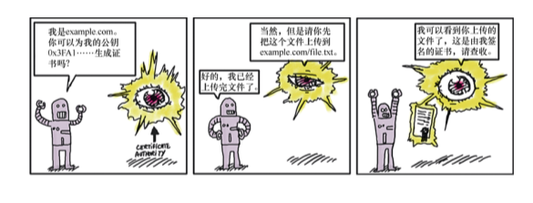
图 9.6　为了证明网站的拥有者确实拥有 example.com，CA 会要求网站拥有者将一个指定的文件上传到指定的地址，如果网站拥有者确实完成了指定操作，则 CA 相信 example.com 确定属于网站拥有者
在此之后，CA 可以对网站的公钥进行签名。由于 CA 的签名有效期通常长达数年，因此这种公钥也称为长期公钥（与临时公钥相反）。更具体地说，CA 实际上并不对公钥进行签名，而是对证书进行签名（稍后将对此进行详细介绍）。证书中包含长期公钥，以及一些附加的重要元数据，如网页的域名。
服务器为了向浏览器证明自己确实是 google.com，需要在 TLS 协议握手阶段向浏览器发送一个证书链。这个证书链包括如下内容。
● 服务器自己的叶子证书，其中包含网站的域名（例如 google.com）、网站的长期公钥以及 CA 对这些内容的签名。
● 一条 CA 证书链，该 CA 证书链包含的 CA 证书从为 google.com 签名的 CA 证书开始，到最后一个由根 CA 证书签名的 CA 证书结束。
图 9.7 形象地描述了上述内容。
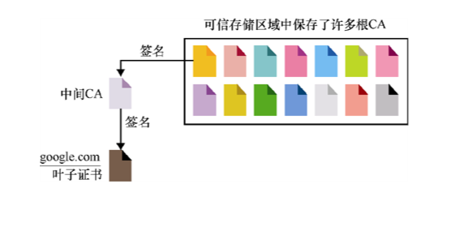
图 9.7　Web 浏览器只需信任一个相对较小的根 CA 集合即可信任整个 Web 系统。这些 CA 存储在所谓的可信存储区中。为了让浏览器信任网站，网站的叶子证书必须由这些 CA 之一进行签名。有时根 CA 只对中间 CA 进行签名，而中间 CA 又对其他中间 CA 或叶子证书进行签名。这就是 Web PKI 的基本原理
若服务器也要求认证客户端，则双方都要在 TLS 协议消息中包含自己的证书链。此后，服务器使用自己通过认证的长期密钥对对所有已接收和先前发送的握手消息进行签名，并将其放入 CertificateVerify 消息中。该流程如图 9.8 所示，其中只包含客户端对服务器进行认证的过程。
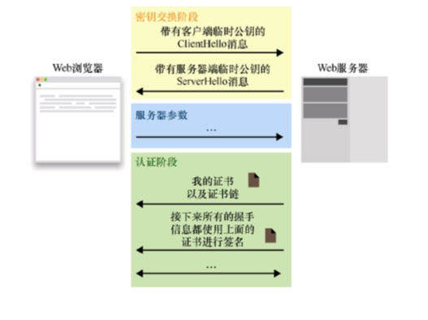
图 9.8　握手的认证部分从服务器向客户端发送证书链开始。证书链从叶子证书［证书包含网站公钥和附加元数据（如域名）］开始，到浏览器信任的根证书结束。每个证书都包含一个来自证书链中上一个节点证书的签名
通过 CertificateVerify 消息中的签名，服务器可以向客户端证明到目前为止交互信息的完整性。如果没有此签名，中间人攻击者可以截获服务器的握手消息，并把 ServerHello 消息中包含的服务器临时公钥替换掉，从而成功地伪装服务器。思考一下，CertificateVerify 签名是如何防止攻击者通过替换临时公钥来成功伪装服务器呢？
故事时间
几年前，我受聘审查一家大公司制定的 TLS 协议。审查后我发现，他们的协议在生成签名时竟然没有将临时密钥包含在签名内容中。得知协议存在这个问题时，整个房间沉默了几乎一分钟。毫无疑问，这是一个重大错误：如果攻击者能够截获握手过程的消息并将服务器的临时密钥替换为自己的密钥，那么他可以轻易伪装服务器。
这件事给我们最大的教训是，不要轻易尝试重新设计安全传输协议，因为安全传输协议很难做到完美，历史证明了它们可能会以许多意想不到的方式被攻破。因此，我们应该使用 TLS 这类成熟的协议，并确保协议基于更常见的方式实现。
最后，正式结束握手时，连接的双方都必须在认证阶段发送一条 Finished 消息。Finished 消息包含 HMAC 算法生成的认证标签，其中 HMAC 算法使用会话中协商好的哈希函数来实例化。客户端和服务器通过 Finished 消息告诉对方，「这些是我在握手过程中按顺序发送和接收的所有消息」。如果有中间人攻击者截获和篡改握手阶段的消息，那么双方都可以检测到攻击者的存在并及时中止连接。由于某些握手模式并没有使用签名来确保握手阶段消息的完整性，所以 Finished 消息非常重要（稍后将对此进行详细介绍）。
在进入握手阶段的下一个阶段之前，让我们先看看 X.509 证书，它是许多密码协议的重要组成部分。
4．使用 X.509 证书来认证连接双方
在 TLS 1.3 协议中，虽然证书不是必选的（我们可以一直使用普通密钥），但许多应用程序和协议（不仅是在 Web 系统的场景中）都大量使用证书来认证附加的元数据。现实中使用的证书是 X.509 证书标准的第 3 版。
X.509 是一个很旧的标准，该标准旨在令证书具有足够的灵活性，使证书可以用于电子邮件、Web 系统等多种场景。X.509 标准使用一种称为抽象语法标记（Abstract Syntax Notation One，ASN.1）的描述性语言来指定证书中包含的信息。ASN.1 中描述的数据结构如下：
Certificate  ::= SEQUENCE { 
    tbsCertificate      TBSCertificate, 
    signatureAlgorithm  AlgorithmIdentifier, 
    signatureValue      BIT STRING }
我们可以把上述的数据结构理解为一个包含 3 个字段的结构，各字段含义如下。
● tbsCertificate：待签名的证书。其中包含证书拥有者想要证明的所有信息。对于 Web 服务器的证书而言，这个字段可以包含域名（例如 google.com）、公钥、证书到期日期等。
● signatureAlgorithm：用于对证书签名的签名算法。
● signatureValue：CA 对该证书的签名。
习题
实际上的证书 tbsCertificate 中并不包含 signatureAlgorithm 和 signatureValue 的值。这是为什么呢？
如果想要查看 X.509 证书中的内容，我们可以首先使用 HTTPS 连接到任何一个网站，然后利用浏览器提供的工具查看服务器发送的证书链，相关示例如图 9.9 所示。
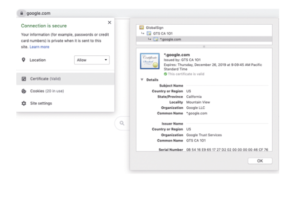
图 9.9　我们可以使用 Chrome 的证书查看器来查看谷歌服务器发送的证书链。根 CA 是 Global Sign，我们的浏览器信任这个 CA。接下来，浏览器会信任一个名为 GTS CA 101 的中间 CA，因为它的证书包含来自 GlobalSign 的签名。那么反过来，由于谷歌的叶子证书（即*.google.com，例如 mail.google.com 等网站的有效证书）中包含来自 GTS CA 101 的签名，所以访问谷歌的浏览器也会信任谷歌服务器
查看 X.509 证书时我们会发现它是以.pem 文件的形式保存的，.pem 文件中包含一些用 Base64 编码的数据，以及解释这些数据含义的注释。下面的代码段是证书在.pem 文件中的内容：
-----BEGIN CERTIFICATE----- 
MIIJQzCCCCugAwIBAgIQC1QW6WUXJ9ICAAAAAEbPdjANBgkqhkiG9w0BAQsFADBC 
MQswCQYDVQQGEwJVUzEeMBwGA1UEChMVR29vZ2xlIFRydXN0IFNlcnZpY2VzMRMw 
EQYDVQQDEwpHVFMgQ0EgMU8xMB4XDTE5MTAwMzE3MDk0NVoXDTE5MTIyNjE3MDk0 
NVowZjELMAkGA1UEBhMCVVMxEzARBgNVBAgTCkNhbGlmb3JuaWExFjAUBgNVBAcT 
[...] 
vaoUqelfNJJvQjJbMQbSQEp9y8EIi4BnWGZjU6Q+q/3VZ7ybR3cOzhnaLGmqiwFv 
4PNBdnVVfVbQ9CxRiplKVzZSnUvypgBLryYnl6kquh1AJS5gnJhzogrz98IiXCQZ 
c7mkvTKgCNIR9fedIus+LPHCSD7zUQTgRoOmcB+kwY7jrFqKn6thTjwPnfB5aVNK 
dl0nq4fcF8PN+ppgNFbwC2JxX08L1wEFk2LvDOQgKqHR1TRJ0U3A2gkuMtf6Q6au 
3KBzGW6l/vt3coyyDkQKDmT61tjwy5k= 
-----END CERTIFICATE-----
如果对 BEGIN CERTIFICATE 和 END CERTIFICATE 中间用 Base64 编码的内容进行解码，则会得到一个根据可分辨编码规则（Distinguished Encoding Rule，DER）进行编码的证书。DER 是一种确定性二进制编码，用于将 X.509 证书的内容转换为字节。对于初学者来说，这些编码方式很容易混淆，但我们可以通过图 9.10 所给的示例来区分它们。
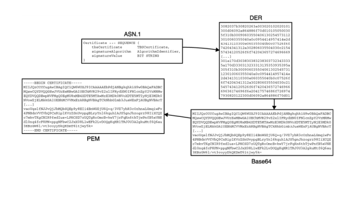
图 9.10　左上角的方框表示用 ASN.1 描述的 X.509 证书，可以通过 DER 编码将其转换为字节以便进行签名。由于这些字节数据并不要求具有易复制性或可读性，因此使用 Base64 进行编码。最后一步是按照 PEM 格式对上述的用 Base64 编码的数据以及注释进行封装
DER 编码后的数据只能以字节形式表示。在 ASN.1 中描述的字段名（如 tbsCertificate）在经过 DER 编码后会丢失。因此，如果不知道原始证书在 ASN.1 的描述下各字段真正的含义，那么对 DER 编码的数据进行解码将不能得到任何有效的证书信息。OpenSSL 是一个十分方便的命令行工具，可以帮助我们将 DER 编码的证书解码和翻译为可读性较强的内容。例如，如果我们下载了 google.com 的证书，就可以通过以下代码在终端中输出证书的内容。
$ openssl x509 -in google.pem -text 
Certificate: 
    Data: 
        Version: 3 (0x2) 
        Serial Number: 
            0b:54:16:e9:65:17:27:d2:02:00:00:00:00:46:cf:76 
        Signature Algorithm: sha256WithRSAEncryption 
        Issuer: C = US, O = Google Trust Services, CN = GTS CA 1O1 
        Validity 
            Not Before: Oct 3 17:09:45 2019 GMT 
            Not After : Dec 26 17:09:45 2019 GMT 
        Subject: C = US, ST = California, L = Mountain View, O = Google LLC, 
CN = *.google.com 
        Subject Public Key Info: 
            Public Key Algorithm: id-ecPublicKey 
                Public-Key: (256 bit) 
                pub: 
                    04:74:25:79:7d:6f:77:e4:7e:af:fb:1a:eb:4d:41: 
                    b5:27:10:4a:9e:b8:a2:8c:83:ee:d2:0f:12:7f:d1: 
                    77:a7:0f:79:fe:4b:cb:b7:ed:c6:94:4a:b2:6d:40: 
                    5c:31:68:18:b6:df:ba:35:e7:f3:7e:af:39:2d:5b: 
                    43:2d:48:0a:54 
                ASN1 OID: prime256v1 
                NIST CURVE: P-256 
[...]
虽然对 X.509 证书的应用已经很成熟，但 X.509 证书的安全性依然颇具争议。2012 年，一个研究团队将验证 X.509 证书的代码实现戏称为「世界上最危险的代码」。这是因为根据 DER 编码的数据在解码的过程中很容易出现错误，而 X.509 证书的复杂性使得解码的错误可能会给使用证书的系统带来安全风险。因此，本书建议如非必要，在任何应用程序中都不要使用 X.509 证书。
5．TLS 中的预共享密钥和会话恢复（或如何减少非必要的密钥交换操作？）
密钥交换的通信代价高昂，而且有时这并不是必要的流程。例如，对于两台只与对方连接的主机，我们并不想为了它们的安全通信而专门使用 PKI，因为这增加了系统管理的开销。为此，TLS 1.3 协议提供了一种通过预共享密钥（Pre-Shared Key，PSK）技术避免这种开销的方法。PSK 就是客户端和服务器共享的密钥，基于这个共享密钥可以派生会话的对称密钥。
在 TLS 1.3 协议中，PSK 技术的握手原理是客户端在 ClientHello 消息中公布自己支持的 PSK 标识符列表。如果服务器在该列表中找到自己支持的 PSK 标识符，它可以将该标识符写入 ServerHello 消息中，只要双方同意使用 PSK 就不需要进行密钥交换。由于这种做法省略了认证阶段，因此使得握手结束时的 Finished 消息对于防止中间人攻击非常重要。
客户端随机和服务器端随机
临时公钥可以令会话内容具有随机性，如果没有临时公钥，可能导致每次握手结束时产生相同的对称密钥。而在不同的会话中使用不同的对称密钥非常重要，因为我们不希望攻击者找到不同会话之间的联系。更糟糕的是，由于不同会话之间加密的消息往往是不同的，这可能导致 nonce 重用（参见第 4 章），从而给会话安全性带来极大威胁。
为了减少 nonce 重用的情况，在 TLS 协议中，ClientHello 和 ServerHello 产生的每个消息都有一个随机字段（字段的名称通常为 client random 和 server random），每个新会话产生时都会随机生成这样一个域。在 TLS 协议中，这些随机值用于派生对称密钥，因此可以有效地为每次新的连接生成随机的对称密钥。
PSK 技术还可以用于会话恢复（Session Resumption）。会话恢复是指重新使用旧的会话或连接中的秘密值。如果浏览器已经连接到 google.com，并且已经完成了验证证书链、执行密钥交换算法、协商共享密钥等流程。当浏览器在几分钟或几小时后再次访问 google.com 时，同样的操作需要再次执行，这无疑增加了通信开销。TLS 1.3 协议可以在成功执行握手操作后生成 PSK，该 PSK 可以在后续连接中使用，这避免了频繁地执行整个握手的操作。
如果服务器想要使用会话恢复的功能，它可以在安全通信阶段的任何时间点向客户端发送 New Session Ticket 消息。服务器可以通过多种方式创建 New Session Ticket 消息。例如，服务器可以根据数据库中有关 PSK 的信息向客户端发送 PSK 的标识符。当然这不是创建 New Session Ticket 消息的唯一方法，但由于会话恢复机制相当复杂，而且大多数情况下它都不是必需的，因此本章将不再过多地讨论这个问题。接下来，让我们看看 TLS 协议中最简单的部分，即通信过程中消息的加密方法。9.2.2　TLS 1.3 中加密应用程序数据的方法
当握手阶段开始并生成对称密钥之后，客户端和服务器可以对交互过程中的应用数据进行加密。此外，TLS 还可以确保通信过程抵御重放攻击和重新排序攻击！为此，认证加密算法使用的 nonce 会从一个固定值开始，每次发送一个新的消息就让 nonce 值加 1。如果消息被重放或重新排序，则接收方会发现当前的 nonce 值与预期的 nonce 值不同，于是无法成功解密。一旦发生这种情况，连接就会终止。
隐藏明文的长度
根据我们在第 4 章中学到的知识，有些加密算法并不能隐藏消息的长度。TLS 1.3 协议允许在加密之前用任意数量的 0 比特填充应用数据，并记录填充数据的配置信息，从而有效地隐藏消息的真实长度。尽管如此，消除附加噪声之后再进行统计攻击依然是可行的，因此减少针对明文长度的攻击并不容易。当必须满足这个安全属性时，应该参考 TLS 1.3 协议中的相关规范。
在 TLS 1.3 协议中，只要服务器允许，客户端可以在 ClientHello 消息之后就发送加密数据，这些作为应用数据的一部分，即浏览器不必等到握手结束后才开始发送应用数据。这种机制称为早期数据或 0-RTT（表示零往返时间）。这种机制只能与预共享密钥组合使用，因为预共享密钥可以在 ClientHello 和 ServerHello 消息交互之后就确定下来。
注意：
在 TLS 1.3 协议标准的开发过程中，0-RTT 机制就引起了很大争议，因为攻击者可以在 0-RTT 数据之后重放一个 ClientHello 消息。这就是为什么 0-RTT 机制只能用于可以安全重放的应用数据的加密。
对于 Web 服务器而言，浏览器的每个 GET 查询都是幂等查询，即 GET 查询只能检索数据而不能更改服务器端的状态（这与 POST 查询不同）。当然，不排除在某些情况下应用程序有很大的权限，可以更改服务器的状态。因此，当有其他数据发送机制可用时，建议不要使用 0-RTT 机制。
++9.3　Web 加密技术发展现状
目前，标准化机构正在推动实现新的 Web 加密技术，并建议弃用旧版本的 SSL 和 TLS 协议。但是由于网络中存在一些比较旧的客户端和服务器，因此许多密码学库和应用程序都会继续支持较旧版本的协议（有些甚至支持 SSL 3 协议！）。这让标准化机构的工作举步维艰，而且协议版本众多也意味着漏洞的数量会有很多，因此必须在系统中维护许多复杂的安全防御措施。
警告：
实践证明，使用 TLS 1.3 协议（和 TLS 1.2 协议）是安全且最佳的选择。使用任何较低版本的 TLS 协议之前都需要咨询专家，并且必须仔细考虑如何避免已知漏洞。
默认情况下，浏览器仍然使用 HTTP 连接到 Web 服务器，而且网站仍然需要手动请求 CA 以获取证书。根据目前的协议，Web 系统中的数据不可能全部是加密数据。
浏览器默认使用 HTTP 传输数据，但采用这种方式建立的连接是不安全的，会引发一系列的安全问题。目前的解决方法是，当用户使用 HTTP 访问某个 Web 服务器时，该网站通常将用户访问的页面重定向到使用 HTTPS 访问的页面。Web 服务器通常还会通知浏览器在后续连接中使用 HTTPS。这是通过一个称为 HTTP 严格传输安全性（HTTP Strict Transport Security，HSTS）的 HTTPS 响应头来实现的。即便如此，由于发起连接的是客户端，因此除非在浏览器的地址栏输入 https，否则客户端与网站的第一个连接仍然不受加密技术保护，并且还可能因为攻击者拦截报文导致无法重定向到 https 连接的网站。
此外，NTP（用于获取当前时间）和 DNS（用于获取域名对应的 IP 地址）等其他 Web 协议目前大多没有对通信内容加密，因此容易受到中间人攻击。虽然有些研究正在努力改善现状，但这些研究都聚焦于针对特定攻击载体的防御。
CA 的恶意行为也会给 TLS 协议用户带来安全威胁。如果今天 CA 决定为服务器拥有的域和它的公钥签署证书，那么如果 CA 是一个中间人敌手，它就可以伪装成真正的服务器接受用户的访问。对于客户端来说，最简单的解决方案是不使用 Web PKI（使用自己的 PKI），或者固定使用特定证书或公钥。
证书或公钥固定技术是指将服务器的证书（通常指证书的哈希值）或公钥直接硬编码到客户端代码中的技术。如果服务器提供的证书或者证书中的长期公钥与客户端硬编码的证书和公钥不一致，那么客户端将在握手的认证阶段中止连接。这种技术通常用于移动应用程序，因为它们能够确切地知道自己需要连接的服务器公钥或证书（而浏览器有无数个可能连接的服务器）。但是，硬编码证书和公钥不能适用于所有的情况，因此还存在另外两种机制可以处理恶意证书。
● 证书撤销：顾名思义，这表示 CA 可以撤销证书并通知浏览器证书的撤销情况。
● 证书监控：这是一个相对较新的系统，它会强制 CA 公开每个由它签名的证书。
证书撤销机制的提出并非一蹴而就。针对恶意 CA 的第一个解决方案是证书撤销列表（Certificate Revocation List，CRL），它是 CA 维护的一张保存已撤销证书的列表，列表中的证书都是无效的。CRL 的问题在于，随着时间推移这个列表将变得很大，而且需要经常进行检查。
后来在线证书状态协议（Online Certificate Status Protocol，OCSP）取代了 CRL，OCSP 是一个简单的 Web 界面，用户可以在上面查看证书是否已被吊销。OCSP 也有自己的问题：它要求 CA 提供一个能够响应 OCSP 请求的高可用性服务；用户访问 Web 网站时的流量信息会泄露给 CA；浏览器通常忽略超时的 OCSP 请求（为了不影响用户体验）。当前的解决方案是使用 OCSP 绑定来优化 OCSP：网站负责向 OCSP 查询 CA 证书的签名状态，并在 TLS 握手过程中将 OCSP 的响应附加在自己的证书后发送给客户端。上述 3 种针对 CA 恶意行为的解决方案如图 9.11 所示。
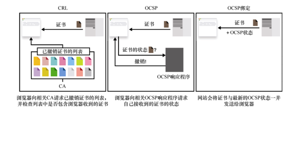
图 9.11　网络上的证书撤销有 3 种流行的解决方案：CRL、OCSP、OCSP 绑定
证书撤销的功能只有当证书遭到破坏的时候才有用武之地（尤其是对相较于万维网规模很小的系统而言）。证书撤销具有类似汽车安全带的安全功能，虽然在大多数情况下都是无用的，但在极少数情况下却至关重要。这就是安全领域常说的「纵深防御」。
注意：
对于 Web 系统而言，实践证明证书撤销是一个很重要的机制。2014 年出现的 Heartbleed 漏洞成为 SSL 和 TLS 协议在历史上最具破坏性的漏洞之一。该漏洞源于在 SSL/TLS 协议流行实现（OpenSSL）中发现了缓冲区溢出漏洞（读取超过数组长度上限的数据），从而使任何人都可以向任何 OpenSSL 服务器发送精心设计的消息，这些消息会导致服务器将自己内存中的数据返回给客户端，而这些数据通常包含长期私钥。
然而，如果 CA 确实有恶意的倾向，它可以选择不撤销恶意证书或不公开恶意证书。这是由于我们盲目地相信数量众多的 CA 不会有恶意行为。为了大规模解决这个问题，谷歌在 2012 年提出了证书透明化的方案。证书透明化背后的想法是强制 CA 将自己颁发的每个证书添加到一个庞大的证书日志中，供所有人查看。这样一来，对于无法证明自身存在于证书日志中的证书，Chrome 之类的浏览器会拒绝接收。这种透明性也使得服务器可以检查 CA 是否为服务器的域颁发了错误的证书（对同样的域，除了该服务器请求过的证书，不应该有其他证书）。
还有一点需要注意的是，证书透明化依赖于监控自己域日志的管理人员能够在事后识别出恶意证书，而且 CA 还必须反应迅速，一旦检测到错误颁发的证书就将其撤销。在极端情况下，浏览器有时会将行为不端的 CA 从可信存储中删除。因此，证书透明化不如证书或公钥固定功能强大，因为后者还可以减少 CA 的错误行为。
++9.4　其他安全传输协议
现在我们已经了解了 TLS 协议，它是最流行的通信加密协议。但 TLS 不是唯一的安全传输协议，不过，虽然还有许多安全传输协议我们还未曾了解，但可能已经在日常生活中使用过这些协议了。这些协议中大多数都与 TLS 有着类似的工作原理，只不过它们是为特定的场景而设计的。例如，以下 3 种情况。
● 安全外壳（Secure Shell，SSH）协议：一种为不同主机上的远程终端提供安全连接的常用协议。
● Wi-Fi 保护接入（Wi-Fi Protected Access，WPA）协议：一种将设备连接到私有网络接入点或互联网常用协议。
● IPSec 协议：IPSec 是最常用的虚拟网络协议（Virtual Network Protocol，VNP）之一，用于将不同的私有网络连接在一起。公司和企业用该协议来连接不同的办公网络。该协议属于在 IP 层工作的协议，通常存在于路由器、防火墙和其他网络设备中。另一种常用的 VNP 协议是 OpenVNP，它直接使用 TLS 协议来实现私有网络的连接。
所有这些协议都实现了类似 TLS 协议的握手和安全通信的流程，并在 TLS 协议的基础之上加入个性化的设计。当然，基于 TLS 来设计新的协议有时也会出现安全问题，例如，一些 Wi-Fi 协议已被攻破。为了保证本章内容的完整性，接下来将讲解 Noise 协议框架。Noise 协议是 TLS 协议的一种更符合当前应用场景的替代品。
++9.5　Noise 协议框架：TLS 新的替代方案
由于受到很多关注，TLS 现在已经相当成熟并且成为大多数场景的必选方案。然而，由于历史原因、向后兼容性约束和总体复杂性，使用 TLS 的应用程序会增加大量的开销。因为在实际应用场景中，我们并不需要用到 TLS 提供的所有功能。接下来学习的 Noise 协议框架就是一个更好的解决方案。
Noise 协议框架省去了握手阶段的所有协商，从而减小了 TLS 的运行时复杂性。Noise 协议是一种不产生分支的线性协议。这与 TLS 不同，TLS 可以有许多不同的运行路径，具体取决于不同的握手消息中包含的信息。Noise 协议的作用是让协议运行时所有的复杂度都可以在协议设计阶段就确定下来。
开发人员使用 Noise 协议框架时必须先根据特定的应用程序将框架实例化，这就是 Noise 称为协议框架而不是协议的原因。因此，开发人员必须先决定要使用何种加密算法、连接的哪一方需要经过认证、是否使用 PSK 技术等，然后实现该协议并将其转化为一系列严格定义的消息。不过，如果以后需要更新协议，并且希望同时保持与旧设备的向后兼容性，那么更新协议就会成为棘手的问题。9.5.1　Noise 协议框架中不同的握手模式
Noise 协议框架提供了不同的握手模式。每个握手模式通常有一个名称，以便开发人员辨认该模式包含的内容。例如，IK（Immediate Known）握手模式表示客户端的公钥作为握手内容的一部分发送给服务器（即 I，意思为立即），并且客户端预先知道服务器的公钥（即 K，意思为知道）。一旦确定了握手模式，使用该模式的应用程序就不会执行其他的握手模式。这恰好与 TLS 协议相反，因此 Noise 协议框架可以在实践中成为一种简单的线性协议。
本小节的其余部分将使用一种称为 NN 的握手模式来解释 Noise 协议的工作方式。NN 握手模式中的两个 N 表示双方都没有进行认证，这显然是不够安全的，不过却有利于我们理解 Noise 协议。用 Noise 协议中的专业术语来说，NN 模式的符号表示为：
NN: 
  -> e 
  <- e, ee
每行表示一个消息模式，箭头指示消息传递的方向。每个消息模式都由一系列标识符号（这里只有两个：e 和 ee）构成，用于指示连接双方需要做的操作。
● -> e：这表示客户端必须生成临时密钥对并将公钥发送给服务器，而服务器必须保存接收到的临时公钥。
● <- e， ee：这表示服务器必须生成一个临时密钥对并将公钥发送给客户端，然后使用客户端的临时密钥（第一个 e）和它自己的临时密钥（第二个 e）作为输入运行 DH 密钥交换算法。同时，客户端也必须接收服务器的临时公钥，并运行类似的 DH 密钥交换算法。
注意：
Noise 协议将提前定义好的标识符号进行组合来表示不同类型的握手模式。例如，s 标识符表示静态密钥（长期密钥的另一种表述）而非临时密钥，并且 es 标识符表示两个协议参与者必须使用客户端的临时密钥和服务器的静态密钥来执行 DH 密钥交换算法。
此外，在每个消息模式（在例子中是 -> e 和 <- e， ee）的末尾，发送方还可以传输一些有效负载数据。如果在第一个消息模式（-> e）之前就已经进行过 DH 密钥交换，则可以对有效负载数据进行加密和认证。在握手结束时，两个参与者都会生成一组对称密钥，并开始加密通信（类似于 TLS 协议）。9.5.2　Noise 协议的握手过程
Noise 协议的一个特殊之处在于它会不断地验证握手记录。为了实现这一点，协议参与双方需要维护两个变量：哈希值（h）和链接密钥（ck）。协议参与者发送或接收的每个握手消息都会与前一个 h 值一起作为哈希函数的输入。详细过程如图 9.12 所示。
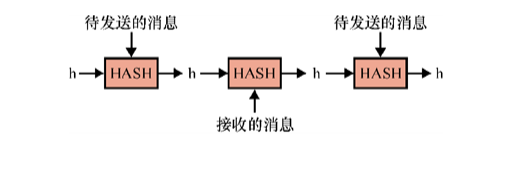
图 9.12　在 Noise 协议框架中，连接的双方都保存握手期间发送和接收的所有消息的摘要 h。当发送消息并使用 AEAD 算法进行加密时，当前 h 值将用作附加数据，以便对此前的握手内容进行认证
在每个消息模式的末尾，使用 AEAD 算法（第 4 章中有详细介绍）对（可能为空的）有效负载数据进行加密。发生这种情况时，接收方会使用 AEAD 消息的附加数据字段认证 h 的值。因此，Noise 协议可以不断地验证连接的两侧观察到的消息的顺序和消息收发的顺序是否相同。
此外，每次完成 DH 密钥交换（握手过程中可能会发生多次密钥交换）之后，算法的输出值将与之前的 ck 一起作为 HKDF 的输入，然后 HKDF 将输出一个新的 ck 和一组新的对称密钥，用于对后续消息进行认证和加密。详细过程如图 9.13 所示。
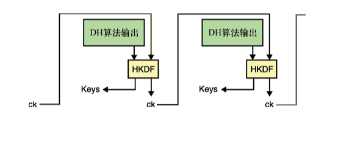
图 9.13　在 Noise 协议框架中，连接双方都保存 ck。每次执行 DH 密钥交换之后，将其输出值与 ck 一起作为 HKDF 的输入，并生成后续协议中要使用的新 ck 和新加密密钥
这使得 Noise 成为一个运行起来很简单的协议：没有分支，并且连接双方都只进行必要的操作。Noise 协议在密码库中的实现也非常简单，总共只有几百行代码，相比实现 TLS 协议的几十万行代码少了很多。虽然 Noise 协议框架的使用更加复杂，开发人员需要了解 Noise 协议框架的工作原理才能将其集成到应用程序中，但它依然是 TLS 协议的一个强有力的替代品。
++9.6　本章小结
● 传输层安全（TLS）协议是一种对两个主机之间的通信进行加密的安全传输协议。该协议的前身是安全套接字层（SSL）协议，现在依然有人称其为 SSL。
● TLS 协议运行在 TCP 之上，用于保护浏览器、Web 服务器、移动应用程序等之间的日常连接。
● TLS 协议有一个称为数据报传输层安全（Datagram Transport Layer Security，DTLS）协议的变体，它可以保护 UDP 的会话。
● TLS 协议以及其他大多数传输安全协议都有握手阶段（进行安全协商）和安全通信阶段（使用握手阶段生成的密钥对通信加密）。
● 为了避免由于过度信任 Web PKI 带来的安全威胁，应用程序在使用 TLS 协议时只可以使用固定的特定证书和公钥进行安全通信。
● 作为一种纵深防御措施，系统可以采用证书撤销（删除受损证书）和监视（检测受损证书或 CA）机制。
● 由于 Noise 协议框架相比 TLS 协议更加简单而且实现的代码量少，因此可以使用 Noise 协议框架作为 TLS 协议的替代方案。
● 如果要使用 Noise 协议框架，开发人员必须在设计协议时就确定使用哪种握手模式。因此，该协议比 TLS 协议简单、安全，但它的灵活性较差。
